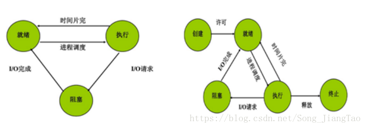
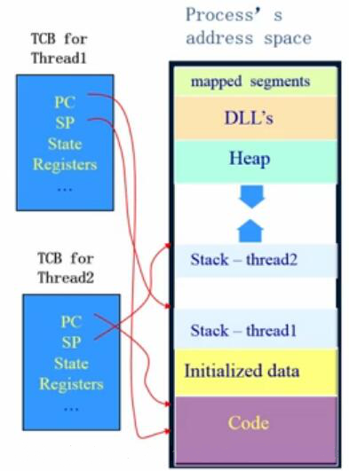
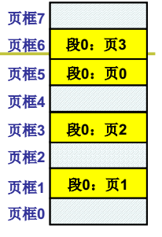
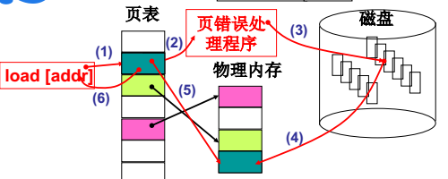

#  操作系统基本知识

## 4. 处理机管理

### 4.1. 线程与进程

　　进程是具有一定独立功能的程序关于某个数据集合上地一次运行活动，是系统进行资源分配和调度的一个独立单位。

　　线程是进程的一个实体，是 CPU 调度和分派的基本单位，它是比进程更小的能独立运行的基本单位。线程自己基本上不拥有系统资源，只拥有一点在运行中必不可少的资源（如程序计数器、一组寄存器和栈），但是它可与同属一个进程的其他的线程共享进程所拥有的全部资源，也有就绪、运行、阻塞三态。

　　一个线程可以创建和撤销另一个线程；同一个进程中的多个线程之间可以并发执行。相对进程而言，线程是一个更加接近于执行体的概念，它可以与同进程中的其他线程共享数据，但拥有自己的栈空间，拥有独立的执行序列。

#### 多进程的组织形式包括下面 3 个关键部分

1. PCB（Process Control Block）：用来记录进程信息的数据结构（管理进程的核心，包含了 PID 等进程的所有关键信息）。
2. 进程的状态：（1）就绪状态，（2）执行状态，（3）阻塞状态（多线程时也是这些状态）。
3. 队列：就绪队列，等待（阻塞）队列。

#### 4.1.1. PCB

　　为了便于系统描述和管理进程，在 OS 的核心位每个进程专门定义了一个数据结构，进程控制块 PCB。PCB 是进程的唯一标志。

#### 4.1.2. 区别

1. 简而言之，一个程序至少有一个进程，一个进程至少有一个线程。
2. 线程的划分尺度小于进程，使得多线程程序的并发性高。
3. 另外，进程在执行过程中拥有独立的内存单元，而多个线程共享内存，从而极大地提高了程序的运行效率。
4. 线程在执行过程中与进程还是有区别的。每个独立的线程有一个程序运行的入口、顺序执行序列和程序的出口。但是线程不能够独立执行，必须依存在应用程序中，由应用程序提供多个线程执行控制。
5. 从逻辑角度来看，多线程的意义在于一个应用程序中，有多个执行部分可以同时执行。但操作系统并没有将多个线程看做多个独立的应用，来实现进程的调度和管理以及资源分配。这就是进程和线程的重要区别。

#### 4.1.3. 优缺点

　　线程执行开销小，单不利于资源的管理和保护；而进程正相反。同时，线程适合于在 SMP 机器上运行，而进程则可以跨机器迁移。

#### 4.1.4. 程序顺序执行的特征

1. 顺序性：每一操作必须在下一操作开始之前结束。
2. 封闭性：程序运行时独占全机资源，资源的状态（除初始状态外）只有本程序才能改变，程序一旦执行，其结果不受外界影响。
3. 可再现性：程序执行环境和初始条件相同，重复执行时，结果相同。

#### 4.1.5. 程序并发执行的特征

1. 间断性：程序并发运行时，共享系统资源，为完成统一任务相互合作，会形成相互制约关系，导致并发程序具有 “ 执行-暂停-执行 ” 这种间断性的活动规律。
2. 失去封闭性：程序并发执行时，资源状态由多个程序改变，某程序执行时，会收到其他程序影响，失去封闭性。
3. 不可再现性：失去封闭性，导致失去可再现性。

#### 4.1.6. 进程的特征

1. 结构特征：程序段、相关数据段和 PCB 三部分构成进程实体。
2. 动态性：进程实体的一次执行过程，具有生命期，而程序是有序指令集合，是静态的。
3. 并发性：多个进程同时存于内存，在一段时间内同时运行。
4. 独立性：进程实体是一个能独立运行、独立分配资源和独立接收调度的基本单位。
5. 异步性：进程按各自独立的、不可预知的速度向前推进。

#### 4.1.7. 进程的状态

　　三态模型（左图）、五态模型（右图）

　　处于就绪状态的进程，在调度程序为之分配了处理及之后便开始执行，就绪 -> 执行。

　　正在执行的进程如果因为分配它的时间片已经用完，而被剥夺处理器，执行 -> 就绪。

　　如果因为某种原因致使当前的进程执行受阻，使之不能执行。执行 -> 阻塞。

#### 4.1.8. 进程间的通信（同步与互斥）

　　由于多个进程可以并发执行，所以进程间必然存在资源共享和相互合作的问题。进程通信是指各个进程交换信息的过程。

　　同步时合作进程间直接制约问题，互斥是申请临界资源进程间的间接制约问题。（临界资源（Critical Resource,CR）：在同一时间只能供一个进程使用的资源，例如：打印机、磁带机等硬件资源）。

　　临界区管理 4 条原则：（临界区：每个进程中访问临界资源的那段代码）

1. 有空即进。
2. 无空则等。
3. 有限等待：要求访问临界区的进程，保证有限时间内进入临界区，避免死等。
4. 让权等待：进程不能进入临界区时，应立即释放处理机，避免忙等。

#### 4.1.9. 信号量机制

　　信号量机制：即利用 PV 操作来对信号量进行处理。

　　信号量（Semaphore）的数据结构为一个值和一个指针，指针指向等待该信号量的下一个进程。信号量的值与相应资源的使用情况有关。

　　当它的值大于 0 时，表示当前可用资源的数量。

　　当它的值小于 0 时，其绝对值表示等待使用该资源的进程个数。

　　注意，信号量的值仅能由 PV 操作来改变。

　　一般来说，信号量 S>= 0 时，S 表示可用资源的数量。执行一次 P 操作意味着请求分配一个单位资源，因此 S 的值减 1；当 S < 0 时，表示已经没有可用资源，请求者必须等待别的进程释放该类资源，它才能运行下去。而执行一个 V 操作意味着释放一个单位资源，因此 S 的值加 1；若 S <= 0，表示有某些进程正在等待该资源，因此要环形一个等待状态的进程，使之运行下去。 

#### 4.1.10. 进程调度：如何分配 CPU

　　调度方法分为可剥夺和不可剥夺两种。即当有更高优先级的进程到来时，是否可以将正在运行进程的 CPU 分配给高优先级的进程，可以则为可剥夺，否则为不可剥夺的。

　　在某些操作系统中，一个作业从提交到完成需要经历高、中、低三级调度。

1. 高级调度：又称长调度或作业调度。它决定处于输入中的哪个后备作业可以调入主系统做好运行的准备，成为一个或一组就绪进程。系统中一个作业（程序）只需经过一次高级调度。
2. 中级调度：又称短程调度或对换调度。它决定处于交换区中的就绪进程哪个可以调入内存，以便直接参与对 CPU 的竞争。在内存资源紧张时，为了将进程调入内存，必须将内存中处于阻塞状态的进程调出交换区，以便为调入进程腾出空间。
3. 低级调度：又称短程调度或进程调度。它决定处于内存中的就绪进程中的哪个可以占用 CPU。最活跃、最重要的调度程序，对系统影响也是最大的。

#### 

#### 4.1.11. 常见的进程调度算法

　　先来先服务（FCFS）、短作业优先、时间片轮转（固定时间片、可变时间片）、优先级调度（静态优先级、动态优先级）、多级反馈调度（时间片轮转+优先级调度）。

　　CPU 调度算法（在就绪序列中怎么挑选进程让 CPU 执行）。

　　先了解两个概念：

* 周转时间：从开始申请执行任务到执行任务完成。
* 响应时间：从开始申请执行任务到开始执行任务。

1. 先来先服务调度算法 FCFS：按作业或者进程到达的先后顺序依次调度；（平均周转时间可能会很长）
2. 短作业优先调度算法 SJF：算法从就绪队列中选择估计时间最短的作业进行处理，直到得出结果或者无法继续执行（周转时间段，但是响应时间长）。
3. 高相应比算法 HRN：响应比 = （等待时间+要求服务时间）/要求服务时间；
4. 时间片轮转调度 RR：按到达的先后对进程放入队列中，然后给队首进程分配 CPU 时间片，时间片用完之后计时器发出中断，暂停当前进程并将其放到队列尾部，循环；（响应时间可以得到保证）。
5. 多级反馈队列调度算法：目前工人较好的调度算法；设置多个就绪队列并为每个队列设置不同的优先级，第一个队列优先级最高，其余依次递减。优先级越高的队列分配的时间片越短，进程到达之后按 FCFS 放入第一个队列，如果调度执行后没有完成，那么放到第二个队列尾部等待调度，如果第二个调度仍然没有完成，放入第三队列尾部...。只有当前一个队列为空时才会去调度下一个队列的进程。

#### 进程的分类

https://www.cnblogs.com/xdyixia/p/9257160.html

#### 线程

　　线程有自己的 TCB （thread control block 线程控制块），只负责这条流程的信息，包括 PC 程序计数器，SP 栈、State 状态、寄存器、线程 id。

　　线程有内核级线程和用户级线程，一般说的都是用户级线程，内核级线程由内核管理。

　　补充小知识：

1. 只有内核级线程才能发挥多核性能，因为内核级线程共用一套 MMU（即内存映射表），统一分配核 1 核 2 （即有多个 CPU，可以一个 CPU 执行一个内核级线程），进程无法发挥多核性能，因为进程切换都得切 MMU。
2. 为什么需要内核级线程？如果只有用户级线程，在内核中只能看到进程，所以当用户级线程中一个线程进行 IO 读写阻塞时，内核会将该线程所在的进程直接切换。例如当用浏览器打开网页，这个进程中有下载数据线程，有显示数据线程，当数据下载读写阻塞时，内核直接切到 qq（这些切换是指在 CPU 上运行的程序）。

#### 进程和线程的对比

　　进程是系统进行资源调度和分配的基本单位；线程是 CPU 调度的基本单位。

　　进程 = 资源（包括寄存器值，PCB，内存映射表）+TCB（栈结构）。

　　线程 = TCB（栈结构）。

　　线程的资源是共享的。

　　进程间的资源是分隔独立的，内存映射表不同，占用物理内存地址是分隔的。

　　线程的切换只是切换 PC，切换了 TCB（栈结构）。

　　进程的切换不仅要切换 PC，还包括切换资源，即切换内存引射表。

#### 进程间通信方式

**https://www.cnblogs.com/xdyixia/p/9257668.html** Unix

#### 进程间同步

　　经典的进程同步问题：生产者-消费者问题；哲学家进餐问题；读者-写者问题。

　　同步的解决方案：管程、信号量。

#### 4.1.12. 死锁

　　两个以上的进程互相要求双方释放已经占用的资源导致无法继续运行下去的现象。

　　在两个或多个并发进程中，如果每个进程持有某种资源而又等待别的进程进程释放它或他们现在保持着的资源，在未改变这种状态之前都不能向前推进，称这一组进程产生了死锁。通俗地讲，就是两个或多个进程被无限期地阻塞、相互等待地一种状态。

　　例如：一个系统有一台扫描仪 R1，一台刻录机 R2，有两个进程 P1、P2，他们都准备将骚猫的文档刻录到 CD 上，P1 先请求 R1 成功，P2 先请求 R2 并成功，后来，P1 又请求 R2，但却因为已经分配而阻塞，P2 请求 R1，也因分配而阻塞，此时，双方都被阻塞，都希望双方释放自己所需的资源，但又谁都不能得到自己所需的资源而继续进程，从而一直占用自己所占的资源，就形成死锁。

#### 4.1.13. 可抢占性资源和不可抢占性资源

　　前者：某进程获得这类资源后，该资源可以在被其他进程或系统抢占。

　　后者：一旦系统将资源分配给一个进程以后，就不能把它强行收回，只能等它用完自行释放。

#### 4.1.14. 产生死锁的原因

1. 竞争不可抢占性资源。
2. 进程运行推进的顺序不合适。
3. 竞争可消耗资源。

　　如果系统资源充足，进程的资源请求都能够得到满足，死锁出现的可能性就很低，否则就会因抢夺优先的资源而陷入死锁。其次，进程运行推进顺序与速度不同，也可能产生死锁。

#### 4.1.15. 产生死锁的四个必要条件：互斥条件、请求与保持条件、不可剥夺条件、循环等待条件。

1. 互斥条件：一个资源一次只能被一个进程使用。
2. 请求与保持条件：一个进程因请求资源而阻塞时，对已获得的资源保持不放。
3. 不剥夺条件：进程已获取的资源，在未使用完之前，不能强行剥夺。
4. 循环等待条件：若干进程之间形成一种头尾相连的循环等待资源关系。

　　这四个条件是死锁的必要条件，只要系统发生死锁，这些条件必然成立，而只要上述条件之一不满足，就不会发生死锁。

#### 4.1.16. 解决死锁的 4 种处理策略

　　鸵鸟策略（即不理睬策略）、预防策略、避免策略、检测与解除策略。

1. 预防死锁：破坏产生死锁的 4 个必要条件中的一个或者多个；实现起来比较简单，但是如果限制过于严格会降低系统资源利用率以及吞吐量。
2. 避免死锁：在资源的动态分配中，防止系统进入不安全状态（可能产生死锁的状态）-如银行家算法。
3. 检测死锁：允许系统运行过程中产生死锁，在死锁发生之后，采用一定的算法进行检测，并确定与死锁相关的资源和进程，采取相关方法清除检测到的死锁。实现难度大。
4. 解除死锁：与死锁检测配合，将系统从死锁中解脱出来（撤销进程或者剥夺资源）。对检测到的和死锁相关的进程以及资源，通过撤销或者挂起的方式，释放一些资源并将其分配给处于阻塞状态的进程，使其转变为就绪态。实现难度大。

　　死锁忽略：Windows、Linux 个人版都不做死锁处理，直接忽略，大不了重启就好了，小概率事件，代价可以接受。

#### 4.1.17. 死锁预防

　　预先静态分配法（破坏不可剥夺条件）、资源有序分配法（将资源分类按顺序排列，保证不形成环路）。

#### 4.1.18. 死锁避免

　　银行家算法（对每个资源请求进行检测，确保安全。需要很大的系统开销）。

#### 4.1.19. 死锁解除

　　资源剥夺法、撤销进程法。

#### 4.1.20. 池

　　所谓池的概念，一般是指应用提前向内核批量申请资源，用于接下来的使用和回收，减少资源的初始化和销毁次数等开销，以达到提高系统性能的目标。

　　内存池：真正使用钱申请一片内存区域，有新需求时取出其中一部分使用，不够用时再重新申请新内存。

　　进程池：应用预先创建一组子进程，所有子进程运行相同代码，拥有相同属性，比如 PGID 和优先级等。

　　常见两种工作方式：

1. 主进程通过随机或 round robin 算法来选择子进程作为新任务的服务进程；
2. 通过一个共享队列来进行同步，所有子进程从该队列中获取任务，不过同时只能有一个子进程能成功获得新任务处理权。

　　线程持：主要应用于任务小而多，处理时间短的场景，比如简单网页请求等。

## 5. 存储器管理

### 5.1. 存储器的层次

　　在存储层次中，层次越高（越接近 CPU），存储介质的访问速度越快，价格越高，存储容量也越少。

* 主存储器：简称内存或主存，是计算机系统中的主要部件，用来保存进程运行时的程序和数据，也称可执行存储器。
* 寄存器：寄存器与处理机的速度，寄存器的字长一般是 32 或是 64 位。
* 高速缓存：介于寄存器和主存储器之间的存储器，主要用来备份内存中常用的数据，以减少处理机对内存的访问次数，这样可以大幅的提高速度。
* 磁盘缓存：由于磁盘的 I/O 速度远低于内存的速度，所以用磁盘缓存来暂时存放一些磁盘数据和信息，它本身并不是一种实际存在的存储器，而是利用内存中的部分存储空间暂时存访一些信息。

### 5.2. 程序的装入和链接

### 5.3. 连续分配存储管理方式

* 地址重定位：指将逻辑地址变换成物理地址的过程。分为静态重定位和动态重定位。
* 存储管理方案：分区存储管理（固定分区、可变分区、可重定位分区）、分页存储管理（将一个进程的地址空间划分为若干个大小相等的区域，成为页，相应地，将主存空间划分成与页相同大小的若干个物理块，称为块。至少需要两次访问主存）、分块存储管理、段页式存储管理（地址结构：段号+段内页号+页内地址）、虚拟存储管理。

　　可变分区请求和释放主要算法：最佳适应算法、最差适应算法、首此适应算法，循环首次适应算法。

　　快表：在页式存储管理中将当前最活跃的少数几页的物理块号保存在高速存储器中，用以提高页式存储管理的性能。（不能两次访问主存）

　　页面置换算法：最佳置换算法（最长时间内不再被访问的页面置换出去）、先进先出置换算法、最近最少未使用置换算法、最近未用置换算法。

　　要解决的两个问题：

1. 每个进程代码中使用的地址可能相同。解决思路：对代码中的地址重定向（加个基地址）。
2. 物理内存可能比较小，不能同时放很多进程进来。解决思路：把要运行的代码移到内存，暂时不用的代码移到磁盘，即交换（swap），内存置换。

### 分段

　　一个程序分成多个段（每个段特性不同为了方便管理，例如代码段只读、数据段等等），当然这都是逻辑上的。

　　管理段的结构叫做段表，段表保存在进程的 PCB 中。

### 页表

　　把程序按段分对程序员是友好的，但是如果物理存储也按段存，则会导致大块的内存碎片，例如现在需要分个 10M 的段但是连续的存储空间只有 8M/9M/5M 三个。解决办法：（将段打散存到页中）不要对内存仅从连续的分配，将内存划分成 1 页 1 页 ，按页分配，一页 4kb 大小，最多浪费的也就 4kb。这样不会有内存碎片，也不会出现没有符合要求大小的内存可以申请的情况，因为可以打散了分散到一页一页中。

　　整个系统的页表就是多级页表（这个整个系统的多级页表简单来说就是把物理地址都进行了按页划分，保存了每页的基地址（对应下图中的页框号））。程序向系统申请内存时，系统就会把哪几个页框号分给程序的某个段，程序再把它段 0 中的第 3 页数据放到页框 6 中。

　　说明：进程需要有自己的 “ 页表 ”，里面映射的双方是程序的逻辑地址中的页号和系统分给这段程序的页框号。

#### 段页结合的内存管理

　　实际在内存管理中的段页结合如下图，页号加偏移称为虚拟地址，MMU 负载从虚拟地址到物理地址的转换，同时页负责权限检查。

　　上面解决了每个进程代码中使用的地址可能相同，系统给每个进程分配基地址，进程保存在 PCB 中。

#### 请求调页内存换入

　　CPU 对数据进行请求时，才会进行映射（虚拟内存到物理内存）。

　　例如进程 1 正在运行，进行映射拿数据，查页表发现页框号中没有数据或有进程 2 的数据，则需要页表调入内存。

#### 内存换出

　　有页表需要调入，那么谁调出。

　　页面置换算法：

1. 最佳置换算法（Optimal）：一种理论的算法，选择淘汰的页面是以后一定不再使用的页面（理想化的），该算法无法实现，只能作为其他算法好坏的一个评价对比。

2. 先进先出（FIFO）算法：总是最先淘汰最先进去的页面，该算法容易实现。缺点：通常程序调入内存的西安候顺序和程序执行的先后顺序不一致，导致缺页率高。

3. 最近最久未使用算法 LRU：算法赋予每个页面一个访问字段，用来记录上次页面被访问到现在所经历的时间 t，每次置换的时候把 t 值最大的页面置换出去（实现方面可以采用寄存器或者栈的方式实现）。

4. 时钟算法 clock（也被称为是最近未使用算法 NRU）：页面设置一个访问位 R，并将页面链接为一个环形队列，页面被访问的时候访问位设置 R 为 1。页面置换的时候，如果当前指针所指页面访问 R 为 0，那么置换，否则将其置为 0，循环直到遇到一个访问位为 0 的页面。

   但是这个方法优缺点：缺页比较少的时候（最近没有使用淘汰中的 “最近” 太长了）。所有的 R 都为 1（很少变成 0），每次都要转一圈才能找到换出去的页，退化成 FIFO，效率不高。

   改进：双指针，一个快，一个慢，像时钟一样（定时清除 R 位）（更像 clock），快时钟做 R 的清 0 定时清 0，等到慢指针转到这里的时候 R=0，说明在定时时间片内没有被访问，该页可以被替换了。

## 6. 设备管理

　　设备管理的目标是如何提高设备的利用率，位用户提供方便统一的界面。

　　设别管理采用的缓冲技术：通道技术、DMS 技术、缓冲技术、Spooling 技术。

　　磁盘调度算法：先来先服务（FCFS）、最短寻道时间（SSTF）、扫描算法（SCAN）（先由里往外到达最外后由外向里）、单向扫描调度算法（CSCAN）（无法换向，只能由里向外）。

## 7. 文件管理

* 文件的逻辑结构：由结构的记录式文件（由一个以上的记录构成。记录分为定长记录、不定长记录）、无结构的流式文件（由一串顺序的字符流构成的文件，不划分记录）。

* 文件的物理结构：顺序结构、链接结构、索引结构、多个物理块的索引表。

* Unix 的三级索引结构：

  * 文件的存取方法：顺序存取法、随机存取法。

    文件的存储空间管理：外存空闲空间管理的数据结构通常称为磁盘分配表。常用的空闲空间的管理方法：位示图（用一个 bit 为 0、1 表示一个物理块的空闲情况）、空闲区表、空闲块链、成组链接法（每 100 块为一组进行记录空闲的块号和大小）。

  * 文件链接

    硬链接（两个文件目录表目指向同一个索引节点，即指不同的文件名与同一个文件实体的链接）、符号链接（在建立的新文件或目录并与原来的文件或目录的路径名进行映射）。

  * 硬连接

    原文件名和连接文件名都指向相同的物理地址。目录不能有硬连接；硬连接不能跨越文件系统（不能跨越不同的分区）文件在磁盘中只有一个拷贝，节省硬盘空间；由于删除文件要在同一索引节点属于唯一的连接时才能成功，因此可以防止不必要的误删除。

  * 符号连接

    用 In -s 命令建立文件的符号连接，符号连接是 linux 特殊文件的一种，作为一个文件，它的数据是它所连接的文件的路径名。类似 windows 下的快捷方式。可以删除原有的文件而保存连接文件，没有防止误删除功能。

## 8. 作业管理

　　作业状态分为 4 中：提交（通过输入设备送人计算机）、后备（通过 Spooling 系统将作业输入到计算机系统的后备存储器中，等待作业调度程序调度）、执行和完成。

　　常用的作业调度算法：先来先服务、短作业优先、响应比高优先、优先调度算法、均衡调度算法。

## 参考文章

1. [操作系统基础知识总结整理](https://blog.csdn.net/Song_JiangTao/article/details/79670805)
2. [操作系统基础知识总结（重要）](https://www.cnblogs.com/xdyixia/p/9274909.html)
3. [计算机操作系统](https://github.com/CyC2018/CS-Notes/blob/master/notes/计算机操作系统 - 目录.md)
