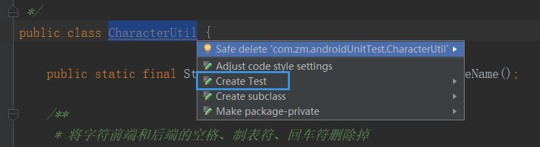
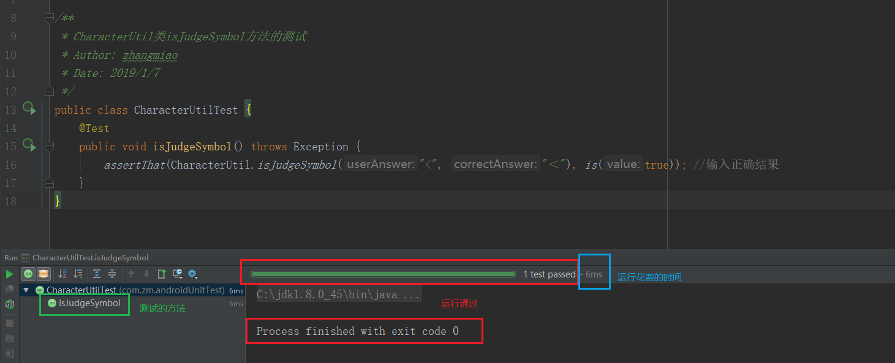

# Android单元测试之本地测试

## 本地测试
本地测试（ Local tests）：只在本地机器 JVM 上运行，以最小化执行时间，这种单元测试不依赖于 Android 框架，或者即使有依赖，也很方便使用模拟框架来模拟依赖，以达到隔离 Android 依赖的目的，模拟框架如 google 推荐的 Mockito 。
## 如何进行本地测试

#### 添加依赖
```
dependencies {
...
    implementation 'com.android.support:appcompat-v7:26.1.0'
    testImplementation 'junit:junit:4.12'
    androidTestCompile 'com.android.support:support-annotations:26.1.0'
...
}
```

#### 测试代码存放的位置
```
app/src
   |-- androidTest/java（仪器化单元测试、 UI 测试）
   |-- main/java（业务代码）
   |-- test/java（本地单元测试）
```

#### 测试
　　可以自己手动在相应目录创建测试类， AS 也提供了一种快捷方式：选择对应的类 -> 将光标停留在类名上 -> 按下 ALT + ENTER -> 在弹出的弹窗中选择 Create Test 。

　　选择 Create Test 选项之后，弹出下面框：

* Testing library: 测试库
* Class Name: 测试类名
* Superclass：超类
* Destination package：指定包
* Generate：setUp/@Before：会生成一个带 @Before 注解的 setUp() 空方法； tearDown/@After 则会生成一个带 @After 的空方法。
* Generate test methods for：选择下面框中需要测试的方法。Show inherited methods：是否显示继承的方法。

　　我这边只勾选了isJudgeSysmbol(userAnswer:String,correctAnswer:String)方法测试，剩下的选项都没有修改，点击了OK。
　　在测试文件夹中就能看到测试类了：

　　图片左侧的两个绿色图标在测试类写好之后就能点击运行测试。
　　**测试通过.**如图在 isJudgeSysmbol 中写入参数和正确的返回结果，测试结果通过。

　　**测试未通过.**如图在 isJudgeSysmbol 中写入参数和不正确的返回结果，测试结果未通过。


## 总结
　　本地测试比较适合一些工具类测试，不需要使用任何 Android 系统的东西，只适用于测试公共方法，比如字符处理，数据整理等这些方法。

## 参考文章
https://www.jianshu.com/p/aa51a3e007e2

