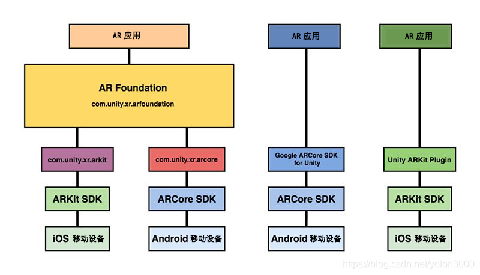

# 1.ARFoundation之路-概述

学习文章地址：[ARFoundation之路－概述_DavidWang-CSDN博客_arfoundation](https://davidwang.blog.csdn.net/article/details/91445797)

## 什么是 ARFoundation

2017 年，Apple 公司与 Google 公司相继推出了各自的 AR 开发 SDK 工具包 ARKit 和 ARCore，分别对应 iOS 平台与 Android 平台 AR 开发。

ARCore 提供了 Android、Android NDK、Unity、Unreal 开发包，ARKit 官方只提供了 Xcode 开发包，这也提高了利用其他工具进行开发的开发者学习成本。在这种情况下，Unity 构建了一个 AR 开发平台，这就是 ARFoundation，这个平台架构于 ARKit 和 ARCore 之上，其目的就是利用 Unity 的跨平台能力构建一种与平台无关的 AR 开发环境，换句话说， ARFoundation 对 ARKit 与 ARCore 进行了再次封装，并按照用户的发布平台自动选择合适的底层 SDK 版本。

因此，ARFoundation 是 ARKit XR 插件（com.unity.xr.arkit）和 ARCore XR 插件（com.unity.xr.arcore）的集合，虽然最终都使用 ARKit SDK 和 ARCore SDK，但因为 Unity 再次封装的缘故，与专业平台（如ARKit插件和ARCore SDK for Unity）相比，C# 调用的API略有不同。

ARFoundation 的目标并不局限于 ARKit 与 ARCore，它的目标是建成一个统一、开放的 AR 开发平台，因此，ARFoundation 极有可能在下步发展中纳入其他 AR SDK，进一步丰富 AR 开发环境。在进一步的发展中，ARFoundation 不仅支持移动端 AR 设备，还会支持穿戴式 AR 设备开发。

## ARFoundation 与 ARCore、ARKit 的关系

ARFoundation 提供了一个独立于平台的脚本 API 和 MonoBehaviour，因此，开发者可以通过 ARFoundation 使用 ARCore 和 ARKit 共有的核心功能构建同时适用于 iOS 和 Android 两个平台的 AR 应用程序。换句话说，这可以让开发者只需开发一次应用，就可以部署到两个平台的设备上，不必做任何改动。

ARFoundation 实现某底层 SDK 的功能会比原生的晚，因此，如果我们要开发 ARFoundation 尚不支持的功能，可以单独使用对应的原生 SDK。目前，如果我们只面向 ARCore 进行开发并希望获取完整的功能集，Google 为 Unity 开发提供了 ARCore SDK for Unity；如果只面向 ARKit 进行开发并希望获取完整的功能集，Unity 提供了适用于 Unity 开发的 ARKit 插件（Apple 并未提供 Unity 的 ARKit SDK 开发插件，在 ARFoundation 发展起来以后，Unity 肯定不会再继续维护 ARKit 插件）。

ARFoundation 与 ARCore、ARKit 的关系如下图所示：

ARFoundation 与 ARCore、ARKit 的区别如下表所示：

| SDK                         | 简介描述                                                                                                                                           |
| --------------------------- | ---------------------------------------------------------------------------------------------------------------------------------------------- |
| ARFoundation                | AR Foundation 将 ARKit 和 ARCore 的底层 API 封装整合到一个统一、开入的框架中，并提供 一些额外的实用功能，如 Session 生命周期管理，以及用于展示环境中已检测功能的 MonoBehaviour。                          |
| Google ARCore SDK for Unity | 该 SDK 为 ARCore 支持的重要 AR 功能提供原生 API，并在 Unity 中向 Android 平台公开这些 API，以方便开发者调用。                                                                    |
| Unity ARKit Plugin          | 该插件是 Unity 公司开发的 ARKit Unity 插件，用于在 Unity 中构建 ARKit 应用，它在 Unity 中公开了 C# 语言的 ARKit Objective-C API，以便开发者调用，该插件还提供一些辅助功能，可以利用兼容 iOS 设备的前置和后置摄像机。 |

## ARFoundation 支持的功能

下表展示了 ARFoundation，ARCore 和 ARKit 功能对比和开发路线图。

| 支持功能                             | AR Foundation | ARCore             | ARkit               |
| -------------------------------- | ------------- | ------------------ | ------------------- |
| 垂直平面检测                           | √             | √                  | √                   |
| 水平平面检测                           | √             | √                  | √                   |
| 特征点检测                            | √             | √+支持特征点姿态          | √                   |
| 光照估计                             | √             | √+Color Correction | √+Color Temperature |
| 射线测试（Hit Testing，对特征点与平面的射线碰撞测试） | √             | √                  | √                   |
| 图像跟踪                             | √             | √                  | √                   |
| 3D 物体检测与跟踪                       | √             | -                  | √                   |
| 环境光探头（Environment Probes）        | √             | -                  | √                   |
| 世界地图（World maps）                 | √             | -                  | √                   |
| 人脸跟踪（识别、姿态、网格和形状混合）              | √             | √                  | √(iPhoneX 及更高型号)    |
| 云锚点（Cloud Anchors）               | √             | √                  | -                   |
| 远程调试（Editor Remoting）            | 开发中           | √-Instant Preview  | √ -ARKit Remote     |
| 模拟器（Editor Simulation）           | √             | -                  | -                   |
| LWRP支持（支持使用ShaderGraph）          | √             | 开发中                | 开发中                 |
| 摄像机图像API                         | √             | √                  | -                   |
| 人体动作捕捉（Motion capture）           | √             | -                  | √（iPhoneX 及更高型号）    |
| 人形遮挡（People occlusion）           | √             | -                  | √（iPhoneX 及更高型号）    |
| 多人脸检测                            | √             | -                  | √（iPhoneX 及更高型号）    |
| 多人协作（Collaborative session）      | √             | -                  | √（iPhoneX 及更高型号）    |
| 多图像识别                            | √             | √                  |                     |
