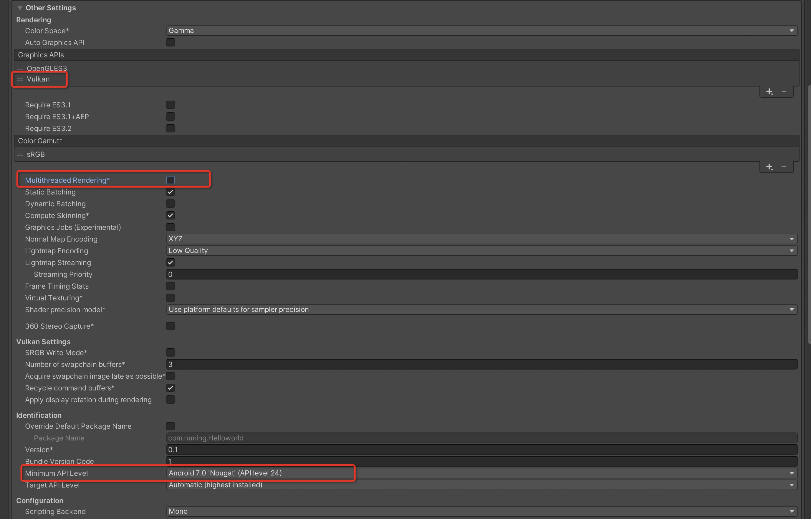
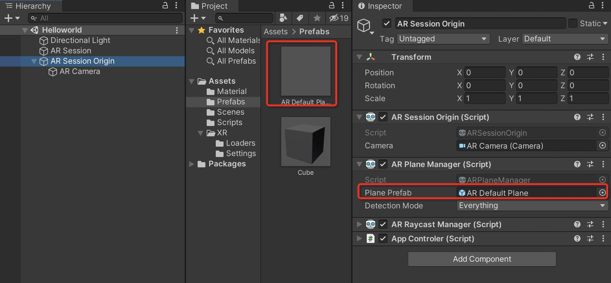

# 2.ARFoundation之路-环境配置(Android)

学习文章地址：[ARFoundation之路－环境配置(Android)_DavidWang-CSDN博客_arfoundation](https://davidwang.blog.csdn.net/article/details/93061181)

## 插件导入

创建一个项目，选择 Window->Package Manager

先选择为 Packages: Ubity Registry，就可以看到 AR Foundation 和 ARCore XR Plugin 插件了。

点击这两个插件的 install 按钮进行安装插件。至此，已经将开发 Android 的 AR 所需插件都导入了。

## 设置开发环境

如果创建项目的时候选择项目的类型是 3D，则需要修改一系列配置，如果选择的类型是 AR，只需要取消多线程渲染。

在 Unity 窗口中，按 Ctrl+Shift+B 快捷键，或者在菜单栏中选择 File->Build Settings…，打开设置窗口。选择 “Platform” 下的 “Android” 选项，然后单击 “Switch Platform” 按钮切换到 Android 平台。当 Unity 标志出现在 Android 选项旁边时，发布平台就切换成 Android 了，如下图所示。

单击"Player Settings" 按钮，选择 Player，打开 Other Settings 选项卡，1.取消勾选 Multithreaded Rendering（多线程渲染）；2.删除 Vulkan，因为 Android 不支持 Vulkan；3.在”Minimum API Level” 选项选择“Android 7.0 'nougat'(API level 24)” 或以上，保证与 ARCore 兼容的 Android 最低版本。

然后打开 “XR Plugin Manager” 选项卡，勾选上 ARCore 选项。

## 搭建基础框架

在创建的项目中，在 Hierarchy 窗口中删除 Main Camera（因为 ARFoundation AR Session Origin 只带有一个 AR 摄像机，Directional Light 可根据需要决定是否删除），选择 XR->AR Session 和 XR->AR Session Origin 两个基础组件，如下图所示。

选择 XR->AR Default Plane，将 Hierarchy 窗口中生成的 AR Default Plane 拖动到 Project 窗口中的 Prefabs 文件夹下，制作一个平面 prefab，然后删除 Hierarchy 窗口中的 AR Default Plane 对象。

在 Hierarchy 窗口选中 AR Session Origin 对象，然后在 Inspector 窗口中点击 Add Component 按钮，并在弹出的搜索中搜索 “AR Plane Manager”，并添加该组件。

将 Project 窗口中 Prefabs 文件夹下的 AR Default Plane 拖到 AR Plane Manager 组件下的 Plane Prefab 属性框。

至此，AR 应用的基础框架我们已经搭建好了，这是一个 ARFoundation 开发 AR 应用的基础框架，流程通用。
