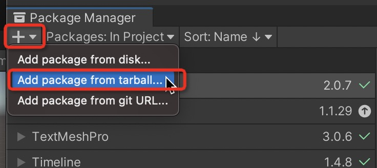
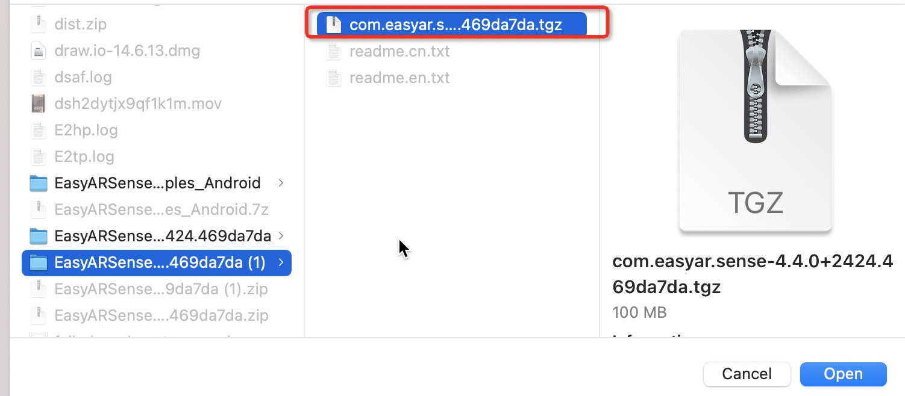
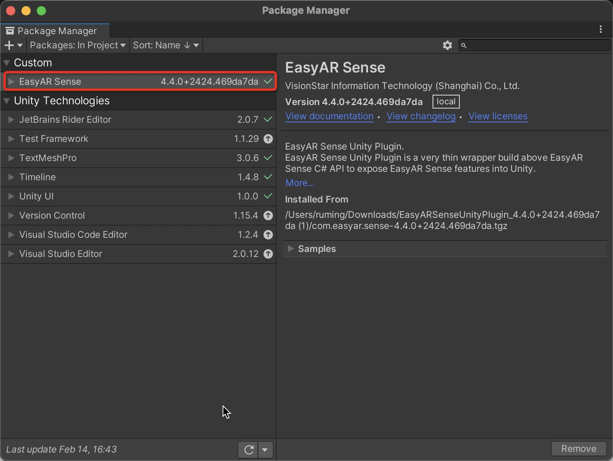
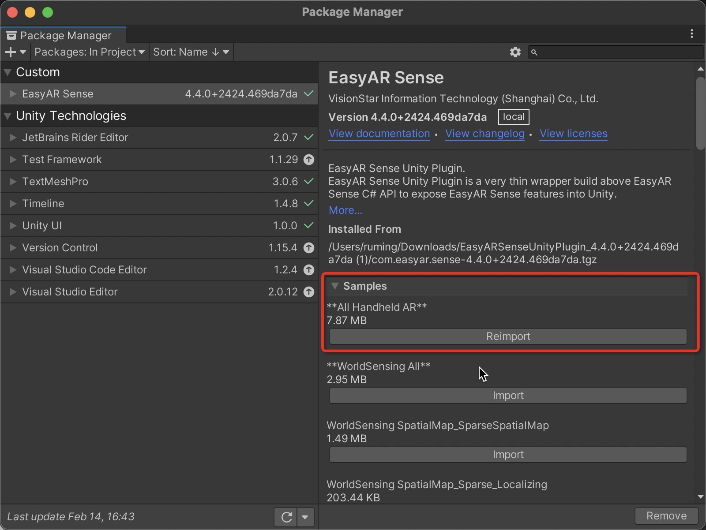
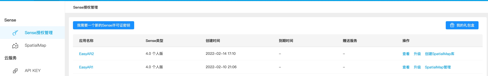
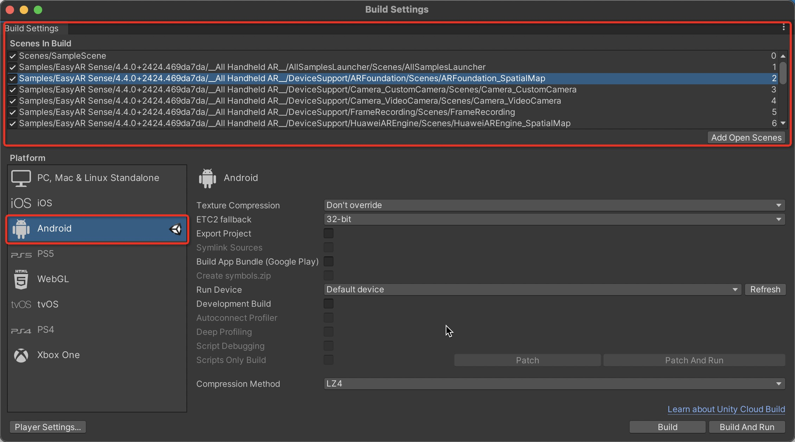
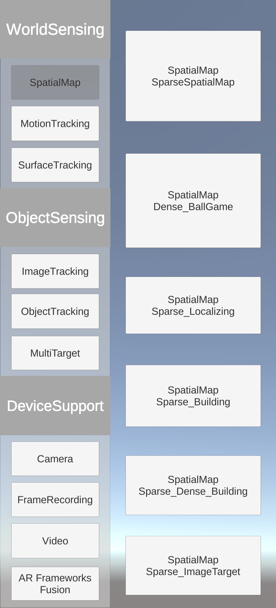

# 2.EasyAR-运行样例

官网的样例使用说明地址：[样例使用说明 &mdash; EasyAR Sense Unity Plugin 4.4.0 文档](https://help.easyar.cn/EasyAR%20Sense%20Unity%20Plugin/latest/GettingStarted/How-to-Use-Samples.html)

## 下载插件包

下载插件包：[下载-EasyAR官网](https://www.easyar.cn/view/download.html)

## 配置编译器工程

### 创建空 Unity 工程

创建工程时，Template 选择 **3D**。

### 添加插件包

在新建的项目里进入 Package Manager 中。

使用本地 tarball 文件安装插件。

将下载的插件解压，选择解压包中的 tgz 文件。

点击打开，会将 Easy Sense 加载进来。

## 导入 sample 到工程

在 Package Manager 中，打开 EasyAR Sense 中 samples，选择示例导入。

可以使用 \**All handhelp AR** 一次性导入所有可以在手机上运行的 sample。

## 许可

使用 EasyAR Sense 之前需要现在官网 www.easyar.com 注册并获取许可证授权([许可证授权 &mdash; EasyAR Sense 4.4.0 文档](https://help.easyar.cn/EasyAR%20Sense/v4_4/GettingStarted/Licensing.html))。

如果没有账号，就申请一个。

### 许可证密钥的获取

打开 EasyAR 官网 [www.easyar.com](http://www.easyar.com)，点击右上角的 “开发中心”，用注册并成功激活的邮箱登录后，进入 “SDK授权管理” 菜单，点击 “我想要一个新的 SDK 许可证密钥”。

填写订阅 SDK 信息

需要填写的部分

* SDK 类型：个人版

* 应用名称：EasyAR2

* Package Name（Android）:com.DefaultCompany.EasyAR2

然后点确认就可以了。

## 填写许可证（License Key）

查看创建的应用信息，复制 Sense License Key。

从Unity菜单中选择 `EasyAR > Sense > Configuration` 并在Inspector面板中输入License Key。

这会在你的 `Assets` 文件夹中创建资产文件，创建出来的文件不能被移动或删除。

## 运行

将示例中的样例场景添加到 build settings 中。

全选场景，然后拖到 Hierarchy 中。然后在 File->Build Settings 中加载所有场景。切换设备为 Android。

然后连接上设备，点击 Build And Run，就成功将样例应用安装到了设备上。

样例的说明可以查看官网：[样例说明 &mdash; EasyAR Sense Unity Plugin 4.4.0 文档](https://help.easyar.cn/EasyAR%20Sense%20Unity%20Plugin/latest/Samples/Samples.html)

一些样例需要在 EasyAR 官网申请云识别管理、云服务等，可以根据官网地样例说明申请。
