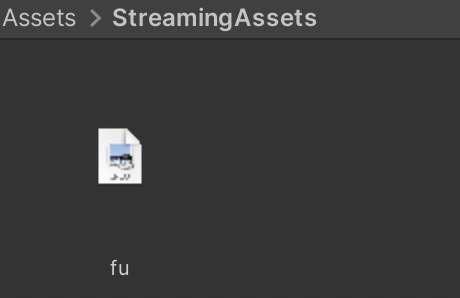
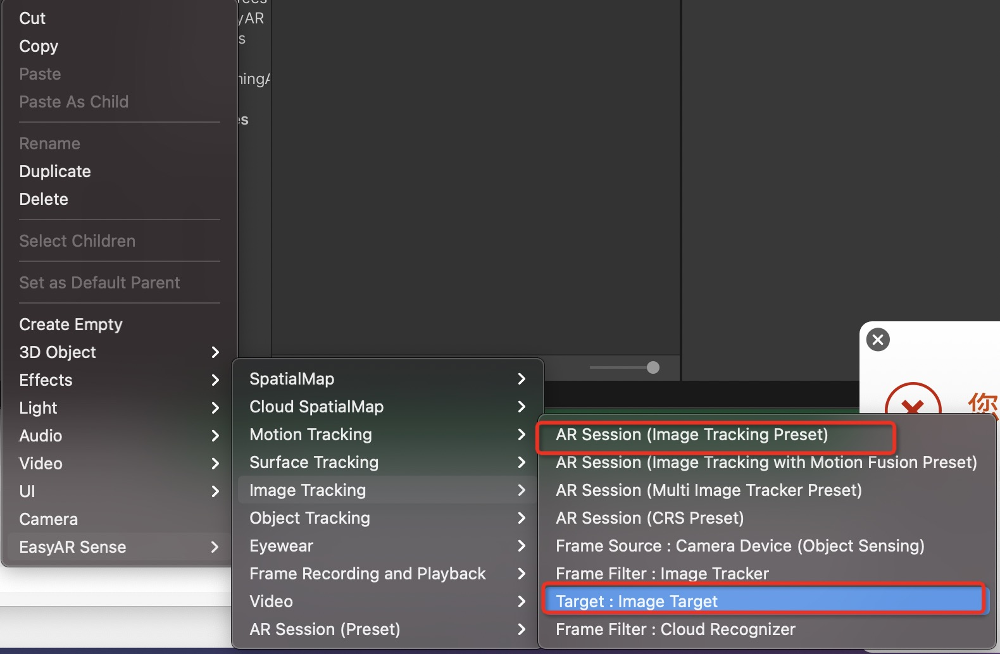
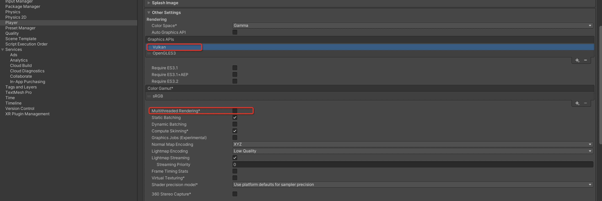

# 4. EasyAR-图像追踪

## 1. 创建场景

保存一张需要识别的图在 Assets/StreamingAssets 文件夹中，如果没有这个文件夹就创建一个。

创建一个新的场景，将 Main Camera 的 Clear Flags 设置为 "Solid Color"。

在 Hierarchy 单击，添加 AR Session(Image Tracking Preset) 和 Image Target。

修改 Image Target 的属性

* Image File Source - Path 填写图片名称+后缀，如 fu.jpeg

* Image File Source - Name 填写图片名称，如 fu

填写了之后就可以在场景中看到图片了：

如果看到问号，说明图片名称填写的不对。

然后添加 3D 模型作为 ImageTarget 子节点。

## ## 2.运行

进入 Build Settings，添加目前的场景，切换到 Android 平台，进入 Player Settings，1.删除 Vulkan，2.取消 Multithreaded Rendering 的勾选。

点击 Build And Run 就可以运行到设备上。

效果如下：

