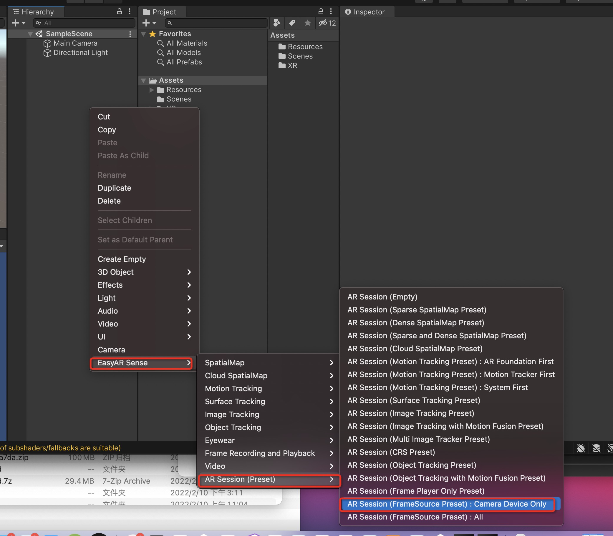
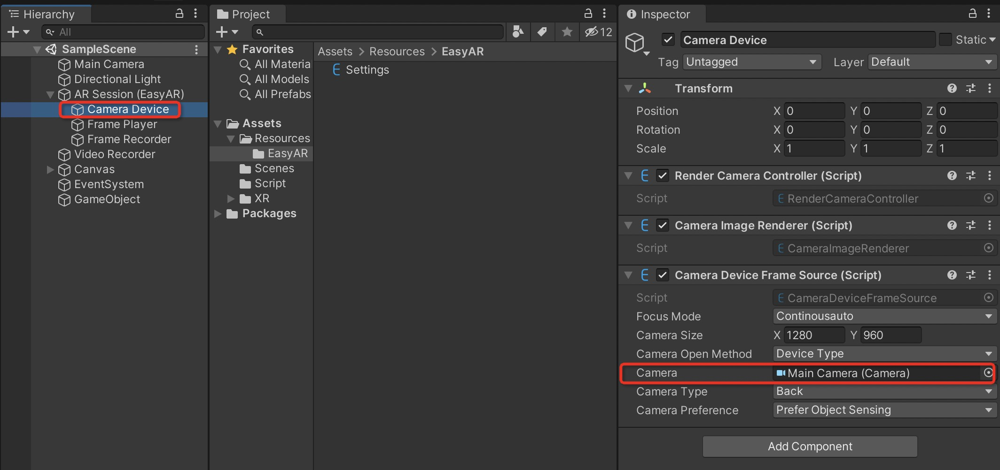
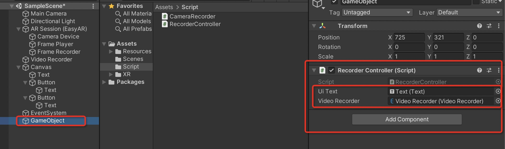
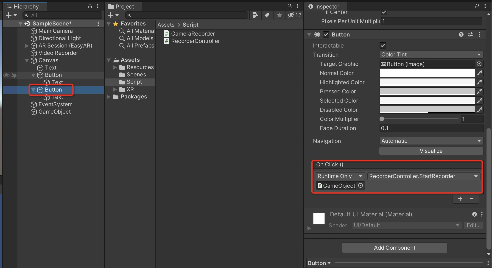

# 3. EasyAR-录屏

官网推荐地址：[EasyAR4.0使用说明（Unity3D）九----屏幕录像 - 游戏编程 🕹️](https://www.233tw.com/unity/1683)

官方推荐视频：https://www.bilibili.com/video/BV1Kt4y1m7Ch/?spm_id_from=autoNext

引入 EasyAR 插件可以查看第 2 篇。

## 1. 创建场景

创建一个新的场景，将 Main Camera 的 Tag 设置为 “MainCamera”，Clear Flags 设置为 "Solid Color"。


在 Hierarchy 点击，添加 AR Session(FrameSource Present):Camera Device Only



创建好之后，在 AR Session（EasyAR）下的 Camera Device 中 Camera 将 Main Camera 拖进去。



同样的方式，再添加一个 Video Recorder。


修改 Video Recorder 的属性。将 File Path Type （文件地址类型）修改为“Persistent Data Path”，将 FilePath 填写一个存储的视频名称。


创建两个简单的按钮与文本，如下图。


## 2. 代码

创建一个 Script 文件夹，创建一个 C# Script 文件，命名为 CameraRecorder，代码（官网示例中的实现代码）如下：

```
//================================================================================================================================
//
//  Copyright (c) 2015-2021 VisionStar Information Technology (Shanghai) Co., Ltd. All Rights Reserved.
//  EasyAR is the registered trademark or trademark of VisionStar Information Technology (Shanghai) Co., Ltd in China
//  and other countries for the augmented reality technology developed by VisionStar Information Technology (Shanghai) Co., Ltd.
//
//================================================================================================================================

using easyar;
using UnityEngine;

    public class CameraRecorder : MonoBehaviour
    {
        private VideoRecorder videoRecorder;
        private Material externalMaterial;
        private RenderTexture rt;

        public void OnRenderImage(RenderTexture source, RenderTexture destination)
        {
            Graphics.Blit(source, destination);
            if (videoRecorder)
            {
                if (externalMaterial)
                {
                    if (rt && (rt.width != source.width || rt.height != source.height))
                    {
                        Destroy(rt);
                    }
                    if (!rt)
                    {
                        rt = new RenderTexture(source.width, source.height, 0);
                    }
                    Graphics.Blit(source, rt, externalMaterial);
                    videoRecorder.RecordFrame(rt);
                }
                else
                {
                    videoRecorder.RecordFrame(source);
                }
            }
        }

        public void Setup(VideoRecorder recorder, Material material)
        {
            videoRecorder = recorder;
            externalMaterial = material;
        }

        public void Destroy()
        {
            if (rt)
            {
                Destroy(rt);
            }
            Destroy(this);
        }
    }
```

再创建一个 C# Script 文件，命名为 RecorderController，代码如下：

```
using System.Collections;
using System.Collections.Generic;
using easyar;
using UnityEngine;
using UnityEngine.UI;

public class RecorderController : MonoBehaviour
{
    public Text uiText;
    public VideoRecorder videoRecorder;
    private CameraRecorder cameraRecorder;

    void Awake()
    {
        Debug.Log("Awake");
        videoRecorder.StatusUpdate += (status, msg) =>
        {
            if (status == RecordStatus.OnStarted)
            {
                uiText.text = "Recording start";
            }
            if (status == RecordStatus.FailedToStart ||
            status == RecordStatus.FileFailed || status == RecordStatus.LogError)
            {
                uiText.text = "Recording Error:" + status + ",default:" + msg;
            }
            Debug.Log("RecordStatus:" + status + ",details:" + msg);
        };
    }

    public void StartRecorder() {
        uiText.text = "StartRecorder";
        Debug.Log("StartRecorder");
        videoRecorder.StartRecording();
        cameraRecorder = Camera.main.gameObject.AddComponent<CameraRecorder>();
        uiText.text = "StartRecorder cameraRecorder:" + cameraRecorder;
        cameraRecorder.Setup(videoRecorder, null);
    }

    public void StopRecorder() {
        Debug.Log("StopRecorder");
        if (videoRecorder.StopRecording())
        {
            uiText.text = "Recording stop " + videoRecorder.FilePath;
        }
        else {
            uiText.text = "Recording failed";
        }
        if (cameraRecorder) {
            cameraRecorder.Destroy();
        }

    }

    // Start is called before the first frame update
    void Start()
    {

    }

    // Update is called once per frame
    void Update()
    {

    }
}
```

在场景中再创建一个空实体，将 RecorderController 绑定在上面，将上面创建的 Text 和 Video Recorder 拖到相应位置。



设置一下两个 Button 的点击事件



## 3.运行

进入 Build Settings，添加目前的场景，切换到 Android 平台，进入 Player Settings，1.删除 Vulkan，2.取消 Multithreaded Rendering 的勾选。


点击 Build And Run 就可以运行到设备上。

视频保存会放在 Android/data/<package name>/files 文件夹里。

录制下来的视频效果：


