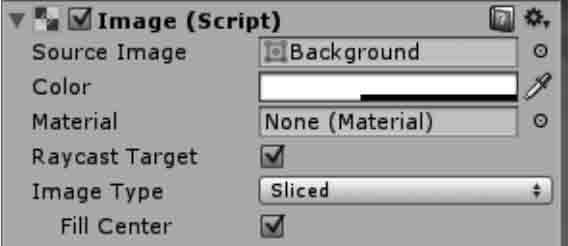
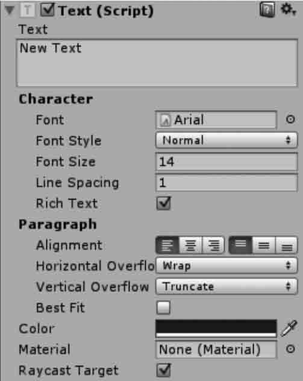
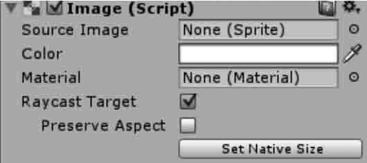
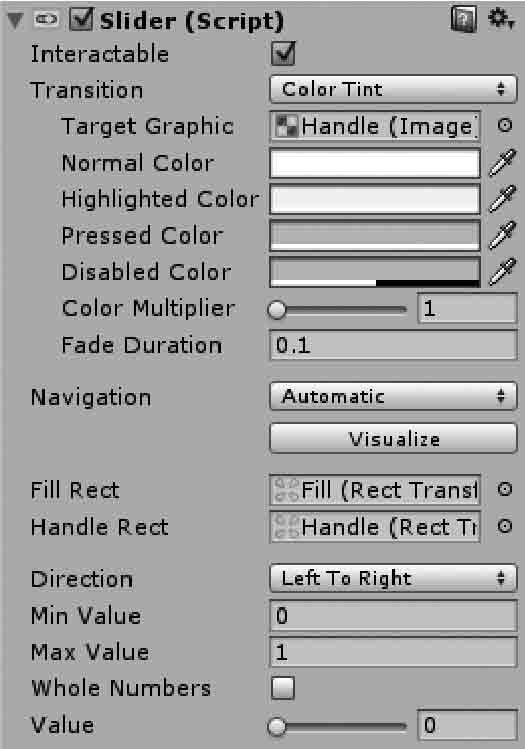

在游戏开发过程中，为了增强游戏与玩家的交互性，开发人员往往会通过制作大量的图形用户界面（Graphical User Interface，GUI）来增强这一效果。
Unity 3D 中的图形系统分为 OnGUI、NGUI、UGUI 等，这些类型的图形系统内容十分丰富，包含游戏中通常使用到的按钮、图片、文本等控件。

## 4.1. Unity 3D GUI 简介

### GUI 的概念

图形用户界面是指采用图形方式显示的计算机用户操作界面。

### GUI 的发展

在游戏开发的整个过程中，游戏界面占据了非常重要的地位。
玩家在启动游戏的时候，首先看到的就是游戏的 GUI，其中包括贴图、按钮和高级控件等。
早期的 Unity 3D 采用的是 OnGUI 系统，后来进展到了 NGUI 系统。
在 Unity 4.6 以后 Unity 官方推出了新的 UGUI 系统，采用全新的独立坐标系，为游戏开发者提供了更高的运转效率。各个时期的 Unity GUI 如下图所示。


## 4.2. Unity 3D OnGUI 常用控件

[Unity 3D](http://c.biancheng.net/unity3d/) 的 OnGUI 系统的可视化操作界面较少，大多数情况下需要开发人员通过代码实现控件的摆放以及功能的修改。
开发人员需要通过给定坐标的方式对控件进行调整，规定屏幕左上角坐标为（0，0，0），并以像素为单位对控件进行定位。
OnGUI 中常用的一些控件：

- [Unity 3D Button控件](http://c.biancheng.net/view/2689.html)
- [Unity 3D Box控件](http://c.biancheng.net/view/2691.html)
- [Unity 3D Label控件](http://c.biancheng.net/view/2692.html)
- [Unity 3D Background Color控件](http://c.biancheng.net/view/2693.html)
- [Unity 3D Color控件](http://c.biancheng.net/view/2694.html)
- [Unity 3D TextField控件](http://c.biancheng.net/view/2695.html)
- [Unity 3D TextArea控件](http://c.biancheng.net/view/2696.html)
- [Unity 3D ScrollView控件](http://c.biancheng.net/view/2697.html)
- [Unity 3D Slider控件](http://c.biancheng.net/view/2699.html)
- [Unity 3D ToolBar控件](http://c.biancheng.net/view/2700.html)
- [Unity 3D ToolTip控件](http://c.biancheng.net/view/2702.html)
- [Unity 3D Drag Window控件](http://c.biancheng.net/view/2703.html)
- [Unity 3D Window控件](http://c.biancheng.net/view/2706.html)
- [Unity 3D贴图](http://c.biancheng.net/view/2707.html)
- [Unity 3D Skin控件](http://c.biancheng.net/view/2708.html)
- [Unity 3D Toggle控件](http://c.biancheng.net/view/2710.html)
  
  ## 4.3. Unity 3D Button 控件
  
  在 [Unity 3D](http://c.biancheng.net/unity3d/) 开发中 Button 控件是游戏开发中最常使用的控件之一，用户常常通过 Button 控件来确定其选择行为，当用户单击 Button 控件时，Button 控件会显示按下的效果，并触发与该控件关联的游戏功能。

在游戏中通常用作游戏界面、游戏功能、游戏设置的开关。

一般来说，按钮分两种：普通按钮和图片按钮。

### 普通按钮

普通按钮是系统默认显示的按钮，Unity 3D 的普通按钮背景呈半透明状态，显示白色文字，普通按钮的使用方法如下：

```java
public static function Button(position:Rect, text:string):bool;
public static function Button(position:Rect, image:Texture):bool;
public static function Button(position:Rect, content:GUIContent):bool;
public static function Button(position:Rect, text:string, style:GUIStyle):bool;
public static function Button(position:Rect, image:Texture, style:GUIStyle):bool;
public static function Button(position:Rect, content:GUIContent, style:GUIStyle):bool;
```

其中，position 指按钮在屏幕上的位置以及长宽值，text 指按钮上显示的文本。

Button 控件的参数如下表所示。

| 参 数      | 功 能            | 参 数     | 功 能           |
| -------- | -------------- | ------- | ------------- |
| position | 设置控件在屏幕上的位置及大小 | text    | 设置控件上显示的文本    |
| image    | 设置控件上显示的纹理图片   | content | 设置控件的文本、图片和提示 |
| style    | 设置控件使用的样式      |         |               |

### 图片按钮

Button 控件除了可以显示文字以外，还可以显示贴图。
贴图是一种美化按钮的方法，开发者可以设定按钮的背景图片，比如水晶按钮、卡通按钮等。
在 Unity 3D 中实现 Button 贴图十分容易，只要将图片作为一个参数传递到 Button 函数中即可。
Button贴图方法如下：

```java
public static function Button(position:Rect, image:Texture):bool;
public static function Button(position:Rect, image:Texture, style:GUIStyle):bool;
```

其中 position 为按钮在屏幕上的位置以及长宽值，image 为按钮上显示的图片。

OnGUI 用的少不用看，从 UGUI 开始看。

## 4.19. Unity 3D UGUI 系统

新版 UGUI 系统相比于 OnGUI 系统更加人性化，而且是一个开源系统，利用游戏开发人员进行游戏界面开发。
UGUI 系统有 3 个特点：灵活、快速、可视化。
对于游戏开发者来说，UGUI 运行效率高，执行效果好，易于使用，方便扩展，与 [Unity 3D](http://c.biancheng.net/unity3d/) 兼容性高。

在 UGUI 中创建的所有 UI 控件都有一个 UI 控件特有的 Rect Transform 组件。
在 Unity 3D 中创建的三维物体是 Transform，而 UI 控件的 Rect Transform 组件是UI控件的矩形方位，其中的 PosX、PosY、PosZ 指的是 UI 控件在相应轴上的偏移量。
一些 UGUI 中常用的控件：

- [Unity 3D Canvas画布](http://c.biancheng.net/view/2714.html)

- [Unity 3D Event System事件系统](http://c.biancheng.net/view/2717.html)

- [Unity 3D Panel控件](http://c.biancheng.net/view/2722.html)

- [Unity 3D Text控件](http://c.biancheng.net/view/2723.html)

- [Unity 3D Image控件](http://c.biancheng.net/view/2724.html)

- [Unity 3D Raw Image控件](http://c.biancheng.net/view/2726.html)

- [Unity 3D UGUI Button控件](http://c.biancheng.net/view/2727.html)

- [Unity 3D UGUI Toggle控件](http://c.biancheng.net/view/2728.html)

- [Unity 3D UGUI Slider控件](http://c.biancheng.net/view/2729.html)

- [Unity 3D Scrollbar控件](http://c.biancheng.net/view/2730.html)

- [Unity 3D Input Field控件](http://c.biancheng.net/view/2732.html)
  
  ## 4.20. Unity 3D Canvas 画布
  
  Canvas 是画布，是摆放所有 UI 元素的区域，在场景中创建的所有控件都会自动变为 Canvas 游戏对象的子对象，若场景中没有画布，在创建控件时会自动创建画布。
  创建画布有两种方式：

- 一是通过菜单直接创建；

- 二是直接创建一个 UI 组件时自动创建一个容纳该组件的画布。

不管用哪种方式创建画布，系统都会自动创建一个名为 EventSystem 的游戏对象，上面挂载了若干与事件监听相关的组件可供设置。

在画布上有一个 Render Mode 属性，它有 3 个选项，如下图所示。
它们分别对应画布的 3 种渲染模式：Screen Space-Overlay、Screen Space-Camera 和 World Space。

### 1）Screen Space-Overlay 渲染模式

在 Screen Space-Overlay 渲染模式下，场景中的 UI 被渲染到屏幕上，如果屏幕大小改变了或更改了分辨率，画布将自动更改大小以适配屏幕。

此种模式不需要 UI 摄像机，UI 将永远出现在所有摄像机的最前面。

Screen Space-Overlay 渲染模式的参数如下表所示。

| 参 数           | 功 能                        |
| ------------- | -------------------------- |
| Pixel Perfect | 重置元素大小和坐标，使贴图的像素完美对应到屏幕像素上 |
| Sort Order    | 排列顺序                       |

### 2）Screen Space-Camera 渲染模式

Screen Space-Camera 渲染模式类似于 Screen Space-Overlay 渲染模式。

这种渲染模式下，画布被放置在指定摄像机前的一个给定距离上，它支持在 UI 前方显示 3D 模型与粒子系统等内容，通过指定的摄像机 UI 被呈现出来，如果屏幕大小改变或更改了分辨率，画布将自动更改大小以适配屏幕。

Screen Space-Camera 渲染模式的参数如下表所示。

| 参 数            | 功 能                                                                                   |
| -------------- | ------------------------------------------------------------------------------------- |
| Pixel Perfect  | 重置元素大小和坐标，使贴图的像素完美对应到屏幕像素上                                                            |
| Render Camera  | UI 绘制所对应的摄像机                                                                          |
| Plane Distance | UI 距离摄像机镜头的距离                                                                         |
| Sorting Layer  | 界面分层，执行 Edit→Project Setting→Tags and Layers→Sorting Layers 命令进 行界面分层，越下方的层在界面显示时越在前面 |
| Order Layer    | 界面顺序，该值越高，在界面显示时越在前面                                                                  |

### 3）World Space 渲染模式

在 World Space 渲染模式下呈现的 UI 好像是 3D 场景中的一个 Plane 对象。与前两种渲染模式不同，其屏幕的大小将取决于拍摄的角度和相机的距离。
它是一个完全三维的 UI，也就是把 UI 也当成三维对象，例如摄像机离 UI 远了，其显示就会变小，近了就会变大。
World Space 渲染模式的参数如下表所示。

| 参 数           | 功 能                                                                                   |
| ------------- | ------------------------------------------------------------------------------------- |
| Event Camera  | 设置用来处理用户界面事件的摄像机                                                                      |
| Sorting Layer | 界面分层，执行 Edit→Project Setting→Tags and Layers→Sorting Layers 命令进 行界面分层，越下方的层在界面显示时越在前面 |
| Order Layer   | 界面顺序，该值越高，在界面显示时越在前面                                                                  |

## 4.21. Unity 3D Event System 事件系统

创建 UGUI 控件后，[Unity 3D](http://c.biancheng.net/unity3d/) 会同时创建一个叫 Event System（事件系统）的 GameObject，用于控制各类事件。
如下图所示。可以看到 Unity 3D 自带了两个 Input Module，一个用于响应标准输入，另一个用于响应触摸操作。

Input Module 封装了 Input 模块的调用，根据用户操作触发各 Event Trigger。
Event System 事件处理器中有 3 个组件：

#### 1) Event System 事件处理组件

是一种将基于输入的事件发送到应用程序中的对象，使用键盘、鼠标、触摸或自定义输入均可。

#### 2) Standalone Input Module（独立输入模块）

用于鼠标、键盘和控制器。该模块被配置为查看 InputManager，基于输入 InputManager 管理器的状态发送事件。

#### 3) Touch Input Module（触控输入模块）

被设计为使用在可触摸的基础设备上。

## 4.22. Unity 3D Panel 控件

[Unity 3D](http://c.biancheng.net/unity3d/) panel 控件又叫面板，面板实际上就是一个容器，在其上可放置其他 UI 控件。
当移动面板时，放在其中的 UI 控件就会跟随移动，这样可以更加合理与方便地移动与处理一组控件。
拖动面板控件的 4 个角或 4 条边可以调节面板的大小。
一个功能完备的 UI 界面往往会使用多个 Panel 容器控件，而且一个面板里还可套用其他面板。
当创建一个面板时，此面板会默认包含一个 Image（Script）组件，如下图所示。
其中，Source Image 用来设置面板的图像，Color 用来改变面板的颜色。


## 4.23. Unity 3D Text 控件

在 [Unity 3D](http://c.biancheng.net/unity3d/) UGUI 中创建的很多 UI 控件都有一个支持文本编辑的 Text 控件。
Text 控件也称为标签，Text 区域用于输入将显示的文本。它可以设置字体、样式、字号等内容，如下图所示，具体参数如下表所示。


| 参 数                 | 功 能                                           |
| ------------------- | --------------------------------------------- |
| Font                | 设置字体                                          |
| Font Style          | 设置字体样式                                        |
| Font Size           | 设置字体大小                                        |
| Line Spacing        | 设置行间距（多行）                                     |
| Rich Text           | 设置富文本                                         |
| Alignment           | 设置文本在 Text 框中的水平以及垂直方向上的对齐方式                  |
| Horizontal Overflow | 设置水平方向上溢出时的处理方式。分两种：Wrap(隐藏）；C)verflow(溢出）    |
| Vertical Overflow   | 设置垂直方向上溢出时的处理方式。分两种：Truncate(截断）；Overflow(溢出） |
| Best Fit            | 设置当文字多时自动缩小以适应文本框的大小                          |
| Color               | 设置字体颜色                                        |

## 4.24. Unity 3D Image 控件

[Unity 3D](http://c.biancheng.net/unity3d/) Image 控件除了两个公共的组件 Rect Transform 与 Canvas Renderer 外，默认的情况下就只有一个 Image 组件，如下图所示。

其中，Source Image 是要显示的源图像，要想把一个图片赋给 Image，需要把图片转换成精灵格式，转化后的精灵图片就可拖放到 Image 的 Source Image 中了。
转换方法为：在 Project 视图中选中要转换的图片，然后在 Inspector 属性面板中，单击 Texture Type（纹理类型）右边的下拉列表，选中 Sprite（2D and UI）并单击下方的 Apply 按钮，就可以把图片转换成精灵格式，然后就可以拖放到 Image 的 Source Image 中了。
Image 控件的参数如下表所示。

| 参 数      | 功 能         | 参 数        | 功 能    |
| -------- | ----------- | ---------- | ------ |
| Color    | 设置应用在图片上的颜色 | Image Type | 设置贴图类型 |
| Material | 设置应用在图片上的材质 |            |        |

## 4.25. Unity 3D Raw Image 控件

[Unity 3D](http://c.biancheng.net/unity3d/) Raw Image 控件向用户显示了一个非交互式的图像，如下图所示。它可以用于装饰、图标等。

Raw Image 控件类似于 Image 控件，但是，Raw Image 控件可以显示任何纹理，而 Image 只能显示一个精灵。

Raw Image控件的参数如下表所示。

| 参 数      | 功 能                     |
| -------- | ----------------------- |
| Texture  | 设置要显示的图像纹理              |
| Color    | 设置应用在图片上的颜色             |
| Material | 设置应用在图片上的材质             |
| UV Rect  | 设置图像在控件矩形中的偏移和大小，范围为0〜1 |

## 4.26. Unity 3D UGUI Button 控件

除了公共的 Rect Transform 与 Canvas Renderer 两个 UI 组件外，[Unity 3D](http://c.biancheng.net/unity3d/) Button 控件还默认拥有 Image 与 Button 两个组件，如下图所示。
Image 组件里的属性与前面介绍的是一样的。Button 是一个复合控件，其中还包含一个 Text 子控件，通过此子控件可设置 Button 上显示的文字的内容、字体、文字样式、文字大小、颜色等，与前面所讲的 Text 控件是一样的。
Button 控件数据如下：

1. Interactable（是否启动交互）

如果把其后的对钩去掉，此 Button 在运行时将不可单击，即失去了交互性。

2. Transition（过渡方式）

共有 4 个选项，如下图（b）所示。默认为 Color Tint（颜色色彩）。

- None：没有过渡方式。
- Color Tint：颜色过渡，相关属性如下表所示。
- Sprite Swap：精灵交换，需要使用相同功能、不同状态的贴图，相关属性如下表所示。
- Animation：动画过渡。


Color Tint 的属性如下：

| 属 性               | 功 能    | 属 性              | 功 肯巨      |
| ----------------- | ------ | ---------------- | --------- |
| Target Graphic    | 设置目标图像 | Disabled Color   | 设置禁用色     |
| Normal Color      | 设置正常颜色 | Color Multiplier | 设置颜色倍数    |
| Highlighted Color | 设置高亮色  | Fade Duration    | 设置变化持续的时间 |
| Pressed Color     | 设置单击色  |                  |           |

Sprite Swap 的属性如下：

| 属 性                | 功 肯运       | 属 性             | 功 能      |
| ------------------ | ---------- | --------------- | -------- |
| Target Graphic     | 设置目标图像     | Pressed Sprite  | 设置单击时的贴图 |
| Highlighted Sprite | 设置鼠标经过时的贴图 | Disabled Sprite | 设置禁用时的贴图 |

## 4.27. Unity 3D UGUI Toggle 控件

[Unity 3D](http://c.biancheng.net/unity3d/) Toggle 控件也是一个复合型控件，如下图所示。它有 Background 与 Label 两个子控件，而 Background 控件中还有一个 Checkmark 子控件。
Background 是一个图像控件，而其子控件 Checkmark 也是一个图像控件，其 Label 控件是一个文本框，通过改变它们所拥有的属性值，即可改变 Toggle 的外观，如颜色、字体等。

Toggle 控件的参数如下表所示。

| 属 性               | 功 能                |
| ----------------- | ------------------ |
| Is On             | 设置复选框默认是开还是关       |
| Toggle Transition | 设置渐变效果             |
| Graphic           | 用于切换背景，更改为一个更合适的图像 |
| Group             | 设置多选组              |

## 4.28. Unity 3D UGUI Slider 控件

在游戏的 UI 界面中会见到各种滑块，用来控制音量或者是摇杆的灵敏度。
[Unity 3D](http://c.biancheng.net/unity3d/) Slider 控件也是一个复合控件，Background 是背景，默认颜色是白色，Fill Area 是填充区域，如下图所示。

Slider 控件的一个需要注意的参数是 Whole Number，该参数表示滑块的值是否只可为整数，开发人员可根据需要进行设置。
除此以外，Slider 控件也可以挂载脚本，用来响应事件监听。
Slider 控件的参数如下表所示。

| 属 性         | 功 能             | 属 性           | 功 能       |
| ----------- | --------------- | ------------- | --------- |
| Fill Rect   | 设置填充矩形区域        | Max Value     | 设置最大数值    |
| Handle Rect | 设置手柄矩形区域        | Whole Numbers | 设置整数数值    |
| Direction   | 设置 Slider 的摆放方向 | Value         | 设置滑块当前的数值 |
| Min Value   | 设置最小数值          |               |           |

## 4.29. Unity 3D Scrollbar 控件

[Unity 3D](http://c.biancheng.net/unity3d/) Scrollbar（滚动条）控件可以垂直或水平放置，主要用于通过拖动滑块以改变目标的比例，如下图所示。
它最恰当的应用是用来将一个值变为指定百分比，最大值为1（100%），最小值为0（0%），拖动滑块可在0和1之间改变，例如改变滚动视野的显示区域。

Scrollbar 控件的参数如下表所示。

| 参 数              | 功 能                                   |
| ---------------- | ------------------------------------- |
| Handle Rect      | 设置最小值与最大值之间的范围，也就是整个滑条的最大可控制范围。       |
| Direction        | 设置滚动条的方向为从左至右、从上至下或其他的方向              |
| Value            | 设置当前滚动条对应的值                           |
| Size             | 设置操作条矩形对应的缩放长度，即 handle 部分的大小，取值为 0〜1 |
| Numbers Of Steps | 设置滚动条可滚动的位置数目                         |
| On Value Changed | 设置值改变时触发消息                            |

## 4.30. Unity 3D Input Field 控件

[Unity 3D](http://c.biancheng.net/unity3d/) Input Field 控件也是一个复合控件，包含 Placeholder 与 Text 两个子控件，如下图所示。
其中，Text 是文本控件，程序运行时用户所输入的内容就保存在 Text 控件中，Placeholder 是占位符，表示程序运行时在用户还没有输入内容时显示给用户的提示信息。
Input Field 输入字段组件与其他控件一样，也有 Image（Script）组件，另外也包括 Transition 属性，其默认是 Color Tint，如下图所示，具体属性如下表所示。


| 参 数             | 功 能                                           |
| --------------- | --------------------------------------------- |
| Interactable    | 设置是否启用 Input Field 组件。勾选表示输入字段可以交互，否则表示不可以 交互 |
| Transition      | 设置当正常显示、突出显示、按下或禁用时输入字段的转换效果                  |
| Navigation      | 设置导航功能                                        |
| Text Component  | 设置此输人域的文本显示组件，用于显示用户输人的文本框                    |
| Text            | 设置此输入域的初始值                                    |
| Character Limit | 设置此输人域最大的输入字符数，0为不限制输入字符数                     |
| Content Type    | 输人此输人域的内容类型，包括数字、密码等，常用的类型如下：                 |

- Standard：允许输人任何字符，只要是当前字体支持的即可。
- Autocorrected:自动校正输入的未知单词，并建议更合适的替换候选对象，除非 用户明确地覆盖该操作，否则将自动替换输入的文本。
- Integer Number：只允许输入整数。
- Decimal Number：允许输入整数或小数。
- Alpha numeric：允许输人数字和字母。
- Name：允许输入英文及其他文字，当输人英文时能自动提示姓名拼写。
- Email Address：允许输人一个由最多一个 @ 符号组成的字母数字字符串。
- Password：输入的字符被隐藏，只显 7K 星号。
- Pin：只允许输人整数。输入的字符被隐藏，只显示星号。
- Custom：允许用户自定义行类型、输入类型、键盘类型和字符验证
  |
  | Line Type | 设置当输人的内容超过输入域边界时的换行方式：
- Single Line：超过边界也不换行，继续向右延伸此行，即输入域中的内容只有一行
- Muhi Line Submit:允许文本换行。只在需要时才换行。
- Multi Line Newline：允许文本换行。用户可以按回车键来换行
  |
  | Placeholder | 设置此输入域的输人位控制符，对于任何带有 Text 组件的物体均可设置此项 |

除此以外，它还有一个重要的 Content Type（内容类型）属性，其参数如下表所示。

| 参 数            | 功 能   | 参 数           | 功 能 |
| -------------- | ----- | ------------- | --- |
| Standard       | 标准的   | Name          | 人名  |
| Autocorrected  | 自动修正  | Email Address | 邮箱  |
| Integer Number | 整数    | Password      | 密码  |
| Decimal Number | 十进制小数 | Pin           | 固定  |
| Alphanumeric   | 字母数字  | Custom        | 定制的 |

