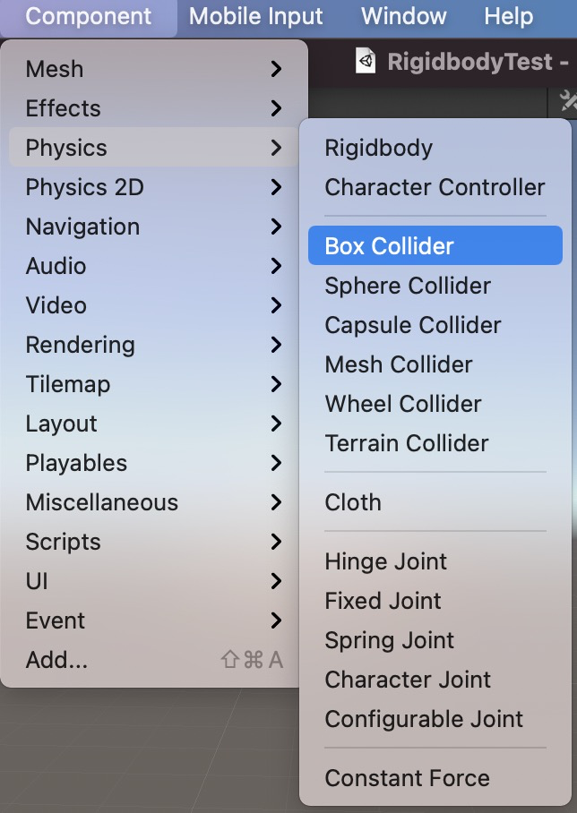
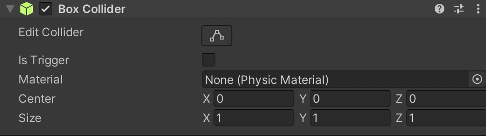
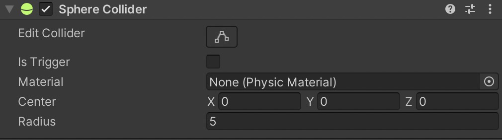
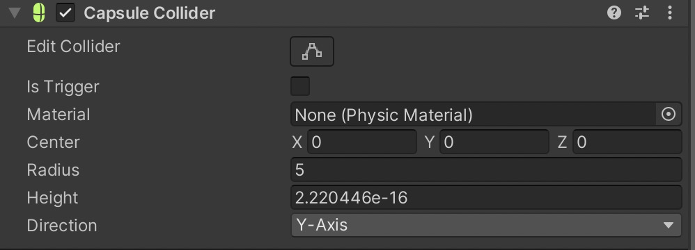
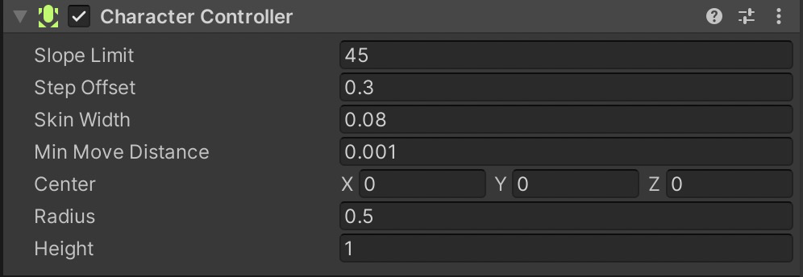
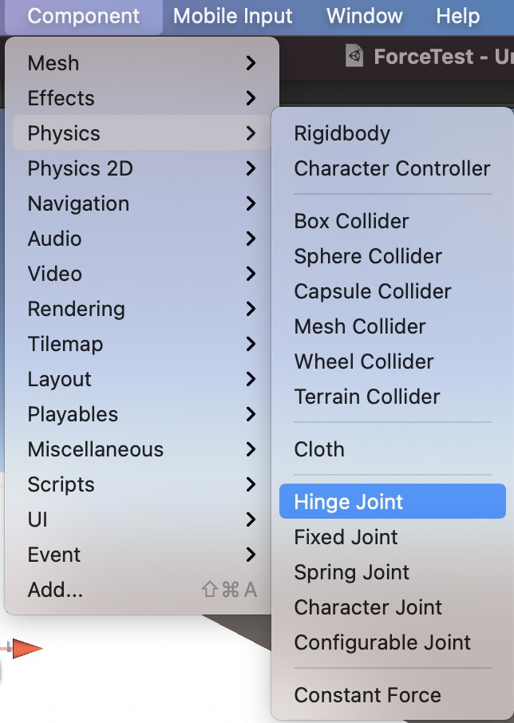
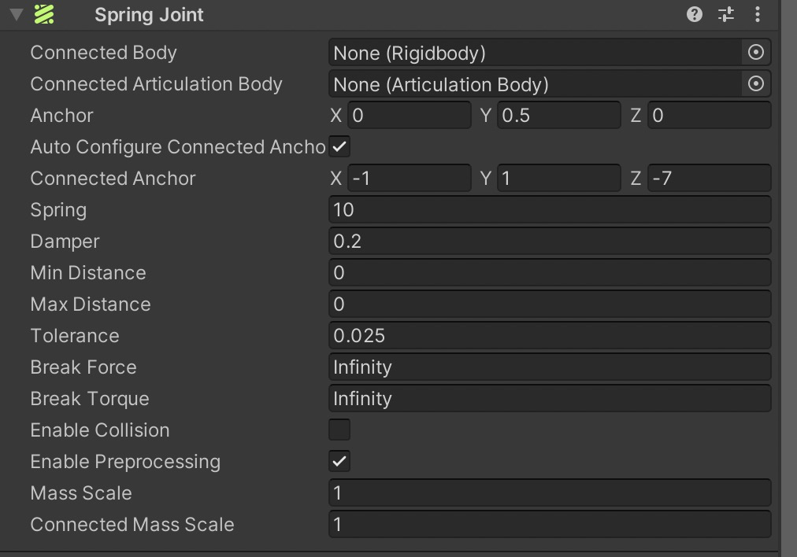
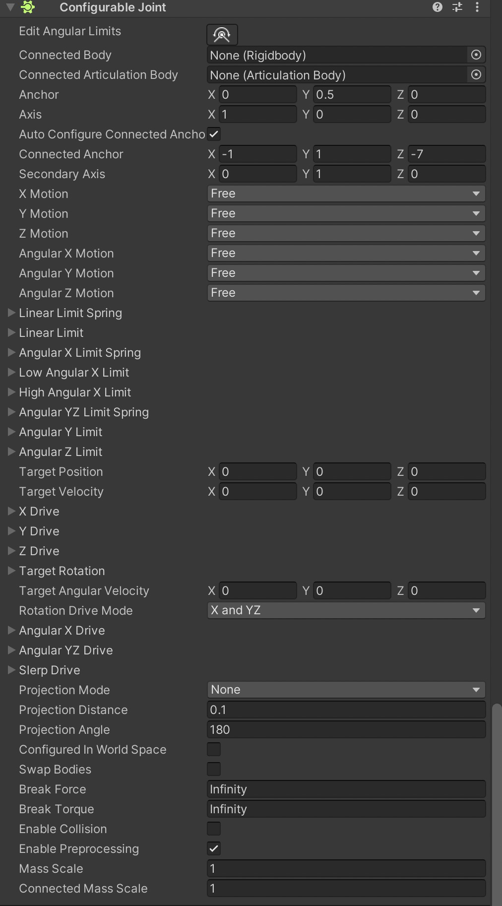
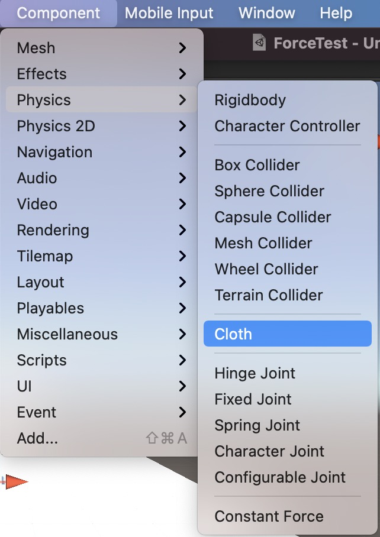
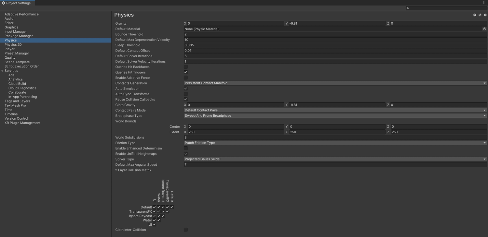

## 6.1. Unity 3D 物理引擎简介
早期的游戏并没有强调物理引擎的应用，当时无论是哪一种游戏，都是用极为简单的计算方式做出相应的运算就算完成物理表现，如超级玛丽和音速小子等游戏，较为常见的物理处理是在跳跃之后再次落到地上，并没有特别注重物理表现效果。
当游戏进入三维时代后，物理表现效果的技术演变开始加速，三维呈现方式拓宽了游戏的种类与可能性，越来越好的物理表现效果需求在短时间内大幅提升。
如何制作出逼真的物理互动效果，而又不需要花费大量时间去撰写物理公式，是物理引擎重点要解决的问题。
在 Unity 3D 内的 Physics Engine 引擎设计中，使用硬件加速的物理处理器 PhysX 专门负责物理方面的运算。
因此，Unity 3D 的物理引擎速度较快，还可以减轻 CPU 的负担，现在很多游戏及开发引擎都选择 Physics Engine 来处理物理部分。
在 Unity 3D 中，物理引擎是游戏设计中最为重要的步骤，主要包含刚体、碰撞、物理材质以及关节运动等。
游戏中物理引擎的作用是模拟当有外力作用到对象上时对象间的相互影响，比如赛车游戏中，驾驶员驾驶赛车和墙体发生碰撞，进而出现被反弹的效果。
物理引擎在这里用来模拟真实的碰撞后效果。通过物理引擎，实现这些物体之间相互影响的效果是相当简单的。
## 6.2. Unity 3D 刚体（Rigidbody）
[Unity 3D](http://c.biancheng.net/unity3d/) 中的 Rigidbody（刚体）可以为游戏对象赋予物理属性，使游戏对象在物理系统的控制下接受推力与扭力，从而实现现实世界中的运动效果。
在游戏制作过程中，只有为游戏对象添加了刚体组件，才能使其受到重力影响。
刚体是物理引擎中最基本的组件。在物理学中，刚体是一个理想模型。
通常把在外力作用下，物体的形状和大小（尺寸）保持不变，而且内部各部分相对位置保持恒定（没有形变）的理想物理模型称为刚体。
在一个物理引擎中，刚体是非常重要的组件，通过刚体组件可以给物体添加一些常见的物理属性，如质量、摩擦力、碰撞参数等。
通过这些属性可以模拟该物体在 3D 世界内的一切虚拟行为，当物体添加了刚体组件后，它将感应物理引擎中的一切物理效果。
Unity 3D 提供了多个实现接口，开发者可以通过更改这些参数来控制物体的各种物理状态。
刚体在各种物理状态影响下运动，刚体的属性包含 Mass（质量）、Drag（阻力）、Angular Drag（角阻力）、Use Gravity（是否使用重力）、Is Kinematic（是否受物理影响）、Collision Detection（碰撞检测）等。
### 6.2.1. 刚体添加方法
在 Unity 3D 中创建并选择一个游戏对象，执行菜单栏中的 Component→Physics→Rigidbody 命令为游戏对象添加刚体组件。

### 6.2.2. 刚体选项设置
游戏对象一旦被赋予刚体属性后，其 Inspector 属性面板会显示相应的属性参数与功能选项，具体内容如下表所示。

| 参 数 | 含义 | 功 能 |
| --- | --- | --- |
| Mass | 质量 | 物体的质量（任意单位）。建议一个物体的质量不要与其他物体相差100倍 |
| Drag | 阻力 | 当受力移动时物体受到的空气阻力。0表示没有空气阻力，极大时使物体立即停止运动 |
| Angular Drag | 角阻力 | 当受扭力旋转时物体受到的空气阻力。0表示没有空气阻力， 极大时使物体立即停止旋转 |
| Use Gravity | 使用重力 | 该物体是否受重力影响，若激活，则物体受重力影响 |
| Is Kinematic | 是否是运动学 | 游戏对象是否遵循运动学物理定律，若激活，该物体不再受物理引擎驱动，而只能通过变换来操作。适用于模拟运动的平台或者模拟由铰链关节连接的刚体 |
| Interpolate | 插值 | 物体运动插值模式。当发现刚体运动时抖动，可以尝试下面的 选项：None(无），不应用插值；Interpolate(内插值），基于上一帧变换来平滑本帧变换；Extrapolate(外插值），基于下一帧变换来平滑本帧变换 |
| Collision Detection | 碰撞检测 | 碰撞检测模式。用于避免高速物体穿过其他物体却未触发碰撞。碰撞模式包括Discrete (不连续）、Continuous (连续）、 Continuous Dynamic (动态连续〉3种。其中，Discrete模式用来检测与场景中其他碰撞器或其他物体的碰撞；Continuous模式 用来检测与动态碰撞器（刚体）的碰撞；Continuous Dynamic模式用来检测与连续模式和连续动态模式的物体的碰撞，适用于 高速物体 |
| Constraints | 约束 | 对刚体运动的约束。其中，Freeze Position(冻结位置）表7TC刚体在世界中沿所选HZ轴的移动将无效，Freeze Rotation(冻结 旋转）表示刚体在世界中沿所选的X、Y、Z轴的旋转将无效 |

## 6.3. Unity 3D 碰撞体（Collider）
在游戏制作过程中，游戏对象要根据游戏的需要进行物理属性的交互。
因此，[Unity 3D](http://c.biancheng.net/unity3d/) 的物理组件为游戏开发者提供了碰撞体组件。碰撞体是物理组件的一类，它与刚体一起促使碰撞发生。
碰撞体是简单形状，如方块、球形或者胶囊形，在 Unity 3D 中每当一个 GameObjects 被创建时，它会自动分配一个合适的碰撞器。
一个立方体会得到一个 Box Collider（立方体碰撞体），一个球体会得到一个 Sphere Collider（球体碰撞体），一个胶囊体会得到一个 Capsule Collider（胶囊体碰撞体）等。
### 6.3.1. 添加碰撞体
在 Unity 3D 的物理组件使用过程中，碰撞体需要与刚体一起添加到游戏对象上才能触发碰撞。
值得注意的是，刚体一定要绑定在被碰撞的对象上才能产生碰撞效果，而碰撞体则不一定要绑定刚体。
碰撞体的添加方法是：首先选中游戏对象，执行菜单栏中的 Component→Physics 命令，此时可以为游戏对象添加不同类型的碰撞体，如下图所示。

### 6.3.2. 碰撞体选项设置
Unity 3D 为游戏开发者提供了多种类型的碰撞体资源。当游戏对象中的 Rigidbody 碰撞体组件被添加后，其属性面板中会显示相应的属性设置选项，每种碰撞体的资源类型稍有不同，具体如下。
#### 6.3.2.1. Box Collider
Box Collider 是最基本的碰撞体，Box Collider 是一个立方体外形的基本碰撞体。
一般游戏对象往往具有 Box Collider 属性，如墙壁、门、墙以及平台等，也可以用于布娃娃的角色躯干或者汽车等交通工具的外壳，当然最适合用在盒子或是箱子上。
下图所示是 Box Collider，游戏对象一旦添加了 Box Collider 属性，则在 Inspector 面板中就会出现对应的 Box Collider 属性参数设置，具体参数如下表所示。

| 参 数 | 含 义 | 功 能 |
| --- | --- | --- |
| Is Trigger | 触发器 | 勾选该项，则该碰撞体可用于触发事件，并将被物理引擎所忽略 |
| Material | 材质 | 为碰撞体设置不同类型的材质 |
| Center | 中心 | 碰撞体在对象局部坐标中的位置 |
| Size | 大小 | 碰撞体在X、Y、Z方向上的大小 |

如果 Is Trigger 选项被勾选，该对象一旦发生碰撞动作，则会产生 3 个碰撞信息并发送给脚本参数，分别是 OnTriggerEnter、OnTriggerExit、OnTriggerStay。
Physics Material 定义了物理材质，包括冰、金属、塑料、木头等。
#### 6.3.2.2. Sphere Collider
Sphere Collider 是球体形状的碰撞体，如下图所示。

Sphere Collider 是一个基于球体的基本碰撞体，Sphere Collider 的三维大小可以按同一比例调节，但不能单独调节某个坐标轴方向的大小，具体参数如下表所示。
当游戏对象的物理形状是球体时，则使用球体碰撞体，如落石、乒乓球等游戏对象。

| 参 数 | 含 义 | 功 能 |
| --- | --- | --- |
| Is Trigger | 触发器 | 勾选该项，则该碰撞体可用于触发事件，并将被物理引擎所忽略 |
| Material | 材质 | 用于为碰撞体设置不同的材质 |
| Center | 中心 | 设置碰撞体在对象局部坐标中的位置 |
| Radius | 半径 | 设置球形碰撞体的大小 |

#### 6.3.2.3. Capsule Collider
Capsule Collider 由一个圆柱体盒两个半球组合而成，Capsule Collider 的半径和高度都可以单独调节，可用在角色控制器或与其他不规则形状的碰撞结合来使用。
通常添加至 Character 或 NPC 等对象的碰撞属性，如下图所示，具体参数如下表所示。

| 选项英文名称 | 选项中文名称 | 功能详解 |
| --- | --- | --- |
| Is Trigger | 触发器 | 勾选该项，则该碰撞体可用于触发事件，并将被物理引擎所忽略 |
| Material | 材质 | 用于为碰撞体设置不同的材质 |
| Center | 中心 | 设置碰撞体在对象局部坐标中的位置 |
| Radius | 半径 | 设置碰撞体的大小 |
| Height | 局度 | 控制碰撞体中圆柱的高度 |
| Direction | 方向 | 设置在对象的局部坐标中胶囊体的纵向所对应的坐标轴，默认是Y轴 |

#### 6.3.2.4. Mesh Collider
Mesh Collider（网格碰撞体）根据 Mesh 形状产生碰撞体，比起 Box Collider、Sphere Collider 和 Capsule Collider，Mesh Collider 更加精确，但会占用更多的系统资源。
专门用于复杂网格所生成的模型，如下图所示，具体参数如下表所示。

| 参 数 | 含 义 | 功 能 |
| --- | --- | --- |
| Convex | 凸起 | 勾选该项，则Mesh Collider将会与其他的Mesh Collider发生碰撞 |
| Material | 材质 | 用于为碰撞体设置不同的材质 |
| Mesh | 网格 | 获取游戏对象的网格并将其作为碰撞体 |

#### 6.3.2.5. Wheel Collider
Wheel Collider（车轮碰撞体）是一种针对地面车辆的特殊碰撞体，自带碰撞侦测、轮胎物理现象和轮胎模型，专门用于处理轮胎，如下图所示，具体参数如下表所示。

| 参 数 | 含 义 | 功 能 |
| --- | --- | --- |
| Mass | 质量 | 用于设置 Wheel Collider 的质量 |
| Radius | 半径 | 用于设置碰撞体的半径大小 |
| Wheel Damping Rate | 车轮减震率 | 用于设置碰撞体的减震率 |
| Suspension Distance | 悬挂距离 | 该项用于设置碰撞体悬挂的最大伸长距离，按照局部坐标来计算， 悬挂总是通过其局部坐标的 Y 轴延伸向下 |
| Center | 中心 | 用于设置碰撞体在对象局部坐标的中心 |
| Suspension [Spring](http://c.biancheng.net/spring/) | 悬挂弹簧 | 用于设置碰撞体通过添加弹簧和阻尼外力使得悬挂达到目标位置 |
| Forward Friction | 向前摩擦力 | 当轮胎向前滚动时的摩擦力属性 |
| Sideways Friction | 侧向摩擦力 | 当轮胎侧向滚动时的摩擦力属性 |

## 6.4. Unity 3D 碰撞体（Trigger）
在 [Unity 3D](http://c.biancheng.net/unity3d/) 中，检测碰撞发生的方式有两种，一种是利用碰撞体，另一种则是利用触发器（Trigger）。
触发器用来触发事件。在很多游戏引擎或工具中都有触发器。
例如，在角色扮演游戏里，玩家走到一个地方会发生出现 Boss 的事件，就可以用触发器来实现。
当绑定了碰撞体的游戏对象进入触发器区域时，会运行触发器对象上的 OnTriggerEnter 函数，同时需要在检视面板中的碰撞体组件中勾选 IsTrigger 复选框，如下图所示。

触发信息检测使用以下 3 个函数：

- MonoBehaviour.OnTriggerEnter（Collider collider），当进入触发器时触发。
- MonoBehaviour.OnTriggerExit（Collider collider），当退出触发器时触发。
- MonoBehaviour.OnTriggerStay（Collider collider），当逗留在触发器中时触发。

Unity 3D 中的碰撞体和触发器的区别在于：碰撞体是触发器的载体，而触发器只是碰撞体的一个属性。
如果既要检测到物体的接触又不想让碰撞检测影响物体移动，或者要检测一个物体是否经过空间中的某个区域，这时就可以用到触发器。例如，碰撞体适合模拟汽车被撞飞、皮球掉在地上又弹起的效果，而触发器适合模拟人站在靠近门的位置时门自动打开的效果。
## 6.5. Unity 3D 物理材质
[Unity 3D](http://c.biancheng.net/unity3d/) 物理材质是指物体表面材质，用于调整碰撞之后的物理效果。
Unity 3D 提供了一些物理材质资源，通过资源添加方法可以添加到当前项目中。
标准资源包提供了 5 种物理材质：弹性材质（Bouncy）、冰材质（Ice）、金属材质（Metal）、橡胶材质（Rubber）和木头材质（Wood）。
在菜单中执行 Assets→Create→Physics Material 便可将物理材质应用在需要的地方，如下图所示。

执行创建物理材质的命令后，在对应的 Inspector 面板上的物理材质设置界面如下图所示，物理材质属性如下表所示。

| 参 数 | 含 义 | 功 能 |
| --- | --- | --- |
| Dynamic Friction | 动态摩擦力 | 当物体移动时的摩擦力，通常为 0〜1，值为 0 时效果像冰， 而值为 1 时物体运动将很快停止 |
| Static Friction | 静态摩擦力 | 当物体在表面静止时的摩檫力，通常为 0〜1。值为 0 时效 果像冰，值为 1 时使物体移动十分困难 |
| Bounciness | 弹力 | 值为 0 时不发生反弹，值为 1 时反弹不损耗任何能量 |
| Friction Combine Mode | 摩擦力组合方式 | 定义两个碰撞物体的摩擦力如何相互作用 |
| Bounce Combine | 反弹组合 | 定义两个相互碰撞的物体的相互反弹模式 |
| Friction Direction 2 | 摩擦力方向 2 | 方向分为 x 轴、y 轴、z 轴 |
| Dynamic Friction 2 | 动态摩擦力 2 | 动摩擦系数，它的摩擦方向根据 Friction Direction 2 确定 |
| Static Friction 2 | 静态摩擦力 2 | 静摩擦系数，它的摩擦方向根据 Friction Direction 2 确定 |

## 6.6. Unity 3D 力（AddForce）
力一般是在物体之间的作用过程中表现出来的，在物理学中力是非常重要的元素。
力的种类有很多，刚体组件因为受到力的作用而进行加速或抛物线运动。
[Unity 3D](http://c.biancheng.net/unity3d/) 中通过 rigidbody.AddForce（x，y，z）方法添加力的作用，该方法的参数是施加力的方向，参数大小代表了力的大小。
## 6.7. Unity 3D 角色控制器
在 [Unity 3D](http://c.biancheng.net/unity3d/) 中，游戏开发者可以通过角色控制器来控制角色的移动，角色控制器允许游戏开发者在受制于碰撞的情况下发生移动，而不用处理刚体。
角色控制器不会受到力的影响，在游戏制作过程中，游戏开发者通常在任务模型上添加角色控制器组件进行模型的模拟运动。
### 6.7.1. 添加角色控制器
Unity 3D 中的角色控制器用于第一人称以及第三人称游戏主角的控制操作，角色控制器的添加方法如下图所示。
选择要实现控制的游戏对象，执行菜单栏中的 Component→Physics→Character Controller 命令，即可为该游戏对象添加角色控制器组件。

### 6.7.2. 角色控制器选项设置
Unity 3D 中的角色控制器组件被添加到角色上之后，其属性面板会显示相应的属性参数，如下图所示，其参数如下表所示。

| 参 数 | 含 义 | 功 能 |
| --- | --- | --- |
| Slope Limit | 坡度限制 | 设置被控制的角色对象爬坡的高度 |
| Step Offset | 台阶高度 | 设置所控制角色对象可以迈上的最大台阶高度值 |
| Skin Width | 皮肤厚度 | 决定两个碰撞体碰撞后相互渗透的程度 |
| Min Move Distance | 最小移动距离 | 设置角色对象最小移动值 |
| Center | 中心 | 设置胶囊碰撞体在世界坐标中的位置 |
| Radius | 半径 | 设置胶囊碰撞体的横截面半径 |
| Height | 高度 | 设置胶囊碰撞体的高度 |

## 6.8. Unity 3D 关节
在 [Unity 3D](http://c.biancheng.net/unity3d/) 中，物理引擎内置的关节组件能够使游戏对象模拟具有关节形式的连带运动。
关节对象可以添加至多个游戏对象中，添加了关节的游戏对象将通过关节连接在一起并具有连带的物理效果。
需要注意的是，关节组件的使用必须依赖刚体组件。
### 6.8.1. 铰链关节
Unity 3D 中的两个刚体能够组成一个铰链关节，并且铰链关节能够对刚体进行约束。
具体使用时，首先执行菜单栏中的 Component→Physics→Hinge Joint 命令，为指定的游戏对象添加铰链关节组件，如下图所示。
然后，在相应的 Inspector 属性面板中设置属性，如下表所示。

| 参 数 | 含 义 | 功 能 |
| --- | --- | --- |
| Connected Body | 连接刚体 | 指定关节要连接的刚体 |
| Anchor | 锚点 | 设置应用于局部坐标的刚体所围绕的摆动点 |
| Axis | 轴 | 定义应用于局部坐标的刚体摆动的方向 |
| Use [Spring](http://c.biancheng.net/spring/) | 使用弹簧 | 使刚体与其连接的主体物形成特定高度 |
| Spring | 弹簧 | 用于勾选使用弹簧选项后的参数设定 |
| Use Motor | 使用马达 | 使对象发生旋转运动 |
| Motor | 马达 | 用于勾选使用马达选项后的参数设定 |
| Use Limits | 使用限制 | 限制铰链的角度 |
| Limits | 限制 | 用于勾选使用限制选项后的参数设定 |
| Break Force | 断开力 | 设置断开铰链关节所需的力 |
| Break Torque | 断开转矩 | 设置断开铰链关节所需的转矩 |

### 6.8.2. 固定关节
在 Unity 3D 中，用于约束指定游戏对象对另一个游戏对象运动的组件叫作固定关节组件，其类似于父子级的关系。
具体使用时，首先执行菜单栏中的 Component→Physics→Fixed Joint 命令，为指定游戏对象添加固定关节组件。
当固定关节组件被添加到游戏对象后，在相应的Inspector属性面板中设置相关属性，如下表所示。

| 参 数 | 含 义 | 功 能 |
| --- | --- | --- |
| Connected Body | 连接刚体 | 为指定关节设定要连接的刚体 |
| Break Force | 断开力 | 设置断开固定关节所需的力 |
| Break Torque | 断开力矩 | 设置断开固定关节所需的转矩 |

### 6.8.3. 弹簧关节
在 Unity 3D 中，将两个刚体连接在一起并使其如同弹簧一般运动的关节组件叫弹簧关节。
具体使用时，首先执行菜单栏中的 Component→Physics→Spring Joint 命令，为指定的游戏对象添加弹簧关节组件。
然后，在相应的 Inspector 属性面板中设置相关属性，如下表所示。

| 参 数 | 含 义 | 功 能 |
| --- | --- | --- |
| Connected Body | 连接刚体 | 为指定关节设定要连接的刚体 |
| Anchor | 错点 | 设置应用于局部坐标的刚体所围绕的摆动点 |
| Spring | 弹簧 | 设置弹簧的强度 |
| Damper | 阻尼 | 设置弹簧的阻尼值 |
| Min Distance | 最小距离 | 设置弹簧启用的最小距离数值 |
| Max Distance | 最大距离 | 设置弹簧启用的最大距离数值 |
| Break Force | 断开力 | 设置断开弹簧关节所需的力度 |
| Break Torque | 断开转矩 | 设置断开弹簧关节所需的转矩 |

### 6.8.4. 角色关节
在 Unity 3D 中，主要用于表现布偶效果的关节组件叫作角色关节。
具体使用时，首先执行菜单栏中的 Component→Physics→Character Joint 命令，为指定的游戏对象添加角色关节组件。
然后，在相应的 Inspector 属性面板中设置相关属性，如下表所示。

| 参 数 | 含 义 | 功 能 |
| --- | --- | --- |
| Connected Body | 连接刚体 | 为指定关节设定要连接的刚体 |
| Anchor | 锚点 | 设置应用于局部坐标的刚体所围绕的摆动点 |
| Axis | 扭动轴 | 角色关节的扭动轴 |
| [Swing](http://c.biancheng.net/swing/)
 Axis | 摆动轴 | 角色关节的摆动轴 |
| Low Twist Limit | 扭曲下限 | 设置角色关节扭曲的下限 |
| High Twist Limit | 扭曲上限 | 设置角色关节扭曲的上限 |
| Swing 1 Limit | 摆动限制1 | 设置摆动限制 |
| Swing 2 Limit | 摆动限制2 | 设置摆动限制 |
| Break Force | 断开力 | 设置断开角色关节所需的力 |
| Break Torque | 断开转矩 | 设置断开角色关节所需的转矩 |

### 6.8.5. 可配置关节
Unity 3D 为游戏开发者提供了一种用户自定义的关节形式，其使用方法较其他关节组件烦琐和复杂，可调节的参数很多。
具体使用时，首先执行菜单栏中的 Component→Physics→Configurable Joint 命令，为指定游戏对象添加可配置关节组件。
然后，在相应的 Inspector 属性面板中设置相关属性，如下表所示。

| 参 数 | 含 义 | 功 能 |
| --- | --- | --- |
| Connected Body | 连接刚体 | 为指定关节设定要连接的刚体 |
| Anchor | 锚点 | 设置关节的中心点 |
| Axis | 主轴 | 设置关节的局部旋转轴 |
| Secondary Axis | 副轴 | 设置角色关节的摆动轴 |
| X Motion | X 轴移动 | 设置游戏对象基于 X 轴的移动方式 |
| Y Motion | Y 轴移动 | 设置游戏对象基于 Y 轴的移动方式 |
| Z Motion | Z 轴移动 | 设置游戏对象基于 Z 轴的移动方式 |
| Angular X Motion | X 轴旋转 | 设置游戏对象基于 X 轴的旋转方式 |
| Angular Y Motion | Y 轴旋转 | 设置游戏对象基于 Y 轴的旋转方式 |
| Angular Z Motion | Z 轴旋转 | 设置游戏对象基于 Z 轴的旋转方式 |
| Linear Limit | 线性限制 | 以其关节原点为起点的距离对齐运动边界进行限制的 设置 |
| Low Angular X Limit | X 轴旋转下限 | 设置基于 X 轴关节初始旋转差值的旋转约束下限 |
| High Angular X Limit | X 轴旋转上限 | 设置基于 X 轴关节初始旋转差值的旋转约束上限 |
| Angular Y Limit | Y 轴旋转限制 | 设置基于 Y 轴关节初始旋转差值的旋转约束 |
| Angular Z Limit | Z 轴旋转限制 | 设置基于 Z 轴关节初始旋转差值的旋转约束 |
| Target Position | 目标位置 | 设置关节应达到的目标位置 |
| Target Velocity | 目标速度 | 设置关节应达到的目标速度 |
| X Drive | X 轴驱动 | 设置对象沿局部坐标系 X 轴的运动形式 |
| Y Drive | Y 轴驱动 | 设置对象沿局部坐标系 Y 轴的运动形式 |
| Z Drive | Z 轴驱动 | 设置对象沿局部坐标系 Z 轴的运动形式 |
| Target Rotation | 目标旋转 | 设置关节旋转到目标的角度值 |
| Target Angular Velocity | 目标旋转角速度 | 设置关节旋转到目标的角速度值 |
| Rotation Drive Mode X&YZ | 旋转驱动模式 | 通过 X&YZ 轴驱动或插值驱动对对象自身的旋转进 行控制 |
| Angular X Drive | X 轴角驱动 | 设置关节围绕 X 轴进行旋转的方式 |
| Angular YZ Drive | YZ 轴角驱动 | 设置关节绕 Y、Z 轴进行旋转的方式 |
| Slerp Drive | 球面线性插值驱动 | 设定关节围绕局部所有的坐标轴进行旋转的方式 |
| Projection Mode | 投影模式 | 设置对象远离其限制位置时使其返回的模式 |
| Projection Distance | 投影距离 | 在对象与其刚体链接的角度差超过投影距离时使其回 到适当的位置 |
| Projection Angle | 投影角度 | 在对象与其刚体链接的角度差超过投影角度时使其回 到适当的位置 |
| Configured In World Space | 在世界坐标系中 配置 | 将目标相关数值都置于世界坐标中进行计算 |
| Swap Bodies | 交换刚体功能 | 将两个刚体进行交换 |
| Break Force | 断开力 | 设置断开关节所需的作用力 |
| Break Torque | 断开转矩 | 设置断开关节所需的转矩 |
| Enable Collision | 激活碰撞 | 激活碰撞属性 |

## 6.9. Unity 3D 布料
布料是 [Unity 3D](http://c.biancheng.net/unity3d/) 中的一种特殊组件，它可以随意变换成各种形状，例如桌布、旗帜、窗帘等。
布料系统包括交互布料与蒙皮布料两种形式。
### 6.9.1. 添加布料系统
Unity 3D 中的布料系统为游戏开发者提供了强大的交互功能。
在 Unity 5.x 中，布料系统为游戏开发者提供了一个更快、更稳定的角色布料解决方法。
具体使用时，执行菜单栏中的 Component→Physics→Cloth 命令，为指定游戏对象添加布料组件，如下图所示。

### 6.9.2. 布料系统属性设置
当布料组件被添加到游戏对象后，在相应的 Inspector 属性面板中设置相关属性，如下表所示。

| 参 数 | 含 义 | 功 能 |
| --- | --- | --- |
| Stretching Stiffness | 拉伸刚度 | 设定布料的抗拉伸程度 |
| Bending Stiffness | 弯曲刚度 | 设定布料的抗弯曲程度 |
| Use Tethers | 使用约束 | 开启约束功能 |
| Use Gravity | 使用重力 | 开启重力对布料的影响 |
| Damping | 阻尼 | 设置布料运动时的阻尼 |
| External Acceleration | 外部加速度 | 设置布料上的外部加速度（常数） |
| Random Acceleration | 随机加速度 | 设置布料上的外部加速度（随机数） |
| World Velocity Scale | 世界速度比例 | 设置角色在世界空间的运动速度对于布料顶点的影响程度，
数值越大的布料对角色在世界空间运动的反应就越 剧烈，
此参数也决定了蒙皮布料的空气阻力 |
| World Acceleration Scale | 世界加速度比例 | 设置角色在世界空间的运动加速度对于布料顶点的影响程度，
数值越大的布料对角色在世界空间运动的反应就 越剧烈。
如果布料显得比较生硬，可以尝试增大此值；
如果布料显得不稳定，可以减小此值 |
| Friction | 摩擦力 | 设置布料的摩擦力值 |
| Collision Mass Scale | 大规模碰撞 | 设置增加的碰撞粒子质量的多少 |
| Use Continuous Collision | 使用持续碰撞 | 减少直接穿透碰撞的概率 |
| Use Virtual Particles | 使用虚拟粒子 | 为提高稳定性而增加虚拟粒子 |
| Solver Frequency | 求解频率 | 设置每秒的求解频率 |

## 6.10. Unity 3D 射线
射线是三维世界中一个点向一个方向发射的一条无终点的线，在发射轨迹中与其他物体发生碰撞时，它将停止发射。
射线应用范围比较广，广泛应用于路径搜寻、AI逻辑和命令判断中。
例如，自动巡逻的敌人在视野前方发现玩家的时候会向玩家发起攻击，这时候就需要使用射线了。
## 6.12. Unity 3D 物理管理器（Physics Manager）
[Unity 3D](http://c.biancheng.net/unity3d/) 集成开发环境作为一个优秀的游戏开发平台，提供了出色的管理模式，即物理管理器（Physics Manager）。
物理管理器管理项目中物理效果的参数，如物体的重力、反弹力、速度和角速度等。
在 Unity 3D 中执行 Edit→Project Settings→Physics 命令可以打开物理管理器，如下图所示。

可以根据需要通过调整物理管理器中的参数来改变游戏中的物理效果，具体参数如下表所示。

| 参 数 | 含 义 | 功 能 |
| --- | --- | --- |
| Gravity | 重力 | 应用于所有刚体，一般仅在 Y 轴起作用 |
| Default Material | 默认物理材质 | 如果一个碰撞体没有设置物理材质，将采用默认材质 |
| Bounce Threshold | 反弹阈值 | 如果两个碰撞体的相对速度低于该值，则不会反弹 |
| Sleep Velocity | 休眠速度 | 低于该速度的物体将进人休眠 |
| Sleep Angular Velocity | 休眠角速度 | 低于该角速度的物体将进人休眠 |
| Max Angular Velocity | 最大角速度 | 用于限制刚体角速度，避免旋转时数值不稳定 |
| Min Penetration For Penalty | 最小穿透力 | 设置在碰撞检测器将两个物体分开前，它们可以穿透 多少距离 |
| Solver Iteration Count | 迭代次数 | 决定了关节和连接的计算精度 |
| Raycasts Hit Triggers | 射线检测命中 触发器 | 如果启用此功能，在射线检测时命中碰撞体会返回一 个命中消息；如果关闭此功能，则不返回命中消息 |
| Layer Collision Matrix | 层碰撞矩阵 | 定义层碰撞检测系统的行为 |

