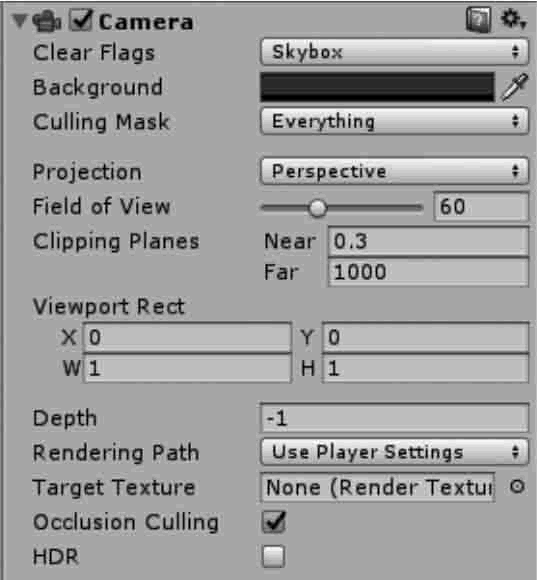

脚本是一款游戏的灵魂，Unity 3D 脚本用来界定用户在游戏中的行为，是游戏制作中不可或缺的一部分，它能实现各个文本的数据交互并监控游戏运行状态。
## 3.1. Unity 3D 支持哪些脚本语言？
 C# 语言在编程理念上符合 Unity 3D 引擎原理。
## 3.2. Unity 3D JavaScript 脚本基础
[Unity 3D](http://c.biancheng.net/unity3d/) 中的 [JavaScript](http://c.biancheng.net/js/) 也称 UnityScript，和基于浏览器的 [Java](http://c.biancheng.net/java/)Script 有比较大的区别。
JavaScript 是一种由 Netscape 公司的 LiveScript 发展而来的原型化继承的面向对象类语言，并且是一种区分大小写的客户端脚本语言。
## 3.3. Unity 3S C# 脚本基础
Unity 5.x 支持两种脚本语言：[C#](http://c.biancheng.net/csharp/) 和 [JavaScript](http://c.biancheng.net/js/)。在 [Unity 3D](http://c.biancheng.net/unity3d/) 内编程，首选 C# 来编写脚本。

C# 是微软公司开发的一种面向对象编程语言。由于有强大的 .NET 类库支持，以及由此衍生出的很多跨平台语言。C# 逐渐成为 Unity 3D 开发者推崇的程序语言。
### 变量
#### 1) 变量定义
任何一个脚本中都缺不了变量，C# 脚本也不例外。

变量主要用于存储数据，在 Unity 3D 的脚本中，每个变量必须拥有唯一的名称，脚本在识读变量时采用的是字符串匹配方式，所以对变量名称大小写敏感。

一旦 Unity 3D 脚本挂到某个 Unity 3D 对象上，在 Unity 3D 的属性面板中就会显示出该脚本中的各个公共变量。开发人员也可以在属性面板中对公共变量的值进行设置，设置后的值将会影响脚本的运行，相当于在脚本中对该变量进行了赋值。
## 函数
在 Unity 3D 中，C# 脚本需要预先载入类库，代码示例如下：
```java
using UnityEngine;
using System.Collections;
public class NewBehaviourScript:MonoBehaviour{
}
```
其中，NewBehaviourScript 是脚本的名称，它必须和脚本文件的名称一致（如果不同，脚本无法在物体上被执行）。
所有游戏执行语句都包含在这个继承自 MonoBehaviour 类的自创脚本中。
Unity 3D脚本中的常用函数如下：
#### 1) Update()
正常更新，创建 JavaScript 脚本时默认添加这个方法，每一帧都会由系统调用一次该方法。
#### 2) LateUpdate()
推迟更新，此方法在 Update() 方法执行完后调用，每一帧都调用一次。
#### 3) FixedUpdate()
置于这个函数中的代码每隔一定时间执行一次。
#### 4) Awake()
脚本唤醒，用于脚本的初始化，在脚本生命周期中执行一次。
#### 5) Start()
在 Update() 之前、Awake() 之后执行。Start() 函数和 Awake() 函数的不同点在于 Start() 函数仅在脚本启用时执行。
#### 6) OnDestroy()
当前脚本销毁时调用。
#### 7) OnGUI()
绘制游戏界面的函数，因为每一帧要执行多次，所以一些时间相关的函数要尽量避免直接在该函数内部使用。
#### 8) OnCollisionEnter()
当一个游戏对象与另外的游戏对象碰撞时执行这个函数。
#### 9) OnMouseDown()
当鼠标在一个载有 GUI 元素（GUI Element）或碰撞器（Collider）的游戏对象上按下时执行该函数。
#### 10) OnMouseOver()
当鼠标在一个载有 GUI 元素或碰撞器的游戏对象上经过时执行该函数。
#### 11) OnMouseEnter()
鼠标进入物体范围时执行该函数。和 OnMouseOver() 不同，OnMouseEnter() 函数只执行一次。
#### 12) OnMouseExit()
鼠标离开物体范围时执行该函数。
#### 13) OnMouseUp()
当鼠标释放时执行该函数。
#### 14) OnMouseDrag()
按住鼠标拖动对象时执行该函数。
## 3.4. 如何在 Unity 3D 中编写脚本？
摄像机（Camera）是向玩家捕获和显示世界的设备。通过自定义和操纵摄像机，可以自由旋转游戏视角。场景中摄像机的数量不受限制，它们可以以任何顺序放置在屏幕上的任何地方，或者只捕获屏幕的某些部分。


| 参 数 | 含 义 | 功 能 |
| --- | --- | --- |
| Clear Flags | 清除标识 | 确定屏幕哪些部分将被清除。这是为了方便使用多个摄像机捕 捉不同的游戏元素 |
| Background | 背景 | 在完成了视图中的所有元素的绘制后以及没有天空盒的情况 下，剩余屏幕的颜色 |
| Culling Mask | 消隐遮罩 | 包含层或忽略层将被摄像机渲染。在检视窗口向对象分配层 |
| Projection | 投影 | 切换摄像机以模拟透视 |
| Perspective | 透视 | 透视摄像机，由原点向外扩散性发射。即，距离越远，它的视口 区域也就越大，透视视图和人眼的视觉感受是一致的 |
| Orthographic | 正交 | 正交摄像机，无论远近，它的视口范围永远是固定的，相机会均 匀地渲染物体，没有透视感 |
| Size | 大小 | 当摄像机设置为正交模式时，摄影机视口的大小 |
| Field of view | 视野 | 摄像机的视野，沿着本地Y轴测量，以度为单位 |
| Clipping Planes | 裁剪面 | 摄像机从开始到结束渲染的距离 |
| Near | 近 | 相对于摄像机，绘制将发生的最近点 |
| Far | 远 | 相对于摄像机，绘制将发生的最远点 |
| Viewport Rect | 视口矩形 | 摄像机画面显示在屏幕上的区域 |
| X |   | 摄像机视图的开始水平位置 |
| Y |   | 摄像机视图的开始垂直位置 |
| W | 宽度 | 摄像机输出在屏幕上的宽度 |
| H | 高度 | 摄像机输出在屏幕上的高度 |
| Depth | 深度 | 摄像机在渲染顺序上的位置。具有较低深度的摄像机将在较高 深度的摄像机之前渲染 |
| Rendering Path | 渲染路径 | 定义摄像机的渲染路径 |
| Target Texture | 目标纹理 | 用于将摄像机视图输出并渲染到屏幕，一般用于制作导航图或 者画中画等效果 |
| Occlusion Culling | 遮挡剔除 | 指定是否剔除物体背向摄像机的部分 |
| HDR | 高动态光照渲染 | 启用摄像机的高动态范围渲染功能 |

### C# 脚本编写注意事项
在 Unity 3D 中，C# 脚本的运行环境使用了 Mono 技术，Mono 是指 Novell 公司致力于 .NET 开源的工程，利用 Mono 技术可以在 Unity 3D 脚本中使用 .NET 所有的相关类。

但 Unity 3D 中 C# 的使用与传统的 C# 有一些不同。
#### 1) 脚本中的类都继承自 MonoBehaviour 类
Unity 3D 中所有挂载到游戏对象上的脚本中包含的类都继承自 MonoBehaviour 类。

MonoBehaviour 类中定义了各种回调方法，例如 Start、Update 和 FixedUpdate 等。
#### 2) 使用Awake或Start方法初始化
用于初始化的 C# 脚本代码必须置于 Awake 或 Start 方法中。

Awake 和 Start 的不同之处在于：Awake 方法是在加载场景时运行，Start 方法是在第一次调用 Update 或 FixedUpdate 方法之前调用，Awake 方法在所有 Start 方法之前运行。
#### 3) 类名必须匹配文件名
C# 脚本中类名必须和文件名相同，否则当脚本挂载到游戏对象时，控制台会报错。
#### 4) 只有满足特定情况时变量才能显示在属性查看器中
只有公有的成员变量才能显示在属性查看器中，而 private 和 protected 类型的成员变量不能显示，如果要使属性项在属性查看器中显示，它必须是 public 类型的。
#### 5) 尽量避免使用构造函数
不要在构造函数中初始化任何变量，而应使用 Awake 或 Start 方法来实现。

在单一模式下使用构造函数可能会导致严重后果，因为它把普通类构造函数封装了，主要用于初始化脚本和内部变量值，这种初始化具有随机性，容易引发引用异常。因此，一般情况下尽量避免使用构造函数。

## 3.5. Unity 3D 脚本应用实例演示
游戏场景中出现的所有物体都属于游戏对象，游戏对象之间的交互都可以通过脚本来控制并实现。
创建游戏对象的方法有 3 种：

- 第一种是将物体模型资源由 Project 视图直接拖曳到 Hierarchy 面板中；
- 第二种是在 Unity 3D 菜单 GameObject 中创建 Unity 3D 自带的游戏对象，如 Cube、Camera、Light 等；
- 第三种是利用脚本编程，动态创建或删除游戏对象。

利用脚本动态创建游戏对象的方法又分为两种：

- 使用 CreatePrimitive 方法创建 Unity 3D 系统自带的基本游戏对象；
- 使用 Instantiate 实例化方法将预制体实例化为对象。

