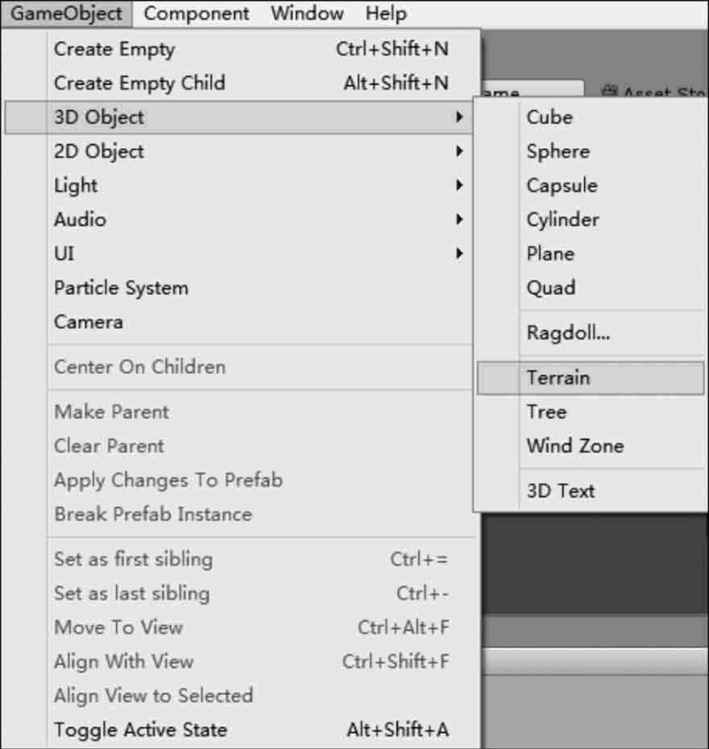
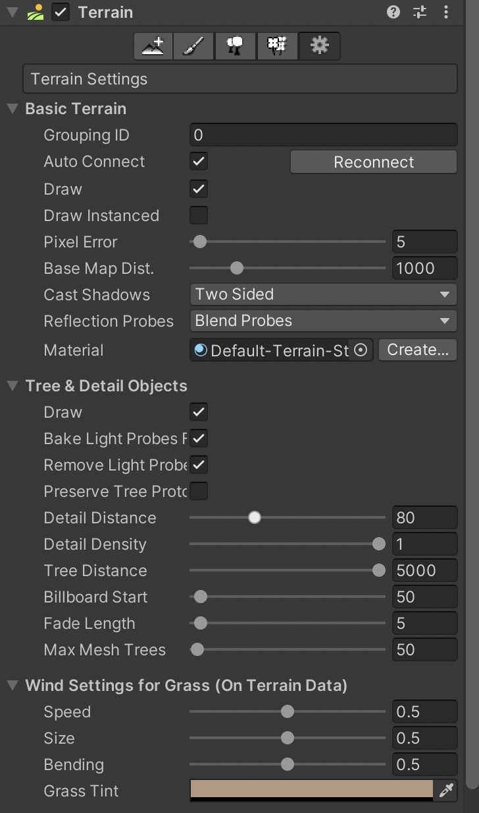
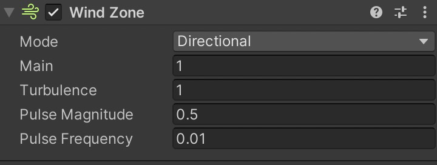
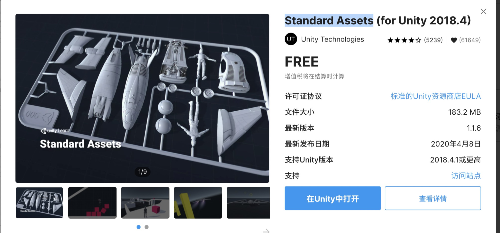
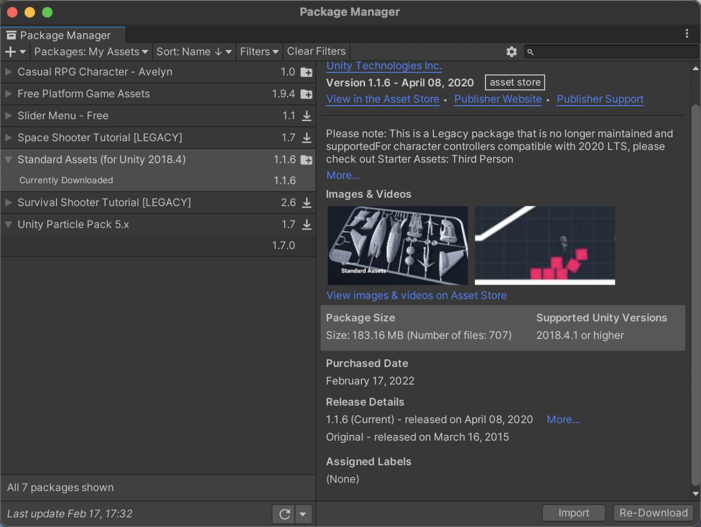
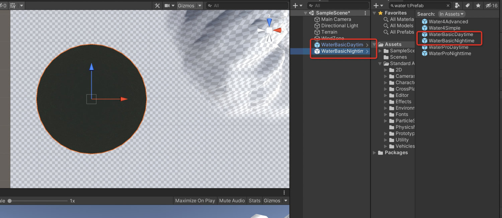
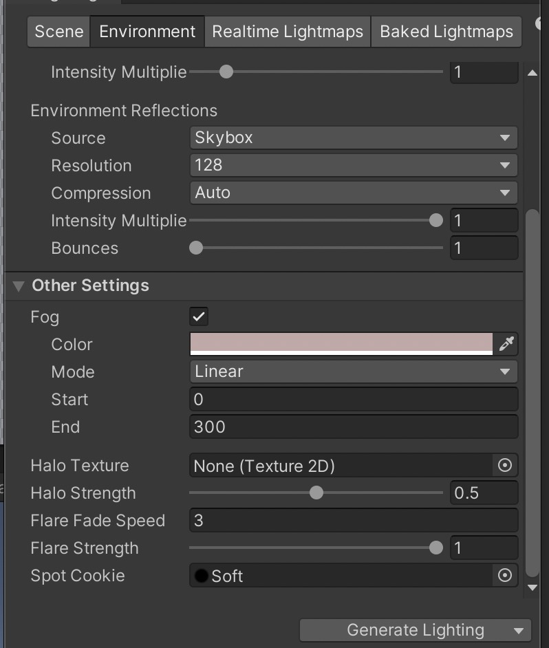
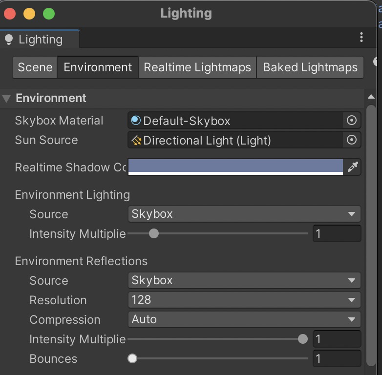
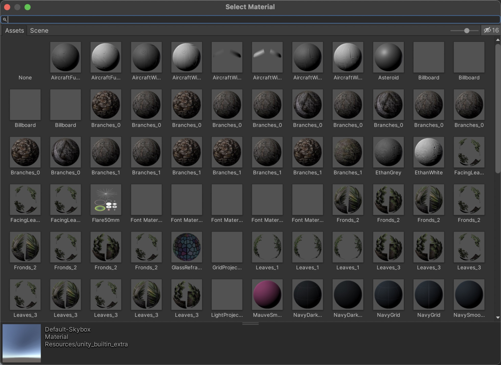

学习资料地址：[http://c.biancheng.net/unity3d/50/](http://c.biancheng.net/unity3d/50/)
## 5.1. Unity 3D 地形系统概述
Unity 3D 有一套功能强大的地形编辑器，支持以笔刷方式精细地雕刻出山脉、峡谷、平原、盆地等地形，同时还包含了材质纹理、动植物等功能。
可以让开发者实现游戏中任何复杂的游戏地形。
大多数人物模型和建筑模型都是在 3ds Max、Maya 等专业的三维模型制作软件中做出来的。
虽然 Unity 3D 也提供了三维建模，但还是相当简单。不过在地形方面 Unity 3D 已经相当强大。
## 5.2. Unity 3D 如何创建地形？
### 5.2.1. 创建地形

在 Hierarchy 视图中选择主摄像机，可以在 Scene 视图中观察到游戏地形。如果想调节地形的显示区域，可以调整摄像机或地形的位置与角度，让地形正对着我们，如下图所示。

### 5.2.2. 地形参数
Unity 3D 创建地形时采用了默认的地形大小、宽度、厚度、图像分辨率、纹理分辨率等，这些数值是可以任意修改的。
选择创建的地形，在 Inspector 视图中找到 Resolution 属性面板，如下图所示。Resolution 属性面板的参数如下表所示。

| 参 数 | 含 义 | 功 能 |
| --- | --- | --- |
| Terrain Width | 地形宽度 | 全局地形总宽度 |
| Terrain Length | 地形长度 | 全局地形总长度 |
| Terrain Height | 地形高度 | 全局地形允许的最大高度 |
| Heightmap Resolution | 高度图分辨率 | 全局地形生成的高度图的分辨率 |
| Detail Resolution | 细节分辨率 | 全局地形所生成的细节贴图的分辨率 |
| Detail Resolution Per Patch | 每个子地形块的网格分辨率 | 全局地形中每个子地形块的网格分辨率 |
| Control Texture Resolution | 控制纹理的分辨率 | 把地形贴图绘制到地形上时所使用的贴图分辨率 |
| Base Texture Resolution | 基础纹理的分辨率 | 远处地形贴图的分辨率 |

## 5.3. Unity 3D 使用高度图创建地形
在 [Unity 3D](http://c.biancheng.net/unity3d/) 中编辑地形有两种方法：一种是通过地形编辑器编辑地形，另一种是通过导入一幅预先渲染好的灰度图来快速地为地形建模。
地形上每个点的高度被表示为一个矩阵中的一列值。这个矩阵可以用一个被称为高度图（heightmap）的灰度图来表示。
灰度图是一种使用二维图形来表示三维的高度变化的图片。近黑色的、较暗的颜色表示较低的点，接近白色的、较亮的颜色表示较高的点。
通常可以用 Photoshop 或其他三维软件导出灰度图，灰度图的格式为 RAW 格式，Unity 3D 可以支持 16 位的灰度图。
Unity 提供了为地形导入、导出高度图的选项。单击 Settings tool 按钮，找到标记为 Import RAW 和 Export RAW 的按钮。这两个按钮允许从标准 RAW 格式中读出或者写入高度图，并且兼容大部分图片和地表编辑器。

## 5.4. Unity 3D 使用笔刷绘制地形
在 [Unity 3D](http://c.biancheng.net/unity3d/) 中，除了使用高度图来创建地形外，还可以使用笔刷绘制地形。
因为 Unity 3D 为游戏开发者提供了强大的地形编辑器，通过菜单中的 GameObject→3D Object→Terrain 命令，可以为场景创建一个地形对象。
初始的地表只有一个巨大的平面。Unity 3D 提供了一些工具，可以用来创建很多地表元素。
游戏开发者可以通过地形编辑器来轻松实现地形以及植被的添加。
地形菜单栏一共有 5 个按钮，含义分别为创建相邻地形、地形贴图、添加树模型、添加草与网格模型、其他设置，如下图所示，每个按钮都可以激活相应的子菜单对地形进行操作和编辑。

### 5.4.1. 地形设置
单击地形编辑器最右边的按钮可以打开地形设置面板，如下图所示。该面板用于设置地形参数，如下所示。

基本地形参数：

| 参 数 | 含 义 | 功 能 |
| --- | --- | --- |
| Draw | 绘制 | 绘制地形 |
| Pixel Error | 像素容差 | 显示地形网格时允许的像素容差 |
| Base Map Dist. | 基本地图距离 | 设置地形高度的分辨率 |
| Cast Shadows | 投影 | 设置地形是否有投影 |
| Material | 材质 | 为地形添加材质 |

树和细节参数：

| 参 数 | 含 义 | 功 能 |
| --- | --- | --- |
| Draw | 绘制 | 设置是否渲染除地形以外的对象 |
| Detail Distance | 细节距离 | 设置摄像机停止对细节渲染的距离 |
| Detail Density | 细节密度 | 设置细节密度 |
| Tree Distance | 树木距离 | 设置摄像机停止对树进行渲染的距离 |
| Billboard Start | 开始广告牌 | 设置摄像机将树渲染为广告牌的距离 |
| Fade Length | 渐变距离 | 控制所有树的总量上限 |
| Max Mesh Trees | 网格渲染树木最大数量 | 设置使用网格形式进行渲染的树木最大数量 |

风参数：

| 参 数 | 含 义 | 功 能 |
| --- | --- | --- |
| Speed | 速度 | 风吹过草地的速度 |
| Size | 大小 | 同一时间受到风影响的草的数量 |
| Bending | 弯曲 | 设置草跟随风弯曲的强度 |
| Grass Tint | 草的色调 | 设置地形上的所有草和细节网格的总体渲染颜色 |

### 5.4.2. 风域
地形中的草丛在运行测试时可以随风摆动，如果要实现树木的枝叶如同现实中一样随风摇摆的效果，就需要加入风域。
执行 GameObject→3D Object→Wind Zone 菜单命令，创建一个风域，风域的参数如下图所示，风域参数如下表所示。

| 参 数 | 含 义 | 功 能 |
| --- | --- | --- |
| Mode | 风域模式 | 设置风域模式：Directional 模式下整个场景中的树木都受影响，Spherical 模式下只影响球体包裹范围内的树木 |
| Main | 主风 | 设置主要风力，产生风压柔和变化 |
| Turbulence | 湍流 | 设置湍流风，产生一个瞬息万变的风压 |
| Pulse Magnitude | 波动幅度 | 定义风力随时间的变化 |
| Pulse Frequency | 波动频率 | 定义风向改变的频率 |

风域不仅能实现风吹树木的效果，还能模拟爆炸时树木受到波及的效果。
需要注意的是，风域只能作用于树木，对其他游戏对象没有效果。场景中不同模式下的风域参数设置如下表所示。

| 实现的效果 | 参数 |  |  |  |
| --- | --- | --- | --- | --- |
|  | Main | Turbulence | Pulse Magnitude | Pulse Frequency |
| 轻风吹效果 | 1 | 0.1 | 1.0或以上 | 0.25 |
| 强气流效果 | 3 | 5 | 0.1 | 1.0 |

## 5.5. Unity 3D 环境特效
一般情况下，要在游戏场景中添加雾特效和水特效较为困难，因为需要开发人员懂得着色器语言且能够熟练地使用它进行编程。
[Unity 3D](http://c.biancheng.net/unity3d/) 游戏开发引擎为了能够简单地还原真实世界中的场景，其中内置了雾特效并在标准资源包中添加了多种水特效，开发人员可以轻松地将其添加到场景中。
需要注意的是，由于 Unity 5.0 以上版本在默认情况下都没有自带的天空盒，只有包，所以当需要使用天空盒资源时，需要人工导入天空盒资源包。
### 5.5.1. 水特效
在 Assets Store 里面搜索 Standard Assets，将其加入到 Unity 中。

在 Package Manager 中，下载并引入 Standard Assets。

然后搜索 water 的预制体，其中包含两种水特效的预制件，可将其直接拖曳到场景中，这两种水特效功能较为丰富，能够实现反射和折射效果，并且可以对其波浪大小、反射扭曲等参数进行修改，如下图所示。

基本水功能较为单一，没有反射、折射等功能，仅可以对水波纹大小与颜色进行设置，由于其功能简单，所以这两种水所消耗的计算资源很小，更适合移动平台的开发。

### 5.5.2. 雾特效
Unity 3D 集成开发环境中的雾有 3 种模式，分别为 Linear（线性模式）、Exponential（指数模式）和 Exponential Squared（指数平方模式）。这 3 种模式的不同之处在于雾效的衰减方式。
场景中雾效开启的方式是，执行菜单栏 Window→Rendering→Lighting 命令打开 Lighting 窗口，在窗口中选中 Fog 复选框，然后在其设置面板中设置雾的模式以及雾的颜色。

开启雾效通常用于优化性能，开启雾效后选出的物体被遮挡，此时便可选择不渲染距离摄像机较远的物体。
这种性能优化方案需要配合摄像机对象的远裁切面设置。通常先调整雾效，得到正确的视觉效果，然后调小摄像机的远裁切面，使场景中距离摄像机较远的游戏对象在雾效变淡前被裁切掉。雾效参数含义如下表所示。

| 参数 | 含 义 |
| --- | --- |
| Fog Color | 雾的颜色 |
| Fog Mode | 雾效模式 |

### 5.5.3. 天空盒
Unity 3D 中的天空盒实际上是一种使用了特殊类型 Shader 的材质，这种类型的材质可以笼罩在整个场景之外，并根据材质中指定的纹理模拟出类似远景、天空等效果，使游戏场景看起来更加完整。
目前 Unity 3D 中提供了两种天空盒供开发人员使用，其中包括六面天空盒和系统天空盒。这两种天空盒都会将游戏场景包含在其中，用来显示远处的天空、山峦等。
为了在场景中添加天空盒，在 Unity 3D 软件界面中，执行菜单 Window→Rendering→Lighting 命令，可以打开渲染设置窗口，如下图所示。单击 Scene 页面 Environment 模块 Skybox 后面的选项设置按钮

出现材质选择对话框，双击即可选择不同材质的天空盒，如下图所示

