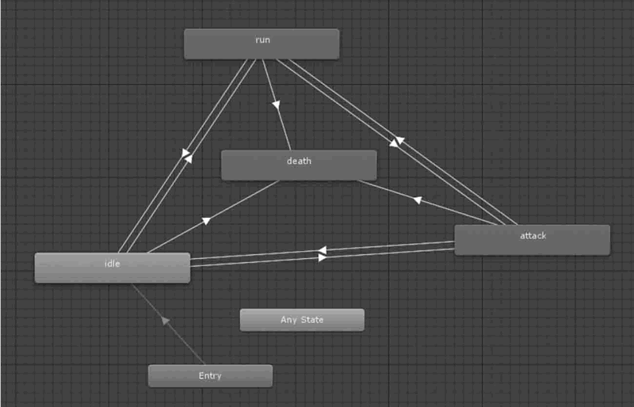
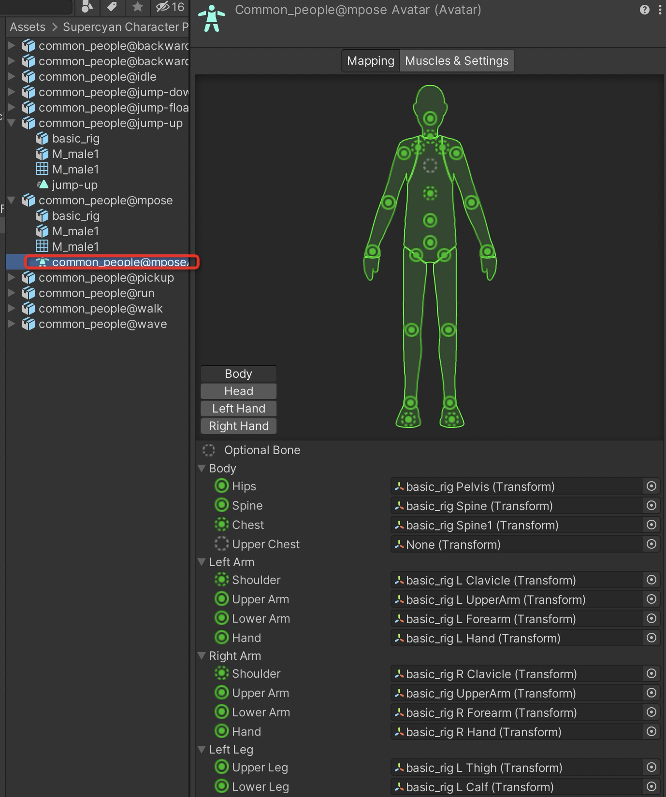
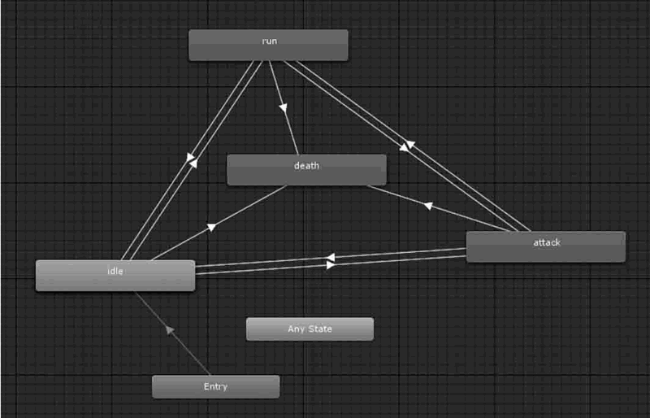

## 7.1. Unity 3D 三维模型简介
三维模型是用三维建模软件建造的立体模型，也是构成 [Unity 3D](http://c.biancheng.net/unity3d/) 场景的基础元素。
Unity 3D 几乎支持所有主流格式的三维模型，如 FBX 文件和 OBJ 文件等。
开发者可以将三维建模软件导出的模型文件添加到项目资源文件夹中，Unity 3D 会将其显示在 Assets 面板中。
### 7.1.1. 主流三维建模软件
首先介绍当今主流的三维建模软件，这些软件广泛应用于模型制作、工业设计、建筑设计、三维动画等领域，每款软件都有自己独特的功能和专有的文件格式。
正因为能够利用这些软件来完成建模工作，Unity 3D 才可以展现出丰富的游戏场景以及真实的角色动画。
下面介绍 3 种主流的三维建模软件。
#### 1. Autodesk 3D Studio Max
Autodesk 3D Studio Max 简称 3ds Max，是 Autodesk 公司开发的基于 PC 系统的三维动画渲染和制作软件。
3ds Max 可谓是最全面的三维建模，有着良好的技术支持和社区支持，是一款主流且功能全面的三维建模工具软件。
#### 2. Autodesk Mays
Autodesk Maya 是 Autodesk 公司旗下的著名三维建模和动画软件。
Maya 2008 可以大大提高电影、电视、游戏等领域开发、设计、创作的工作流效率，同时改善了多边形建模，通过新的算法提高了性能，多线程支持可以充分利用多核心处理器的优势。
新的 HLSL 着色工具和硬件着色 API 则可以大大增强新一代主机游戏的视觉效果，另外，它在角色建立和动画方面也更具弹性。
#### 3. Cinema 4D
Cinema 4D 的字面意思是 4D 电影，不过其本身还是 3D 的表现软件，由德国 Maxon Computer 公司开发，以极高的运算速度和强大的渲染插件著称，很多模块的功能代表同类软件中的科技进步成果，并且在用其描绘的各类电影中表现突出，随着其技术越来越成熟，Cinema 4D 受到越来越多的电影公司的重视。
## 7.2. Unity 3D 导入三维模型
将三维模型导入 [Unity 3D](http://c.biancheng.net/unity3d/) 是游戏开发的第一步。
## 7.3. Unity 3D 动画系统（Mecanim）
Mecanim 动画系统是 Unity 公司推出的全新动画系统，具有重定向、可融合等诸多新特性，可以帮助程序设计人员通过和美工人员的配合快速设计出角色动画，其主界面如下图所示。
Unity 公司计划采用 Mecanim 动画系统逐步替换直至完全取代旧版动画系统。

Unity 5.x 版本针对 Mecanim 动画系统的底层代码进行了升级优化，提升了动画制作的效果。
Mecanim 动画系统提供了 5 个主要功能：

- 通过不同的逻辑连接方式控制不同的身体部位运动的能力。
- 将动画之间的复杂交互作用可视化地表现出来，是一个可视化的编程工具。
- 针对人形角色的简单工作流以及动画的创建能力进行制作。
- 具有能把动画从一个角色模型直接应用到另一个角色模型上的 Retargeting（动画重定向）功能。
- 具有针对 Animation Clips 动画片段的简单工作流，针对动画片段以及它们之间的过渡和交互过程的预览能力，从而使设计师在编写游戏逻辑代码前就可以预览动画效果，可以使设计师能更快、更独立地完成工作。
## 7.4. Unity 3D 人形角色动画（Avatar）
Mecanim 动画系统适合人形角色动画的制作，人形骨架是在游戏中普遍采用的一种骨架结构。
[Unity 3D](http://c.biancheng.net/unity3d/) 为其提供了一个特殊的工作流和一整套扩展的工具集。
由于人形骨架在骨骼结构上的相似性，用户可以将动画效果从一个人形骨架映射到另一个人形骨架，从而实现动画重定向功能。
除了极少数情况之外，人物模型均具有相同的基本结构，即头部、躯干、四肢等。
Mecanim 动画系统正是利用这一点来简化骨架绑定和动画控制过程。
创建模型动画的一个基本步骤就是建立一个从 Mecanim 动画系统的简化人形骨架到用户实际提供的骨架的映射，这种映射关系称为 Avatar，如下图所示。

### 7.4.1. 创建 Avatar
在导入一个角色动画模型之后，可以在 Import Settings 面板中的 Rig 选项下指定角色动画模型的动画类型，包括 Legacy、Generic 以及 Humanoid 3 种模式。
#### 1. Legacy 与 Generic
Unity 3D 的 Mecanim 动画系统为非人形动画提供了两个选项：Legacy（旧版动画类型）和 Generic（一般动画类型）。
旧版动画使用 Unity 4.0 版本文前推出的动画系统。一般动画仍可由 Mecanim 系统导入，但无法使用人形动画的专有功能。
非人形动画的使用方法是：在 Assets 文件夹中选中模型文件，在 Inspector 视图中的 Import Settings 属性面板中选择 Rig 标签页，单击 Animation Type 选项右侧的列表框，选择 Generic 或 Legacy 动画类型即可。
#### 2. Humanoid
要使用 Humanoid（人形动画），单击 Animation Type 右侧的下拉列表，选择 Humanoid，然后单击 Apply 按钮，Mecanim 动画系统会自动将用户所提供的骨架结构与系统内部自带的简易骨架进行匹配，如果匹配成功，Avatar Definition 下的 Configure 复选框会被选中，同时在 Assets 文件夹中，一个 Avatar 子资源会被添加到模型资源中。
### 7.4.2. 配置 Avatar
Unity 3D 中的 Avatar 是 Mecanim 动画系统中极为重要的模块，正确地设置 Avatar 非常重要。
不管 Avatar 的自动创建过程是否成功，用户都需要到 Configure Avatar 界面中确认 Avatar 的有效性，即确认用户提供的骨骼结构与 Mecanim 预定义的骨骼结构已经正确地匹配起来，并已经处于 T 形姿态，如下图所示。

单击 Configure 按钮后，编辑器会要求保存当前场景，因为在 Configure 模式下，可以看到 Scene 视图（而不是 Game 视图）中显示出当前选中模型的骨骼、肌肉、动画信息以及相关参数。
在这个视图中，实线圆圈表示的是 Avatar 必须匹配的，而虚线圆圈表示的是可选匹配的。

### 7.4.3. 人体动画重定向
在 Mecanim 动画系统中，人形动画的重定向功能是非常强大的，因为这意味着用户只要通过很简单的操作就可以将一组动画应用到各种各样的人形角色上。
由于动画重定向功能只能应用到人形模型上，所以为了保证应用后的动画效果，必须正确地配置 Avatar。
## 7.5. Unity 3D 角色动画在游戏中的应用
### 7.5.1. Animator 组件
Animator 组件是关联角色及其行为的纽带，每一个含有 Avatar 的角色动画模型都需要一个 Animator 组件。Animator 组件引用了 Animator Controller 用于为角色设置行为，具体参数如下表所示。

| 参 数 | 含 义 | 功 能 |
| --- | --- | --- |
| Controller | 控制器 | 关联到角色的 Animator 控制器 |
| Avatar | 骨架结构的映射 | 定义 Mecanim 动画系统的简化人形骨架结构到该角色的骨架结构的映射 |
| Apply Root Motion | 应用 Root Motion 选项 | 设置使用动画本身还是使用脚本来控制角色的位置 |
| Animate Physics | 动画的物理选项 | 设置动画是否与物理属性交互 |
| Culling Mode | 动画的裁剪模式 | 设置动画是否裁剪以及裁剪模式 |

### 7.5.2. Animator Controller
Animator Controller 可以从 Project 视图创建一个动画控制器（执行 Create→Animator Controller 命令），同时会在 Assets 文件夹内生成一个后缀名为 .Controller 的文件。
当设置好运动状态机后，就可以在 Hierarchy 视图中将该 Animator Controller 拖入含有 Avatar 的角色模型 Animator 组件中。
通过动画控制器视图（执行 Window→Animator Controller 命令）可以查看和设置角色行为，值得注意的是，Animator Controller 窗口总是显示最近被选中的后缀为 .Controller 的资源的状态机，与当前载入的场景无关。
### 7.5.3. Animator 动画状态机
一个角色常常拥有多个可以在游戏中不同状态下调用的不同动作。例如，一个角色可以在等待时呼吸或摇头，在得到命令时行走，从一个平台掉落时惊慌地伸手。
当这些动画回放时，使用脚本控制角色的动作是一个复杂的工作。Mecanim 动画系统借助动画状态机可以很简单地控制和序列化角色动画。
状态机对于动画的重要性在于它们可以很简单地通过较少的代码完成设计和更新。每个状态都有一个当前状态机在那个状态下将要播放的动作集合。这使动画师和设计师不必使用代码定义可能的角色动画和动作序列。
Mecanim 动画状态机提供了一种可以预览某个独立角色的所有相关动画剪辑集合的方式，并且允许在游戏中通过不同的事件触发不同的动作。
动画状态机可以通过动画状态机窗口进行设置，如下图所示。

动画状态机之间的箭头标示两个动画之间的连接，右击一个动画状态单元，在快捷菜单中执行 Make Transition 命令创建动画过渡条件，然后单击另一个动画状态单元，完成动画过渡条件的连接。
过渡条件用于实现各个动画片段之间的逻辑，开发人员通过控制过渡条件可以实现对动画的控制。
要对过渡条件进行控制，就需要设置过渡条件参数，Mecanim 动画系统支持的过渡条件参数有 Float、Int、Bool 和 Trigger 4 种。
