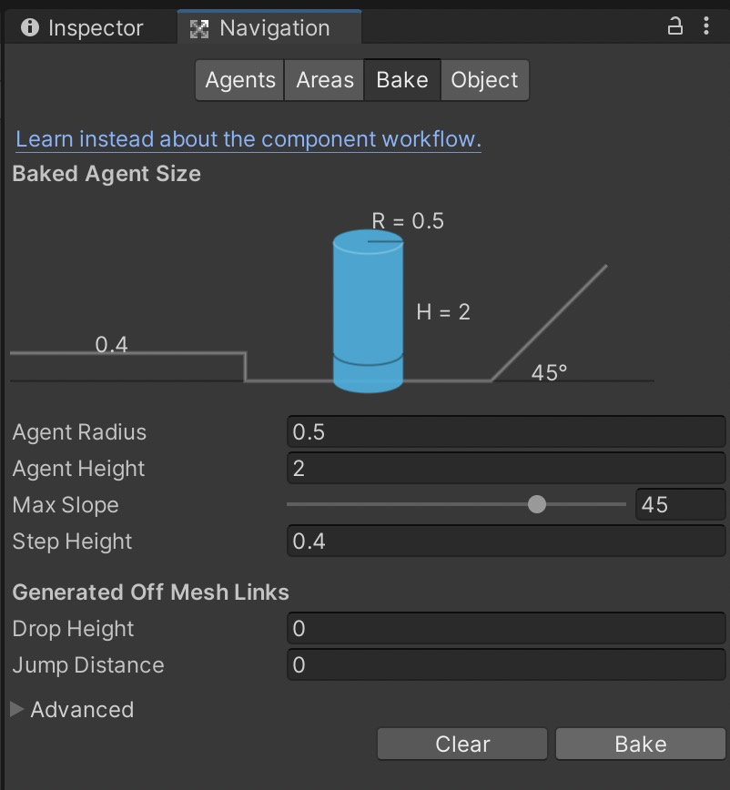
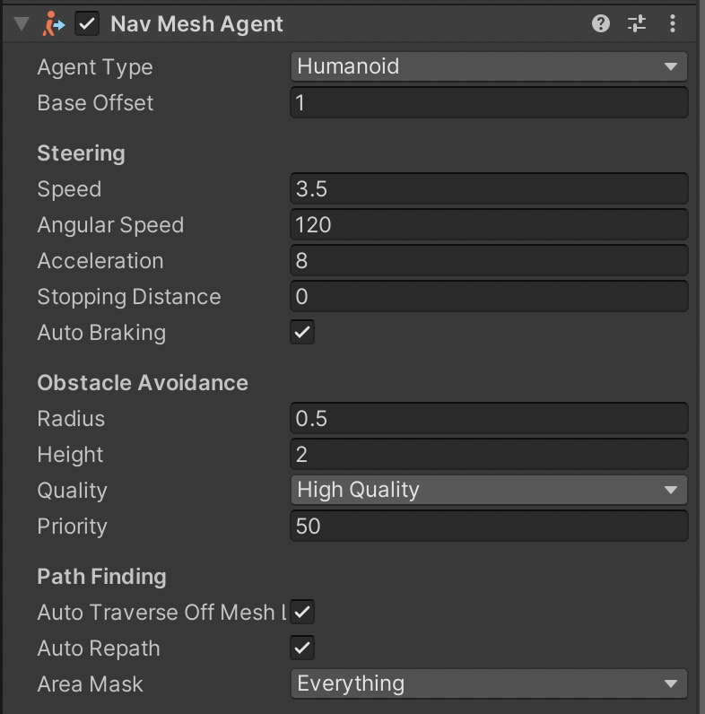

## 8.1. Unity 3D 导航系统（Navigation）
[Unity 3D](http://c.biancheng.net/unity3d/) Navigation（导航）是用于实现动态物体自动寻路的一种技术，它将游戏场景中复杂的结构关系简化为带有一定信息的网格，并在这些网格的基础上通过一系列相应的计算来实现自动寻路。
本节主要讲解在创建好的三维场景中烘焙导航网格、创建导航代理以实现让角色绕过重重障碍最终到达终点的功能。
### 8.1.1. 导航系统
过去，游戏开发者必须自己打造寻路系统，特别是在基于节点的寻路系统中，必须手动地在 AI 使用的点之间进行导航，因此基于节点系统的寻路非常烦琐。
Unity 3D 不仅具有导航功能，还使用了导航网格（navigation meshes），这比手动放置节点更有效率而且更流畅。
更重要的是，还可以一键重新计算整个导航网格，彻底摆脱了手动修改导航节点的复杂方法。
#### 1. 设置 NavMesh
NavMesh 的设置方法很简单，在 Hierarchy 视图中选中场景中除了目标和主角以外的游戏对象，在 Inspector 视图中单击 Static 下拉列表，在其中勾选 Navigation Static 即可，如下图所示。

#### 2. 烘焙
执行菜单 Window→AI→Navation 命令，打开导航窗口，单击右下角的 Bake（烘焙）按钮即可，烘焙后的场景如下图所示。

接下来详细看看 Navigation 面板，它有 Object、Bake、Areas 这 3 个标签页。

其中，Object 标签页如下图所示，该标签页可以设置游戏对象的参数，如下表所示。当选取游戏对象后，可以在此标签页中设置导航相关参数。

| 参 数 | 功 能 |
| --- | --- |
| Navigation Static | 勾选后表示该对象参与导航网格的烘焙 |
| Generate OffMeshLinks | 勾选后可在导航网格中跳跃(Jump)和下落（Drop) |
| Navigation Area | 导航区域 |

Bake 标签页如下图所示，是 Navigation 面板最重要的标签页，在该标签页下可以设置导航代理相关参数以及烘焙相关参数，参数说明如下表所示。

| 参 数 | 功 能 |
| --- | --- |
| Agent Radius | 设置具有代表性的物体半径，半径越小，生成的网格面积越大 |
| Agent Height | 设置具有代表性的物体的高度 |
| Max Slope | 设置斜坡的坡度 |
| Step Height | 设置台阶高度 |
| Drop Height | 设置允许最大的下落距离 |
| Jump Distance | 设置允许最大的跳跃距离 |
| Manual Voxel Size | 设置是否手动调整烘焙尺寸 |
| Voxel Size | 设置烘焙的单元尺寸，控制烘焙的精度 |
| Min Region Area | 设置最小区域 |
| Height Mesh | 设置当地形有落差时是否生成精确而不是近似的烘焙效果 |

#### 3. 设置导航代理
导航代理（Navigation Agent）可以理解为去寻路的主体。
在导航网格生成之后，给游戏对象添加了一个 Nav Mesh Agent 组件，如下图所示。
Nav Mesh Agent 面板中各导航代理参数含义如下表所示。

| 属性分区 | 参 数 | 功 能 |
| --- | --- | --- |
| Steering | Speed | 设置最大移动速度 |
|  | Angular Speed | 设置最大角速度 |
|  | Acceleration | 设置最大加速度 |
|  | Stopping Distance | 设置离目标距离还有多远时停止 |
|  | Auto Braking | 激活时，到达目标位置前将减速 |
| Obstacle
Avoidance | Quality | 设置躲避障碍物的质量，如果设置为0则不躲避其他导航代理 |
|  | Priority | 设置自身的导航优先级，范围是0〜99，值越小，优先级越大 |
| Path Finding | Auto Traverse Off Mesh Link | 设置是否采用默认方式经过链接路径 |
|  | Auto Repath | 设置当现有的路径变为无效时是否尝试获取一个新的路径 |
|  | Area Mask | 设置此导航代理可以行走哪些区域类型 |

## 8.2. Unity 3D 障碍物
一般来说，不可攀爬的 Nav Mesh 都被视为障碍物（Nav Mesh Obstacle），也可以直接将物体设为障碍物，即可以为游戏对象添加 Nav Mesh Obstacle 组件。
有别于普通的 Nav Mesh，Nav Mesh Obstacle 是一种不需要烘焙的障碍物，形状可以选择为立方体或胶囊体。

