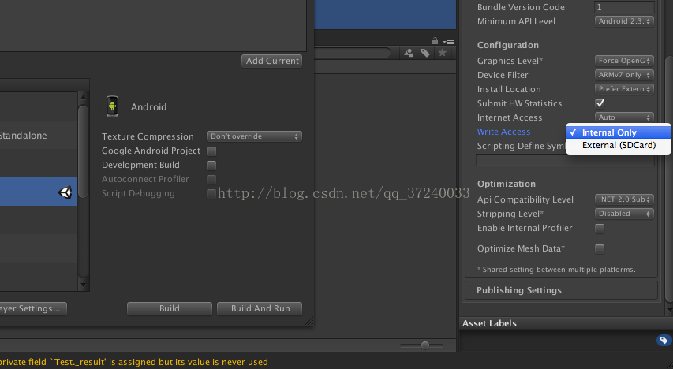

- unity3D 中的资源路径
| Application.dataPath | 此属性用于返回程序的数据文件所在文件夹的路径。例如在 Editor 中的就是 Assets 了。 |
| --- | --- |
| Application.streamingAssetsPath | 此属性用于返回流数据的缓存目录，返回路径为相对路径，适合设置一些外部数据文件的路径。 |
| Application.persistentDataPath | 此属性用于返回一个持久化数据存储目录的路径，可以在此路径下存储一些持久化的数据文件。 |
| Application.temporaryCachePath | 此属性用户返回一个临时数据的缓存目录。 |

- Android 平台
| Application.dataPath | /data/app/xxx.xxx.xxx.apk |
| --- | --- |
| Application.streamingAssetsPath | jar:file:///data/xxx.xxx.xxx.apk/!/assets |
| Application.persistentDataPath | /data/data/xxx.xxx.xxx/files |
| Application.temporaryCachePath | /data/data/xxx.xxx.xxx/cache |

- IOS 平台
| Application.dataPath | Application/xxxxxxxx-xxxx-xxxx-xxxx-xxxxxxxxxxxx/xxx.app/Data |
| --- | --- |
| Application.streamingAssetsPath | Application/xxxxxxxx-xxxx-xxxx-xxxx-xxxxxxxxxxxx/xxx.app/Data/Raw |
| Application.persistentDataPath | Application/xxxxxxxx-xxxx-xxxx-xxxx-xxxxxxxxxxxx/Documents |
| Application.temporaryCachePath | Application/xxxxxxxx-xxxx-xxxx-xxxx-xxxxxxxxxxxx/Library/Caches |

Application.presistentDataPath 对于 Android 端，有两种可能，一种是 Android 的沙盒路径，一种是 SD 卡路径，这个打包设置有关系。

在打包面板中，有个 Write Access，当选择 Internal Only 就是表示沙盒路径，/data/data/com.xxx.xxx/，对应的 Android 方法为 getFilesDir()。
当选择 SDCard 时就表示存储到 SD 卡上，:/storage/emulated/0/Android/data/<package name>/file。对应的 Android 方法为 getExternalFilesDir()。
