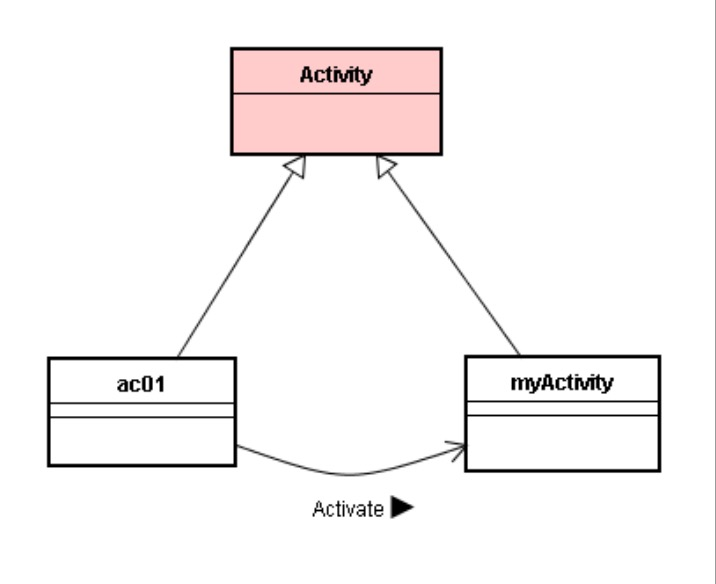
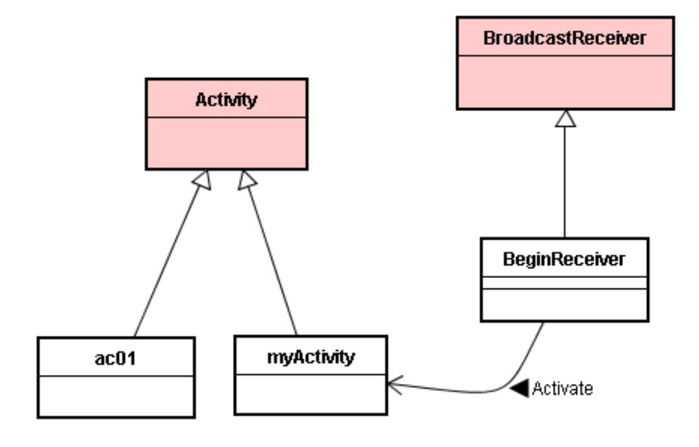
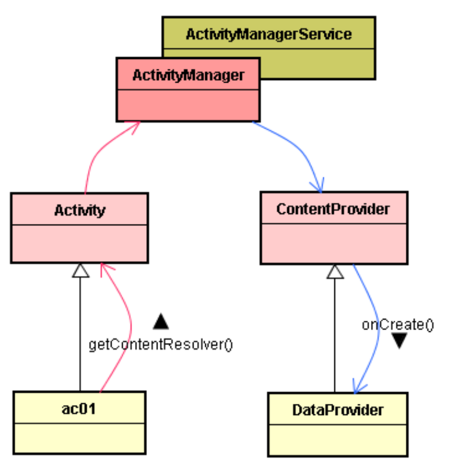
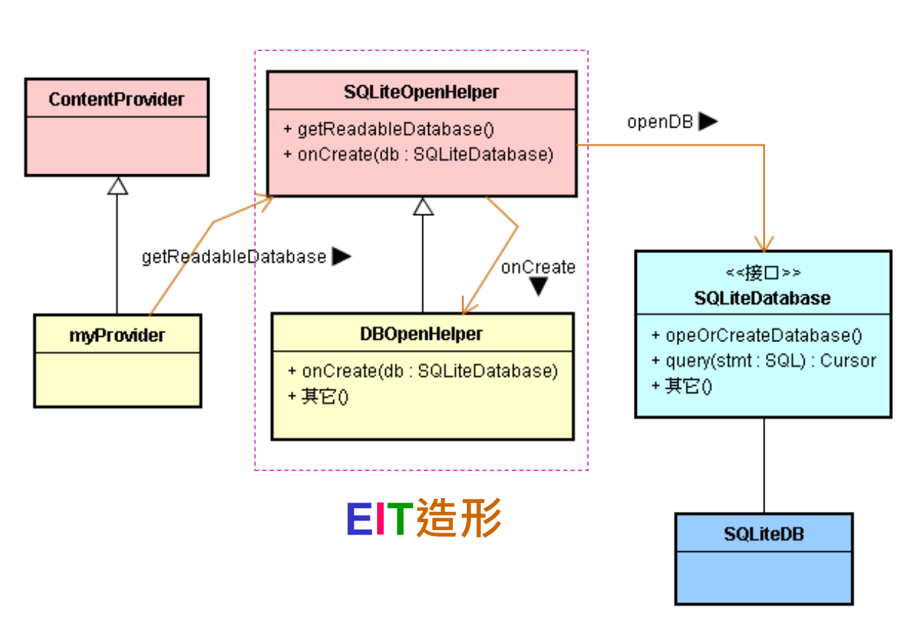

# 介绍 Android 的 Java 层应用框架

# 1. 传统无框架

* 传统上，在没有框架的环境里，应用程序（Application，简称 AP 或 App）会调用平台（如 Linux 或 Windows 等）平台的函数。
* 由于控制权掌握在 App 开发者手中，所以在软件架构上，平台开发者反而受制于 App 开发者，这常常严重伤害平台软件变动的自由度，进而导致整个架构体系失去弹性，也失去活力而凋零。
* 因而，最近十年来，软件产业逐渐放弃上述的古典架构，改为基于框架(Framework)的新型架构，甚至最时髦的两层框架，或是三层框架。例如，微软的.NET、Android 平台都是时髦的多层框架。

# 2. 单层框架

* 在框架型式的平台架构里，是由框架里的基类(Base class)来调用 App 里的子类，于是框架拥有软件执行上的控制权，由框架来指挥 App 的运行。

# 3. 复合型框架

* 基于这个框架型式的软件架构，在各个应用领域里的软件开发者，皆能运用大框架，来建立其独特的小框架。

# 4. 双层框架

* 虽然 Java 语言具有简单容易之美，但是其执行效率比 C++ 低。为了追求力与美的组合，在目前的产业里，许多平台都是双层或多层框架。

# 4. 框架的控制机制

* 顾名思义，IoC(Inversion of Control) 就是「反向控制」之意思。IoC 观念和机制源自于 OOP 语言(如 C++、Java 等)的 < 基类 / 子类 > 结构。
* 例如 Java 语言中，基类(Super-class)的函数可以主动呼叫子类(Subclass)之函数，这就是一般所谓的 IoC 机制。后来，人们常将这些基类聚集起来，就称之为框架(Framework)。
* IoC 又称为「反向呼叫」或「反向调用」。而反向调用的相反词就是：正向调用。正向调用就是 App 子类调用基类的函数。正向调用例如：MyActivity（子类）调用 Activity（父类）的 setContentView() 函数。
* 反向调用恰好相反，表示由基类调用子类的函数。例如，Activity（父类） 调用 MyActivity（子类）的 onCreate() 函数。
* 正向调用就意味着正向控制，也就是说，AP 子类控制了框架基类，这是违背框架设计原则的。
* 反向调用就意味着反向控制，也就是说，框架基类控制了AP 子类，这是符合框架设计原则的，也符合**Hollywood(**好莱坞)大明星的原则（Don't call me,I'll call you back!）。
* 反向调用：框架掌握控制权。
* 无论是.NET、iOS 或 Android 框架的设计，都依循着这项基本原则（反向控制），让框架掌握控制权，也让掌握框架者能成为强龙。

# 5. 认识 Android 框架的实践技术

## 5.1. 4 个嫡系基类

​		Android 框架里提供了 4 个嫡系的基类，包括：

* Activity：处理 UI 互动的事情
* Service：幕后服务（如播放背景音乐）
* BroadcastReceiver：接收讯息及事件
* ContentProvider：储存共享数据

​		这 4 种应用子类都是由 Android 框架来负责创建（Create or New）其对象（Object）的。

* 撰写框架基类在先
* 撰写应用子类在后

​		那么框架事先又如何知道开发者后来撰写的应用子类的名称呢？如果不知道应用子类的名称，又如何创建应用子类的对象呢？答案是：依赖 AndroidManifest.xml 文档。

​		在执行阶段（Run-time），Android 框架读取这个由开发者所写的 XML 文档。于是 Android 框架得知开发者撰写了多个嫡系应用子类，就会去创建这些应用子类的对象。

# 6. Intent-based Programming 技术

​		Android 的 4 个嫡系应用子类之间如何相互沟通呢？使用 Intent（意图）。

​		Android 框架里所提供的 Intent 就扮演它们之间的沟通媒介。这 4 种嫡系对象都是由架构去配对及启动的，并不是组件之间透过直接呼叫而启动的。【意图】（Intent）本身是定义为一个类（Class），一个 Intent 对象表达一个期望（Expectation），叙述其所期望的服务或动作。

​		框架则根据此 Intent 对象之叙述，负责配对找出相配的组件，然后将 Intent 对象传递给锁找到的对象，于是框架的媒婆任务就完成了。

​		因此，Intent 对象扮演着媒体中介的角色。例如，提供【Activity 组件 -> Android 框架 -> ContentProvider 组件】之间互相沟通的相关信息。

​		这种 Intent 沟通方式让不同人开发的套件（Package）内之类别可以轻易达成沟通。例如，有两个套件：A 与 B。假设它们是由不同的开发者所撰写的，当这两个套件都被下载到同一支手机里执行时，就能立即互相沟通了，这是 Android 框架的一项重要实践技术。

# 7. 四大组件之相互启动关系

* 在 Android 框架里应定义了这些组件间之互动关系。互动关系又分为二：
  1. 启动（Activation）关系。
  2. 数据传输与交换（Data Exchange）关系。

## 7.1. AA 模式

​		这是由 Android 先启动一个 Activity 的子类(如 ac01 )之对象，然后 ac01 对象视需要而要求 Android 启动另一个 Activity 的子类(如 myActivity )的对象。

* ac01 就要求 Android (里的 ActivityManager )去启动 myActivity 子类别之对象了。
* 当 myActivity 被启动时，立即执行 myActivity 的 onCreate() 函数。

## 7.2. RA 模式

​		在此模式里，是由 R(BroadcastReceiver) 启动 A(Activity)。

### 7.3. RS 模式

​		在此模式里，是由 R(BroadcastReceiver) 启动 S(Service)。

## 7.4. RSA 模式

​		在此模式里，是由 R(BroadcastReceiver) 启动 S(Service) ，然后 S 再启动 A。

## 7.5. 其他模式

* AR 模式（由 A 启动 R）
* AS 模式
* SR 模式

# 8. 认识 ContentProvider

* Activity 启动和使用 ContentProvider

