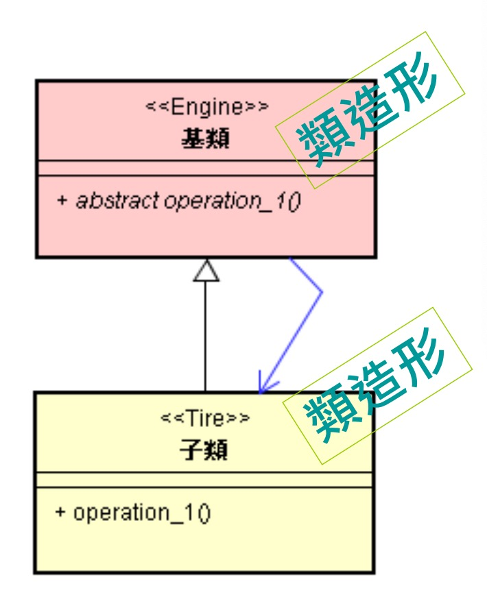

# 简介EIT造形

# 1. 认识类（Class）与内涵

## 类（Class）是比较小的造形

* 各种不同内涵，可以透过类（Class）的形式（Form）来呈现出来。
* 类造形就像集装箱（Container），可以容纳各种内涵。
* 集装箱的形式大多与内涵无关。

# 2. 认识 EIT 造形与内涵

## EIT 造形：类造形的组合

## 复习 EIT 的基本形与变形

* EIT 造形就像比类（Class）大的集装箱。
* 就像集装箱也有不同形式（即变形）。EIT 造形有 2 种变形，如下：

# 3. 结束

* 造形特性

  形式简单、内涵复杂、重复组合

* 其他造形范例

  物理原子（Atom）、唐诗七言绝句之形