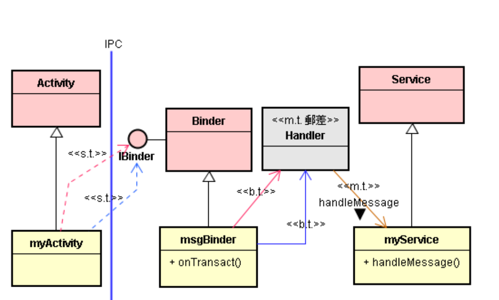
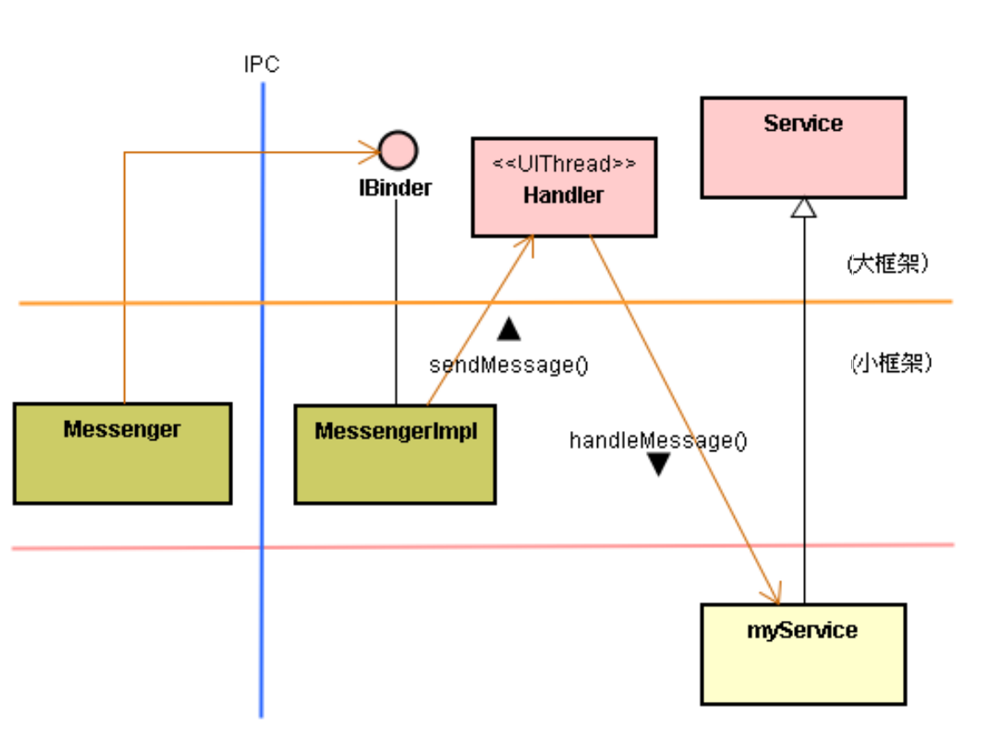
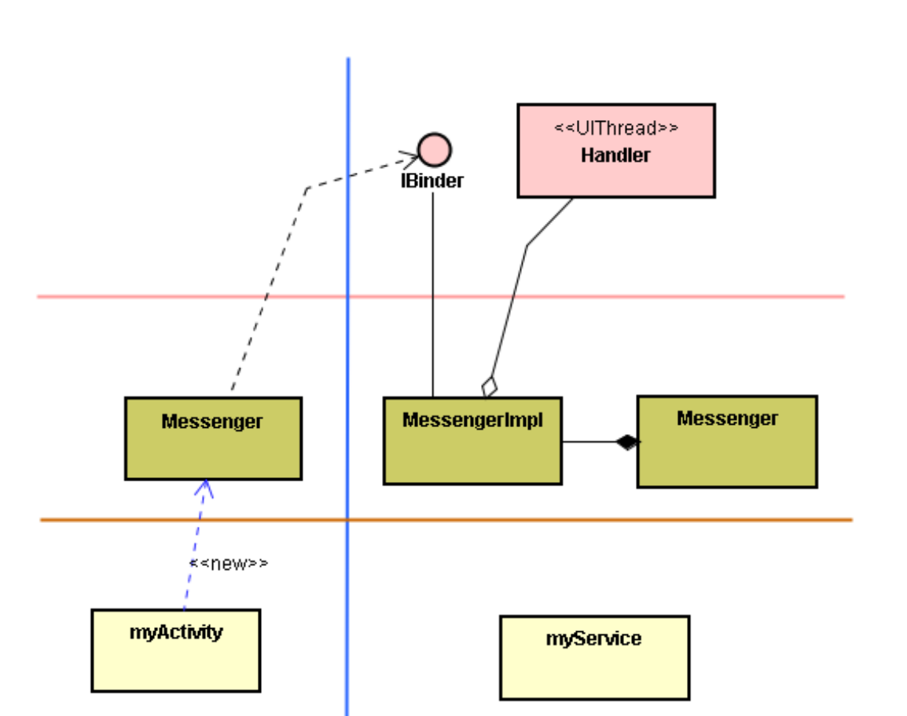
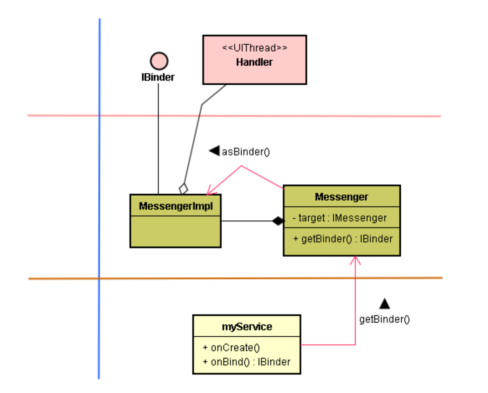
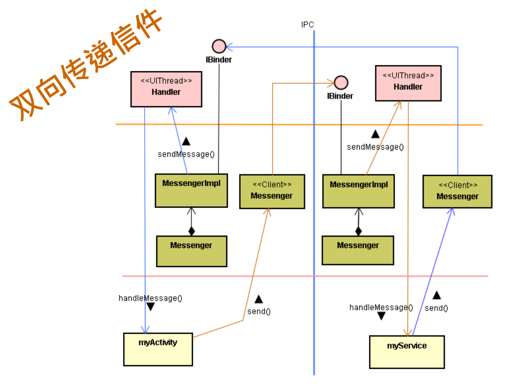
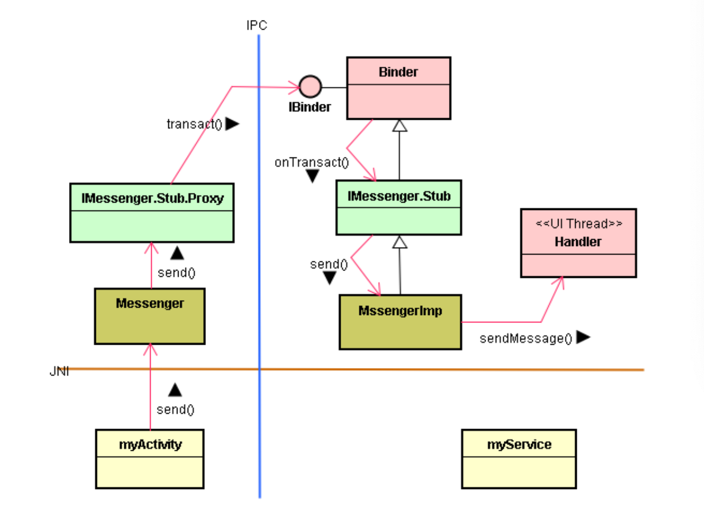

# Messager 框架与 IMessager 接口

# 1. Messenger 的概念和角色

* myActivity 和 myService 两者执行于不同的进程里 (IPC) 。
* myActivity 的线程想丢信息 (Message) 给 myService 的主线程。



* Messenger 类来扩充 IBinder 接口机制，让其能跨进程地将 Message 对象传递到另一个进程里，给其主线程 ( 又称 UI 线程 )。
* 由于 Message 类实作 (Implement) 了 Parcelable 接口，所以 Messenger 类可以透过 IBinder 接口而将 Message 对象传送到另一个进程里的 MessengerImpl 类。
* 然后，透过 Handler 而将 Message 对象丢入 UI 线程的 MQ 里，让 UI 线程来处理之。
* 由于是同步 ( 依序 ) 处理信息，所以 myService 类的开发者，不必顾虑多线程冲突的安全议题，减轻开发者的负担。


* 目的：myActivity 方的多个线程想丢信息给远程的 myService 的线程。
* 方法：使用 Messenger 类包装 IBinder 接口，将信息丢入 myService 主线程的 MQ 里。然后，由 myService 主线程同步 (依序) 处理这些信息。
* 这适用于跨进程的 IPC 沟通，可让双方透过 Messenger 来传递 Message 对象。
* 同一进程由于是同步 (依序) 处理信息，所以 myService 类的开发者，不必顾虑多线程冲突的安全议题，减轻开发者的负担。

# 2. Android 的 Messenger 框架

## 2.1. 复习：线程、信息和 IBinder 接口

* 在 Android 框架里，有个 IBinder 接口来担任跨进程的通讯。
* 在 Android 框架里，也有一个 Message 类，两个线程之间能互传 Message 对象。
* 于是，就能设计一个 **Messenger 类**来包装 IBinder 接口机制，让其能跨进程地将 Message 对象传递到另一个进程里，给其主线程 (又称 UI 线程)。
* 其中，由于 Message 类实作(Implement)了 Parcelable 接口，所以 **Messenger 类**可以透过 IBinder 接口而将 Message 对象传送到另一个进程里的 **MessengerImpl 类**。 
* 然后，MessengerImpl 透过 **Handler** 而将 Message 对象丢入 UI 线程的 MQ 里，让 UI 线程来处理之。



* 在传送 Message 对象之前，必须先建立 MessengerImpl、Handler 和 myService 三者之间的关系。如下图：


* 首先 myService 诞生一个 Handler 对象，并诞生一个 Messenger 对象，并让 Messenger 指向该 Handler 对象（Messenger 有 Handler 的指针）。
* 于是，Messenger 对象调用 Handler 的 getIMessenger() 函数去诞生一个 MessengerImpl 对象，并让 Messenger 对象指向 MessengerImpl 对象。
* 此时，MessengerImpl 对象也指向 Handler 对象。
* 建构完毕后，在另一个进程里的 myActivity 就能透过 Messenger 类而将 Message 对象传递给 MessengerImpl 对象。
* 然后，MessengerImpl 继续将 Message 对象放入主线程(main thread) 的 MQ 里。



## 2.2. 步骤

* myActivity 调用 bindService() 去绑定 myService，取得 IBinder 接口。

* 以 Messenger 类包装 IBinder 接口。

  ```java
  mMessenger = new Messenger(ibinder);
  ```

* myActivity 透过 Messenger 类接口将 Message 信息传给远方的 MessengerImpl 类。

  ```java
  mMessenger.send(msg);
  ```

* MessengerImpl 类将信息丢入对方主线程的 MQ 里。

* 主线程从 MQ 里取得信息，并调用 myService 的函数来处理信息。

## 2.3. 程序代码

```java
// myService.java
// ……….
public class myService extends Service {
		class myHandler extends Handler {
				@Override public void handleMessage(Message msg) {
						//……..
						Toast.makeText(getApplicationContext(),msg.obj.toString(),
						Toast.LENGTH_SHORT).show();
						//……..
				} 
    } 
		final Messenger mMessenger = new Messenger(new myHandler());
		@Override
		public IBinder onBind(Intent intent) {
				return mMessenger.getBinder();
		} 
}
```

```java
// myActivity.java
// ………
public class myActivity extends Activity {
		Messenger mMessenger = null;
		@Override
		protected void onCreate(Bundle savedInstanceState) {
				super.onCreate(savedInstanceState);
				setContentView(R.layout.main); 
      	bindService(new Intent(this, MessengerService.class), mConnection, 				
                    Context.BIND_AUTO_CREATE); 
    }
		private ServiceConnection mConnection = new ServiceConnection() {
				public void onServiceConnected(ComponentName className, IBinder ibinder){
						mMessenger = new Messenger(ibinder);
        } 
    }
}
```

* 一开始，框架会诞生 myService 对象，此时也执行指令：

  ```java
  final Messenger mMessenger = new Messenger(new myHandler());
  ```

* 就诞生一个 myHandler 对象，并且诞生一个 Messenger 对象，并把 myHandler 对象指针存入 Messenger 对象里。

* 一旦 myActivity 执行到指令：

  ```java
  bindService(new Intent(this,MessengerService.class), 
              mConnection,
              Context.BIND_AUTO_CREATE)；
  ```

* 框架会调用 myService 的 onBind() 函数，其内容为：

  ```java
  public IBinder onBind(Intent intent) {
  		return mMessenger.getBinder();
  }
  ```

* 此时，调用 Messenger 的 getBinder() 函数来取的MessengerImpl 的 IBinder 接口，并回传给 Android 框架。

  

* 接着，框架就调用 myActivity 的 onServiceConnected() 函数：

  ```java
  public void onServiceConnected(ComponentName 
  className, IBinder ibinder) {
  		mMessenger = new Messenger(ibinder);
  }
  ```

* 此时，就让 Messenger 对象指向 IBinder 接口了。

* 一旦myActivity执行到指令

  ```java
  public void onClick() {
  		Message msg = Message.obtain(null, “hello”, 0, 0);
  		mMessenger.send(msg);
  }
  ```

* 就诞生一个 Message 对象，然后调用 Messenger 的 send() 函数，此 send() 函数则调用 IBinder 接口的 transact() 函数，将 Message 对象传递给 MessengerImpl，再透过 myHandler 将 Message 对象放入主线程的 MQ 里。

## 2.4. 再谈线程的角色

* 如果你并不考虑让多个线程 (thread) 同时来执行你的Service，你就可以透过这个机制，将多个 Client 端 ( 如myActivity1, myActivity2 等 ) 送来的 Message  对象存入单一线程的 MessageQueue 里，由该线程依序逐一地处理各 Client 传来的 Message 对象。
* 虽然多个并行的 Client 端线程在调用 IBinder 接口时，会触发多个 Binder 驱动线程 (Binder Thread) 而进入MessengerImpl，然而它们则依序将 Message 丢入同一个 (即主线程的) MessageQueue 里。因此，对于 Service 而言，还是单线程的情境，你在撰写 myService 程序代码时，不必担心多线程之间的数据冲突问题。

# 3. 双向沟通的 Messenger 框架

* 这个 Messenger 框架是对 Binder 框架加以扩充而来的。在双向沟通上，也继承了 Binder 框架机制。
* Binder 框架双向沟通的应用情境是：当 myActivity 透过 IBinder 接口调用 myService 的函数去执行任务时 ( 例如使用子线程去播放 mp3 音乐)，万一发现底层播放系统故障了，则 myService 必须透过 IBinder 接口来通知 myActivity。
* 基于上述的 IBinder 双向通信机制，就能用 Messenger 来加以包装，而为跨进程双向的 Messenger 框架。



## 3.1. 基本设计原则

* **已知：**myActivity 透过 Android 框架去配对才取得myService 对象，然后才取得 myService 所在进程里的 IBinder 接口。

* **议题：**那么，myService 又如何取得 myActivity 进程里的 IBinder 接口呢? 

* **答案：**myActivity 先将 IBinder 接口打包到信件 (Message 对象) 里，随着信送到对方，对方 (myActivity) 就接到 IBinder 接口了。

  ```java
  message.replyTo = aMessenger;
  ```

# 4. IMessenger 接口

* 在 Messenger 框架里还定义了 IMessenger 接口，让应用程序 (App) 可直接调用 IMessenger 接口的 send() 函数。



* 这是典型的 Proxy-Stub 模式来包装 IBinder 接口。
* 在 myActivity 进程里：Messenger 类可以将 IBinder 接口转换成为 IMessenger 接口。
* 在 myService 进程里：也可以透过 Messenger 取得 MessengerImpl 类的 IMessenger 接口。