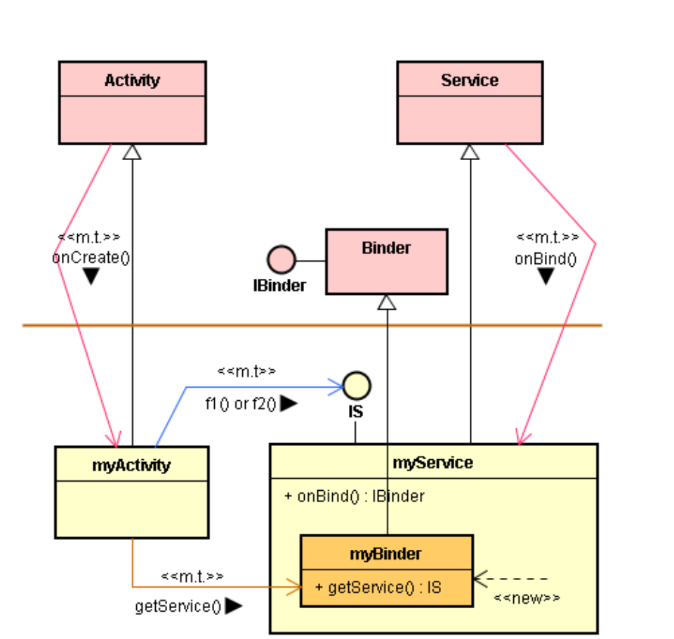
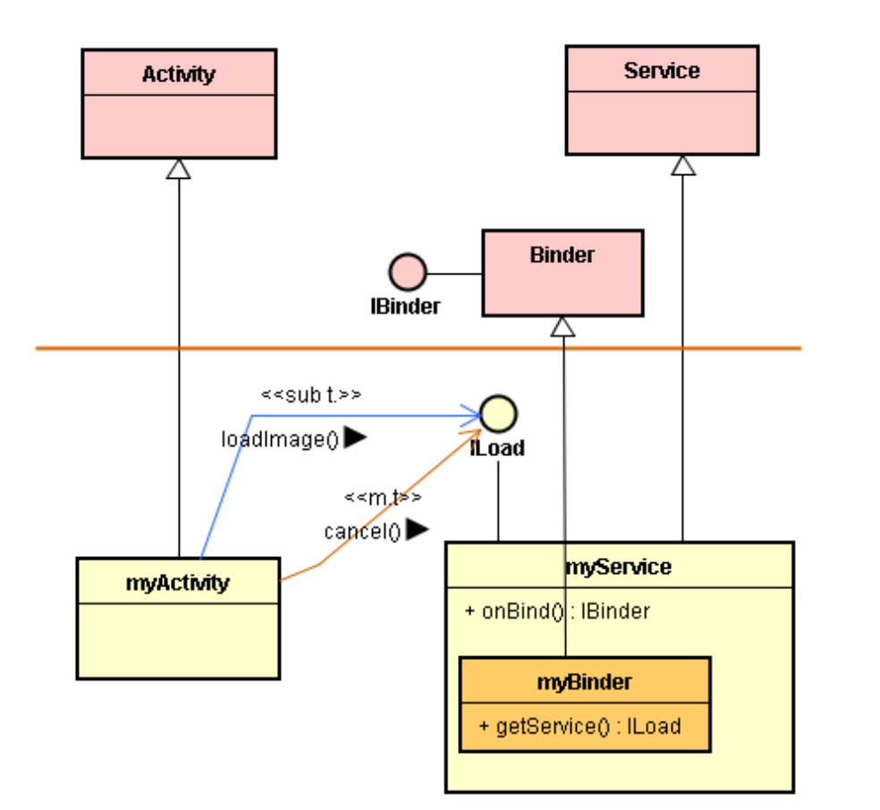

# 活用 IBinder 接口于近程通信

# 1. 在同一进程里，活用 IBinder 接口

* IBinder 接口的重要目的是支持跨进程的远程调用。然而，它也应用于同一进程里的近程调用。
* 例如，当 Activity 远程调用 Service 时，我们常用bindService() 函数去绑定 Service，取得对方的 IBinder 接口。
* 在近程 ( 同一进程内 ) 调用时也可以使用 bindService() 函数去绑定 Service，并取得对方的 IBinder 接口。

# 2. 目的、议题与方法

* 目的：myActivity 想去直接(近程)调用 myService 类的函数， 例如 IS 接口里的 f1() 函数。
* 议题：如何取的 myService 对象的 IS 接口呢? 
* 方法：先取得 myService 对象的  IBinder 接口。


* 第 1 步

  当Android框架启动myService时，就立即执行：

  ```java
  private final IBinder mBinder = new myBinder();
  ```

  這诞生了myBinder对象。

* 第 2 步

  随后，当 myActivity 调用 bindService() 时，框架会反向调用到 myService 的 onBind() 函数：

  ```java
  public IBinder onBind(Intent intent)
  { return mBinder; }
  ```

  其将 myBinder 的 IBinder 接口回传给框架，并由框架调用 onServiceConnected() 函数，将此接口回传给 myActivity。

* 第 3 步

  由于 myActivity 与 myService 在同一个进程里执行，myActivity 所获得的就是 myBinder 的真正接口 ( 不是它的 Proxy 的 )；于是，执行：

  ```java
  myBinder ib = (myBinder) ibinder;
  ```

  就从接获的 IBinder 接口转型 (casting) 为 myBinder 本身接口了。

* 第 4 步

  接着，执行：

  ```java
  isv = ib.getService();
  ```

  这透过 myBinder 本身接口来调用 getService() 函数，取得了 myService 的 IS 接口。

* 第 5 步

  最后，myActivity 就能透过 IS 接口来调用 myService 的 f1() 或 f2() 函数了。

# 3. 留意线程的角色

* 在上述的范例中，都是由主线程所执行的。由主线程执行所有的调用。



* 也可以创建小线程执行对 IS 接口的调用。



* 在这个范例里，活用 Android 框架提供的 Binder 基类和 IBinder 接口。 
* 然后配合 myService 的 onBind() 函数，将 myBinder 的 IBinder 接口回传给 myActivity。
* 接着，myActivity 并不透过 IBinder 接口来调用 myService 的服务。而是直接调用了 myService 的 IS 接口。
* 此外，可擅用小线程来执行比较耗时的服务。