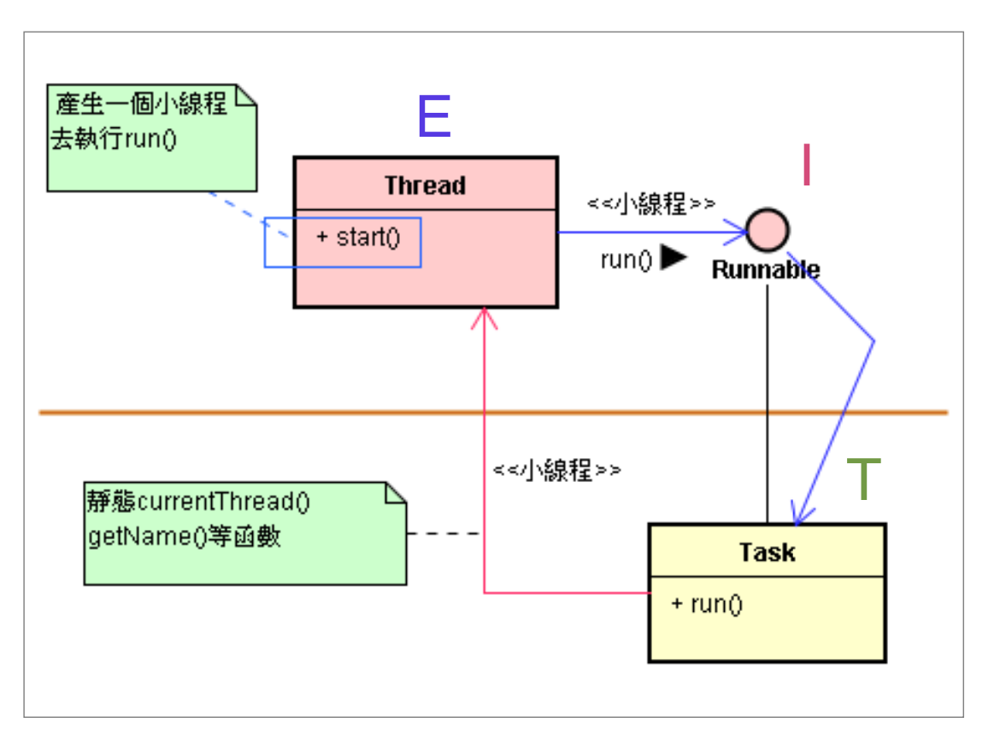
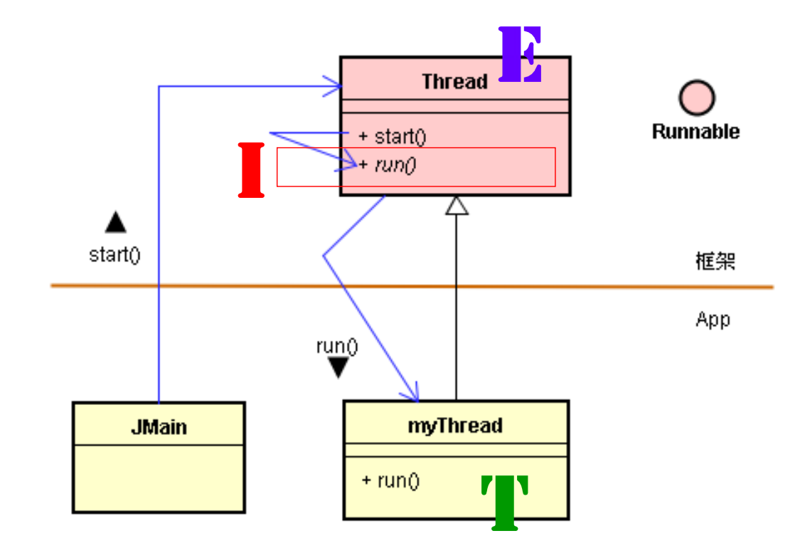
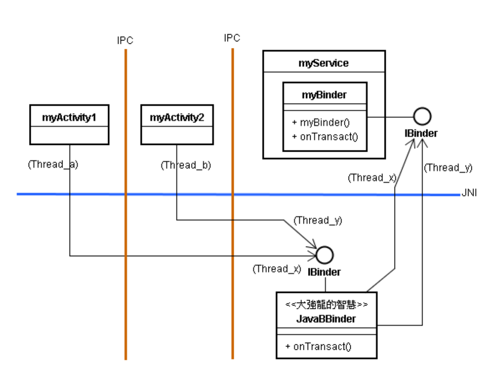

# 认识线程（Thread）模式

# 1. 线程（Thread）概念

* 所谓**线程** (Thread) 是指一串连续的执行动作，以达成一项目的。
* 現代的电脑内部都有数串连续性的动作同时在进行。也就是有多条线程并行地 (Concurrently) 执行。
* 在电脑中，若电脑拥有多颗 CPU，则每颗 CPU 可各照顾一个线程，于是可多个线程同时间进行。若只有单一 CPU，则此 CPU 可同时(Concurrently)照顾数个线程。
* 无论是多CPU或单一CPU的电脑，多条线程并行地执行，都可增加执行效率。
* 像 Java、C++ 等现代的电脑语言都能让程序师们能够易于创建多条线程减化 GUI 动画的设计工作，也可增加其执行效率。
* 多条线程能并行地执行同一个类别，或者是不同的类别。
* 在 Android 平台里也不例外，无论是在 Java 层或是 C++ 层，都常常见到多条线程并行的情形。
* Android 采取 Java 的 Thread 框架，来协助建立多條线程並行的环境。
* 在 Java 里，大家已经习惯撰写一个类别来支持 Runnable 接口，再搭配 Thread 基类就能顺利诞生一个新线程来执行该类别里的 run() 函数了。

# 2. Java 的线程框架 

* Java 提供一个 Thread 基类 (Super Class) 来支持多线程功能。这个基类协助诞生 ( 小 ) 线程，以及管理 ( 小 ) 线程的进行，让电脑系统更容易取得程序师的指示，然后安排 CPU 来运作线程里的指令。
* 例如，线程所欲达成的任务(Task)是程序师的事，所以程序师应填写线程里的指令，来表达其指示。
* 为配合此部份的运作，Java 提供了 Runnable 接口，其定义了一个 run() 函数。
* 于是，程序师可撰写一个应用类别 (Application Class) 来实作 (Implement) 此界面，并且把线程的任务写在应用类别的run() 函数里，如此即可让(小)线程来执行 run() 函数里的任务了。
* 这是几乎每一位 Java 开发者都常用的多线程 (Multi-thread) 机制，只是许多人都会用它，却不曾认识它的真实身影：就是一个幕后的框架。由于 Android 应用程序开发也采用 Java 语言，所这个 Thread 框架也成为 Android 大框架里的一个必备元素。
* 基于这个框架里的 Thread 基类和 Runnable 接口，你就可以撰写应用类别，来实作 run() 函数了。

* 于此图里，框架的 Thread 基类会先诞生一个小线程，然后该小线程透过 Runnable 接口，调用(或执行)了 Task 类别的 run() 函数。
* 就框架的结构而言，上图里的 Runnable 接口与 Thread 基类是可以合并起来的。也就是把 run() 函数写在 Thread 的子类别里。

# 3. 认识 Android 的主线程（又称 UI 线程）

​		**UI 线程的责任：迅速处理 UI 事件**

* 在 Android 里，关照 UI 画面的事件 (Event) 是 UI 线程的重要职责，而且是它的专属职责，其它子线程并不可以插手存取 UI 画面上的对象 ( 如 TextView ) 呢!
* 由于 Android 希望 UI 线程能够给予用户的要求做快速的反应。如果 UI 线程花费太多时间做幕后的事情，而在 UI 事件发生之后，让用户等待超过 5 秒钟而未处理的话，Android 就会向用户道歉。  
* 主线程可以诞生多个子线程来分担其工作，尤其是比较冗长费时的幕后服务工作，例如播放动画的背景音乐、或从网络下载影片等。于是，主线程就能专心于处理 UI 画面的事件了。
* 再如，当你开发一个游戏程序时，如果你希望游戏循环不受 UI 事件的干扰，或希望游戏循环 (GameLoop) 不要阻塞住 UI 线程的话，就不适合拿 UI 线程去跑游戏循环了。

* 当我们启动某一支 APP 时，Android 就会诞生新进程(Process)，并且将该 APP 程序加载这新诞生的进程里。每个进程在其诞生时刻，都会诞生一个主线程，又称为 UI 线程。
* 在进程诞生时刻，除了诞生主线程之外，还会替主线程诞生它专用的 Message Queue 和 Looper。
* 这个 Main Looper 就是让主线程没事时就来执行 Looper，确保主线程永远活着而不会死掉；在执行 Looper 时，会持续观察它的 Message Queue 是否有新的信息进来；如果有新信息进来的话，主线程就会尽快去处理(响应)它。
* 在 Android 环境里，一个应用程序常包含有许多个类别，这些类别可以分布在不同进程里执行，或挤在一个进程里执行。
* 在不同进程里 ， 各有其主线程(Thread)。由于线程是不能越过进程边界的。所以，当执行 LoadActivity（进程A） 的线程必须跨越进程去执行 LoadService( 的函数 )（进程B） 时 ，Android 的内层 Binder System 即刻从 LoadService 所在进程的线程池启动线程 (BinderThread) 来配合接力，由此 BinderThread 去执行 LoadService。

*  Binder System 會從進程的線程池(Thread pool) 裡啟動一個線程來執行 Binder::onTransact() 函數。

* Android 的每一个进程里，通常含有一个线程池，让跨进程的线程得以进行。虽然是由 Thread_a 与 Thread_x 相互合作与衔接而完成远距通讯的，但让人们能单纯地认为是单一进程(即 Thread_a )跨越到另一个进程去执行 JavaBBinder 对象。虽然 JavaBBinder 是 C/C++ 层级的；而 myService 是 Java 层级的，两者不同语言，但处于同一个进程，所以 Thread_x 可以执行到 myService 对象。

# 4. 细说主线程（UI 线程）的角色

## 4.1. 近程通信

* 在 Android 里，无论组件在那一个进程里执行，于预设情形下，他们都是由该进程里的主线程来负责执行之。

## 4.2. 远程通信

* 如果 Activity、Service 和 BroadcastReceiver 三者并不是在同一个进程里执行时，它们之间的通讯就是跨进程通讯(IPC)了。
* 当 Activity 与 Service ( 或 BroadcastReceiver) 之间采用 IPC 通讯时，意味着两者分别在不同的进程里执行。此时，**于预设情形下，Activity、BroadcastReceiver 或 Service 都是由其所属进程里的主线程负责执行之**。
* Android 核心的 Binder System 从 ”remote” 进程的线程池里，启动一个线程 ( 名为 ”Binder Thread #1” ) 来执行myBinder 的 onTransact() 函数。 
* 依据 Binder System 的同步 (Synchronization) 的机制，主线程会等待 Binder Thread #1 线程执行完毕，才会继续执行下去。

# 5. 线程之间的通信架构

## 5.1. 认识 Looper 与 Handler 对象

* 当主线程诞生时，就会去执行一个代码循环(Looper)，以便持续监视它的信息队列(Message Queue，简称 MQ)。当 UI 事件发生了，通常会立即丢一个信息 (Message) 到 MQ，此时主线程就立即从 MQ 里面取出该信息，并且处理之。
* 例如，用户在 UI 画面上按下一个 Button 按钮时，UI 事件发生了，就会丢一些信息到 MQ 里，其中包括 onClick 信息，于是，主线程会及时从 MQ 里取出 onClick 信息，然后调用 Activity 的 onClick() 函数去处理之。处理完毕之后，主线程又返回去继续执行信息循环，继续监视它的 MQ，一直循环下去，直到主线程的生命周期的终了。
* 通常是进程被删除时，主线程才会被删除。
* Android 里有一个 Looper 类别，其对象里含有一个信息循环(Message Loop)。也就是说，一个主线程有它自己专属的Looper 对象，此线程诞生时，就会执行此对象里的信息循环。此外，一个主线程还会有其专属的 MQ 信息结构。
* 由于主线程会持续监视 MQ 的动态，所以在程序的任何函数，只要将信息 (以 Message 类别的对象表示之) 丢入主线程的 MQ 里，就能与主线程沟通了。
* 在 Android 里，也定义了一个 Handler 类别，在程序的任何函数里，可以诞生 Handler 对象来将 Message 对象丢入 MQ 里，而与主线程进行沟通。
* 在 Android 的预设情况下，主线程诞生时，就会拥有自己的 Looper 对象和 MQ (即 Message Queue ) 数据结构。
* 然而，主线程诞生子线程时，于预设情形下，子线程并不具有自己的 Looper 对象和 MQ。由于没有 Looper 对象，就没有信息回圈(Message Loop)，一旦工作完毕了，此子线程就结束了。
* 既然没有 Looper 对象也没有 MQ，也就不能接受外来的 Message 对象了。则别的线程就无法透过 MQ 来传递信息给它了。
* 那么，如果别的线程(如主线程)需要与子线程通讯时，该如何呢? 答案是：替它诞生一个 Looper 对象和一个 MQ 就行了。

## 5.2. 主线程丢信息给自己

* Handler 是 Android 框架所提供的基类，用来协助将信息丢到线程的 MQ 里。
* 主线程创建一个 Handler 对象，在主线程中使用 Handler 对象传递消息。

## 5.3. 自线程丢信息给主线程

* 子线程也可以诞生 Handler 对象来将 Message 对象丢到主线程的 MQ 里，又能与主线程通讯了。
* 主线程创建 Handler 对象 h，在子线程中使用 h 传递消息。

## 5.4. 替子线程诞生 Looper 与 MQ

* 如果别的线程(如主线程)需要与子线程通讯时，该如何呢? 答案是：替它诞生一个 Looper 对象和一个 MQ 就行了。
* 在子线程中调用 Looper.prepare() 和 Looper.loop 方法，并创建 Handler 对象 h，在主线程中使用 h 传递消息，主线程传递消息到子线程。
* 请留意，此刻子线程因为不能碰触 UI 控件，所以无法更新画面。

# 6. Android UI 的单线程环境

## 6.1. 单线程程序概念

* **单线程程序**意谓着两个(或多个)线程不能共享对象或变量值。
* Android 的 UI 是单线程程序的环境。
* UI 控件 (如 Button 等) 都是由 UI 线程所创建，内部攸关于 UI 显示的属性或变量都只有 UI 线程才能存取(Access)之，别的线程并不能去存取之。
* View 类别体系，都只限于 UI 线程才能去执行它们的onDraw() 函数，因为它会实际更动到 UI 的属性。
* 单线程可避开 “ 线程安全 ” 问题。
* 线程安全问题就是如何避免不同线程之间，可能会相互干扰的问题。
* 虽然两个线程几乎同时先后执行一个类别里的 (可能不同) 函数，只要不共享对象、或共享变量 ( 例如 Android 的 UI 单线程环境)，就不会产生干扰现象，也就没有线程安全问题。
* 换句话说，如果各自使用自己的对象或变量 (即不共享对象或变量)，就不会干扰到别线程执行的正确性了。
* View 控件是由 UI 线程 (主线程) 所执行。如果需要去迅速更新 UI 画面或者 UI 画图需要较长时间(避免阻塞主线程)，就使用 SurfaceView。 
* SurfaceView 可以由背景线程 (background thead) 来执行，而 View 只能由 UI (主) 线程执行画面显示或更新。
* 在 SurfaceView 里，非 UI 线程可以去碰触 UI 显示，例如将图形绘制于 Surface 画布上。这 SurfaceView 内含高效率的 rendering 机制，能让背景线程快速更新 surface 的内容，适合演示动画(animation)。

# 7. 线程安全的化解之例

* View 是一个单线程的类；其意味着：此类的撰写者心中意图只让有一个线程来执行这个类的代码（如函数调用）。
* 由于 View 类开发者心怀 < 单线程 >，则 View 类的 Client 开发者就不宜让多线程去执行 View 的代码。
* 同样地，View 的子类开发者也不宜让多线程去执行 View ( 基类 ) 的代码。
* 如果共享对象或变量是不可避免的话，就得试图错开线程的执行时刻了。
* 由于共享对象或变量，若两个线程会争相更改对象的属性值或变量值时，则可能会互相干扰对方的计算过程和结果。
* 同步（Synchronization）化解 “ 线程安全 ” 问题。