# JNI：必要的优化设计

# 1. 创建 C++ 累的对象

* 在 JNI 的 C 模块里，不仅能创建 Java 层的对象，也可以创建 C++ 类别的对象。

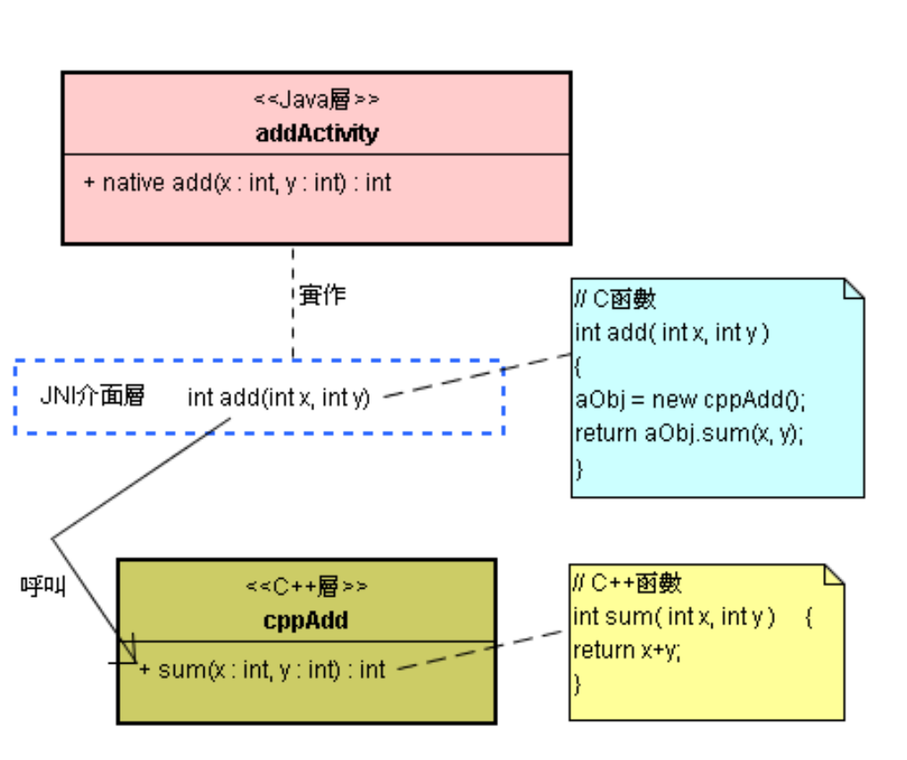

* 上图的 JNI 接口层是以 C 语言实作的本地函数。
* 在逻辑上，这些 C 函数仍属于 Java 类 ( 即定义 < In > 的类)。 
* 典型的架构共分为三个层级：Java 层、C 层和 C++ 层；其间可以互相沟通与合作。
* C 和 C++ 代码可以摆在同一个 \*.so 档案里。
* 多个 Java 类的 C 函数 (即多个 < In > 的实现代码) 可以摆在同一个 \*.so 档案里。

# 2. 优化目的：维护本地函数的稳定性

* 不宜仰赖 C 层的 \*.so 的全局变量来储存 Java 层或 C++ 层的对像 (指针或参考)。 
* 依赖 C 层 (全局或静态变量) 来储存 C++ 对象指针，或者储存 Java 层对象参考，这常常让 C 层模块与特定 C++ 对象或 Java 对象绑在一起，产生紧密的相依性，导致系统弹性的下降。
* 所以不将 Java 或 C++ 对象参考储存于 C 层的全部变量里；提升 C 函数和代码稳定度。
* C 层的全局或静态 (static) 变量只适合储存静态的数据，例如 methodID 或 fieldID 值。

# 3. < 静态对静态，动态对动态 > 原则

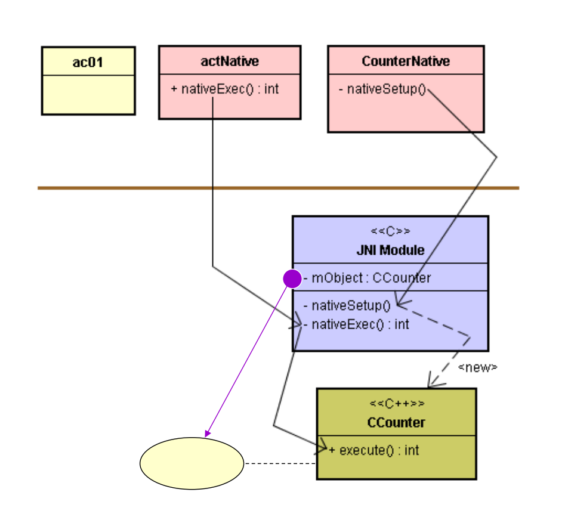

* 这 nativeSetup() 函数动态创建 CCounter 类的对象，并将新对象的指针储存于全局 (静态) 的 mObject 变量里。
* 这违背了 “静态对静态，动态对动态” 的原则。

# 4. Java 与 C++ 对象之间的 < 单向 > 对称关连

```java
// CounterNative.java
// ……..
public class CounterNative {
		private int mObject;
		static { 
				System.loadLibrary("MyCounter7"); 
		}
		public CounterNative(int numb) {
				nativeSetup( numb );
		}
		private native void nativeSetup(int n);
}
```

* 当你定义 C++ 类别时，可以将它与 JNI 的 C 函数定义在同一个文件 (*.so) 里，也可定义在独立的档案里。
* 在此范例里，在 JNI 的 C 函数文件中，新增一个 CCounter 类。
* 例如，在 com_misoo_counter_CounterNative.cpp 里除了实作本地 C 函数之外，还定义了一个 C++ 的 CCounter 类。

```c++
/* com.misoo.counter.CounterNative.cpp */
#include "com_misoo_counter_actNative.h"
#include "com_misoo_counter_CounterNative.h“
class CCounter{
		int n;
		public:
				CCounter(int v) { n = v; }
				int execute() {
						int i, sum = 0;
						for(i=0; i<=n; i++) sum+=i;
						return sum;
				}
};
```

```c
JNIEXPORT void JNICALL Java_com_misoo_counter_CounterNative_nativeSetup(JNIEnv *env, jobject thiz, jint n) {
		CCounter *obj = new CCounter(n);
		jclass clazz = (jclass)env->GetObjectClass(thiz);
		jfieldID fid = (jfieldID)env->GetFieldID(clazz,"mObject", "I");
		env->SetIntField(thiz, fid, (jint)obj);
}
JNIEXPORT jint JNICALL Java_com_misoo_counter_actNative_nativeExec(JNIEnv *env, jclass clazz, jobject obj) {
		jclass objClazz = (jclass)env->GetObjectClass(obj);
		jfieldID fid = env->GetFieldID(objClazz, "mObject", "I");
		jlong p = (jlong)env->GetObjectField(obj, fid);
		CCounter *co = (CCounter*)p;
		return (jint)co->execute();
}
```

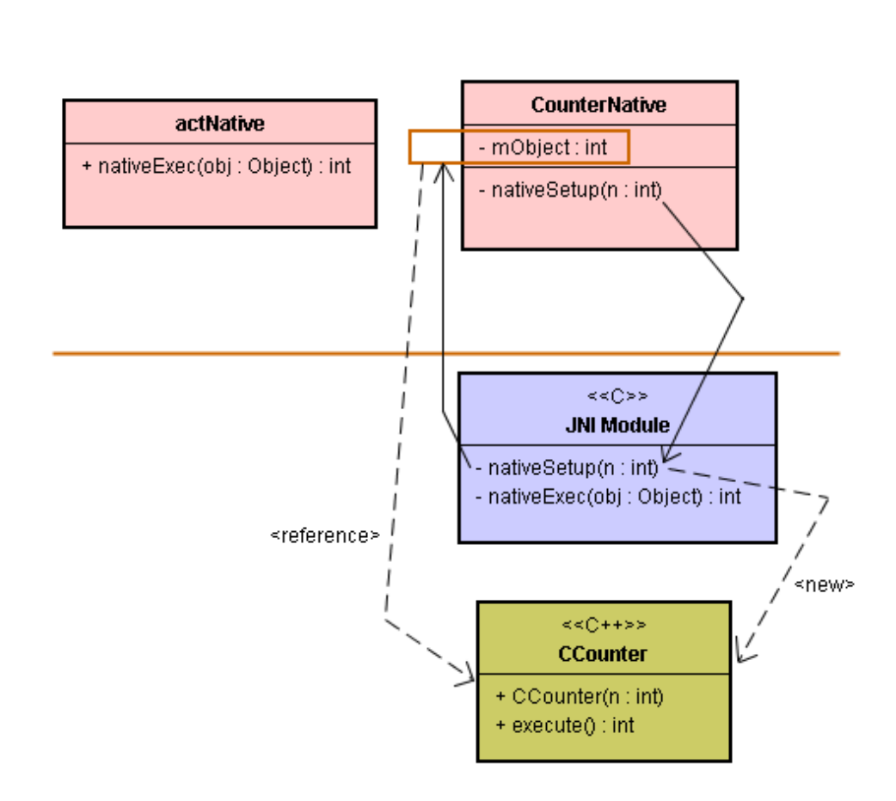

* 上述 nativeSetup() 函数里的指令：

  ```c
  CCounter *obj = new CCounter(n);
  ```

* 创建一个 C++ 层的 CCounter 对象，并且把 n 值存入其中。

* 随后，指令：

  ```c
  jclass clazz = (jclass)env->GetObjectClass(thiz);
  jfieldID fid = (jfieldID)env->GetFieldID(clazz, "mObject", "I");
  ```

* 取得该 CCounter 对象的 mObject 属性 ID。

* 接着，指令：

  ```c
  env->SetIntField(thiz, fid, (jint)obj);
  ```

* 就将 CCounter 对象的指针值储存于 CounterNative 对象的 mObject 属性里，如此建立了 CounterNative 对象与 CCounter 对象之连结。

* C 模块创建 CCounter 对象之后，立即将 CCounter 对象指针储存于 CounterNative 的 mObject 属性里。

* C 模块来创建 C++ 对象，然后让 Java 对象与 C++ 对象之间产生成双成对的连结关系。

* C 模块本身并不储存 Java 或 C++ 对象的指针或参考值。而是仅负责创建 C++ 对象，并建立 Java 与 C++ 的对象间的连结关系。

* 如此，C 模块能替众多 Java 对象服务，而不再与特定的 Java 对象绑在一起了。

* 一旦解开 C 模块与 C++ 对象 (或 Java 对象) 之间的相依性，C 模块就能具有通用性。

* 例如，C 层 nativeSetup() 函数，能为 Java 层的每一个对象建立其相对映的 C++ 对象。

* 由于 C 层的 nativeSetup() 已经变成为通用型的函数了，每次调用它时，只要将特定的 CounterNative 对象传递给它，就能顺利找到其相对映的 CCounter 对象了。

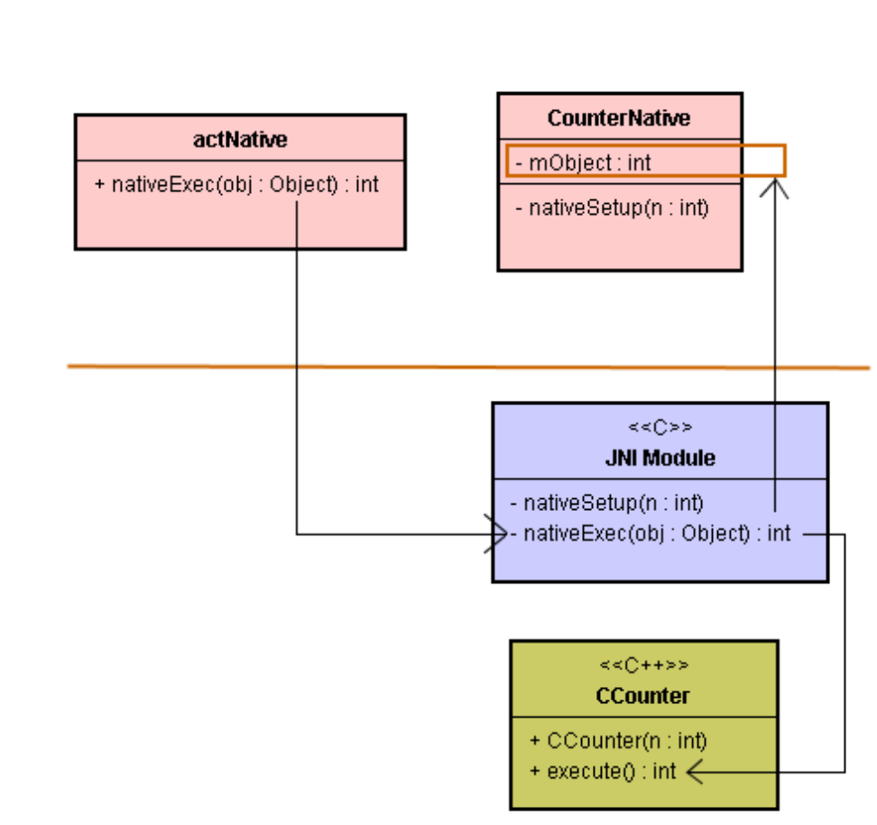

```java
// actNative.java
// ………
public class actNative {
public static native int nativeExec(Object obj);
}
```

* 这 nativeExec() 先取得 CounterNative 对象里的 mObject 属性值，相当于取得 CCounter 对象的指针了，就能调用 CCounter 对象的 execute() 函数了。

* 由于 C 模块里并没有储存 CounterNative 对象的指针，所以 Java 必须将 CounterNative 对象的参考值传递给 JNI 层的nativeExec() 本地函数，如下指令：

  ```java
  // ac01.java
  // ……..
  public class ac01 extends Activity implements OnClickListener {
  		private CounterNative cn1, cn2;
    
  		@Override 
    	public void onCreate(Bundle savedInstanceState){
  				//……..
  				cn1 = new CounterNative(10);
  				cn2 = new CounterNative(12);
  		}
    
    	@Override 
    	public void onClick(View v) {
  				int sum;
  				switch(v.getId()){
  						case 101: 
              		sum = actNative.nativeExec(cn1);
  								setTitle("Sum = " + sum);
  								break;
  						case 102: 
              		sum = actNative.nativeExec(cn2);
  								setTitle("Sum = " + sum);
  								break;
  						case 103: 
              		finish(); 
  								break;
          }
      }
  }
  ```

* 指令：

  ```java
  actNative.nativeExec( cn1 );
  ```

* 此时，ac01 将 CounterNative 类别的第 1 个对象传递给 JNI 模块的 nativeExec() 函数，找到相对映的 CCounter 对象，然后调用它的 execute() 函数。

  ```c
  JNIEXPORT jint JNICALL Java_com_misoo_counter_actNative_nativeExec (JNIEnv *env, jclass clazz, jobject obj) {
  		jclass objClazz = (jclass)env->GetObjectClass(obj);
  		jfieldID fid = env->GetFieldID(objClazz, "mObject", "I");
  		jlong p = (jlong)env->GetObjectField(obj, fid);
  		CCounter *co = (CCounter*)p;
  		return (jint)co->execute();
  }
  ```

* 这 obj 参考到 CounterNative 对象。

* 当其执行到指令：

  ```c
  jfieldID fid = env->GetFieldID(objClazz, "mObject", "I");
  jlong p = (jlong)env->GetObjectField(obj, fid);
  ```

* 就从 CounterNative 对象里取得 mObject 属性值，并存入 p 变量里。此 p 值正是 C++ 层 CCounter 对象的参考，所以可透过 p 调用 CCounter 对象的 execute() 函数。

# 5. Java 与 C++ 对象之间的 < 双向 > 对称关连

* 上一节里，将 C++ 对象指针储存于 Java 对象的属性里；成为 <单向> 的对称联结关系。
* 也可以将 Java 对象的参考储存于 C++ 对象里。


```java
// INumber.java
package com.misoo.counter;
public interface INumber {
		int onNumber();
}
```

```java
// ac01.java
// ………
public class ac01 extends Activity implements OnClickListener, INumber {
		private CounterNative cn;
  
		@Override 
  	public void onCreate(Bundle savedInstanceState){
				//………….-
				cn = new CounterNative();
				cn.setOnNumber(this);
		}
  
  	@Override 
  	public void onClick(View v) {
				int sum;
				switch(v.getId()){
						case 101: 
								sum = actNative.nativeExec(cn.mObject);
								setTitle("Sum = " + sum);
								break;
						case 103: 
								finish(); 
            		break;
				} 
    }
  
		@Override 
  	public int onNumber() {
      	return 17; 
    }
}
```

* 指令

```java
@Override 
public void onCreate(Bundle savedInstanceState){
		//………….-
		cn = new CounterNative();
		cn.setOnNumber(this);
}
```


```java
// CounterNative.java
package com.misoo.counter;
public class CounterNative {
		public int mObject;
		private INumber listener;
  
		static { 
				System.loadLibrary("MyCounter8"); 
    }
  
		public CounterNative(){ 
      	nativeSetup(); 
    }
  
		public void setOnNumber(INumber plis){ 
      		listener = plis; 
    }
  
		private int getNumb(){ 
      		return listener.onNumber(); 
    }
  
		private native void nativeSetup();
}
```

```c++
/* com.misoo.counter.CounterNative.cpp */
#include "com_misoo_counter_actNative.h"
#include "com_misoo_counter_CounterNative.h“
class CCounter{
	public:
		int n;
		jint javaObj;
	public:
		CCounter() {}
		int execute() {
			int i, sum = 0;
			for(i=0; i<=n; i++) sum+=i;
			return sum;
		}
};
```

```c
JNIEXPORT jint JNICALL  Java_com_misoo_counter_actNative_nativeExec(JNIEnv *env, jclass clazz, jint refer) {
	CCounter *co = (CCounter*)refer;
	jobject jo = (jobject)co->javaObj;
	jclass joClazz = (jclass)env->GetObjectClass(jo);
	jmethodID mid = env->GetMethodID(joClazz, "getNumb", "()I");
	int numb = (int)env->CallIntMethod(jo, mid);
	co->n = numb;
	return (jint)co->execute();
}
```

## 5.1. 关于 nativeSetup() 函数的动作

* 上述 nativeSetup() 函数里的指令：

  ```c
  CCounter *obj = new CCounter();
  ```

  诞生一个 CCounter 对象。 

* 指令：

  ```c
  jfieldID fid = (jfieldID)env->GetFieldID(clazz, "mObject", "I");
  env->SetIntField(thiz, fid, (jint)obj);
  ```

* 就将 CCounter 对象的指针值储存于 CounterNative 对象的 mObject 属性里。

* 指令：

  ```c
  jobject gThiz = (jobject)env->NewGlobalRef(thiz);
  obj->javaObj = (jint)gThiz;
  ```

* 就将 CounterNative 对象的指针值储存于 CCounter 对象的 javaObj 属性里，如此建立了 CounterNative 对象与 CCounter 对象之双向连结。如下图：

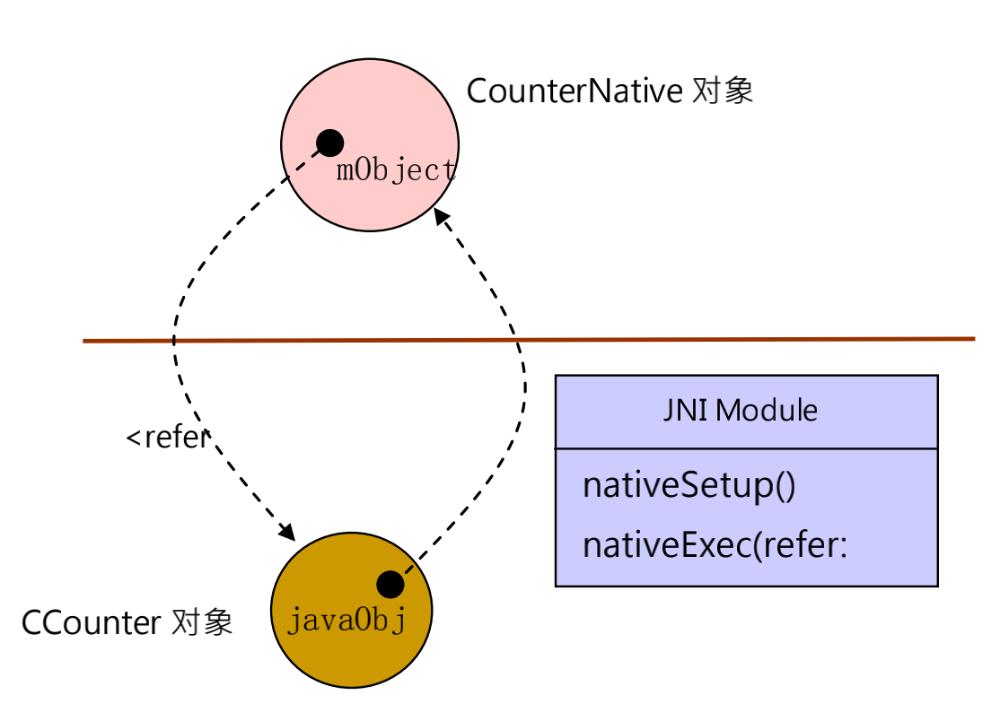

## 5.2. 关于 nativeExec() 函数的动作

* 当 ac01 调用这个函数时，将 CCounter 对象的参考值传递给 JNI 层的 nativeExec() 本地函数。


```java
// ac01.java
// ......
@Override 
public void onClick(View v) {
	int sum;
	switch(v.getId()){
		case 101: 
			sum = actNative.nativeExec( cn.mObject );
			setTitle("Sum = " + sum);
			break;
		case 103: 
			finish(); 
      break;
	} 
}
@Override 
public int onNumber() { 
  return 17; 
}
```

```java
// actNative.java
package com.misoo.counter;
public class actNative {
		public static native int getCounter(int refer);
		public static native int nativeExec(int refer);
}
```

* 指令：

  ```java
  actNative.nativeExec(cn.mObject);
  ```

* 这 nativeExec() 函数的参数 refer 则参考到 CCounter 的对象。当其执行到指令：

  ```c
  CCounter *co = (CCounter*)refer;
  jobject jo = (jobject)co->javaObj;
  ```

* 就从 CCounter 对象里取得 javaObj 属性值，并存入 jo 变量里。

* 此 jo 值正是 Java 层 CounterNative 对象的参考，所以透过 jo 可以调用 CounterNative 对象的 getNumb() 函数，进而调用 ac01 的 onNumber() 函数，顺利取得 n 值 ( 即 numb 值)。

* 最后，指令：

  ```java
  co->n = numb;
  return (jint)co->execute();
  ```

* 将取到的 numb 值存入 CCounter 对象里，并调用其 execute() 函数算出结果，回传给 Java 层。

## 5.3. mObject 优化

* 在此范例里，ac01 类和 actNative 开发者知道 CounterNative 类的内涵，而且 CounterNative 的 mObject 必须 public，才能取得 co 的指针。

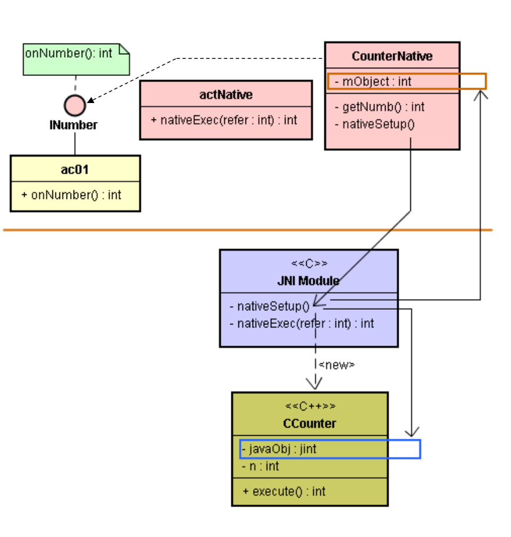

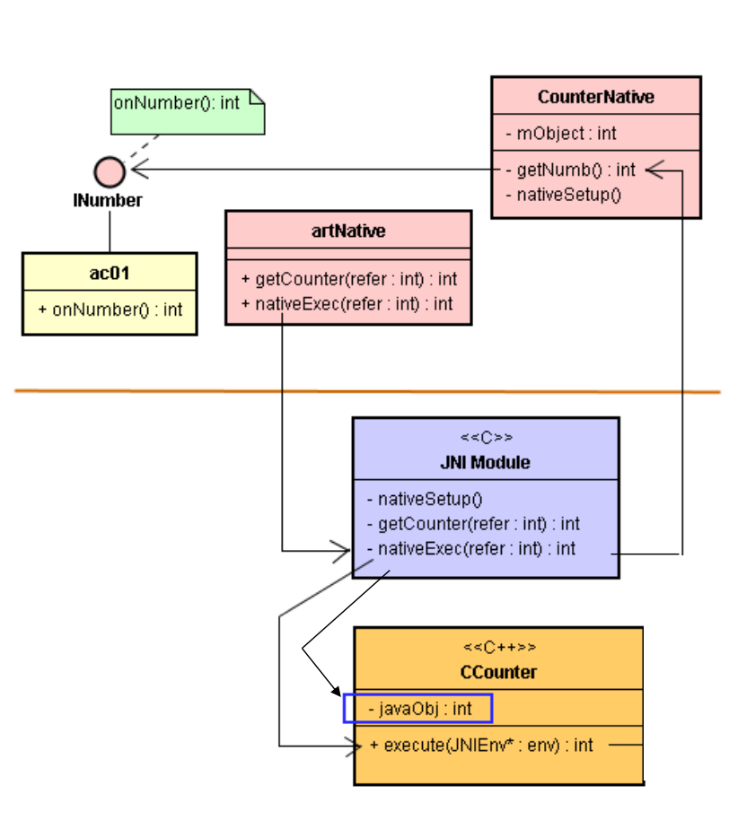

```java
// ac01.java
// ………
public class ac01 extends Activity implements OnClickListener, INumber {
	private CounterNative cn;
  
	@Override 
  public void onCreate(Bundle savedInstanceState){
		//………….-
		cn = new CounterNative();
		cn.setOnNumber(this);
	}
  
  @Override 
  public void onClick(View v) {
		int sum;
		switch(v.getId()){
			case 101: 
					sum = actNative.nativeExec( cn.mObject );
					setTitle("Sum = " + sum);
					break;
			case 103: 
					finish(); 
        break;
		} 
  }
  
	@Override 
  public int onNumber() { return 17; }
}
```

```java
// CounterNative.java
package com.misoo.counter;
public class CounterNative {
	public int mObject; // public
	private INumber listener;
  
	static { 
		System.loadLibrary("MyCounter8"); 
  }
  
	public CounterNative(){ 
    nativeSetup(); 
  }
  
	public void setOnNumber(INumber plis){ 
    listener = plis; 
  }
  
	private int getNumb(){ 
    return listener.onNumber(); 
  }
  
	private native void nativeSetup();
}
```

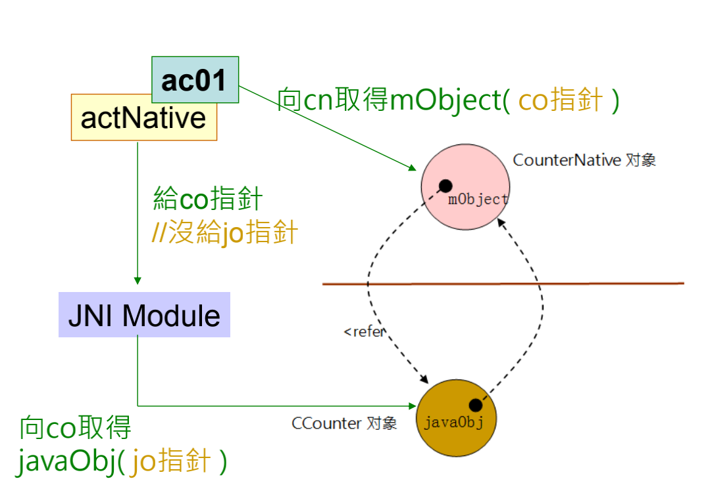

*  如果 CouterNative 的 mObject 属性改为 private 时，ac01 或 actNative 就拿不到 mObject 属性值了。
* 只能将 cn 指针传递给 C 函数。
* 此时，必须有个前置的预备动作 (setup) 了。


```java
// ac01.java
// ………
@Override 
public void onClick(View v) {
	int sum;
	switch(v.getId()){
		case 101: 
			sum = actNative.nativeExec( cn );
			setTitle("Sum = " + sum);
			break;
    case 103: 
			finish(); 
      break;
	} 
}

@Override public int onNumber() { 
  return 17; 
}
```

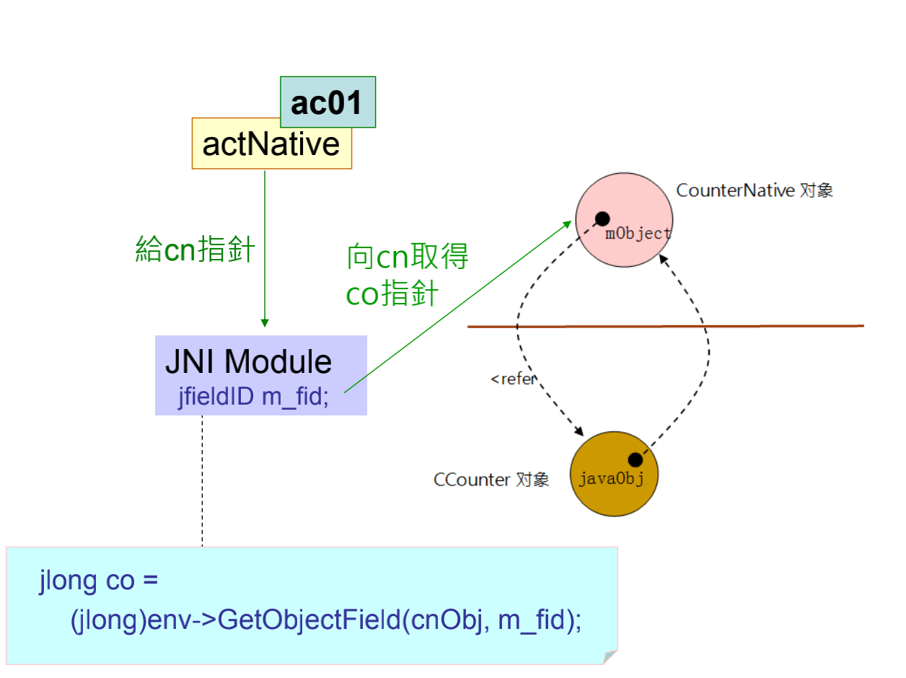

* 静态对静态

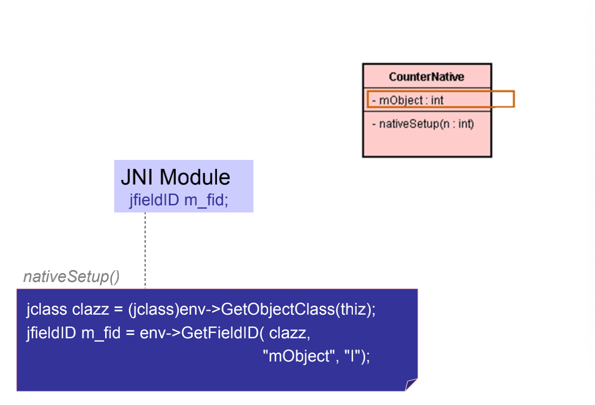

* 动态对动态

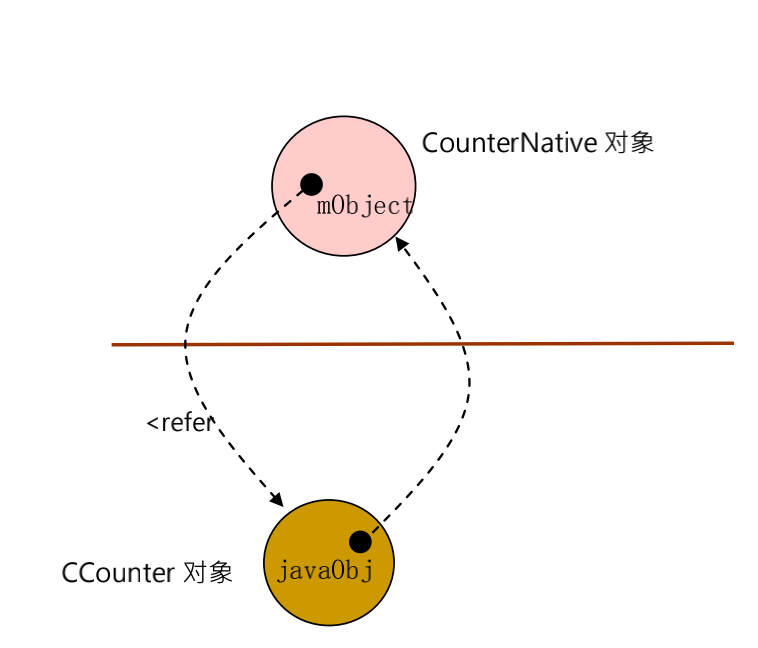