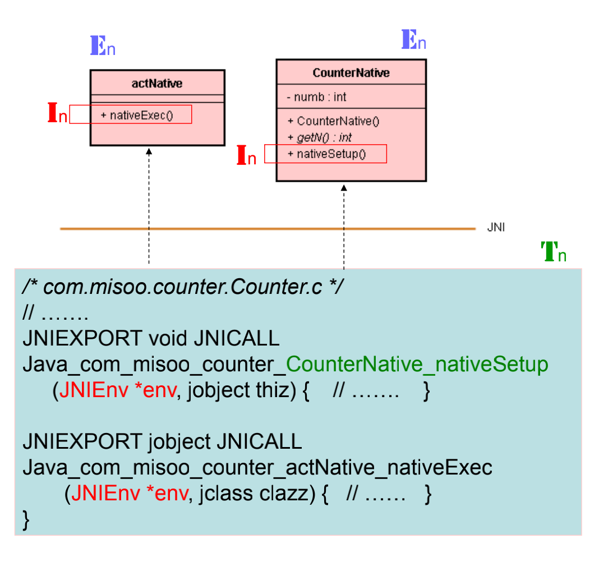

# 多个 Java 线程进入本地函数

## 1. 介绍 JNI 线程模式

## 1.1. Android 线程的特性

* 线程 (Thread) 又称为「执行绪」。 
* 于默认 (Default) 下，一个 App 的各类别 (如 Activity、BroadcastReceiver 等) 都在同一个进程(Process)里执行，而且由该进程的主线程负责执行。
* 如果有特别指示，也可以让特定类在不同的进程里执行。
* 例如由一个 Activity 启动一个 Service，在默认情形下，两者都在同一个进程里执行。
* 主线程除了要处理 Activity 类别的 UI 事件，又要处理 Service 幕后服务工作，通常会忙不过来。
* 该如何化解这种困境呢? 
* 主线程可以诞生多个子线程来分担其工作，尤其是比较冗长费时的幕后服务工作，例如播放动画的背景音乐、或从网络下载映片等。
* 于是，主线程就能专心于处理 UI 画面的事件了。

## 1.2. 线程往返 Java 与 C/C++

* 由于每一个进程里都有一个主线程。
* 每一个进程里，都可能有 Java 程序码，也有 C/C++ 本地程序码。
* Java 层的主线程经常从 Java 层进入 JNI 层的 C 函数里执行；此外，当反向调用 Java 函数时，又返回进入 Java 函数里执行。
* 无论是主线程，或是子线程，都可以从 Java 层进入 C/C++ 层去执行，也能从 C/C++ 层进入 Java 层。

## 1.3. VM 对象与 JavaVM 指针

* 在进程里，有一个虚拟机 (Virtual Machine，简称 VM) 的对象，可执行 Java 代码，也引导 JNI 本地程序的执行，实现 Java 与 C/C++ 之间的沟通。 
* 当 VM 执行到 System.loadLibrary() 函数去加载 C 模块时会时，就会立即先调用 JNI_OnLoad() 函数。
* VM 调用 JNI_OnLoad() 时，会将 VM 的指标 (Pointer) 传递给它，其参数如下：

```c
/* com.misoo.counter.CounterNative.cpp */
// ……… 
JavaVM *jvm;
// ………
jint JNI_OnLoad( JavaVM* vm, void* reserved){
	jvm = vm;
	return JNI_VERSION_1_4;
}
```

* 指令：jvm = vm;

  将传来的 VM 指针储存于这本地模块 (*.so) 的公用变量 jvm 里。让本地函数随时能使用 jvm 来与 VM 交互。

* 例如，当你创建一个本地 C 层的新线程时，可以使用指令：

  ```c
  jvm->AttachCurrentThread(&env, NULL);
  ```

* 就向 VM 登记，要求 VM 诞生 JNIEnv 对象，并将其指针值存入 env 里。有了 env 值，就能执行指令：

  ```java
  env->CallStaticVoidMethod(mClass, mid, sum);
  ```

* 其调用 Java 层的函数了。

## 1.4. 为什么需要 JNIEnv 对象呢？

* 本地 C 函数的第 1 个参数就是 JNIEnv 对象的指针，例如：



* 这是 Java 线程透过 VM 进入 C 函数时，VM 替线程而创建的对象，是该线程专属的私有对象。

* 线程透过它来要求 VM 协助进入 Java 层去取得 Java 层的资源，包括：取得函数或属性 ID、调用 Java 函数或存取 Java 对象属性值等。

* 例如，有了 env 值，就能执行指令：

  ```c
  env->CallStaticVoidMethod(mClass, mid, sum);
  ```

* 其调用 Java 层的函数了。

## 1.5. 议题

* 议题：在 C/C++ 层所创建的子线程，没有经过 VM，所以没有 JNIEnv 对象，该如何要求 VM 协助进入 Java 层去取得 Java 层的资源，例如取得函数 ID、调用 Java 函数呢?

* 使用指令：

  ```c++
  jvm->AttachCurrentThread(&env, NULL);
  ```

* 就向 VM 登记，要求 VM 诞生 JNIEnv 对象，并将指针存入 env 里。有了 env 值，就能执行指令：

  ```c++
  env->CallStaticVoidMethod(mClass, mid, sum);
  ```

* 其调用 Java 层的函数了。

# 2. 从 Session 概念认识 JNIEnv 对象

* WebService 应用，由于 Client 与 Server 是 N : 1 关系所以 Server 替每一个 Client 的 Connection 准备一个 Session 对象，让各 Connection 使用自己专属的对象，避免共享对象的数据安全问题。 
* 每一个 Connection 都有一个私有的 Session 对象。每一个线程进入 VM 都有一个私有 JNIEnv 对象。

# 3. 细说 JNIEnv 对象

* 在预设情形下，在某个线程第一次进入 VM 去执行 JNI 层 C 函数时，VM 就会替它诞生专属的 JNIEnv 对象。只要该线程还存在着，就会一直保留它所专属的 JNIEnv 对象。
* 不同的线程的 JNIEnv 对象都是不一样的。
* 这样安排的好处之一是：每一个线程都不共享 JNIEnv 对象，此对象可以储存该线程相关的数据值，如此可以避免线程因共享对象或数据而引发的线程冲突问题，已就是有效提升了 JNI 环境下的多线程的安全性。
* JNIEnv 对象内含一个指针，正指向 VM 的函数表 (Function Table)。
* 每一个线程第一次进入 VM 调用本地函数时，VM 会替它诞生一个相对映的 JNIEnv 对象。
* Java 层的线程调用 C 层的本地函数时，该线程必然经过 VM，且 VM 一定替它诞生相对映的 JNIEnv 对象。
* 所以一个线程每次调用本地函数时，都会将其对映的 JNIEnv 对象指针值传递给本地函数。
* 每一个线程都有其专属的 JNIEnv 对象，所以不同的线程 ( 例如 th1 和 th2 ) 调用同一个本地函数 ( 例如 f1(JNIEnv* env, …..) 函数 ) 时，这本地函数所接到的 env 值是不一样的。
* 线程不共享 JNIEnv 对象，成为 “单线程” 开发，不必烦恼线程安全问题，让本地函数的撰写单纯化了。
* 一个线程经常会多次进入 VM 去执行 JNI 层 C 函数，其中，每一次进入时，VM 都会将其专属的 JNIEnv 对象指针传递给 C 函数的第 1 个参数 ( 即 env )。
* 因此，同一个线程每回进入 C 函数时，所带进来的 env 参数值都是相同的。 
* 采取 JNIEnv 机制，既能避免多线程的相互冲突，还能达成跨函数的数据共享。

# 4. 本地函数的线程安全

* Java 程序可能会有多个线程几乎同时先后进入同一个本地函数里执行。
* VM 会替各线程创建其专用的 JNIEnv 对象，有些平台允许你将私有的数据储存于 JNIEnv 的对象里，避免共享问题；但有些平台则否。
* 如果你的私有数据不能或不想將它存于 JNIEnv 对象里，而是放在一般的变量里，就必须自己注意变量共享而产生的线程安全问题了。
* 化解冲突解决途径之一是：多个 Java 线程之同步(Synchronization)。

```c
JNIEXPORT jstring JNICALL Java_com_misoo_thread_JTX04_execute(JNIEnv *env, jobject thiz,
jobject syncObj){
	env->MonitorEnter( syncObj ); // 加锁
	sum = 0;
	for(int i = 0; i<=10; i++) {
		sum += i; Thread_sleep(1);
	}
	env->CallStaticVoidMethod(mClass, mid, sum, 666); // 解锁
	env->MonitorExit( syncObj );
	long pid = getpid();
	sprintf(sTid, "%lu", test);
	jstring ret = env->NewStringUTF(sTid);
	return ret;
}
```

