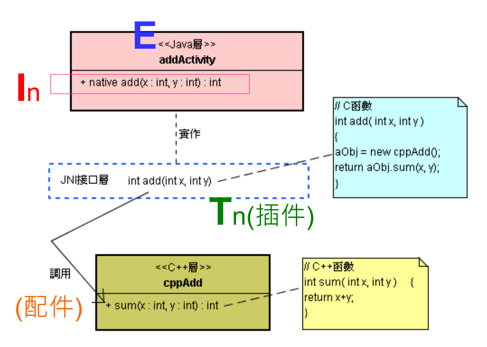
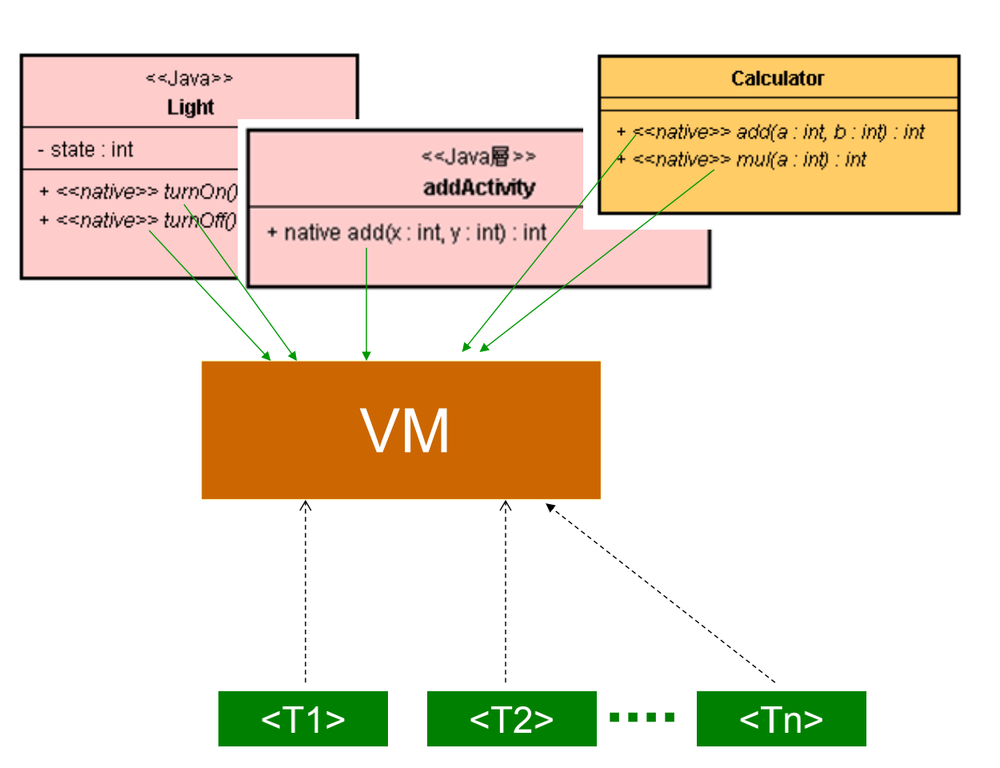

# 认识 JNI 开发与 NDK

# 1. JNI 基本概念

* 在 Androd 框架里，上层是 Java 框架，而下层是 C/C++ 框架。这两层框架之间会有密切的沟通。此时 JNI(Java Native Interface) 就扮演双方沟通的接口了。 
* 藉由 JNI 接口，可将 Java 层的基类或子类的函数实作部份挖空，而移到 JNI 层的 C 函数来实作之。


* 这个 add() 函数仍然是 Java 类的一部分，只是它是用 C 语言来实作而已。为什么要将 Java 类的 add() 函数挖空呢? 其主要的理由是：Java 代码执行速度较慢，而 C 代码执行速度快。然而 Java 代码可以跨平台，而 C 代码与本地平台设备息息相关，所以称之为本地 (Native) 代码。
* 在本地的 C 代码里，可以创建 C++ 类的对象，并调用其函数。



* 藉由 JNI 接口，就能让 Java 类与 C++ 类互相沟通起来了。这也是 Android 双层框架的重要基础机制。
* JNI 接口是 Android 的双层框架幕后的重要支柱。


* 从上述各图看来，只看到上层的 Java 函数调用中间 JNI 层的 C 函数，再往下调用 C++ 层的函数。然而，在 Android 环境里，从 C/C++ 层函数反过来调用 Java 层函数，反而是更关键性的机制。
* 所以，我们更需要关注于从 C/C++ 层调用 Java 层函数的方法和技术。

# 2. 使用 Android NDK

* 当你安装好 NDK 环境之后，就能动手利用 NDK 环境来开发本地 (Native) 的 C 程序了。

* 步骤

  * Step-1. 在 Android SDK 环境里，建立一个开发项目。

    建立一个名称为 NDK-01 的应用程序开发项目，内含 helloNDK.java 和 test.java 程序。

    ```java
    // helloNDK.java
    public class helloNDK {
    		static {
    				System.loadLibrary("helloNDK");
    		}
      	public native String sayHello();
    }
    ```

  * Step-2.进行编译，产出 helloNDK.class 档案。

  * Step-3.使用 javah 工具，产出 C 语言的 \*.h 头文件。

    创建 /jni/ 目录区，执行 javah 去读 取/bin/helloNDK.class 档案，然后产出 com_misoo_pk01_helloNDK.h 头文件

  * Step-4.依据 \*.h 头文件而撰写 \*.c 程序码。

    本地 C 开发者就能使用 C 语言，结合 JNI(Java Native Interface) 语法，撰写 com_misoo_pk01_helloNDK.c 程序码。

  * Step-5. 编译及连结本地程序

    必须先开启 Cygwin。也就是，从桌面或<开始/所有程序/Cygwin> 里，点选 < Cygwin bash shell>，进行编译和连结动作。

    就完成编译和连结任务，产出 libhelloNDK.so 本地程序库，并放置于 /libs/armeabi/ 里。

    当 C 开发端完成 libhelloNDK.so 程序库之后，就可以将 /samples/NDK-01 内容 (或是只拷贝 /libs/ 目录区内容)，拷贝回去 Android SDK 环境里。于是在 Android SDK 环境里可以看到 libhelloNDK.so 本地程序库。

  * Step-6.编执行范例程序

  * Step-7.将 \*.so 打包到 \*.apk

    接着编译项目，将 \*.so 本地程序库打包到 \*.apk里，并且执行该 \*.apk。

# 3. 如何载入 *.so 档案

## 3.1. VM 的角色

* 由于 Android 的应用层级类别都是以 Java 撰写的，这些 Java 类别转译为 Dex 型式的 Bytecode 之后，必须仰赖 Dalvik 虚拟机器 (VM: Virtual Machine) 来执行之。VM 在 Android 平台里，扮演很重要的角色。

* 此外，在执行 Java 类别的过程中，如果 Java 类别需要与 JNI 本地模块沟通时，VM 就会去加载 JNI 本地模块，然后让 Java 的函数顺利地调用到本地模块的函数。此时，VM 扮演着桥梁的角色，让 Java 与本地模块能透过标准的 JNI 接口而相互沟通。

* Java 层的类别是在 VM 上执行的，而本地模块则不是在 VM 上执行，那么 Java 程序又如何要求 VM 去加载 (Load) 所指定的 C 模块呢? 

  可使用下述指令：

  ```java
  System.loadLibrary(*.so的檔名);
  ```

* 载入 \*.so 档之后，Java类别与 \*.so 档就汇合起来，一起执行了。

## 3.2. 将 C/C++ 对象指针传回 Java


* 这个 JNI 接口定义类别含有 2 个函数：newObject() 和 execute()。 
* 其中，newObject() 函数诞生一个 Adder 对象，并且将该对象的指针传递回来给 Java 程序。
* 而 execute() 函数的 refer 参数，是用来让 Java 程序能将对象指针传进去给 execute() 函数，此时 execute() 就能藉由该指标而调用到先前 newObject() 函数所诞生的那个对象了。
* newObject() 将 c/c++ 对象指针传回 Java 层。

## 3.3. 结语

* VM 调用 < Tn > 本地函数时，将 Java 层对象指针(pointer)传给 < Tn >。
* 配上 < Tn > 之后，< Tn > 可以将 C/C++ 对象指针回传到 Java 层。 
* 由于这些 Java 和 C 代码都在同一个进程里执行，所以指针都是可以互传的。

# 4. *.so 的入口函数：JNI_OnLoad()

## 4.1. 前言

* Java 代码在 VM 上执行。
* 在执行 Java 代码的过程中，如果 Java 需要与本地代码 (\*.so) 沟通时，VM 就会把 \*.so 視为插件 < Tn > 而加载到 VM 里。
* 然后让 Java 函数呼叫到这插件 < Tn > 里的 C 函数。 
* 插件是由 VM 来管理的，实体上 VM 是 *.so 插件的管理器(Plug-in Manager)。 
* Java 与 C 函数的调用，也是透过 VM 来对接的。

### 4.1.1. 两个观点（视角）下的 EIT 造形


### 4.1.2. VM 是插件管理器的角色



### 4.1.3. EIT 造形平台化的基本思维


## 4.2. VM 的接口


* 执行 System.loadLibrary() 函数时，VM 会反向调用 \*.so 里的 JNI_OnLoad() 函数。用途有二：
  1. VM 询问此 \*.so 使用的 JNI 版本编号。
  2. VM 要求 \*.so 做一些初期设定工作 (Initialization)，例如登记 < 函数名称表 >。
* 例如，在 Android 的 /system/lib/libmedia_jni.so 档案里，就提供了 JNI_OnLoad() 函数，其程序码片段为：

```c
// #define LOG_NDEBUG 0
#define LOG_TAG "MediaPlayer-JNI"
// ………
jint JNI_OnLoad(JavaVM* vm, void* reserved) {
		JNIEnv* env = NULL;
		jint result = -1;
		if (vm->GetEnv((void**) &env, JNI_VERSION_1_4) != JNI_OK) {
				LOGE("ERROR: GetEnv failed\n"); goto bail;
		}
		assert(env != NULL);
		if (register_android_media_MediaPlayer(env) < 0) {
				LOGE("ERROR: MediaPlayer native registration failed\n");
				goto bail;
		}
		/* success -- return valid version number */
		result = JNI_VERSION_1_4;
		bail: return result;
}
// KTHXBYE
```

* 此函数回传 JNI_VERSION_1_4 值给 VM，于是 VM 知道了其所使用的 JNI 版本了。
* 此外， JNI_OnLoad() 函数也做了一些初期的动作，例如指令：

```c
if (register_android_media_MediaPlayer(env) < 0) {
		LOGE("ERROR: MediaPlayer native registration failed
\n");
		goto bail;
}
```

* 就将此 \*.so的 < 函数名称表 > 登记到 VM 里，以便能加快后续调用本地函数之效率。
* JNI_OnUnload() 函数与 JNI_OnLoad() 相对应的。
* 当 VM 释放该 C 模块时，则会调用 JNI_OnUnload() 函数来进行善后清除动作。

### 4.2.1. registerNativeMethods() 函数之用途

* Java 类别透过 VM 而调用到本地函数。
* 一般是仰赖 VM 去寻找 \*.so 里的本地函数。如果需要连续调用很多次，每次都需要寻找一遍，会多花许多时间。
* 此时，将此 \*.so 的 < 函数名称表 > 登记到 VM 里。例如，在 Android 的 /system/lib/libmedia_jni.so 档案里的程序码片段如下：

```c
// #define LOG_NDEBUG 0
#define LOG_TAG "MediaPlayer-JNI"
// ………
static JNINativeMethod gMethods[] = {
		{"setDataSource", "(Ljava/lang/String;)V",
				(void *)android_media_MediaPlayer_setDataSource},
		{"setDataSource", "(Ljava/io/FileDescriptor;JJ)V",
				(void *)android_media_MediaPlayer_setDataSourceFD},
		{"prepare", "()V", (void *)android_media_MediaPlayer_prepare},
		{"prepareAsync", "()V",
				(void *)android_media_MediaPlayer_prepareAsync},
		{“_start", "()V", (void *)android_media_MediaPlayer_start},
		{“_stop", "()V", (void *)android_media_MediaPlayer_stop},
		(省略)
};
```

```c
// ………
static int register_android_media_MediaPlayer(JNIEnv *env) {
		………
		return AndroidRuntime::registerNativeMethods(env,
				"android/media/MediaPlayer", gMethods, NELEM(gMethods));
}
// ……….
jint JNI_OnLoad(JavaVM* vm, void* reserved){
		………
		if (register_android_media_MediaPlayer(env) < 0) {
				LOGE("ERROR: MediaPlayer native registration failed\n");
				goto bail;
		}
		// ………. 
}
```

* JNI_OnLoad() 调用 register_android_media_MediaPlayer() 函数。
* 此时，就调用到 AndroidRuntime::registerNativeMethods() 函数，向 VM 登记 gMethods[] 表格。
* 登记 gMethods[] 表格的用途有二：
  1. 更有效率去找到 C 函数。
  2. 可在执行期间彈性进行抽换。
* 由于 gMethods[] 是一个 < 名称，函数指针 >对照表，在程序执行时，可多次调用 registerNativeMethods() 来更换本地函数之指针，而达到弹性抽换本地函数之目的。


