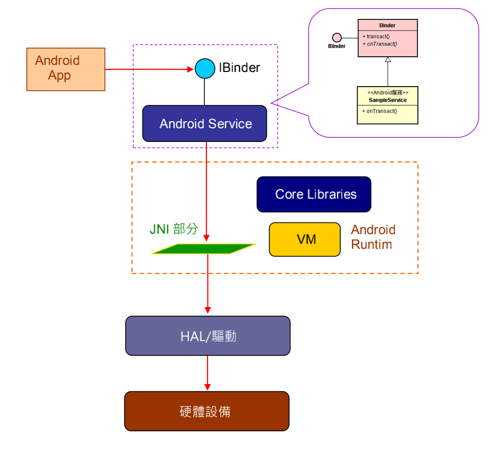
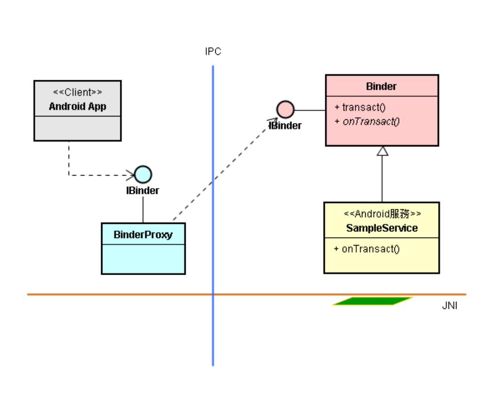
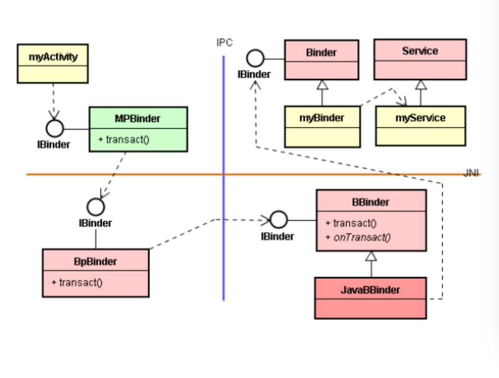
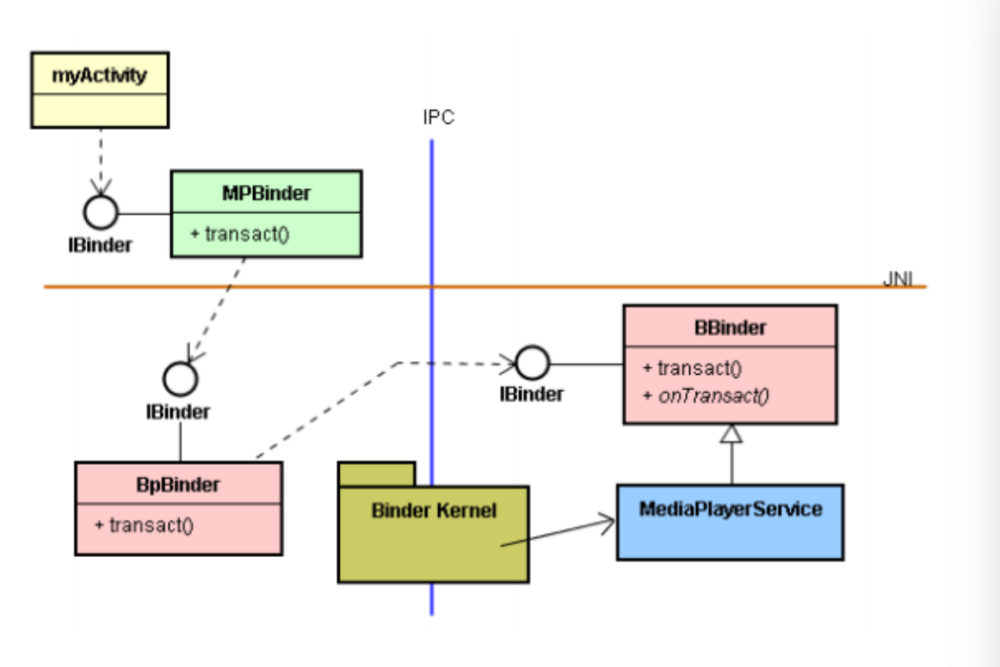
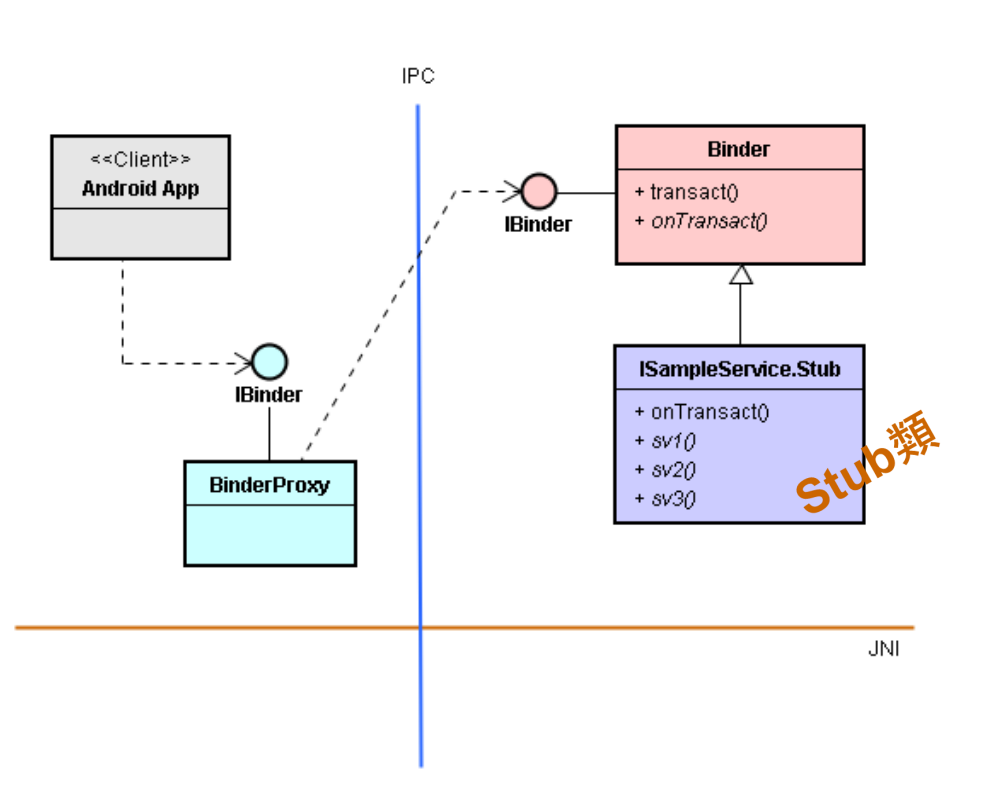
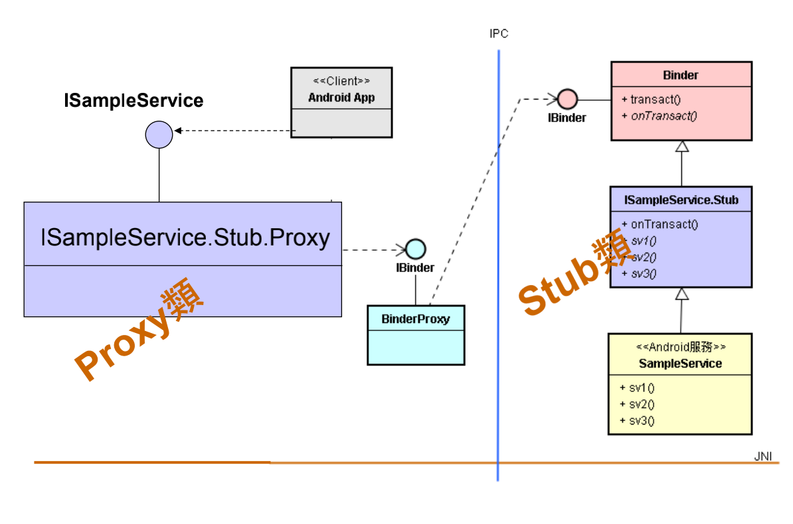

# Android Service 的 Proxy-Stub 设计模式

# 1. 复习：Android Service

## 什么是 Android Service

* 核心服务可以用 C++ 语言来撰写，就称为 Native 核心服务，简称为 Native Service， 如 MediaPlayerService、SensorService 等。
* 此外，核心服务也可以用 Java 语言来撰写，就称为 Java 核心服务，简称为 Android Service，如 AudioService, WindowManagerService 等。

## Android Service 与 App Service 结构的不同

# 2. 通用接口：IBinder

## Android Service 通用接口：IBinder

* 以 Java 撰写的 Android Service 都会提供 IBinder 接口来让其 Client 模块进行跨进程的远程调用。
* 然而，IBinder 接口只提供一个 transact() 函 数，使用起来并不好用，通常我们会使用 Proxy-Stub 设计模式来将 IBinder 接口包装起来，然后创造一个更好用、更具亲密感的接口。

## 使用 AIDL 定义服务的接口

* AIDL 架构的幕后也是采用 Proxy-Stub 设计模式来封装 IBinder 接口，以便产生更亲切贴心的新接口。
* 所以 Android 提供 aidl.exe 工具来协助产出 Proxy 和 Stub 类别，以化解这个困难。这 aidl.exe 工具就附在 Android SDK 的 /tools/ 目录区里。

# 3. 实践 Proxy-Stub 模式

* 基于 AIDL 架构，可以包装这个 IBinder 接口，来提供更好用的接口 ( 如 ISampeService )。 

* 这个 ISampleService.Stub 类别是由 Android SDK 所提供的 aidl.exe 工具所自动产生的。
* 我们只要撰写 SampleService 类别，它来继承上述的 ISampleService.Stub 类别即可。

# 4. 举例：以既有的 SensorService 为例

* 从上一节里，可以看出使用 AIDL 来 ( 生成 Stub 类 ) 包装 Android Service 的要点：

  1. 地头蛇(服务开发者)定义一个 ISampleService 接口。

  2. 使用强龙提供的 AIDL 工具去读取接口定义檔，产生一个 Stub 类和 Proxy 类；这个 Stub 类就是 ISampleService.Stub 类。

  3. 然后，撰写一个 SampleService 类来继承 

     ISampleService.Stub 基类。

