# Native 核心服务的 Proxy-Stub 设计模式

# 1. 复习：Java 层的 Proxy-Stub 设计模式

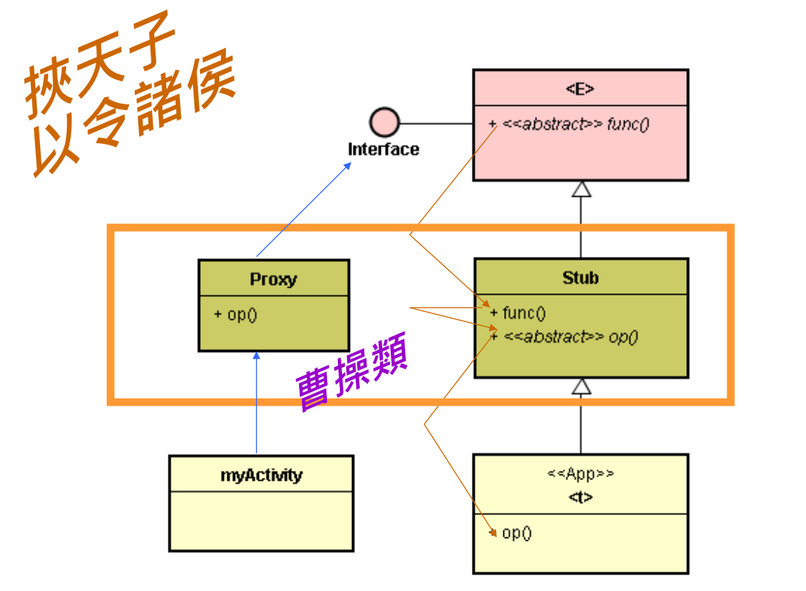

* Proxy-stub 模式：Binder 应用范例

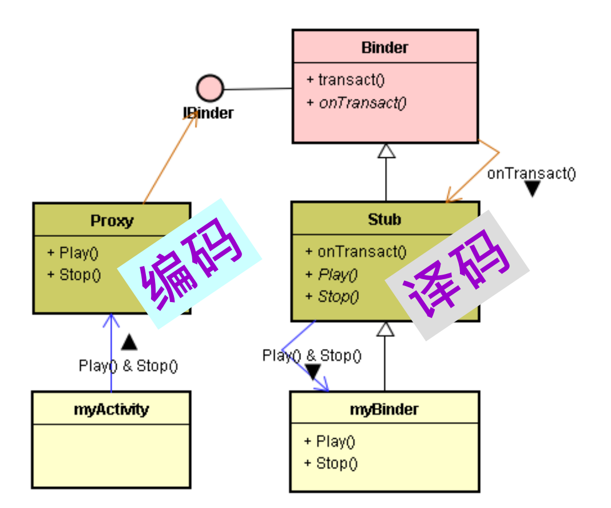

* 大大的减少了 App 开发者的负担。

# 2. 从 IBinder 接口说起

* 在 Java 层，Binder 类实现了 IBinder 接口。

  在 C++ 层，BBinder 类实现了 IBinder 接口。

* 两层都有 IBinder 接口。

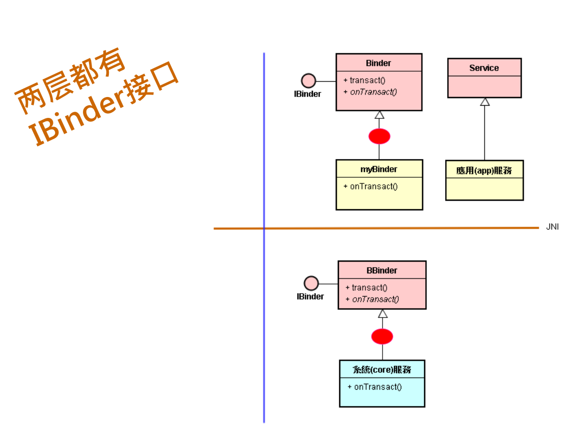

* Proxy 类在哪里呢？App Service

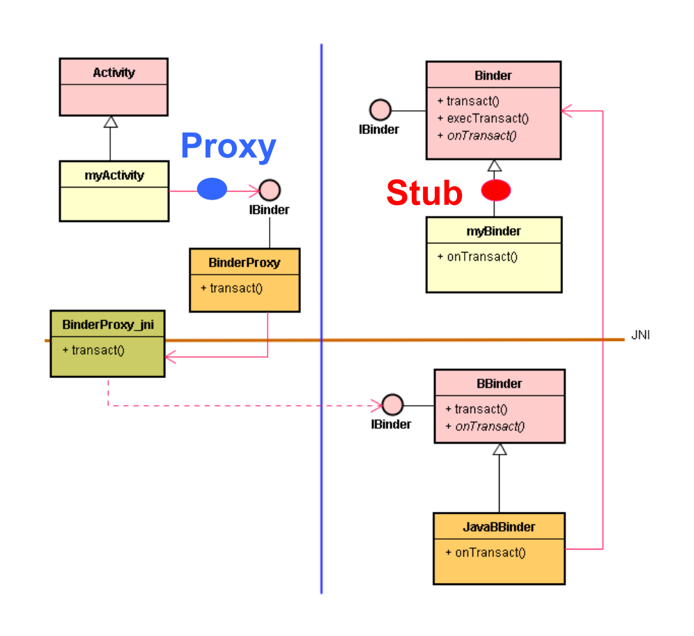

* Proxy 类在哪里呢？Native Core Service

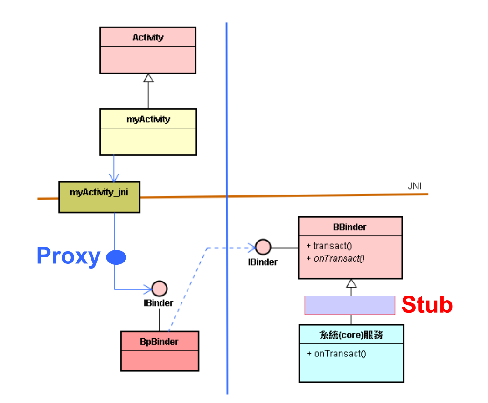

* Native Service 都有通用性 API：即 IBinder 接口。
* 在撰写 Native Service 时，因为它必须提供 IBinder 接口给远程的 Client 来调用。

* 在  Java 层使用 aidl.exe 工具来生成 Proxy Stub 类。
* 在 C/C++ 层使用模板 (Template) 来协助产生 Proxy_Stub 类。 

# 3. 使用模版，产生 Stub 类

* 如何考虑 < 人 > 的 < 分工 >

  * 由框架开发者来撰写 Proxy-Stub 类，才能减轻开发者的负担。 
  * 框架分为：< 天子框架 > 和 < 曹操框架 >。
  * 因此，应该由两者 ( 天子或曹操 ) 之一来撰写 Proxy-Stub 类。

* 接口知识取得的难题

  * 但是，有个难题：接口的内容必须等到 <买主> 来了才会知道。
  * 在框架开发阶段，买主还没来，接口的知识无法取得，又如何定义接口呢 ? 没有接口定义，又如何撰写 Stub 和 Proxy 类呢?

* 好办法是：

  * “强龙(天子或曹操)撰写代码(在先) ；然后，地头蛇(App开发者)定义接口(在后)。”

* 在编程（Programming）上，有什么技术可以实现这个办法呢？

  * 技术之一是：類別模板(class template)例如，强龙撰写模板。
  * 地头蛇利用模板来生成一个类。
  * 由于接口(interface)是一种特殊的类(class)，所以也可以定义模板。
  * 地头蛇利用模板来生成一个类。
  * Android 提供的：BnInterface < I > 和 BpInterface< I > 模版。
  * Android SDK 提供了 BnInterface < T > 类模板，此模板定义于 frameworks/base/include/binder/IInterface.h 文件中。

  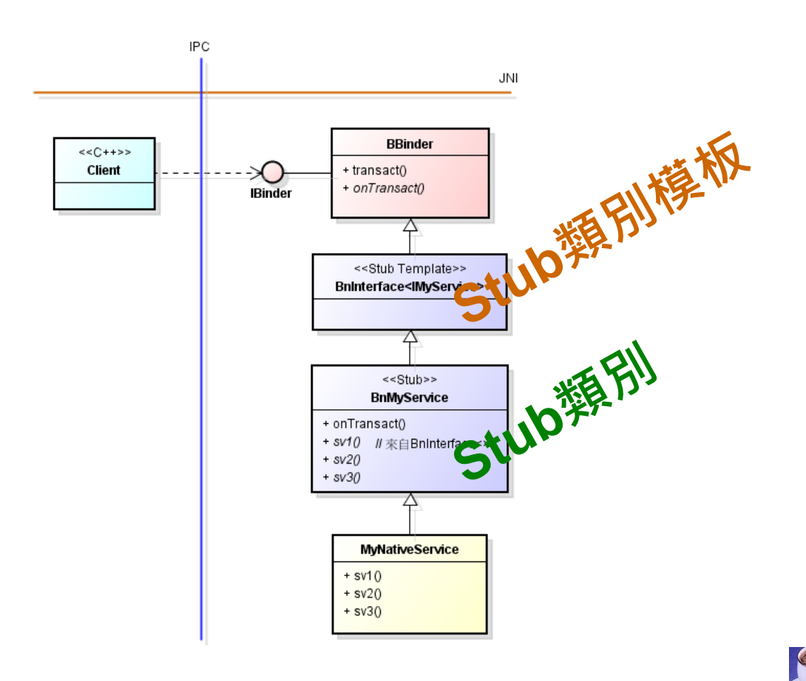

# 4. 举例：以既有的 Native Service 为例

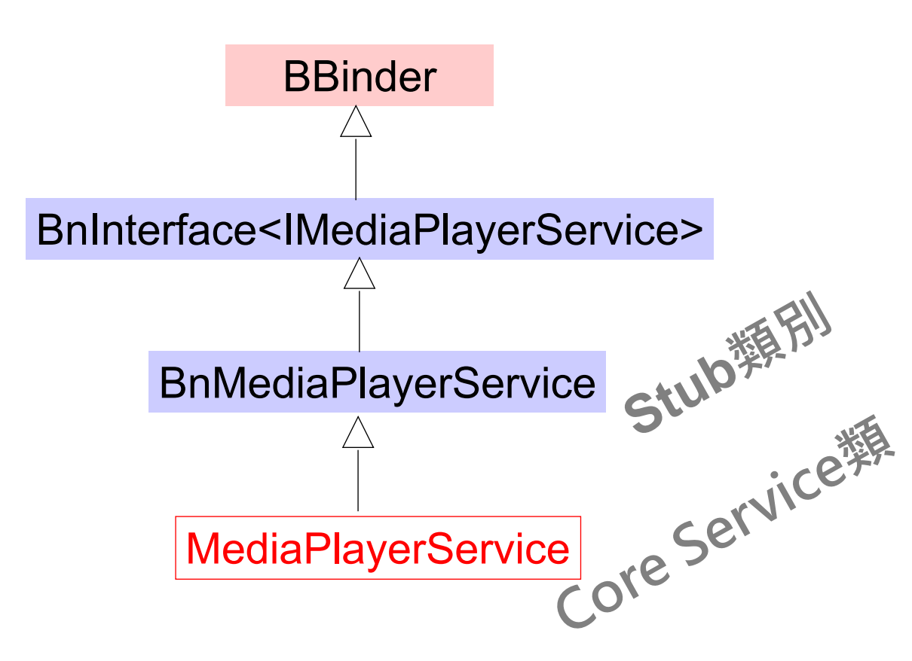

* 在 Android 的框架里，许多核心服务也都是依循这个途径的。
* 为什么这些服务不直接提供 IMediaPlayerService 接口呢? 这个问题就像家庭墙壁上，只提供标准插座(如 IBinder 接口)，不能支持特殊的插头(如 IMediaPlayerService 接口) 。
* 于是，只能要求各种电器提供商 ( 如同各领域的服务开发者 ) 自备转接器 (Adapter)。所以 BnMediaPlayerService、BnCameraService 等就是扮演转接器的角色。

# 5. 使用模版，产生 Proxy 类

* 在上节里，介绍了 BnMyService 类就是服务端 ( 进程 ) 的 Stub 类；那么，在 Client 端 ( 进程 ) 也能设计一个 Proxy 类；两者构成 Proxy-Stub 设计模式，来包装 IBinder 接口，以提供新的接口，来简化核心服务及其 Client 开发的复杂度。

* Android SDK 提供了 BpInterface \<T\> 类别模板：

  ```c++
  template<typename INTERFACE> class BpInterface : public INTERFACE, public BpRefBase 
  { 
  	public: 
  		BpInterface(const sp<IBinder>& remote); 
  	protected:
  		virtual IBinder* onAsBinder();
  };
  ```

* 此时可使用 BpInterafce\<T\> 模板来产生 BpInterafce\<IMyService\> 类别。

  如下：

  ```
  BpInterface<IMyService>
  ```

* 它继承了 IMyService 接口所定义的 sv1(), sv2() 和 sv3() 函数。

* 基于这个模板产生的类别，就可衍生出 Proxy 类别，如下：

  ```java
  class BpMyService : public BpInterface<IMyService> {
  	//……
  }
  ```

  如下图：

  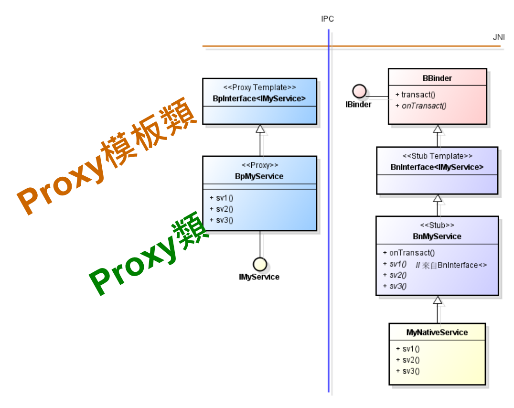

# 6. 让 Client 使用 Proxy 类的新接口

* Client 先透过 SM(ServiceManager) 核心服务去绑定 MyNativeService 的 IBinder 接口，取得接口的指针 ( 即 ibinder )。

  ```c++
  sp<IServiceManager> sm = defaultServiceManager();
  sp<IBinder> ibinder = sm->getService(String16("misoo.myNS"));
  ```

* 这要求 SM 协助绑定 MyNativeService 核心服务。 

* 绑定了，SM 就会在 Client 进程里诞生一个分身： BpBinder 对象。

* 接着，SM 就将 BpBinder 的 IBinder 接口 ( 如 ibinder 指针 )，回传给 Client 模块。

  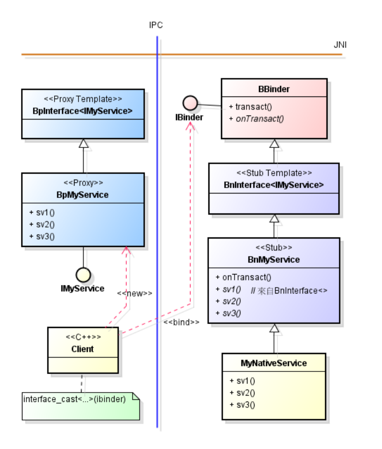

* 当 Client 取得 ibinder 之后，就使用 interface_cast\<T\>() 函数模板：

  ```java
  interface_cast<IMyService>(ibinder);
  ```

* 撰写如下的指令：

  ```java
  sp<IMyService> sService =
  interface_cast<IMyService>(ibinder);
  ```

* 这使用樣板 interface_cast\<T\> 来转换出 IMyService 新接口。

  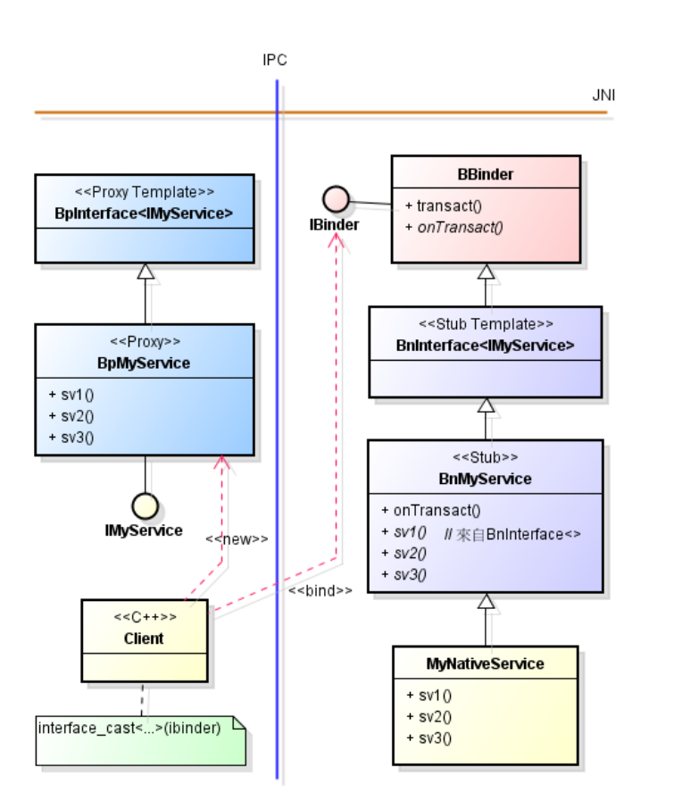

* 继续执行到指令：

  ```c++
  sService->sv1(…);
  ```

* Client 就使用了 Proxy 类提供的 IMyService 接口；并调用到 MyNativeServce 了。

  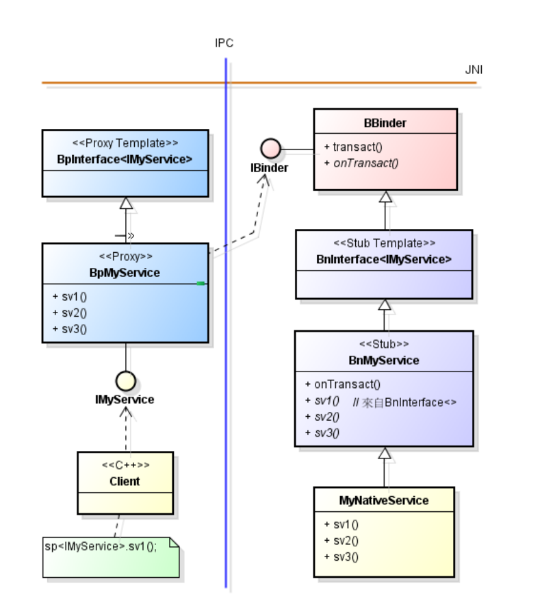

* 就 Client 模块的开发而言，此刻只需要使用新 API ( 即 IMyService 接口 ) 来呼叫所熟悉的 sv1()、sv2() 和 sv3() 函数即可，不必知道 IBinder 的存在及其写法，因而简化许多了。