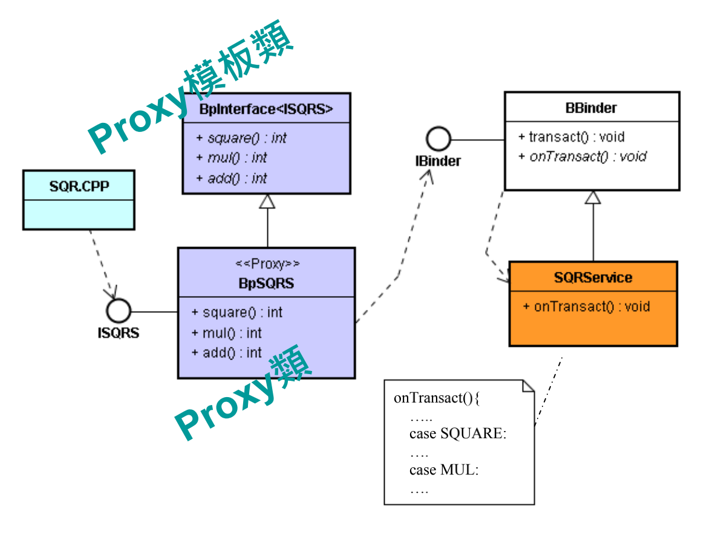
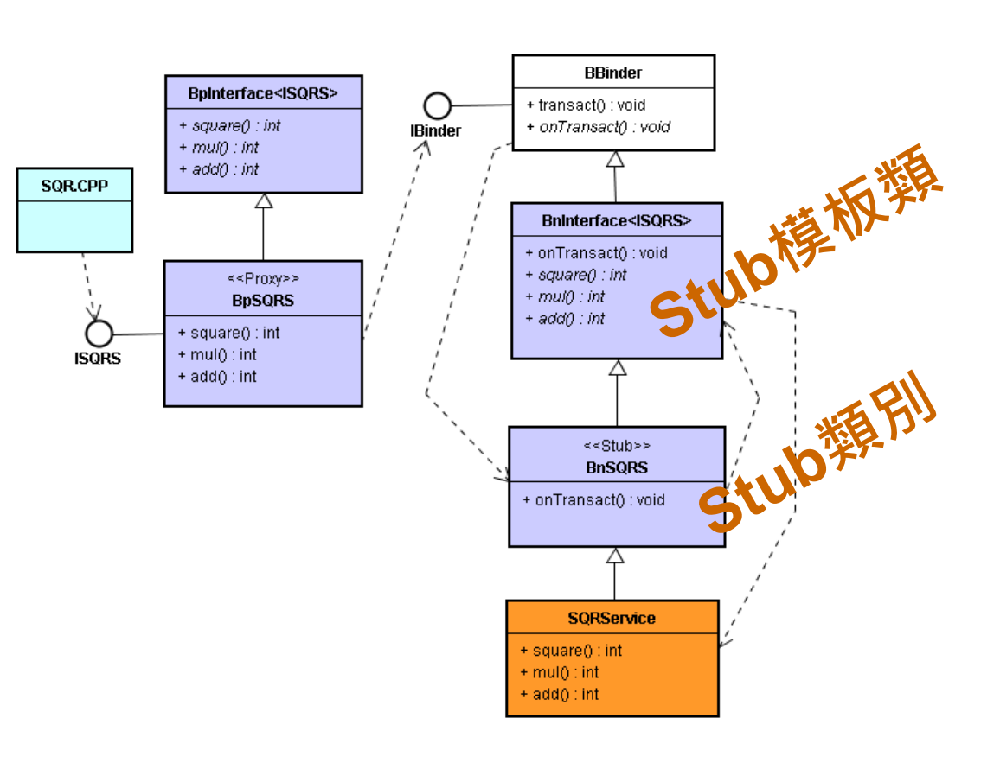
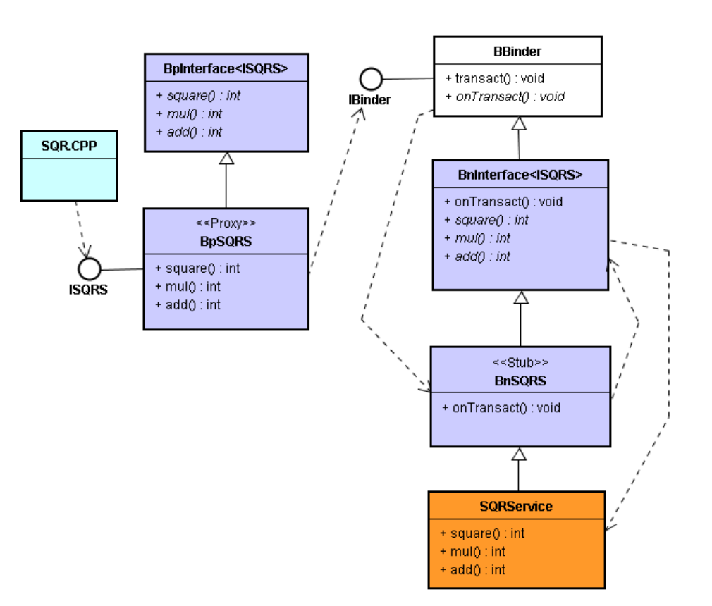
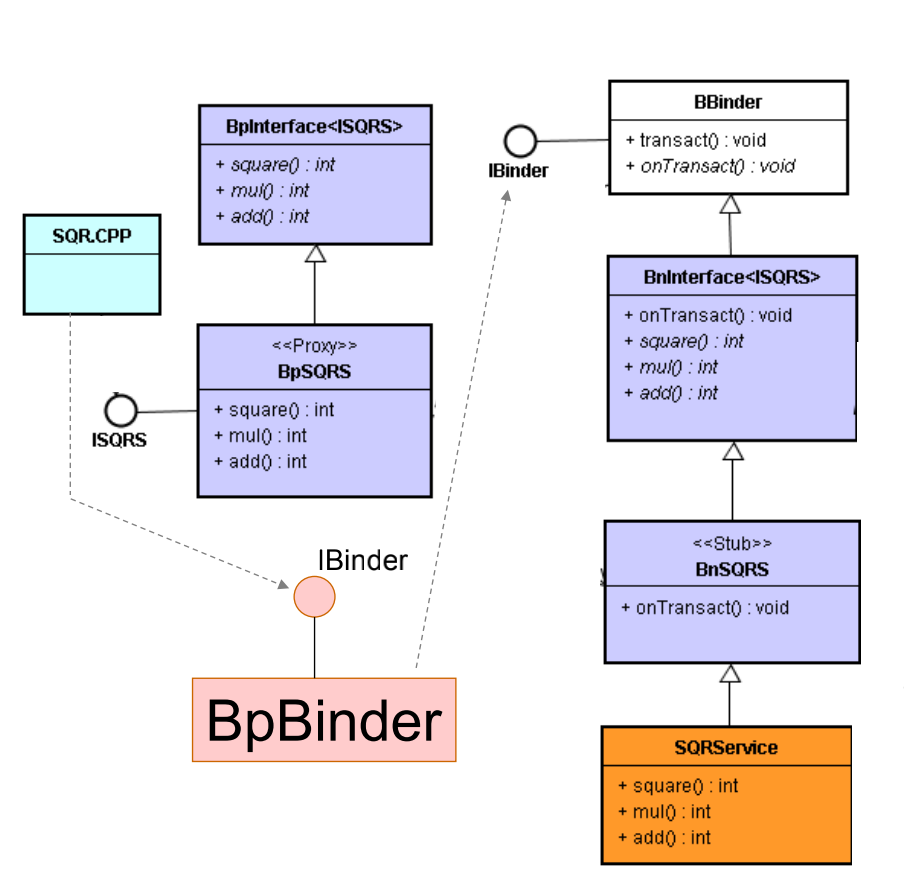
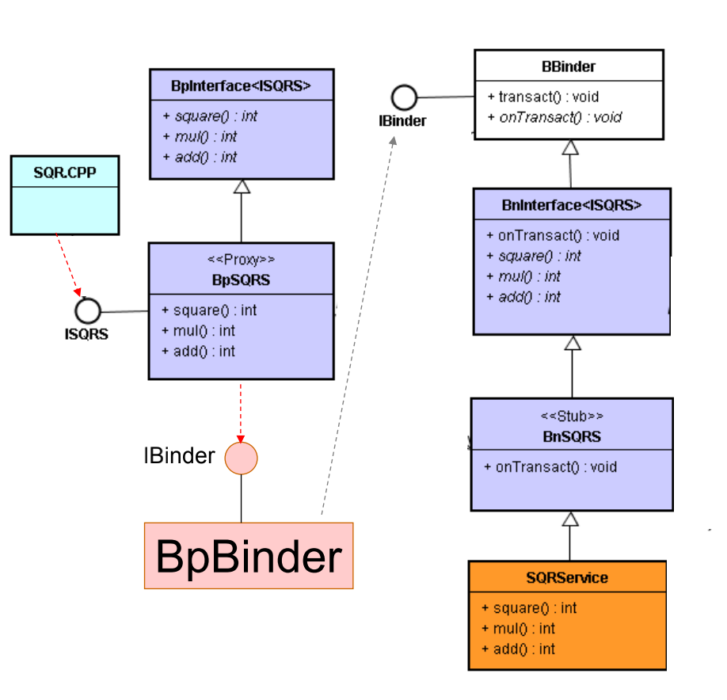
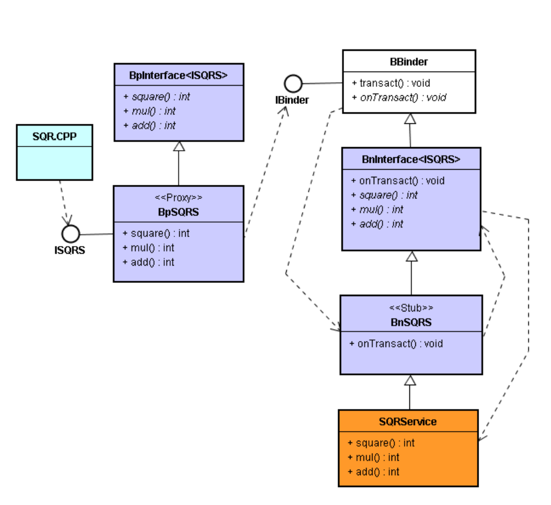

# 亲自开发 SQRService 的 Proxy-Stub 模式

# 1. SQRService 的 Proxy-Stub 架构





# 2. 撰写 Proxy 类代码



* 定义 ISQRS 接口

  ```c++
  class ISQRS: public IInterface{
  public:
  DECLARE_META_INTERFACE(SQRS);
  virtual int square(const int& n) = 0;
  };
  ```

* 定义 Proxy 类

  * 利用 ” 模板 + 接口 ”，产生 Proxy 模板类：BpInterface\<ISQRS\> 类。 

  * 并衍生出 Proxy 类：BpSQRS 类。

    ```c++
    // ISQRS.h
    #include <utils/RefBase.h>
    #include <utils/IInterface.h>
    #include <utils/Parcel.h>
    #ifndef ANDROID_MISOO_ISQRS_SERVICE_H
    #define ANDROID_MISOO_ISQRS_SERVICE_H
    namespace android {
    class ISQRS: public IInterface{
    public:
    	DECLARE_META_INTERFACE(SQRS);
    	virtual int square(const int& n) = 0;
    };
    ```

    ```c++
    //--------------------------------------------------------------
    class BpSQRS: public BpInterface<ISQRS>{
    public:
    	BpSQRS(const sp<IBinder>& impl): BpInterface<ISQRS>(impl){}
    	virtual int square(const int& n);
    };
    }; // namespace android
    #endif
    ```

  * 撰写 BpSQRS 类的实现代码

    ```c++
    // ISQRS.cpp
    #include "ISQRS.h"
    namespace android {
    enum {
    SQUARE = IBinder::FIRST_CALL_TRANSACTION,
    };
    int BpSQRS::square(const int& n) {
    Parcel data, reply;
    data.writeInt32(n);
    remote()->transact(SQUARE, data, &reply);
    int num = reply.readInt32();
    return num;
    }
    IMPLEMENT_META_INTERFACE(SQRS, "android.misoo.IAS");
    }; // namespace android
    ```

* 撰写 Client 类代码

  * 撰写一个 SQR 类来使用核心服务。此 SQR 类调用 BpSQRS 的 ISQRS 接口，再转而 SQRService 的通用性 IBinder 接口。

    ```c++
    // SQR.h
    #ifndef ANDROID_MISOO_SQR_H
    #define ANDROID_MISOO_SQR_H
    #include "../core_service/ISQRS.h"
    namespace android {
    class SQR{
    public:
    int execute(int n);
    private:
    static const sp<ISQRS>& getSQRService();
    static sp<ISQRS> sSQRService;
    };
    }; // namespace android
    #endif
    ```

    ```c++
    // SQR.cpp
    #include <utils/IServiceManager.h>
    #include <utils/IPCThreadState.h>
    #include "SQR.h"
    namespace android {
    const sp<ISQRS>& SQR::getSQRService(){
    sp<IServiceManager> sm = defaultServiceManager();
    sp<IBinder> ib = sm->getService(String16("misoo.sqr"));
    LOGE("SQR::getSQRService\n");
    sp<ISQRS> sService = interface_cast<ISQRS>(ib);
    return sService;
    }
    int SQR::execute(int n){
    int k =0;
    const sp<ISQRS>& isqrs( getSQRService() );
    if (isqrs != 0) k = isqrs->square(n);
    return k;
    }}; // namespace android
    ```

  * 此 Client 模块执行时，首先由 execute() 函数调用 getSQRService() 函数。 

  * 这要求 SM 协助绑定 SQRService 核心服务。绑定了， SM 就会在 Client 进程里诞生一个分身：BpBinder 对象。接着，SM 就将 BpBinder 的 IBinder 接口，回传给 SQR 类。

    ```c++
    sp<IBinder> ib = sm-
    >getService(String16("misoo.sqr"));
    ```

    

    ```c++
    sp<ISQRS> sService = 
    interface_cast<ISQRS>(ib);
    ```

    

  * 继续执行到指令：

    ```c++
    k = isqrs->square(n);
    ```

  * 直接使用 ISQR 接口了。

# 3. 撰写 Stub 类代码

* 利用 BnInterface\<T\> 样板来实现 ISQRS 接口。 
* 例如，让 BnSQRS 来继承 BnInterface\<ISQRS\> 父类别。如下图：



* 定义 Stub 类

  ```c++
  // ISQRSStub.h
  #ifndef ANDROID_MISOO_ISQRSStub_H
  #define ANDROID_MISOO_ISQRSStub_H
  #include <utils/RefBase.h>
  #include <utils/IInterface.h>
  #include <utils/Parcel.h>
  #include "ISQRS.h"
  namespace android {
  	class BnSQRS: public BnInterface<ISQRS>{
  		public:
  			virtual status_t onTransact( uint32_t code,
  					const Parcel& data,
  					Parcel* reply,
  					uint32_t flags = 0);
  	};
  }; 
  #endif
  ```

* 实现 Stub 类

  ```c++
  // ISQRSSTub.cpp
  #include <stdint.h>
  #include <sys/types.h>
  #include <utils/Parcel.h>
  #include "ISQRSStub.h"
  namespace android {
  	enum {
  		SQUARE = IBinder::FIRST_CALL_TRANSACTION,
  	};
  	status_t BnSQRS::onTransact(
  		uint32_t code, const Parcel& data, Parcel* reply, uint32_t flags)
  		{
  			switch(code) {
  				case SQUARE: 
  					{
  						int num = data.readInt32();
  						int k = square(num); 
  						reply->writeInt32(k);
  						return NO_ERROR;
  					}
  					break;
  				default:
  					return BBinder::onTransact(code, data, reply, flags);
  		} 
  	}
  }; // namespace android
  ```

* 撰写 Core Service 类代码

  * 有了 Stub 类别，核心服务的開发者就不必关心 onTransact() 函数了。这会让核心服务内容更加简单。此 SQRService 類別的内容就简化如下：

  * 定义 SQRService 类

    ```c++
    // SQRService.h
    #ifndef ANDROID_MISOO_SQR_SERVICE_H
    #define ANDROID_MISOO_SQR_SERVICE_H
    #include <utils.h>
    #include <utils/KeyedVector.h>
    #include <ui/SurfaceComposerClient.h>
    #include "ISQRSStub.h"
    namespace android {
    class SQRService : public BnSQRS
    {
    public:
    static int instantiate();
    virtual int square(const int& n);
    };
    }; // namespace android
    #endif
    ```

  * 撰写 SQRService 类的实现代码

    ```c++
    // SQRService.cpp
    #include <utils/IServiceManager.h>
    #include <utils/IPCThreadState.h>
    #include <utils/RefBase.h>
    #include <utils/IInterface.h>
    #include <utils/Parcel.h>
    #include "SQRService.h"
    namespace android {
    int SQRService::instantiate() {
    int r = defaultServiceManager()->addService(
    String16("guilh.add"), new SQRService());
    return r;
    }
    int SQRService::square(const int& n) {
    int k = n * n;
    return k;
    }
    }; // namespace android
    ```

  * 在 Java 层里，Android 提供 AIDL.exe 工具来协助建立 Proxy-Stub 机制。同样地，在 C++ 层里，Android 则提供 BpInterface\<T\> 和 BnInterface\<T\> 类别模板来协助建立 Proxy-Stub 机制。虽然做法不同，但其目的是一致的。

  * 以 Proxy 类「提供」比较亲切的 API，降低 Client 模块的开发负担。

  * 以 Stub 类别来协助「实践」上述 API，降低核心服务的开发负担。