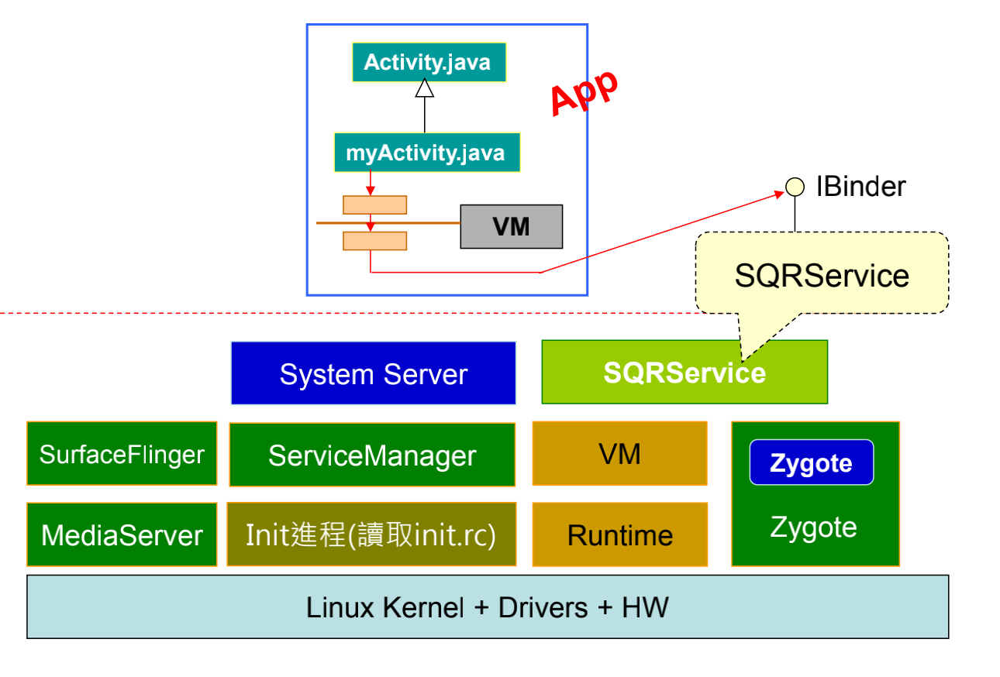
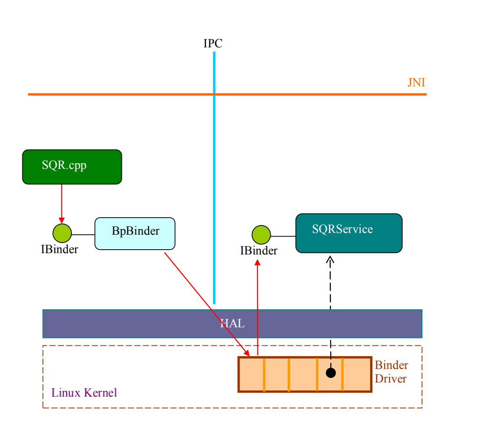
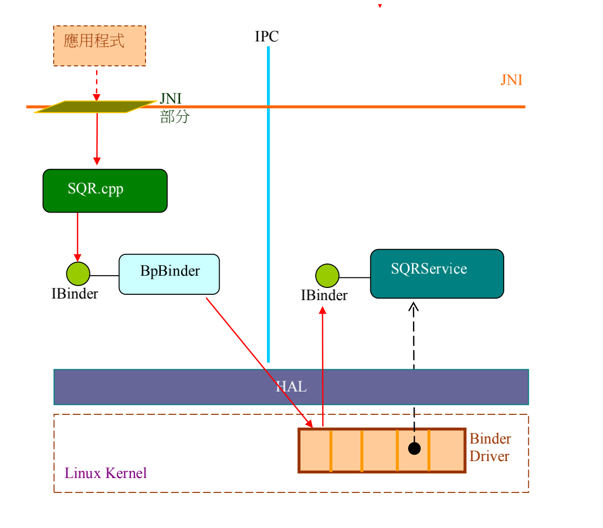
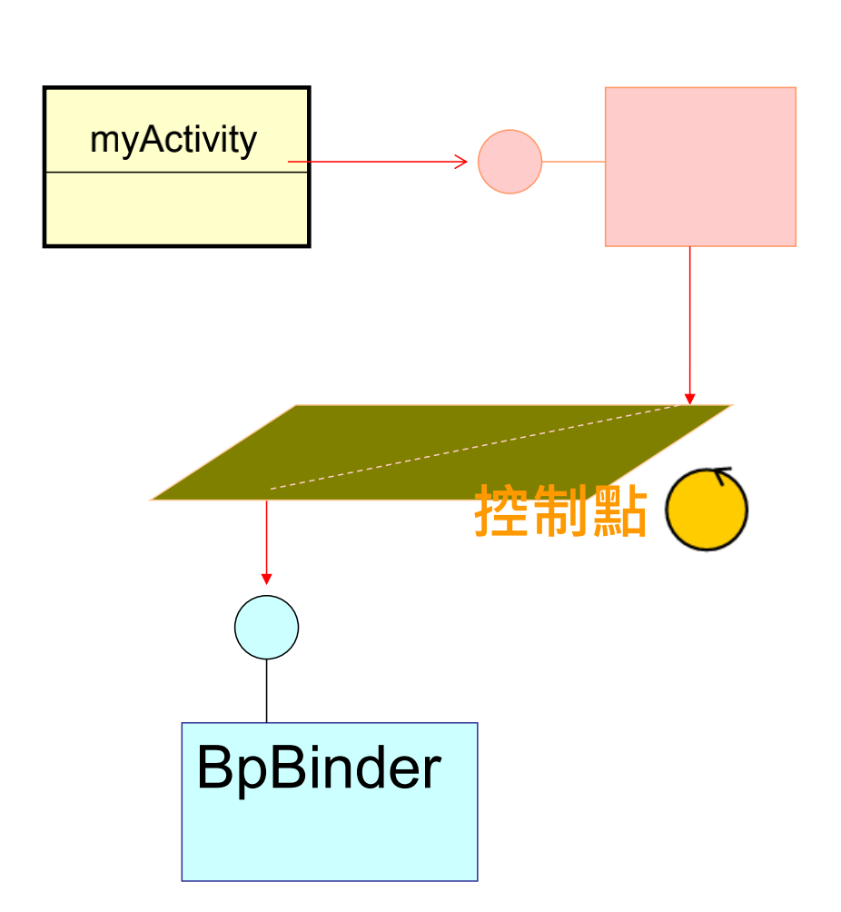
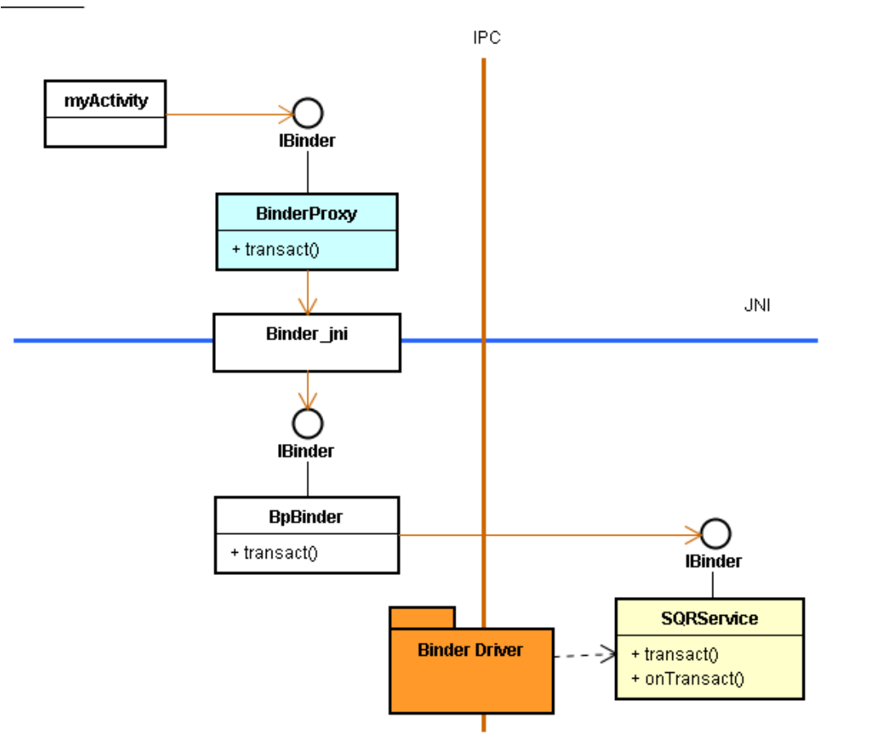

# 撰写你的第一个核心服务

# 1. 为什么要写核心服务呢？

* 为什么需要学习撰写核心服务呢? 其常见的理由是：
  1. 核心服务是 Android 框架裡最接近 Linux/Driver 的部分。为了充分发挥硬件设备的差異化特性，核心服务是让上层 Java 应用程序來使用 Driver/HW Device 特色的重要管道。
  2. 在开机过程中，就可以启动核心服务 ( 例如汉字输入法服务等 )，让众多应用程序來共享之。
  3. 由于共享，所以能有效降低 Java 应用程序的大小(Size)。

# 2. 亲自开发一个 Native Service：SQRService

* 此核心服务命名为 SQRService，它做简单的整數平方 (Square) 运算。其开发要点为：

  1. 核心服务通常在特定的进程 (Process) 裡执行。
  2. 必须提供 IBinder 接口，让应用程序可以进行跨进程的绑定 (Binding) 和调用。
  3. 因为共享，所以必须确保多线裎安全 (Thread-safe)。
  4. 以 C++ 類定义，诞生其对象，透过 SM 之协助，将该对象參考值传给 IServiceManager::addService() 函數，就加入到 Binder Driver 裡了。
  5. 应用程序可透过 SM 之协助而远距绑定该核心服务，此时 SM 会回传 IBinder 接口给应用程序。
  6. 应用程序可透过 IBinder::transact() 函數來与核心服务互传资料。

* 在 Java 层，Binder 类实现了 IBinder 接口。

  在 C++ 层，BBinder 类实现 IBinder 接口。

# 3. 撰写 SQR.CPP 来使用 SQRService

# 4. 撰写 Java 层 Client 来使用核心服务

* Java 层的应用程序可以透过 JNI Native Code 来调用上图里的 SQR 类别，进而取得 SQRService 的服务。

# 5. 撰写一个 Java 层 Activity

* 这不是好的架构设计。
* 此时，C/C++ 层都是被动的、被调用的，这是古典的架构思维，其控制点在 App 上。 
* 新潮架构设计思维：如何将控制点下移到 C/C++层呢? 例如，下移到 JNI 本地层。

* C 层拥有控制点的必备表现是：
  1. 从 C 创建 Java 对象
  2. 从 C 调用 Java 层函数
* 如果 myActivity 想使用 SQRService 服务，该如何规划呢?
  * 方案一：最简单的途径是：让 myActivity 透过 sqr01.java，再经由 JNI 本地函数去调用到 SQRService 的 onTranscat() 函数。
  * 方案二：善用 BinderProxy 对象
    * 由 myActivity 透过 JNI Native 函数去绑定核心服务。 
    * 然后，在 Java 层诞生一个 BpBinder 对象的分身：即 BinderProxy 对象。

# 6. 优化设计

