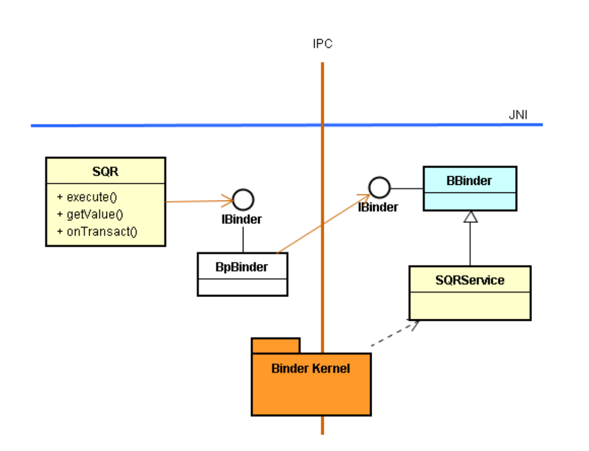
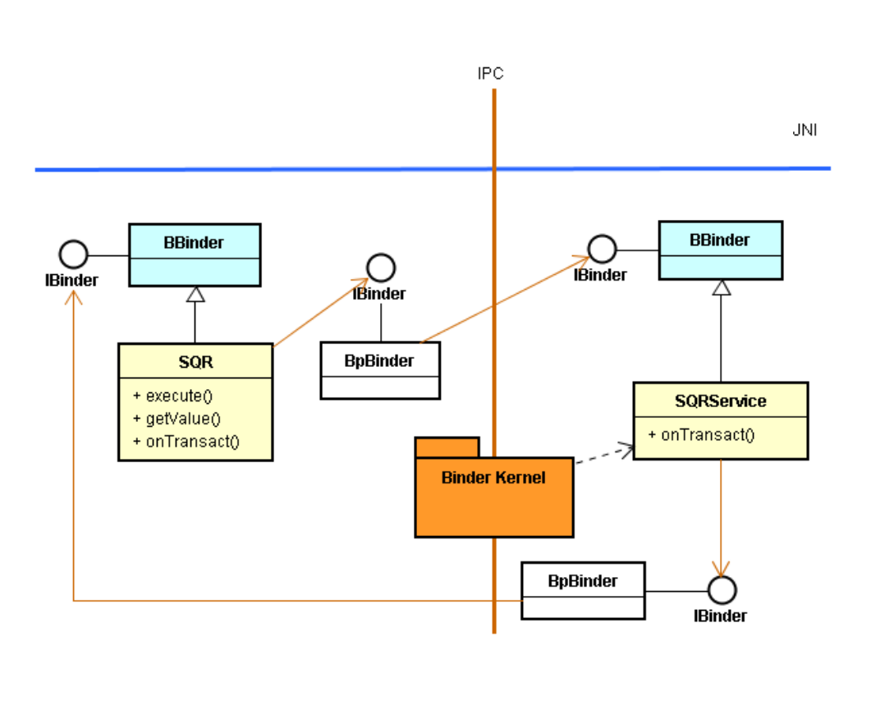
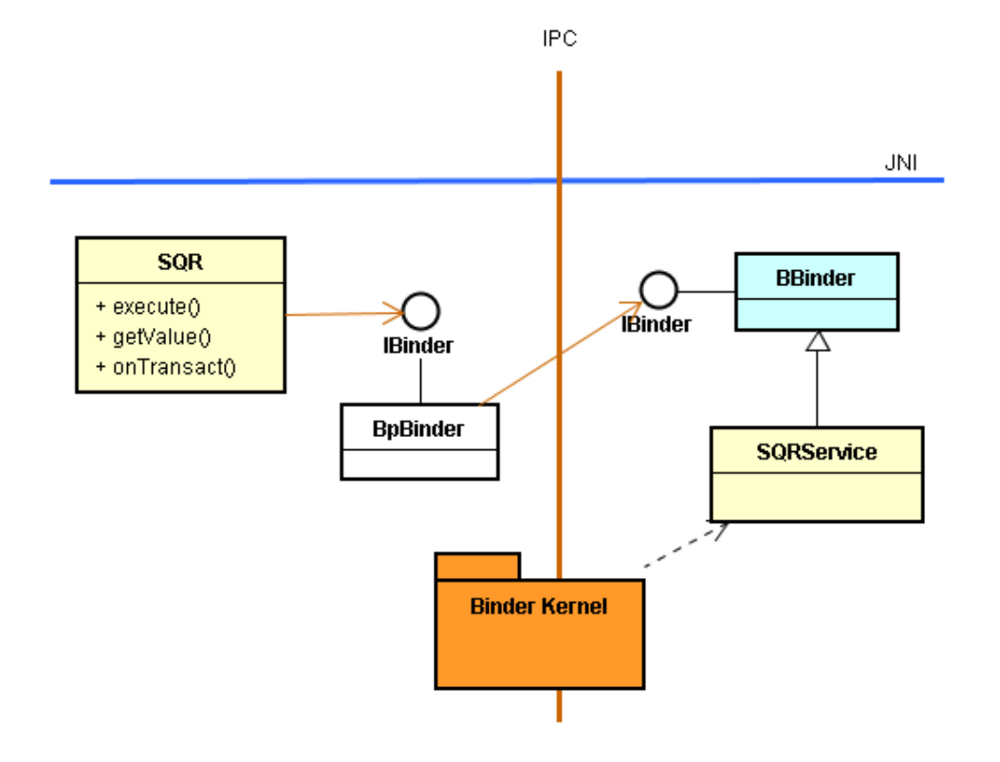
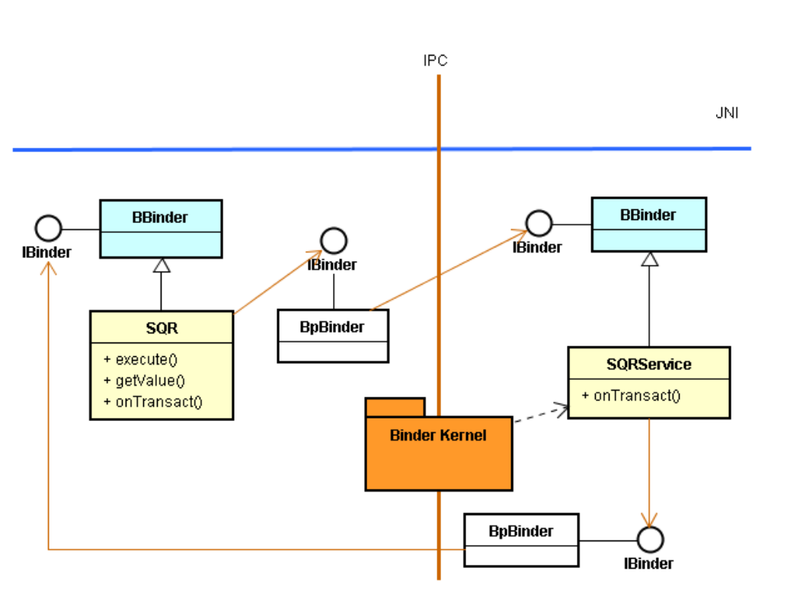
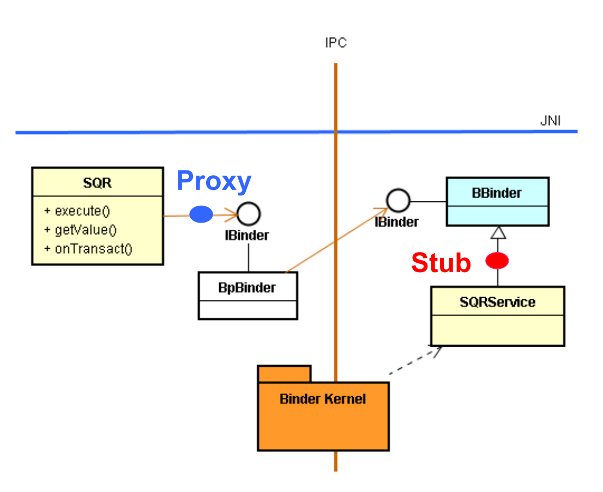
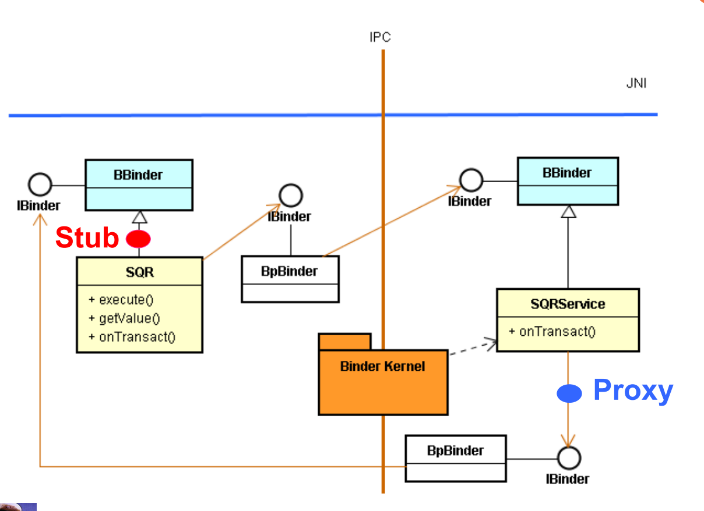

# 核心服务 Callback 的 IBinder 接口设计

# 1. 正向调用核心服务



* 这是典型的正向调用途径。然而，在实务上，也经常需要从核心服务回调 (Callback) 到 Client 模块。

# 2. 核心服务的远程回调（Callback）

* 由于 Client 模块是在另一个进程里，SQRService 是进行 IPC 回调到 Client 模块，此时也必须透过 IBinder 接口才行。于是，可以推论得知：
  1. Client 模块必须提供 IBinder 接口。
  2. 实现方法就是：让 Client 模块继承 BBinder 基类。



# 3. Native Service 范例代码实现

```c++
// SQRService.cpp
#include "SQRService.h"
#include <utils/IServiceManager.h>
#include <utils/IPCThreadState.h>
namespace android {
	int SQRService::instantiate(){
		LOGE("SQRService instantiate");
		int r = defaultServiceManager()->addService(String16("misoo.sqr"),new SQRService());
		LOGE("SQRService r = %d\n", r);
		return r;
	}
  
	status_t SQRService::onTransact(uint32_t code, const Parcel& data,Parcel* reply, uint32_t flags){
		switch(code) {
			case 0: {
				int x = data.readInt32();
				callback_ib = data.readStrongBinder();
				int k = x * x;
				Parcel data1, reply1;
				data1.writeInt32(k);
				callback_ib->transact(0, data1, &reply1);
				LOGE("SQRService::onTransact. %d\n", x);
				return NO_ERROR;
				}
				break;
			default:
				return BBinder::onTransact(code, data, reply, flags);
		}
  }
}; //namespace
```

* 其中的指令：

  ```c++
  callback_ib->transact(0, data1, &reply1);
  ```

  就是远距回调到 Client。

# 4. Client 模块范例代码实现

* 撰写 Client 模块：即 SQR 类别。

  ```c++
  // SQR.h
  #ifndef ANDROID_MISOO_SQR_H
  #define ANDROID_MISOO_SQR_H
  namespace android {
  class SQR : public BBinder
  {
  sp<IBinder> m_ib;
  int value;
  const void getAddService();
  public:
  SQR();
  void execute(int n);
  int getValue();
  virtual status_t onTransact(uint32_t, const Parcel&, Parcel*, 
  uint32_t);
  };
  }; //namespace
  #endif
  ```

  ```c++
  // SQR.cpp
  #include <utils/IServiceManager.h>
  #include <utils/IPCThreadState.h>
  #include "SQR.h"
  namespace android {
  SQR::SQR()
  { getSQRService(); }
  const void SQR::getSQRService(){
  sp<IServiceManager> sm = defaultServiceManager();
  m_ib = sm->getService(String16("misoo.sqr"));
  LOGE("SQR.getSQRService %p\n", sm.get());
  if (m_ib == 0)
  LOGW("SQRService not published, waiting...");
  return;
  }
  void SQR::execute(int n) {
  Parcel data, reply;
  data.writeInt32(n);
  data.writeStrongBinder( this );
  LOGE("SQR::execute\n");
  m_ib->transact(0, data, &reply);
  return;
  }
  int SQR::getValue() {
  return value;
  }
  status_t SQR::onTransact(uint32_t code, const Parcel& data,
  Parcel* reply, uint32_t flags){
  switch(code) {
  case 0: {
  value = data.readInt32();
  // LOGE("SQRService::onTransact. %d\n", x);
  return NO_ERROR;
  }
  break;
  default:
  return BBinder::onTransact(code, data, reply, flags);
  }}
  }; //namespace
  ```

* 其中，大家比较好奇的是，核心服务如何去绑定 Client 模块的 IBinder 接口呢? 

* 事实上，也很简单，答案是：由于正向调用发生在先，而回调时间在后；所以在正向调用时，将 Client 模块的 IBinder 接口，当作参数传递给核心服务就行了。

* 于是，上述代码的执行情境，兹说明如下：

  * 首先，要求 SM(Service Manager) 协助绑定SQRService 核心服务，如下代码：

    ```c++
    const void SQR::getSQRService()
    {
    sp<IServiceManager> sm = defaultServiceManager();
    m_ib = sm->getService(String16("misoo.sqr"));
    …….
    }
    ```

  * 然后，进行正向调用，其程序代码为：

    ```c++
    void SQR::execute(int n) {
    Parcel data, reply;
    data.writeInt32(n);
    data.writeStrongBinder(this);
    m_ib->transact(0, data, &reply);
    return;
    }
    ```

  * 這先执行指令：

    ```c++
    Parcel data, reply;
    data.writeInt32(n);
    data.writeStrongBinder(this);
    ```

  * 这准备好参数，并将 SQR 自己的 IBinder 接口存入参数变量里。

  * 接着执行正向调用指令：

    ```c++
    m_ib->transact()
    ```

    就将 SQR 的 IBinder 接口传递给了 SQRService 了。

  * 此时，就开始执行了 SQRService 的 onTransact() 函数了。

  * 也就是指令：

    ```c++
    status_t SQRService::onTransact(uint32_t code, const 
    Parcel& data, Parcel* reply, uint32_t flags)
    {
    switch(code) {
    case 0: {
    int x = data.readInt32();
    callback_ib = data.readStrongBinder();
    // ……..
    callback_ib->transact(0, data1, &reply1);
    // ……..
    } }
    ```

  * 就從參數裡取出 IBinder 接口，绑定了 SQR 的 IBinder 接口。

  * 然后，就执行 callback_ib->transact() 指令，顺利回调到 SQR 类别了。

  * 此时，就开始执行了 SQR 类别的 onTransact() 函数了。

# 5. Summary

## 同步

* 在前面的范例里，都采正向远距调用途径，其核心服务可以及时将参数值回传给 Client 模块，这是大家所熟悉的「同步」数据回传。

```c++
void SQR::execute(int n) {
Parcel data, reply;
data.writeInt32(n);
data.writeStrongBinder( this );
LOGE("SQR::execute\n");
m_ib->transact(0, data, &reply);
return;
}
```



## 异步

* 在本范例里的核心服务则是在上述同步回传之后，必要时(或突发状况下)才由核心服务主动回调，来将数据回传给 Client 模块，这是通称的「异步」数据回传。



### 设置回调（Callback）接口

* 在此范例里，其回调机制仅使用到 IBinder 接口。我们也可以藉由 BpInterface\<T\> 和 BnInterface\<T\> 模板产生 Proxy 和 Stub 类，来将上述回调机制的 IBinder 接口包装起来，以便提供好用的接口。



