# 认识 Android 核心服务

# 1. 区分核心服务与 App 服务

* 在 Android 平台，上层 App 的 SDK-based Service 与底层的核心服务有很大的区别，只是许多人都将它们混在一起了。

* 于此，兹说明 Android 里有 2 种服务：

  1. 应用层的应用服务，通称为 SDK-based Service (或称为  App 服务)。

  2. 系统层的核心服务，通称为 Core Service( 或称为 System Service)。

* 至于 App 服务 ( 即 SDK-based Service ) 则属于 App 的一部份，是开机完成后，用户加载并开启某 App 时，才会启动该 App 里的服务。这种 App 服务的特征是，它会定义成为 Service 的一个子类别。

* 在 Android 开机过程中，就会启动数十个核心服务。当开机完成时，全部核心服务也都启动完成了。

* 接着，才能启动 App，并执行之。所以，核心服务的启动时间早于 App 的启动时间。

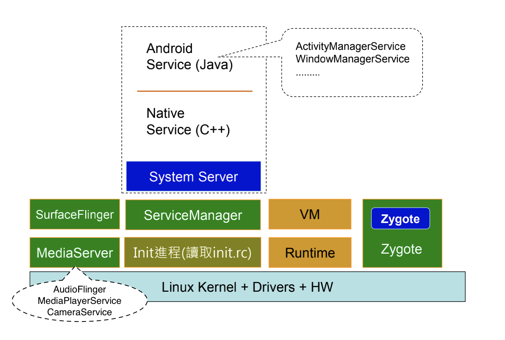

* AMS(ActivityManagerService) 启动一个 App 的时候，就会通过 Socket 请求 Zygote 来 fork 一个进程给这个即将要启动的 App。

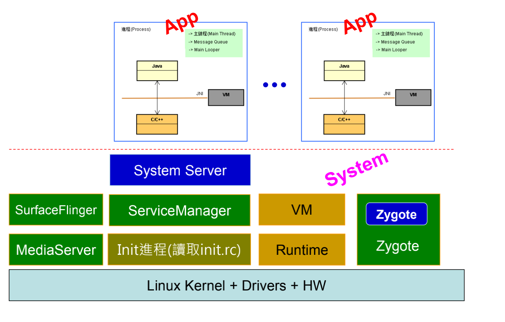


# 2. 回忆 App 服务

* 核心服务是系统层的「前装型」服务
  * 一般以 C++ 类别实现，有些以 Java 类别实现。
  * 可透过 ServiceManager 来建立和绑定 (Bind) 核心服务。
  * 绑定后，可透过 IBinder 接口去执行其函数。
* App 服务是应用层的「后装型」服务
  * 以 Java 层的 Service 的应用子类别实现。所有的 App 服务都是由 ActivityManagerService 核心服务所掌管。
  * 在应用层 ( 如 Activity ) 可调用 Android 框架里 Context 类别的 startService() 和 bindService() 函数去绑定 App 服务。
  * 绑定后，可透过 IBinder 接口去执行其函数。

# 3. 区分两种核心服务：Android Service 与 Native Service

* 核心服务可以用 Java 撰写；也可以用 C++ 撰写。
* 以 Java 撰写的核心服务通称为 **Android Service ** (例如AudioService 和 SensorService 等)；
* 以 C++ 撰写的核心服务则通称为 **Native Service** (例如 MediaPlayerService 和 CameraService 等)。

## 3.1. Android Service

* Android Service 又称为 Java Service，是实现于应用框架层 (Framework) 里的。
* 这里所讲的 Service 是系统服务 (System Service)，又称为Server；其与 App 开发上所讨论的 Service 不同。
* Android Service 以 Java 撰写。

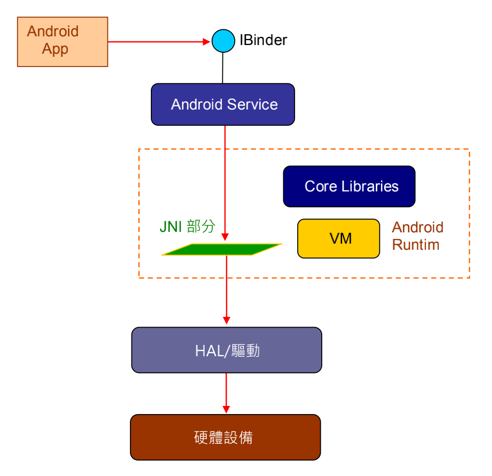

## 3.2. Native Service

* Native Service 则是实现于 System 层里的 Server。在系统服务开发上，我们有二个途径，一个是写成 Android Service、其再透过 JNI 与 HAL 驱动沟通；另一个途径是，跳过 Android Service，让 App 透过 JNI 直接与 Native Service 沟通。

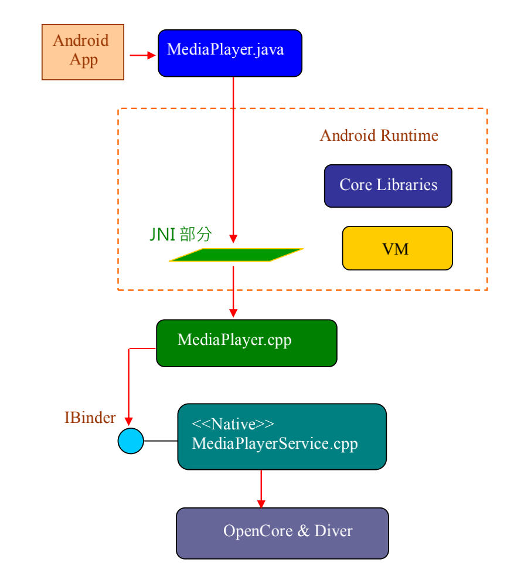


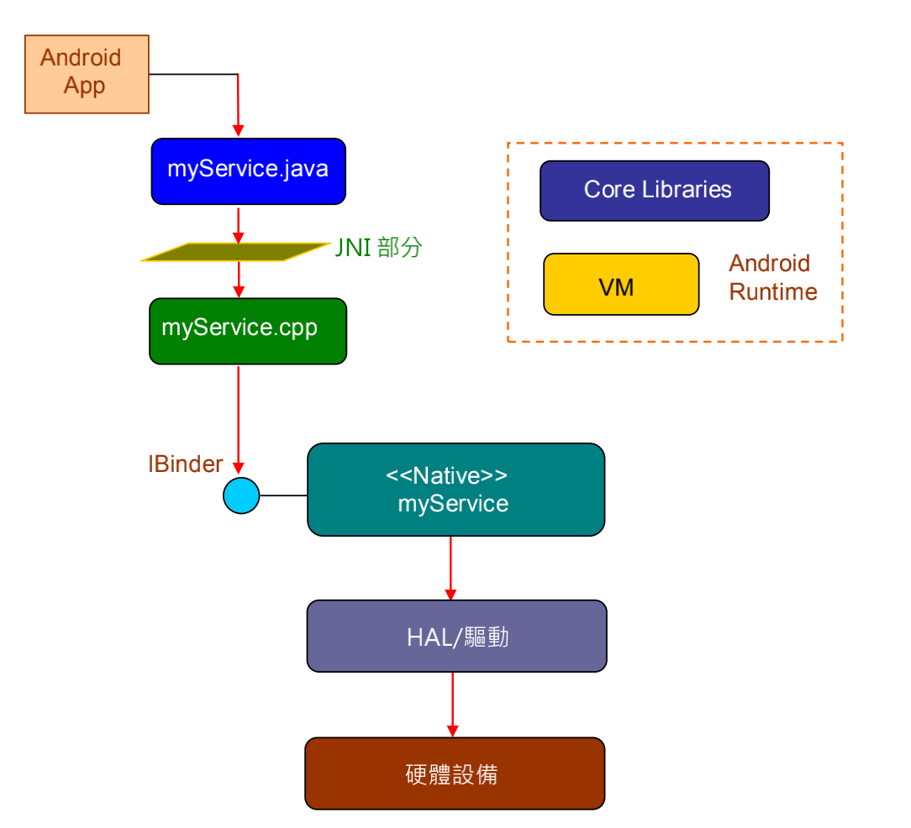

# 4. 核心服务的特性

* 其中，核心服务属于 Android 平台的系统服务模块，在开机过程，就会启动数十个核心服务；例如MediaPlayerService、AudioService、SensorService 等。
* 关于核心服务的启动，就是在开机时，加载 Linux kernel 部分，进行 Kernel-Space 的初始化，然后加载硬件驱动程序，就启动了 Linux 系统。随后切换至 User-Space，创建 init 进程，读取 init.rc 文档，依据其内容的指示而先启动 Native Service，再启动 Android Service。就完成核心服务的启程序了。
* 由 Linux 内核启动用户空间的 Init 进程
  * 解析脚本文件：Init.rc
  * Init.rc 是 Android 的初始化脚本
* 由 Init 进程创建 ServiceManager 和 Zygote 进程。
* 由 Zygote 创建 (VM 和) SystemServer 进程。

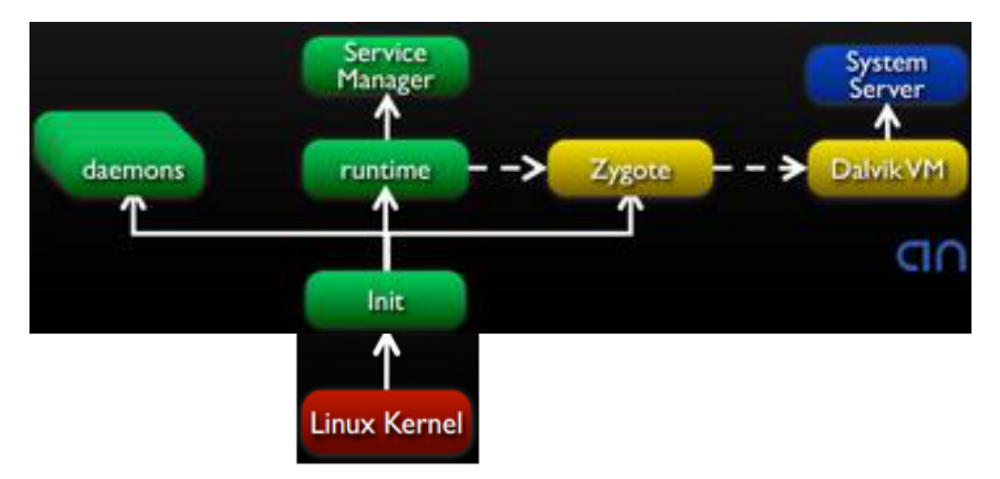

## 4.1. 核心服务的特性

* 核心服务通常在特定的进程里执行。
* 必须提供 IBinder 接口，让 App 进行跨进程的绑定 (Bind) 和呼叫。
* 因为共享，所以必须确保多线裎安全 (Thread-safe)。
* 以 C++ 类别或 Java 类别定义，诞生其对象，请ServiceManager (简称 SM) 将该对象参考值加入到 Binder Driver 里。
* App 可请 SM 协助而远距绑定某核心服务，此时 SM 会传 IBinder 接口给 App。 
* App 可透过 IBinder::transact() 函数来与核心服务互传讯息。
* 核心服务启动在先，应用程序启动在后。
* 核心服务能以 C++ 撰写；也可以用 Java 撰 写(如 AudioService )。 
* 核心服务与 App 服务不同，App 服务不会加入到 Binder Driver 里。

# 5. 简介几个 Android Service

* 在 Android Service 里，常见的有如 ActivityManager、LocationManager 等。兹针对其中的几个常见服务介绍如下：

  * ActivityManager (活动管理器)

    提供所有的应用程序的生命周期，以及 Activity 之间的互动之服务。

  * WindowManager (窗口管理器)

    提供由关频幕窗口之管理服务。

  * ResourceManager (资源管理器)

    管理程序使用的各项资源，例如：字符串、图片、UI 布局 (Layout) 定义档。

  * LocationManager (位置管理器)

    提供位置服务 (Location-based Service)。

  * TelephonyManager (电话管理器)

    提供有关手机通话的服务，例如关闭电话等。

  * 其它服务

# 6. 简介几个 Native Service

* Native Service 是以 C++ 语言所撰写的核心服务。

* 在 Native Service 里，大家比较熟悉得有如ServiceManager、MediaPlayerService、Zygote、CameraService 等等。

* 兹针对其中的几个常见服务介绍如下：

  * ServiceManager (服务管理器)

    协助登录与绑定系统服务。

    * ServiceManager 是 Android 平台里的一个基本模块。在 Android 系统启动过程中，它就会被登录到 Binder Kernel 里，成为天字第一号的可提供远距服务之模块。

    * 使用 C/C++ 撰写 Android 的 NativeService 模块时，可以透过 defaultServiceManager() 函数来取得 ServiceManager 模块的 IServiceManager 接口之指针。例如，在 CameraService.cpp 程序里的 instantiate() 函数，其内容如下：

      ```c++
      // CameraService.cpp
      void CameraService::instantiate() {
      	defaultServiceManager()->addService(
          String16("media.camera"), new CameraService());
      }
      ```

    * 它使用了 defaultServiceManager() 函数来取得 ServiceManager 模块，然后呼叫其 IServiceManager 接口里的 addService() 函数来将自己对象 ( 即 CameraService 类别之对象 ) 传给 ServiceManager 模块，请它登录到 Binder Kernel里，成为一个可提供远距服务之模块(即 CameraService 模块)。

  * Zygote 服务

    Android 最内层有个 Zygote 服务。它是 Android Java 层的孵化器。Zygote 就在幕后复制孵化(Fork)出一个子进程来给这些 Java 层的系统服务或应用程序。所以， Android 的应用程序，以及上述的各项服务，也都是由 zygote 所繁殖出来的。

    Zygote服务的架构位置如下图：

    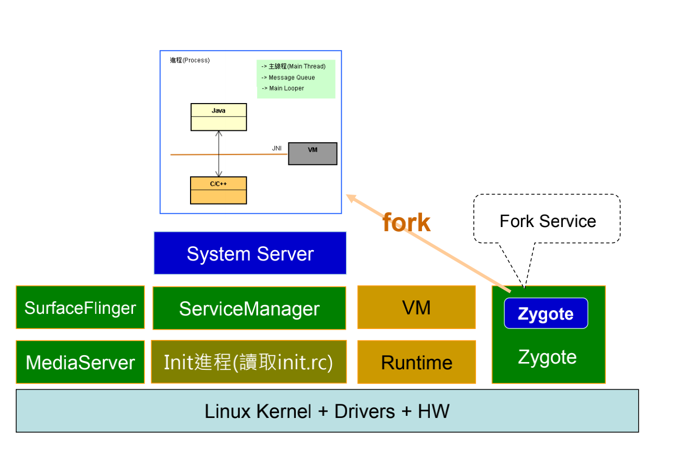

  * CameraService (摄像服务)

    其实作于 libcameraservice.so 共享库里，与底层 Camera 硬件的 HAL 驱动程序衔接，藉由 Linux 的  videodev 接口来撷取视讯。

  * 其它服务

# 7. 天字第一号的核心服务：ServiceManager

* 天字第一号的核心服务就是 ServiceManager ( 简称 SM)。当 Android 系统启动时，就会优先将之登记到 Binder Driver 里。
* 随后，陆续会有更多的核心服务呼叫 SM 的 addService() 函数去登录到 BD 里。例如，ActivityManagerService 也是透过 SM 而登录到 BD 里。再如，MediaPlayerService 也继续透过 SM 去登录到 BD 里。

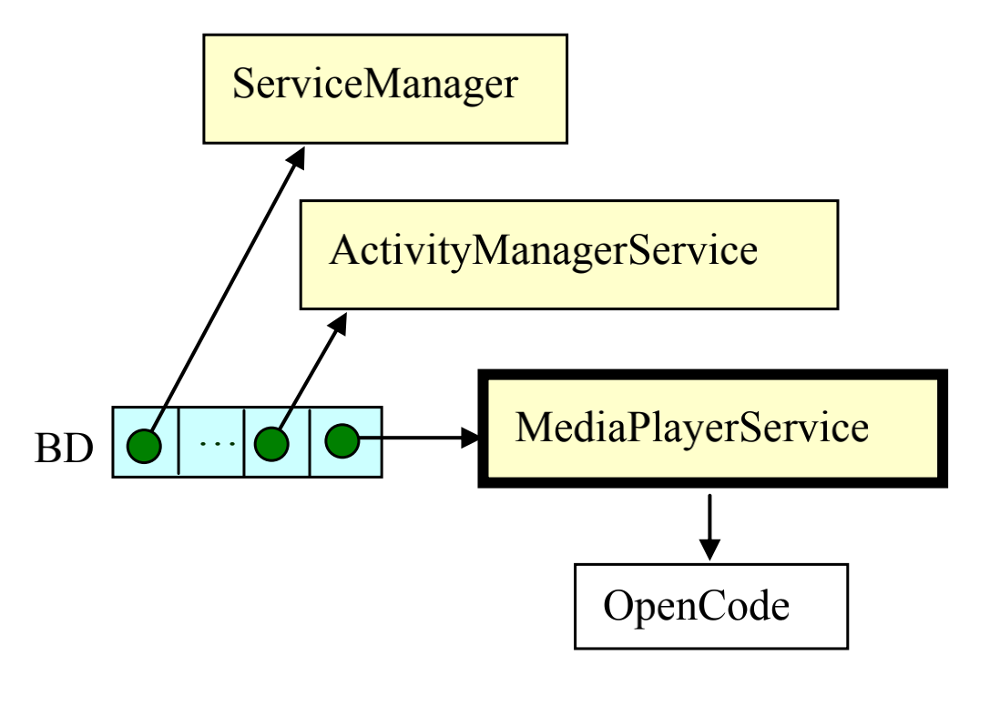

* 当 Android 系统启动完成 ( 主要核心服务也启动完成 ) 之后，就可以启动及执行应用程序了。
* 执行应用程序时，各 App 服务 ( 亦即 Service 的子类)都由 ActivityManagerService 来掌管。
* 例如，App 里的 myActivity 等类别可以使用 bindService() 来绑定 (Bind) 到 myService 服务，然后透过 IBinder 接口而远程呼叫到 myService。之后，myService 再透过 JNI 而呼叫到 MediaPlayerService，进而呼叫到更底层的驱动模块。

# 8. 核心服务的共通 API：IBinder 接口

* 就以 ServiceManager ( 简称 SM ) 为例子，由于 SM 跑在自己的进程里，为了让别的模块可以来呼叫它的服务，它必需提供共通的 IBinder 接口，才能让其它进程里的模块来进行 IPC 沟通。如下图：

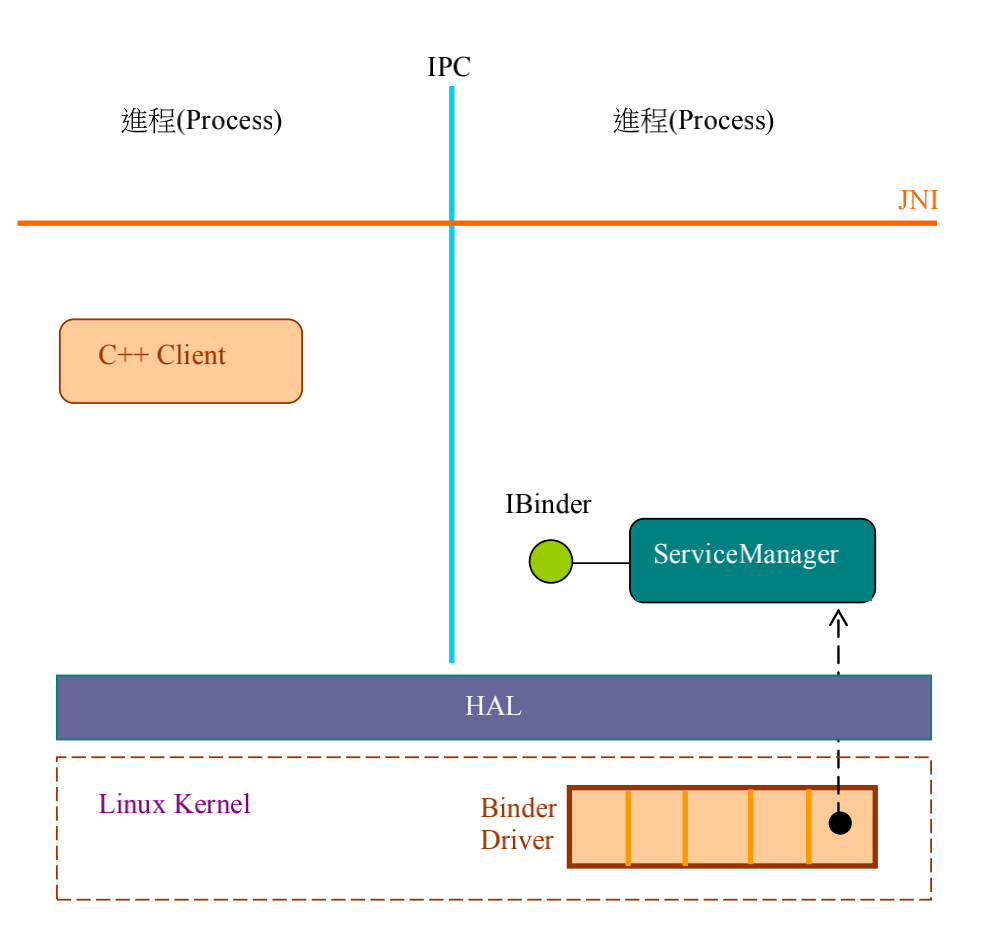

* 此刻，如果另一个进程里的 C++ Client 想与 SM 互动时，就会透过更底层的 ProcesState 服务在自己的进程里，诞生一个 BpBinder 对象，作为 BinderDriver 的分身 ( 即 Proxy 对象 )。
* 让 C++ Client 能透过 BpBinder 而与 Binder Driver 互动，进而跨进程地与 SM 沟通，所以 BpBinder 也间接地扮演 SM 的分身的角色。如下图所示：

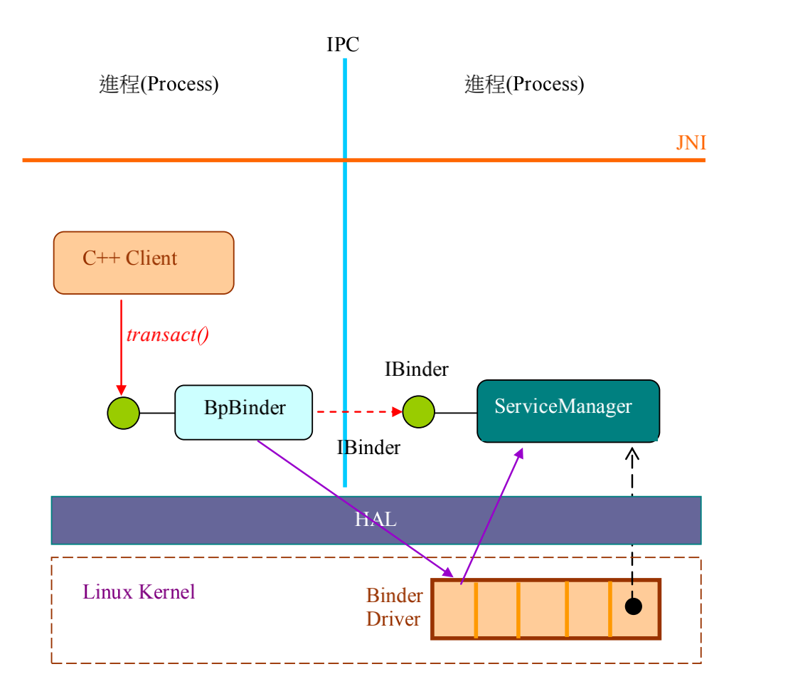

# 9. BBinder 基类实现 IBinder 接口

* 在 C++ 层实现核心服务时，可继承 BBinder 父类别而拥有 IBinder 接口；然后透过 ServiceManager 而登录到 Binder Kernel 里。

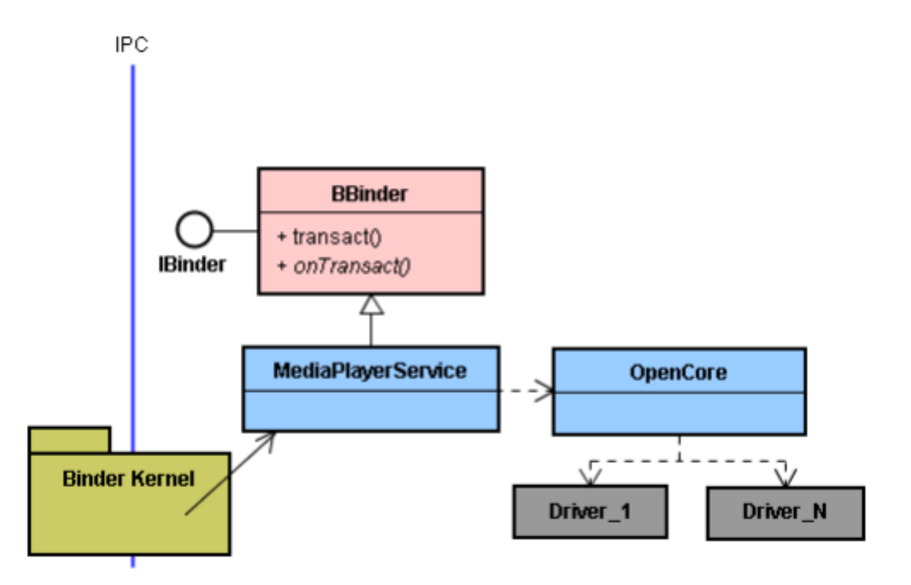

* 由于核心服务通常执行于独立的进程里，所以它的 Client 模块 ( 如下图的 MediaPlayer.cpp 类别 ) 通常在另一个进程里，与 MediaPlayerService 之间是跨进程的。
* C++ 层的 Client 模块 ( 如下图的 MediaPlayer.cpp 类别 ) 就透过 ServiceManager 来绑定核心服务。

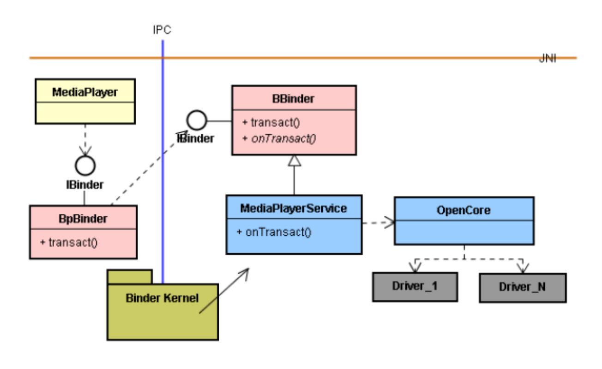

* Java 层的 Client 模块 ( 如下图的 myActivity.java 类别 ) 也能透过 ServiceManager 来绑定核心服务。

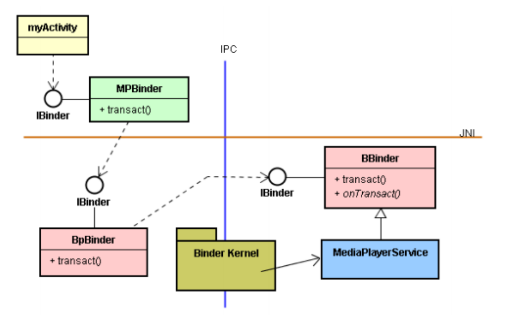

* 同样的 C++ 层机制，也能绑定 Java 层的 SDK-Service。

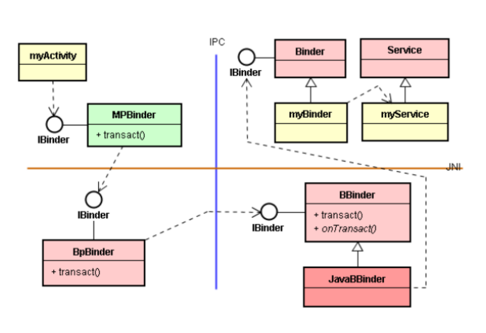