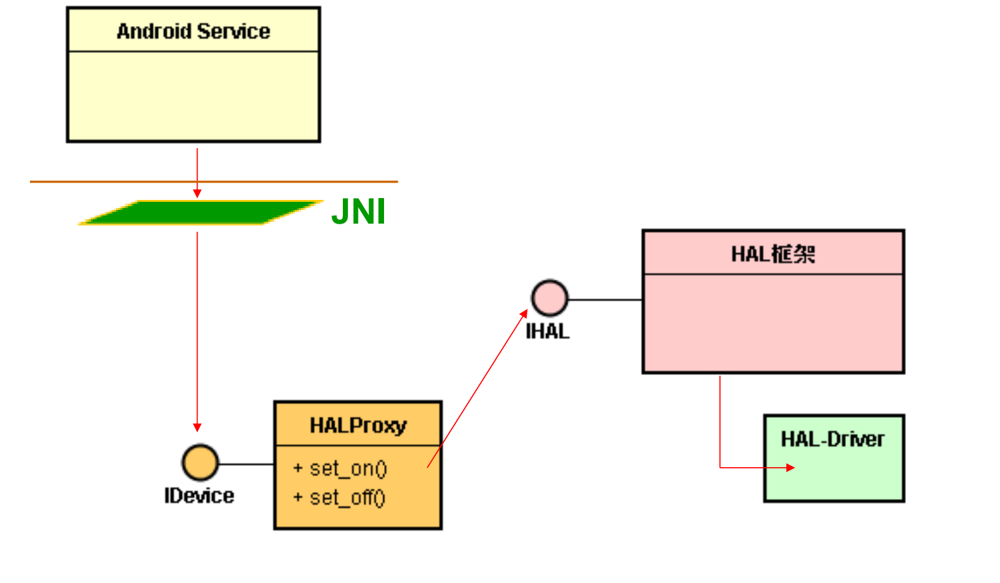
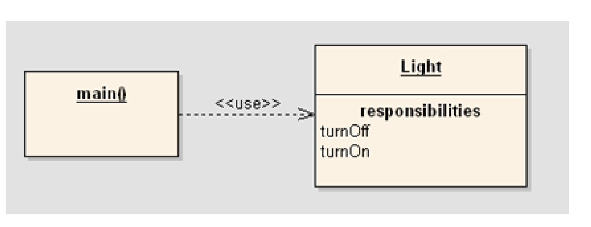
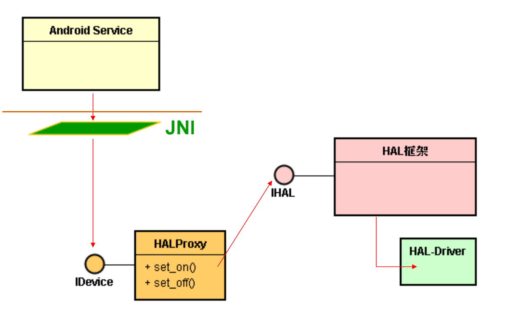
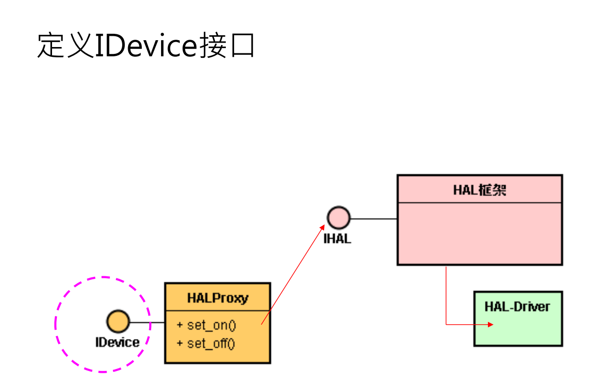
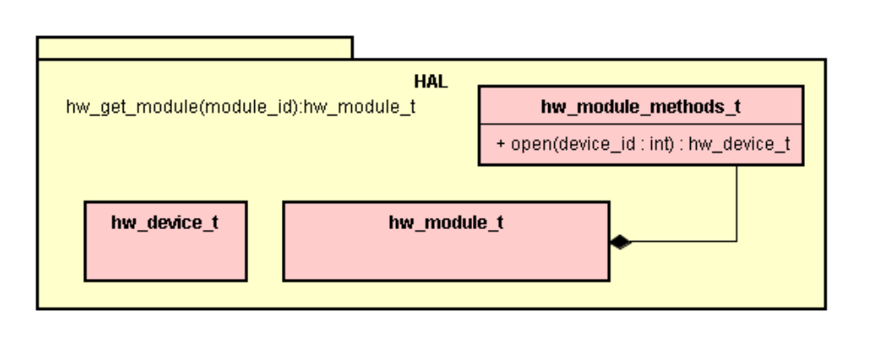
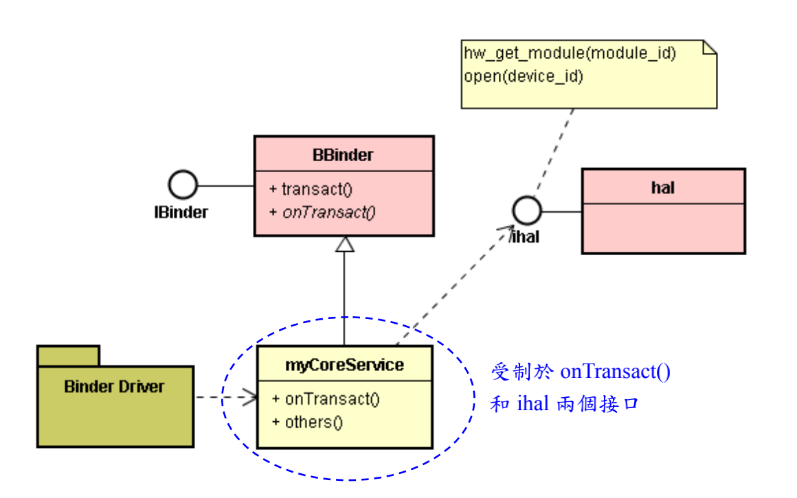
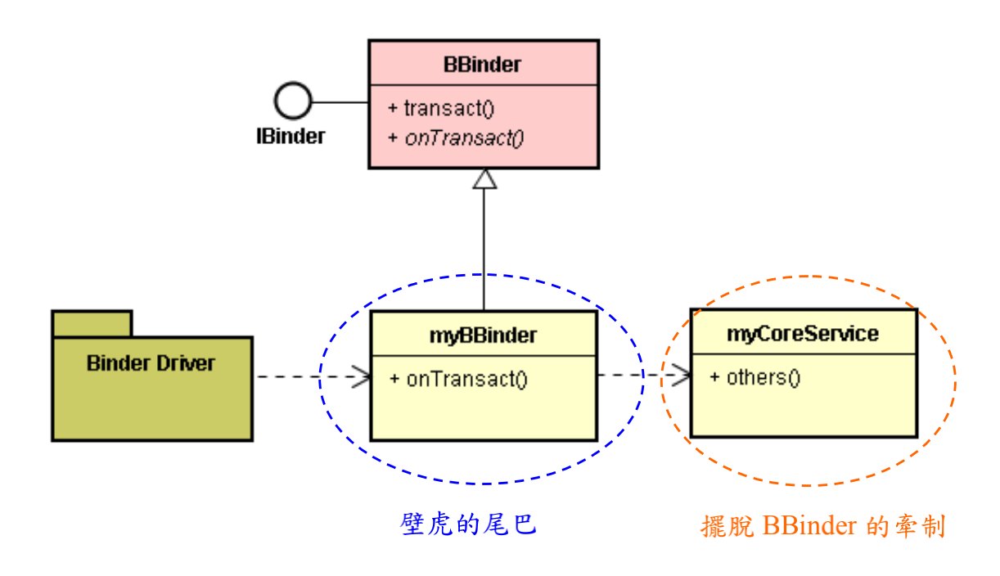
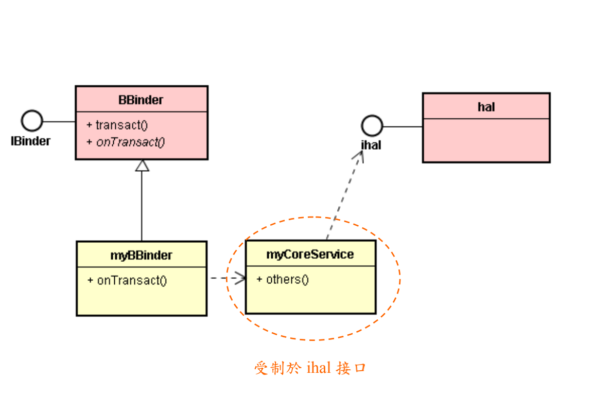
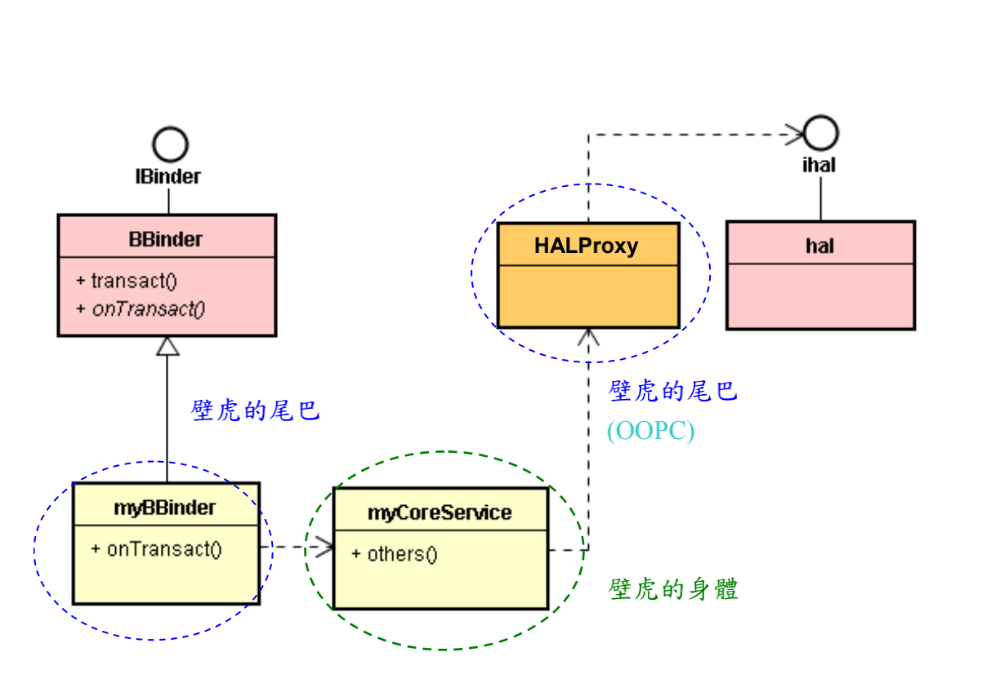

# OOPC 与 HAL 的美妙结合

# 1. 设计：替 HAL 增添一个 Proxy 类



* 有了 Proxy 类，对于 JNI Native 模块的代码，有何影响呢？

  降低了 JNI 模块与 HAL 之间的相依性。

# 2. 基础：介绍 LW_OOPC

* 高焕堂老师于 2008 年设计出 LW_OOPC 初版，并出版 << UML+OOPC 嵌入式 C 语言开发精讲 >> 一书。 

* 后来，于 2010 年由金永华先生继续扩充，推出更新版本。目前为全球 LGPL 协议开源软件：

  http://sourceforge.net/projects/lwoopc/

## C 语言 + 面向对象

* OOPC 是指 OOP(Object-Oriented Programming) 与 C 语言的结合，藉由 C 语言的 Macro 指令定义出 OOP 概念的关键词(Key Word)，C 程序员就能运用这些关键词来表达 OOP 概念，如类别、对象、信息、继承、接口等等。

## 比 C++ 更精简有力

* 虽然 OOPC 程序的语法不像 C++ 那么简洁，但是 OOPC 也有其亮丽的特色，就是编译后的程序所占内存空间(Size)比 C++ 程序来得小，较能满足像 Embedded System 等的内存限制，程序员也较能高效调整程序的瓶颈而提升其执行速度。
* OOPC 是以 C 的宏写成的 Header 档案，可以任由 C 程序员去对它瘦身美容，删去不需要的部分，挑出自己所需要的 OOP 特性，以小而美的身材满足 Embedded 系统开发的需要。

## 认识 LW_OOPC

* LW_OOPC 是一种轻便又快速的对象导向 C 语言。在嵌入式程序员还是蛮青睐 C 语言的，只是 C 语言没有对象、类别等概念，程序很容易变成意大利面型的结构，维护上比较费力。
* 在 1986 年 C++ 上市时，希望大家改用 C++，但是 C++ 的效率不如 C，并不受嵌入式程序员的喜爱。
* 于是，**高煥堂老師** 设计一个轻便又高效率的 OOPC 语言。轻便的意思是：它只用了约 20 个 C 叙述而已，简单易学。其Macro如下：

```c
/* lw_oopc.h */ /* 这就高焕堂老师团队所设计的C */
#include "malloc.h"
#ifndef LOOPC_H
#define LOOPC_H
#define CLASS(type)\
typedef struct type type; \
struct type
#define CTOR(type) \
void* type##New() \
{ \
struct type *t; \
t = (struct type *)malloc(sizeof(struct type));
#define CTOR2(type, type2) \
void* type2##New() \
{ \
struct type *t; \
t = (struct type *)malloc(sizeof(struct type));
#define END_CTOR return (void*)t; };
#define FUNCTION_SETTING(f1, f2) t->f1 = f2;
#define IMPLEMENTS(type) struct type type
#define INTERFACE(type) struct type
#endif
```

* 于 2010 年由金永华先生继续扩充，推出更新版本。目前为全球 LGPL 协议开源软件，

  您可以下载各版本：

  http://sourceforge.net/projects/lwoopc/

### Why，高效率？

* 其高效率的意思是，它没提供类别继承，内部没有虚拟函数表 (Virtual Function Table)，所以仍保持原来 C 语言的高效率。除了没有继承机制之外，它提供有类别、对象、信息传递、接口和接口多型等常用的机制。目前受到不少 C 程序员的喜爱。

## LW_OOPC 初版的宏(Macro)

```c
/* lw_oopc.h */ /* 这就高焕堂老师团队所设计的C */
#include "malloc.h"
#ifndef LOOPC_H
#define LOOPC_H
#define CLASS(type)\
typedef struct type type; \
struct type
#define CTOR(type) \
void* type##New() \
{ \
struct type *t; \
t = (struct type *)malloc(sizeof(struct type));
#define CTOR2(type, type2) \
void* type2##New() \
{ \
struct type *t; \
t = (struct type *)malloc(sizeof(struct type));
#define END_CTOR return (void*)t; };
#define FUNCTION_SETTING(f1, f2) t->f1 = f2;
#define IMPLEMENTS(type) struct type type
#define INTERFACE(type) struct type
#endif
```

## LW_OOPC 简单示例

* 由于一般 C 语言并没有使用 OO 观念。
* 高老师将 OO 观念添加到 C 语言，让人们既以 OO 观念去分析及设计，并以 OO 观念去编写 C 程序，则从分析、设计到程序编写的过程就非常直截了当。如下述的步骤：
* **Step-1:** 分析出一个类别叫 Light，它提供两项服务，以 UML 表达如下：



* **Step-2：**实现为 LW_OOPC 程序：

  * 基于上述的 lw_oopc.h 就可以定义出类别了，例如定义一个 Light 类别，其 light.h 内容为：

    ```c
    /* light.h */
    #include "lw_oopc.h“
    CLASS(Light) {
    void (*turnOn)();
    void (*turnOff)();
    };
    ```

  * 类别定义好了，就开始编写函数的内容：

    ```c
    /* light.c */
    #include "stdio.h"
    #include "light.h“
    static void turnOn()
    { printf("Light is ON\n"); }
    static void turnOff()
    { printf("Light is OFF\n"); }
    CTOR(Light)
    FUNCTION_SETTING(turnOn, turnOn)
    FUNCTION_SETTING(turnOff, turnOff)
    END_CTOR
    ```

  * 这个 FUNCTION_SETTING(turnOn, turnOn) 的用意是：让类别定义 (.h 文件 ) 的函数名称能够与实现的函数名称不同。例如在 light.c 里可写为：

    ```c
    static void TurnLightOn()
    { ….. }
    CTOR(Light)
    {
    FUNCTION_SETTING(turnOn, TurnLightOn);
    …..
    }
    ```

  * 这是创造 .c 档案自由抽换的空间，这是实践接口的重要基础。

  * 最后看看如何编写主程序：

    ```c
    #include "lw_oopc.h"
    #include "light.h"
    extern void* LightNew();
    void main()
    {
    Light* light = (Light*)LightNew();
    light->turnOn();
    light->turnOff();
    getchar();
    return;
    }
    ```

  * LightNew() 是由 CTOR 所生成的类别构造器(Constructor)。由于它是定义于别的档案，所以必需加上 extern void* LightNew();指令。生成对象的基本格式为：

    ```
    类别名称* 对象指针 = (类别名称*)类别名称New();
    示例：Light* light = (Light*)LightNew()
    ```

  * 然后就能透过对象指针去呼叫成员函数了。

# 3. 演练：<LW_OOPC + JNI> 代码范例

* Android 的以 JNI 为桥梁，将 Java 与 C/C++ 结合起来。
* 虽然 C++ 是个面向对象的语言，但如果有时不得不用 C 来编写代码时，可使用 OOPC 来写出易读易懂的面向对象代码。 
* 举个简单范例，说明如何以 OOPC 来撰写 JNI 本地代码。

# 4. 实践：以 LW_OOPC 撰写 HAL 的 Proxy 类



* 这个 HALProxy 类，其实就是 Proxy-Stub 设计模式里的 Proxy 类。
* 这把 IHAL 接口包装起来，而呈现新的接口。此 HALProxy 类的定义如下：



* 定义 IDevice 接口

```c
/* ihal.h */
#ifndef IDEVICE_H
#define IDEVICE_H
INTERFACE( IDevice )
{
void (*set_on)(void*);
void (*set_off)(void*);
}
#endif
```

* 定义 HALProxy 类（并实现 IDevice 接口）

```c
/* HALProxy.h */
#ifndef HALPROXY_H
#define HALPROXY_H
#include <misoo/lw_oopc.h>
#include <stdio.h>
#define LED_HARDWARE_MODULE_ID "led"
#define LED_HARDWARE_DEVICE_ID "led_dev“
CLASS(HALProxy)
{
IMPLEMENTS( IDevice );
struct hw_module_t* module;
struct hw_device_t* device;
char* module_id;
char* device_id;
void (*setModuleID)(HALProxy* thiz, const char* id);
void (*setDeviceID)(HALProxy* thiz, const char* id);
int (*getModule)(HALProxy* thiz);
int (*getDevice)(HALProxy* thiz);
};
#endif
```

* 撰写 HALProxy 的实现代码

```c
/* HALProxy.c */
#include "HALProxy.h"
#include <hardware/hardware.h>
#include <stdio.h>
static void setModuleID(HALProxy* thiz, const char* id)
{
thiz->module_id = id;
}
static void setDeviceID(HALProxy* thiz, const char* id)
{
thiz->device_id = id;
}
static int getModule(HALProxy* thiz)
{
int t = hw_get_module( module_id, 
(const struct hw_module_t**)(&module));
if (t != 0 ) {
printf("Error : hw_get_module = -1\n"); return 0;
}
return 1;
}
static int getDevice(HALProxy* thiz)
{
thiz->module->methods->open( 
module, device_id, (struct hw_device_t**)(&device));
return 1;
}
static void led_set_on(HALProxy* thiz)
{
printf("set_on ...\n");
}
static void led_set_off(HALProxy* thiz)
{
printf("set_off ...\n");
}
CTOR(HALProxy)
FUNCTION_SETTING(setModuleID, setModuleID);
FUNCTION_SETTING(setDeviceID, setDeviceID);
FUNCTION_SETTING(getModule, getModule);
FUNCTION_SETTING(getDevice, getDevice);
FUNCTION_SETTING(IDevice.set_on, led_set_on);
FUNCTION_SETTING(IDevice.set_off, led_set_off);
END_CTOR
```

* 撰写 Client：如 JNI Native 模块

```c
HALProxy* proxy;
IDevice* idev;
static jint led_init(JNIEnv *env, jclass clazz)
{
proxy = (HALProxy*)HALProxyNew();
idev = (IDevice*)proxy;
proxy->setModuleID(proxy, 
LED_HARDWARE_MODULE_ID);
proxy->getModule(proxy);
proxy->setDeviceID(proxy, 
LED_HARDWARE_DEVICE_ID) {
proxy->getDevice(proxy);
return 1;
}
static jint led_setOn(JNIEnv* env, jobject thiz) {
idev->set_on(idev);
return 1;
}
static jint led_setOff(JNIEnv* env, jobject thiz) {
idev->set_off(idev);
return 1;
}
```

* 有了 Proxy 类，对于 JNI Native 模块的代码，有何影响呢?

  分隔。

# 5. 讨论：HAL 接口 Proxy 类的角色和意义

* HAL 框架定义了基类 ( 以 C 语言的 struct )，如下：



* 核心服务 (Core Service) 或 JNI 模块，常常会使用 HAL 的接口，如下：



* 由于没有进行封装，Core Service 会受制于 HAL 接口，无法包容 HAL 大框架的变动，不利于 Core Service 的跨平台移植，于是设计壁虎的尾巴：



* 这已经摆脱 BBinder 的牵制，但是请再看看与 ihal 的关系： 



* 这仍然还受制于 HAL 的接口，于是又设计壁虎的尾巴(也就是 Proxy 类 )：



* 这样就能包容 HAL 大框架的变动了，也保护了壁虎的身体，增加系统的生命力。