# 观摩：Android 和 i-Jetty 网页的设计

# 1. Android + 互联网

## 前言：传统架构：云手机/云电视

* 智能电视是彩云，不只是终端

* 許多人都認為 TV 是終端，而沒有想到 Android TV 也可以是雲，而不只是端而已。 

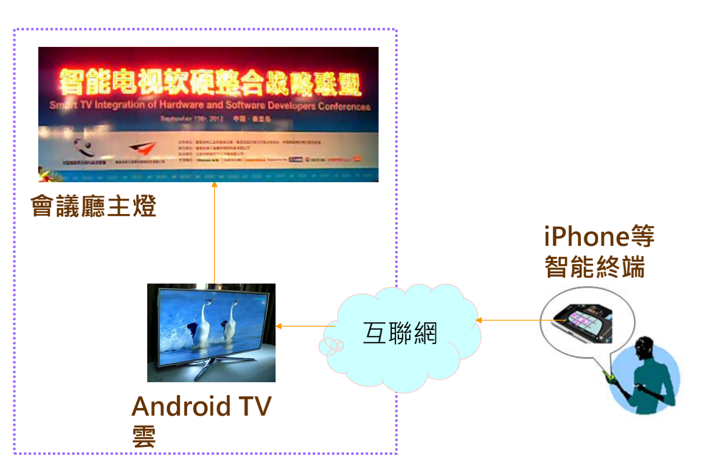

## 在 Android 平台上跑 i-Jetty web server

* Jetty 是于 1996 年。是由澳洲 Mort Bay Consulting Limited 公司 ( 由 Greg Wilkins 所创设的 ) 开发的 Java-based web and application server and servlet container。
* 这 Mort Bay 公司 Logo 图像里就是雪梨港口的照片，可以看到港口里有一个小码头(jetty)，而且是 J 字母开头的字，可呈现出它是 Java web server 的涵意，所以称为 Jetty。
* 由于 Jetty 一开始就设计成为幕后型的 Java web server，可以嵌入于各式各样的平台系统里，所以大家其实已经天天在使用 Jetty 而不自知罢了。
* 例如，许多赫赫有名的平台系统的幕后都使用 Jetty web server。例如 Eclipse、IBM Tivoli Netview、BEA WebLogic Event Server、Sybase EAServer、Apache Geronimo 等系统。
* Jetty 设计得很精巧又稳定，它只需要很小的记忆里空间，所以它适合运作于像 Android 等手持设备平台里，例如 Android 手机、Android TV 等。
* 于2008年，Android 版本的 Jetty 诞生了，称为 i-Jetty。一旦在 Android 手机、Android TV 等设备上执行 i-Jetty 时，可以让更多人来与这些设备沟通、分享其信息。
* 目前负责维护 Jetty 的是 Jetty community，其服务网页是： www.mortbay.org。
* i-Jetty 本身是以 Android 应用程序形式嵌入(运行)于 Android 平台里，它可以透过 Android 框架的 API 与其它应用程序沟通。
* 因而，在 i-Jetty 里执行的 Servlet 程序也能透过该 Android API 而与其它应用程序沟通、分享数据。

## 传统架构：云手机/云电视

* 传统的观点：Android 是终端，透过互联网去访问云平台；终端跑浏览器去展现云端的网页。
* 由于 Android 端支持 3G 上网功能。HTTP 是方便的通讯协议。
* App 很容易透过 HTTP 来访问云层上的 Servlet 程序。

## 新潮架构

* 把网页放进 Android TV 里；于是，让 iPhone 等手机都能藉由浏览器上网去访问自己家中 TV 里的网页。
* 許多人都認為 TV 是終端，而沒有想到 Android TV 也可以是雲，而不只是端而已。
* 智能电视是彩云，不只是终端。
* 以 Android TV 构筑一个心灵家庭。 
* 家庭雲 (Family Cloud) ：家家戶戶都有一朵美麗的 彩雲。
* 家庭成员之间心灵的持续联系是一种深度的潜在性需求。只要 Android TV 能照顾这种心灵联系的需要，就能激发这项潜在性需求。 

## i-Jetty 的角色

* 例如，在家庭的 Android TV 裡，加入一個 i-Jetty 插件，來容納 HTML5 網頁和 Servlet 程序。 
* 數千公里外的家庭成員，透過手機 Browser 解析 HTML5 ，與家裡的 TV 溝通，形成大小屏互動、多機整合的架構設計了。
* 马上相逢不需纸与笔，让 HTML5 传语报平安。

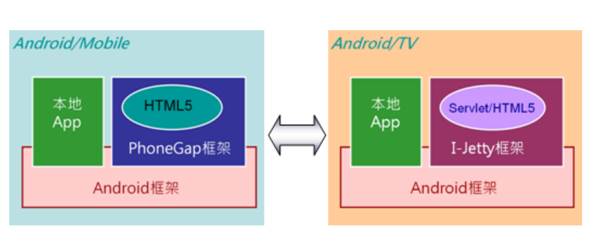

* Android 端上的 i-Jetty Container 本身也是一支标准的 Android 应用程序。所以执行于该 i-Jetty 里的 Servlet 也能进行跨进程 (IPC) 地启动手机上的其它应用程序或服务。如下图：

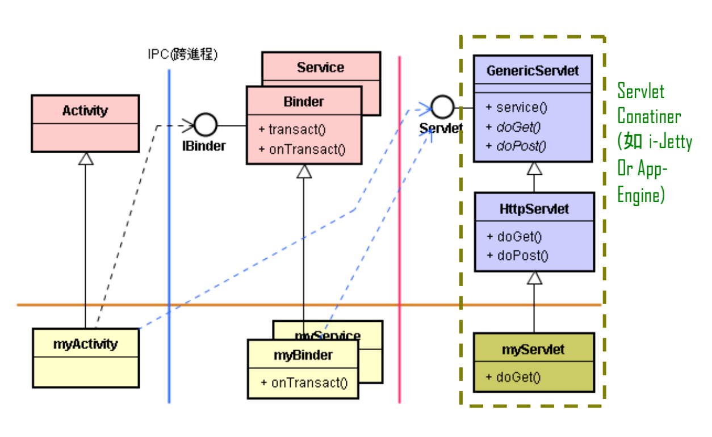

* 无论是 Android 手机或是 PC 等其它设备，皆能透过 HTTP 来访问 Android TV 上的 Servlet ( 如执行于 i-Jetty 内 )，然后该 Servlet 进而启动 TV 内的 App。

# 2. I-Jetty 与 Android 沟通接口：Context

* I-Jetty 里的 Servlet 程序如何与同一只手机里的其它 App 沟通呢? 答案是：透过 Android 的 Context 接口。在 Android 应用框架 (Framework) 里定义了一个纯粹抽象父类别，其主要的类继承体系如下：


* I-Jetty 是一支 Android 应用程序 (*.apk)，其扮演 Container 角色，让许多支 Servlet 程序可以在 Android 手机里执行。
* 然而，这些 Servlet 程序经常需要与同一只手机里的其它 App 沟通，例如启动晨钟或闹铃等等。
* 此时，只要能取得 Android 框架的 Context 接口，就能调用 Android 的服务了。
* 这个 Context 界面位居幕后，仅从 App 代码的表面，常常看不到，然而它却是 Android 平台框架的最主要服务窗口。
* Context 接口提供数十个大家很常用的服务，例如startService()、sendBroadcast() 函数等。
* 由于 Activity 也是继承 Context 抽象父类别，意味着 Activity 也是实作 (Implements) 这个 Context 界面。
* 所以我们在 Android 应用程序里 ( 如 myActivity 子类 ) 随时可调用 Context 接口里的函数，如下述的程序范例：

```java
// Android 程序范例
//…..
public class ac01 extends Activity implements OnClickListener {
	private Button btn, btn3;
  
	@Override 
  protected void onCreate(Bundle icicle) {
		super.onCreate(icicle);
		//…….
		setContentView(layout);
  }
  
	public void onClick(View v) {
    if(v == btn)
      startService(new Intent(this, myService.class));
    else if(v == btn3)
      finish();
  } 
}
```

*  其中的指令：

```java
startService(new Intent(this, myService.class));
```

* 相当于指令：

```java
this.startService(new Intent(this, myService.class));
```

* 意味着，其呼叫到 Context 接口的 startService() 函数。
* 其幕后机制是，myActivity 类调用到 ContextWrapper 类的 Context 接口 ( 的 startService() 函数 )，然后转而调用其 mBase 的 ( 例如 ApplicationContext 的对象 ) Context 接口的 startService() 函数。
* 除了 startService() 函数之外，Context 接口还含有许多其它函数，例如 getApplicationContext() 函数等。

# 3. Android 内的 I-Jetty 与 App 通信

* 我们撰写 i-Jetty 里的 myServlet 程序时，也能透过 Context 接口来呼叫 startService() 函数来启动 Android 应用程序里的 myService 子类别，也能呼叫 Context 接口 startActivity() 函数来启动 Android 应用程序里的 myActivity 子类别，如下图：

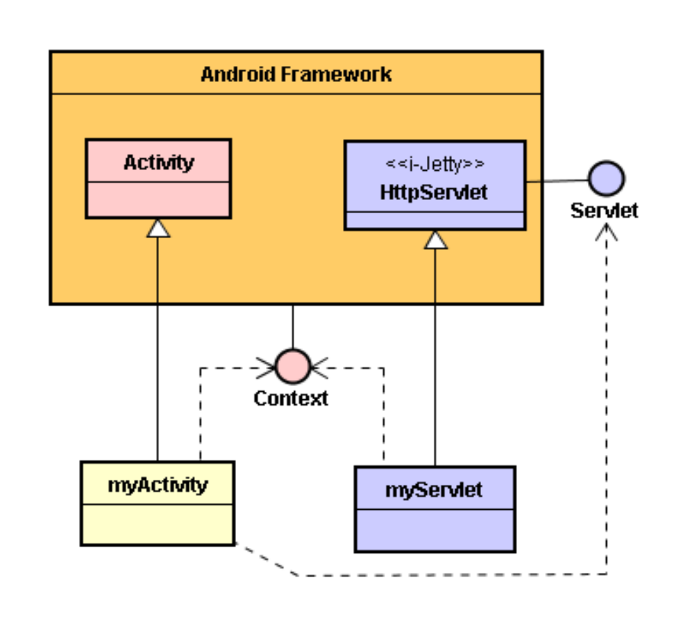

* 在 myServlet 子类别里可利用指令：

```java
config.getServletContext().getAttribute(
"org.mortbay.ijetty.context");
```

* 指令来取得其当下的 Context 接口，如下述 i-Jetty 的范例代码：

```java
/* --- i-Jetty的Servlet程序范例 ----*/
//………
public class HelloWorld extends HttpServlet {
	String proofOfLife = null;
	public void init(ServletConfig config) throws ServletException {
		super.init(config);
		Object o = config.getServletContext().getAttribute("org.mortbay.ijetty.contentResolver");
		android.content.ContentResolver resolver = (android.content.ContentResolver)o;
		android.content.Context androidContext = (android.content.Context)
      config.getServletContext().getAttribute("org.mortbay.ijetty.context");
		proofOfLife = androidContext.getApplicationInfo().packageName;
  }
  
  public void doPost(HttpServletRequest request, HttpServletResponse response)
    throws ServletException, IOException{ 
    doGet(request, response); 
  }
  
	public void doGet(HttpServletRequest request, HttpServletResponse response)
    throws ServletException, IOException {
    response.setContentType("text/html");
    ServletOutputStream out = response.getOutputStream();
    out.println("<html>");
    out.println("<h1>Hello From Servlet Land!</h1>");
    out.println("Brought to you by: "+proofOfLife);
    out.println("</html>");
    out.flush();
  } 
}
```

# 4. I-Jetty 与 Android App 的跨机通信

* 上图里是从同一支手机 ( 本机 ) 里的 myActivity 来调用本机的 Servlet 接口，这意义比较小。
* 更大的意义是：由别的手机里的 myActivity 来传送 HTTP 访问到本机的 Servlet 接口，调用到本机的 myServlet 子类；然后由 myServlet 调用 Android 的 Context 接口，而完成两支手机里两个 myActivity 子类之间的通信。如下图：

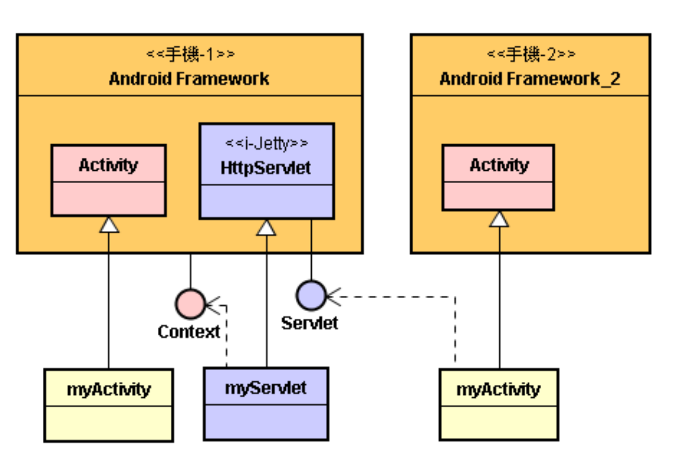

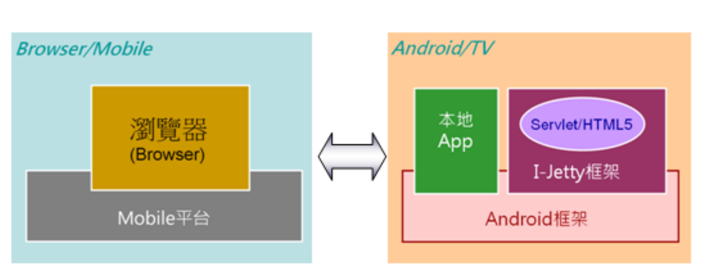

* 于是，Context 和 Servlet 两大接口，成为 Android 云的喜鹊桥的两个主要桥墩。

# 5. 实际案例分享

## 案例情景说明

* 这是 2012 年 9 月 21 日于秦皇岛市举行的 < 智能电视软硬整合产业联盟会议 >> 开幕时，副市长以他自己的手机上网访问会议厅中 Android TV 里的 i-Jetty 网页，再透过 Android App 发出 Zigbee 信号，打开会议厅的主灯和电视墙。

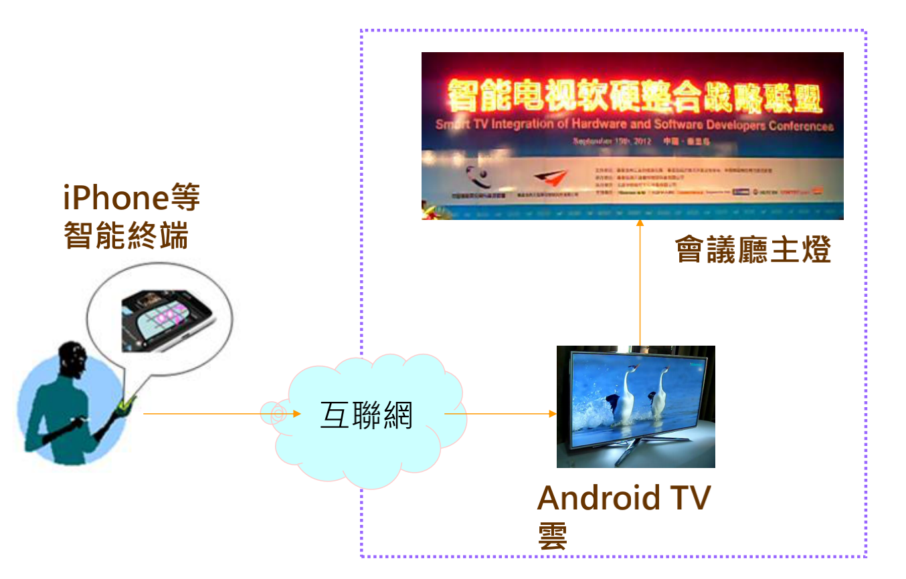

## 范例代码

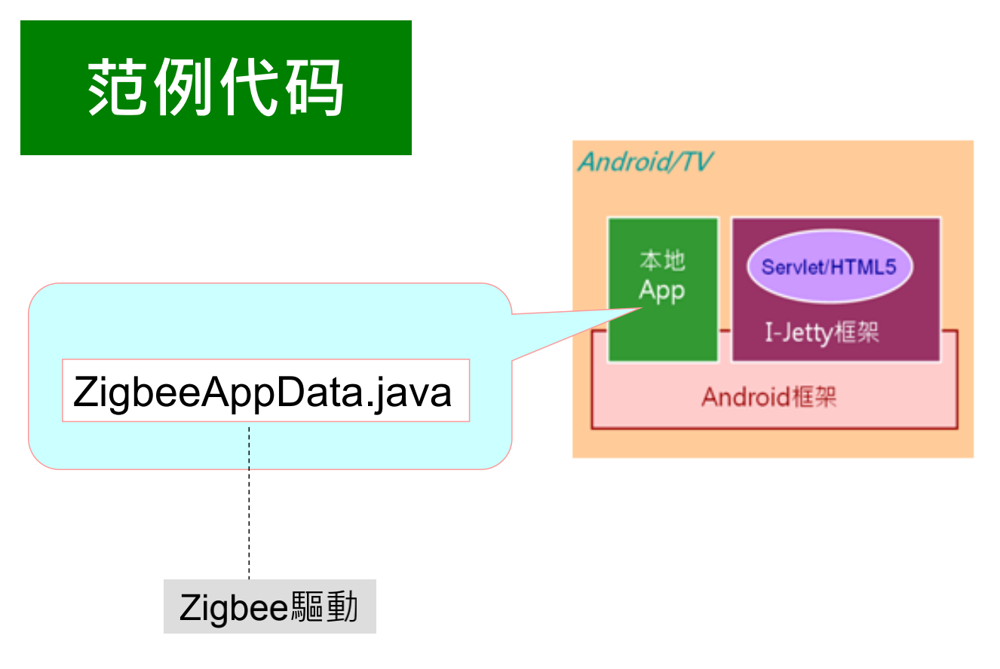

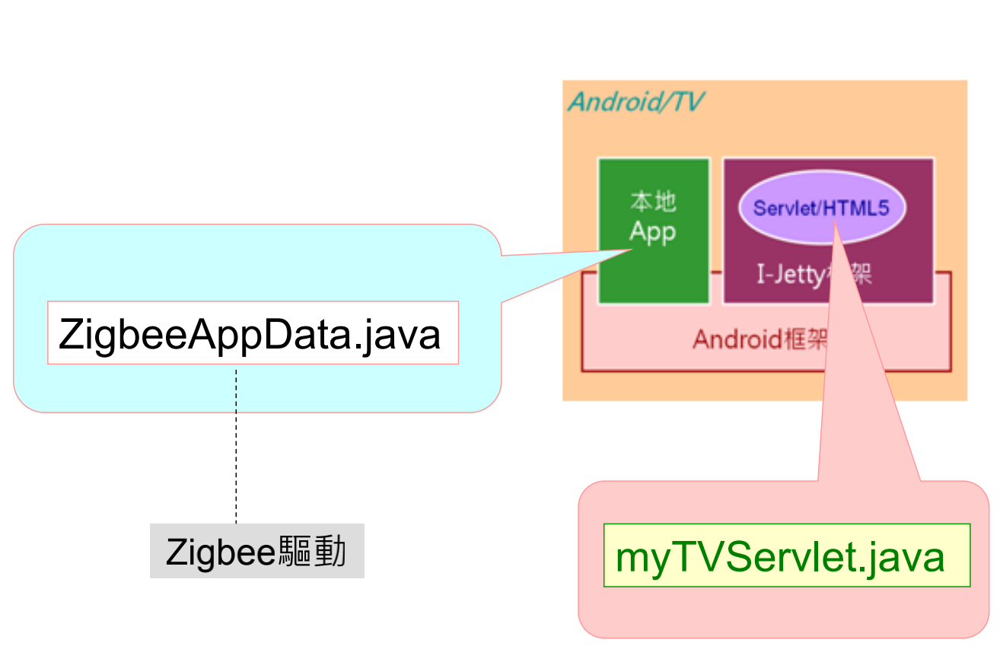

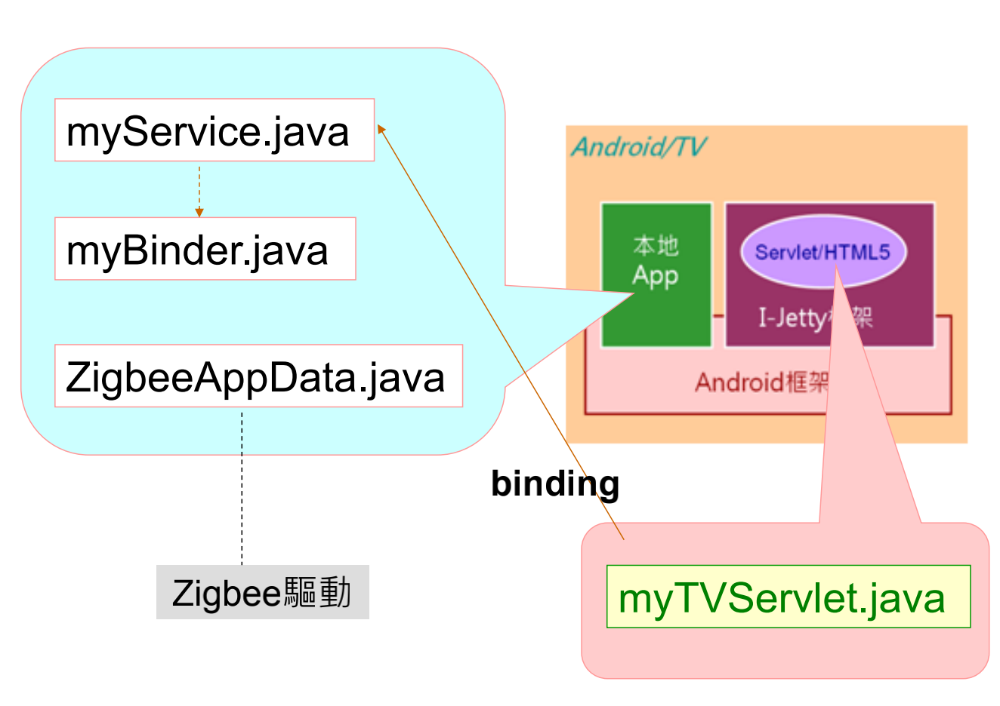

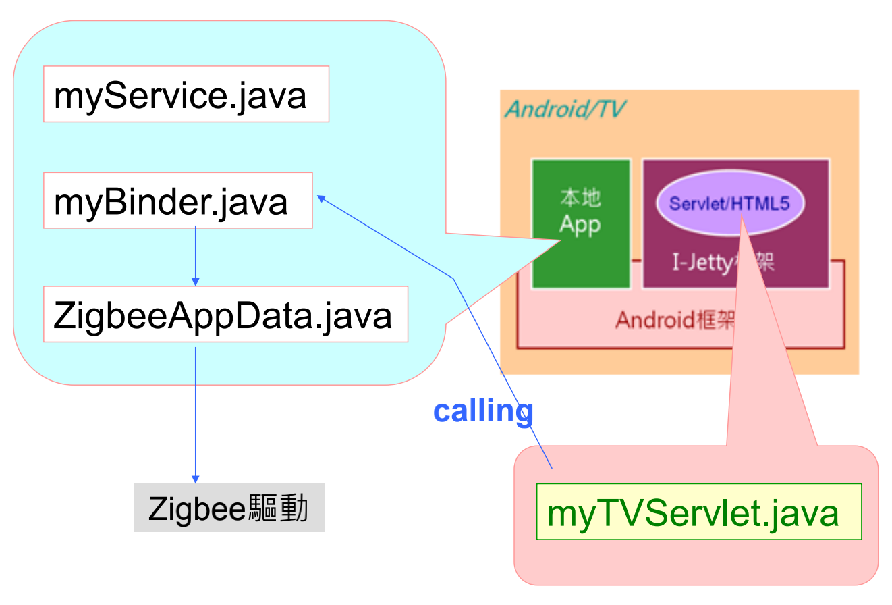

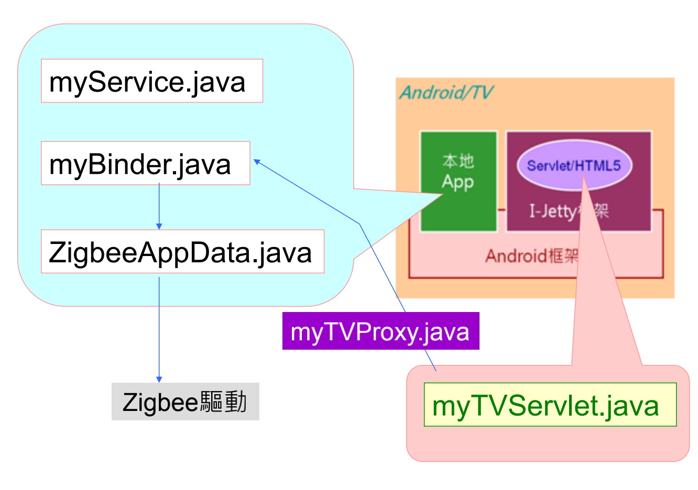

```java
// myBinder類
package com.google.android.ZigbeeApp;

import android.content.Context;
import android.os.Binder;
import android.os.Parcel;

public class myBinder extends Binder {
  private ZigbeeAppData mZigbeeAppData ;
	private Context context ;
	public myBinder(Context ctx){
		context = ctx ;
		mZigbeeAppData = new ZigbeeAppData();
	}
  
	@Override
	public boolean onTransact( int code, Parcel data, 
                            Parcel reply, int flags)
    throws android.os.RemoteException {
    if (code == 1) 
      reply.writeString(
      	mZigbeeAppData.getAppData( data.readString()) 
    	);
    else if (code == 2){ 
      String [] strings = {};
      data.readStringArray(strings) ;
      mZigbeeAppData.setAppdata(strings[0], strings[1]) ;
    }
    return true ;
  } 
}
```


```java
// myService類
package com.google.android.ZigbeeApp;
import android.app.Service;
import android.content.Intent;
import android.os.IBinder;

public class myService extends Service{
	private IBinder mBinder = null ;
  
  @Override 
  public void onCreate() {
		mBinder = new myBinder(getApplicationContext());
  }

  @Override 
  public IBinder onBind(Intent intent){
		return mBinder ;
  } 
}
```


```java
// myTVServlet類
package org.mortbay.ijetty;
import java.io.IOException;
import javax.servlet.ServletConfig;
import javax.servlet.ServletException;
import javax.servlet.ServletOutputStream;
import javax.servlet.http.HttpServlet;
import javax.servlet.http.HttpServletRequest;
import javax.servlet.http.HttpServletResponse;
import android.content.ComponentName;
import android.content.Intent;
import android.content.ServiceConnection;
import android.os.IBinder;
import android.os.Parcel;
import android.util.Log;

public class myTVServlet extends HttpServlet {
  private static final long serialVersionUID = 1L;
  private String proofOfLife ;
  private myTVProxy pProxy = null ;
  
  public void init(ServletConfig config) throws ServletException {
		super.init(config);
		android.content.Context androidContext = 
      (android.content.Context)config.getServletContext().getAttribute("org.mortbay.ijetty.context");
    proofOfLife = androidContext.getApplicationInfo().packageName;
		androidContext.bindService ( 
      new Intent("com.google.android.ZigbeeApp.REMOTE_SERVICE"), 
      mConnection, 
      android.content.Context.BIND_AUTO_CREATE);
  }
  
  private ServiceConnection mConnection = new ServiceConnection() {
    public void onServiceConnected(ComponentName className, IBinder ibinder){
      pProxy = new myTVProxy(ibinder);
    }
    public void onServiceDisconnected(
      ComponentName className) {}
  };
  
  protected void doGet( HttpServletRequest request, HttpServletResponse response) 
    throws ServletException, IOException {
    // TODO Auto-generated method stub
    response.setContentType("text/html");
    ServletOutputStream out = response.getOutputStream();
    out.println("<html>");
    out.println("<h1>TVZigbee Status From i-Jetty in FamilyCoud! 
                RESULT is " + pProxy.getStatus(
                "Text_POWERSTATUS") + "</h1>");
    out.println("</html>");
    out.flush();
  }
  
  protected void doPost(HttpServletRequest request, HttpServletResponse response) 
    throws ServletException, IOException { }
  
  private class myTVProxy {
    private IBinder ib ;
    private String mStatus ;
    myTVProxy(IBinder ibinder) { 
      ib = ibinder ;
    }
    
    public String getStatus(String what) {
      Parcel pc = Parcel.obtain();
      Parcel pc_reply = Parcel.obtain();
      pc.writeString(what) ;
      try {
        ib.transact(1, pc, pc_reply, 0);
        mStatus = pc_reply.readString();
      } catch (Exception e) {
        e.printStackTrace();
      }
      return mStatus ; 
    }

    public void refreshStatus(String what, String value) {
      String[] strings = {"","On"};
      strings[0] = what;
      strings[1] = value;
      Parcel pc = Parcel.obtain();
      pc.writeStringArray(strings);
      Parcel pc_reply = Parcel.obtain();
      try {
        ib.transact(1, pc, pc_reply, 0);
      } catch (Exception e) {
        e.printStackTrace();
      }
    }
  }
}
```

