# 观摩：Android 的 ListView 框架设计

# 1. 复习：两种知识的分析

* 需求知识分为两种：
  * 第一种需求知识 -> 成为基类的内涵
  * 第二种需求知识 -> 成为子类的内涵

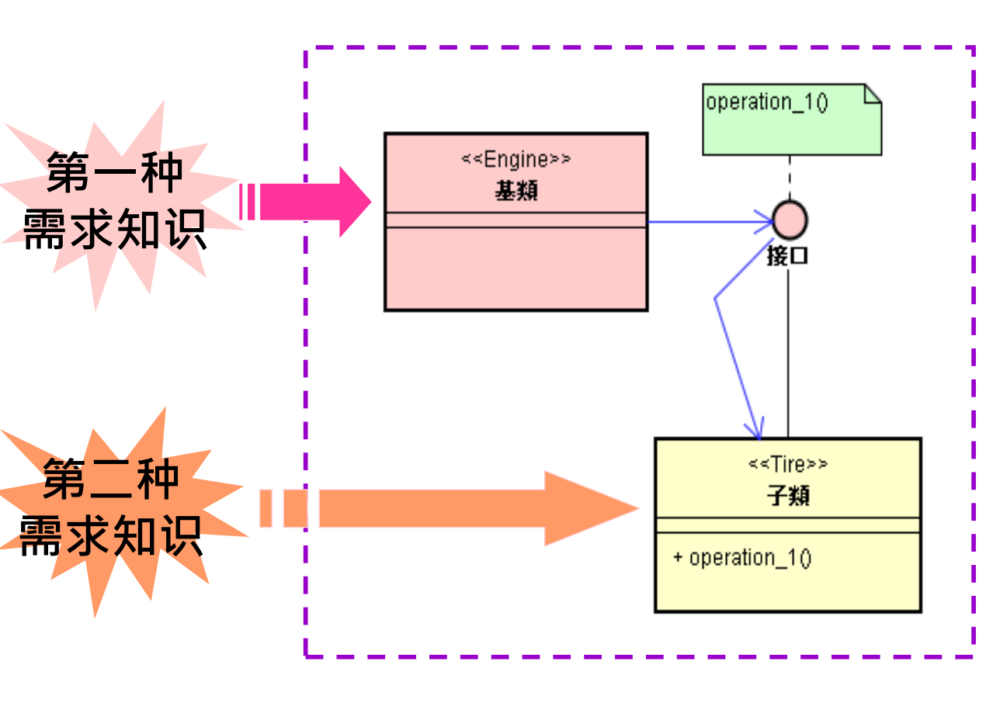

## 两种需求知识的时间差距

* 这两种知识的取得，会有时间落差。
* 第一种需求知识 -> 先取得
* 第二种需求知识 -> 后取得

## 时间先后的分界点：买主来到

* 以  \<买主来到\> 的时间点加以切分。

  第一种：买主来之前已知的需求知识

  第二种：买主 ( 来到时才 ) 提供的需求知识

## 两种知识分别写入 < 基类 > 和 < 子类 >

* 第一种知识写入基类 \<E>
* 第二种知识写入子类 \<T>

## 两种知识江必须汇合起来

* 设计接口 \<I>，准备将基类与子类汇合起来
* 于是，就能将两种知识汇合起来了

# 2. ListView 的接口设计

* 当你看到 ListView 的列表面貌时，必须仔细想一想：买主来了，他会提出那些特殊的要求。
* 如同你正要开设一家新的餐馆，你必须想好如何规划点菜单，也就是点菜单上，你想让买主填写些甚么呢? 
* 想好后，得出下述需求时间表：

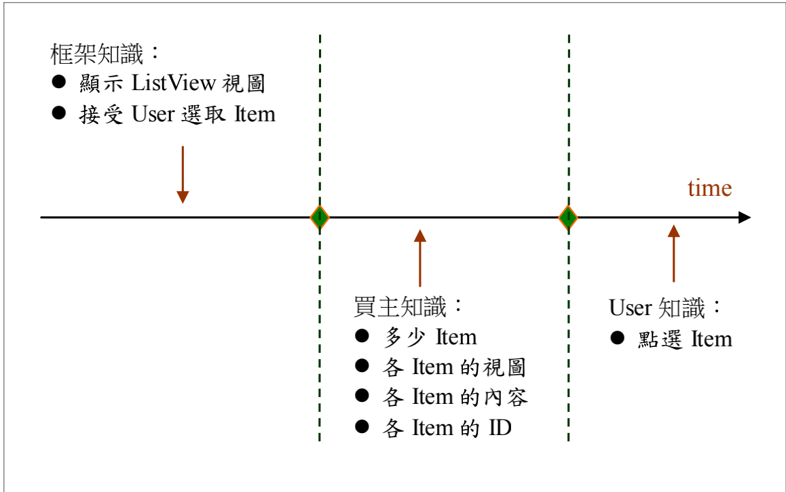

* 此图说明了，你必须设计 “ 点菜单 ”，让买主(Buyer)表达：
* ListView 里想显示出多少行选项 (Item)，让用户 (User) 于执行阶段来做选择。
* 每一行选项的视图 ( Item 的图像 ) 是甚么? 
* User 挑取选项，要响应给 User 甚么内函? 
* User 挑取选项，要响应给 User 甚么 ID 值?

## 接口设计

* 将上述买主知识点归于 App 子类，其余部分归于框架基类。
* 接着，设计接口函数，让基类能调用子类的函数，将子类里的买主知识 ( 点菜单内容 ) 汇集到框架基类 ( 食谱 ) 里。于是，得到接口设计如下：

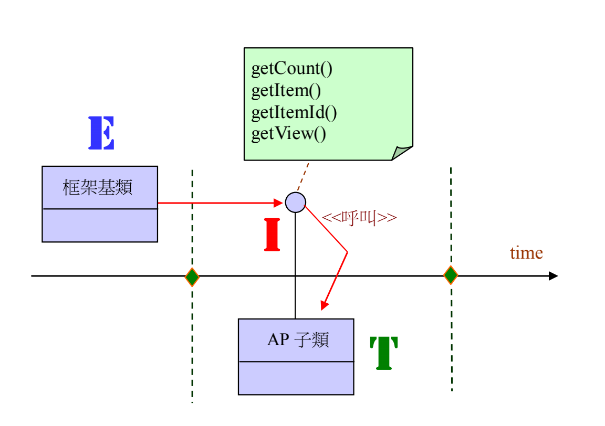

## 总共分为两个阶段

1. 视图显示阶段 ( User 点选之前 ) 

* \<E> 透过接口的 getCount() 从子类里取得买主所做的决定：多少行选项 ( 如 N 行 )。 
* 继续调用 N 次 getView()，从子类里取得各行的视图。

2. 选项响应阶段 ( User 点选之后 )

* 基类可透过接口的 getItem() 函数从子类里取得买主所做的决定：响应什数据或对象。
* 也可调用 getItemId() 函数，从子类里取得各选项的 ID 值。

* 基于上述的初步规划，继续做细部接口 \<I> 细部设计，包括上述函数的名称和参数、回传值的型态都得详细推敲，才能定案。
* 于是，得到详细的接口设计，如下图所示：

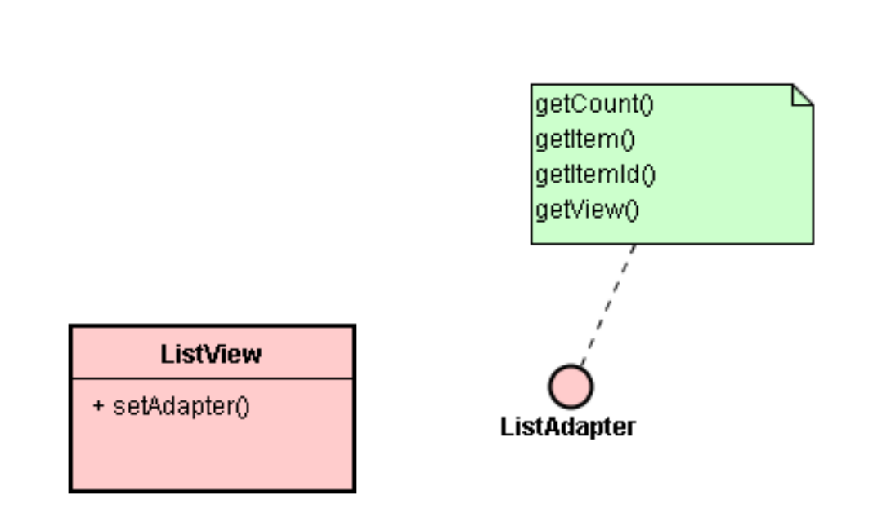

```java
public int getCount();
public T getItem( int position );
public long getItemId( int position );
public View getView( int position, View convertView,
ViewGroup parent );
// 其它
```

## 说明

* \<E> 调用 getCount() 函数而取得买主心中的 N 值 ( 多少个Item )。
* 调用 N 次 getView(position : int) 函数，每次取得第 position 个 Item 的貌相，它就是该 Item 的代表视图 ( 一个 View 对象)。
* 调用 N 次 getItem() 函数，每次回传买主所设定第 position 个 Item 的内涵 ( 例如每次从 Coll[ ] 里取得第 position 个对象)。 
* 调用 N 次 getItemId() 函数，每次回传买主所设定的第 position 个 Item 的 ID 值。

# 3. 兼顾通用性和特殊性的设计

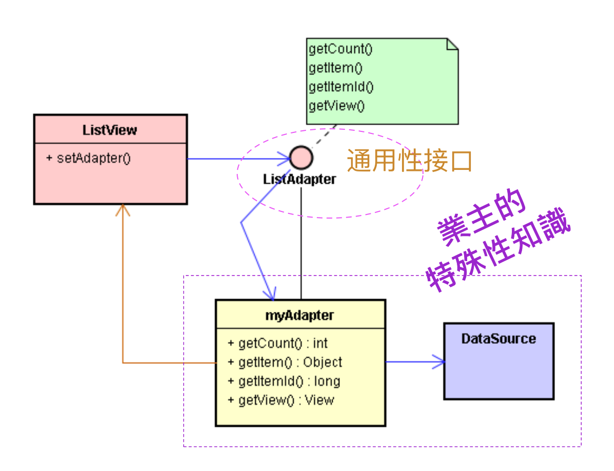

## 特殊性设计

* 使用 Stub 来表达一些特殊性设计，容纳特殊性的知识。例如，提供特殊性的默认 (Default) 行为；或者包装出新的特殊性接口等。

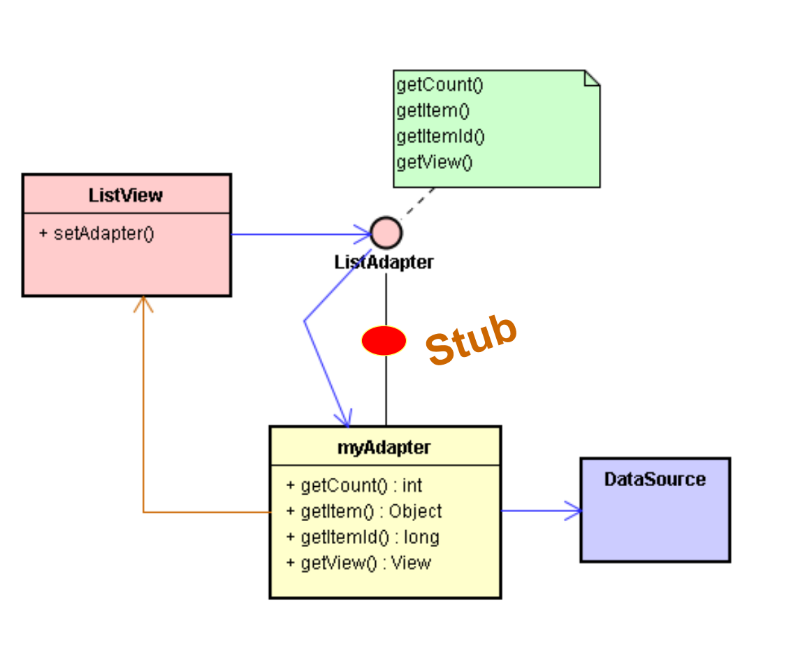

* Android 定义的 Stub 类：BaseAdapter。

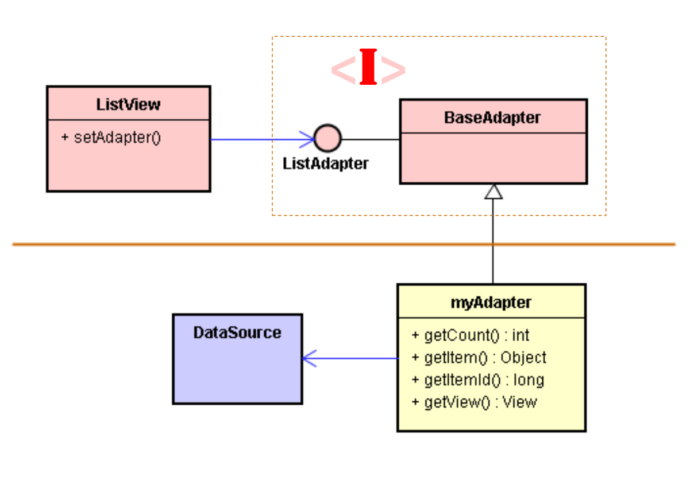

* 将 ListAdapter 接口包装并隐藏起来。

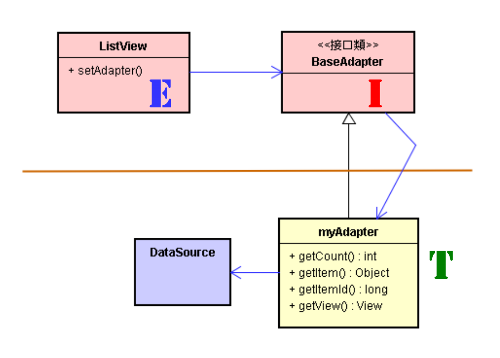

* 此 BaseAdapter 表达一些特殊性设计，容纳特殊性的知识。例如，提供特殊性的默认 (Default) 行为；或者包装出新的特殊性接口等。

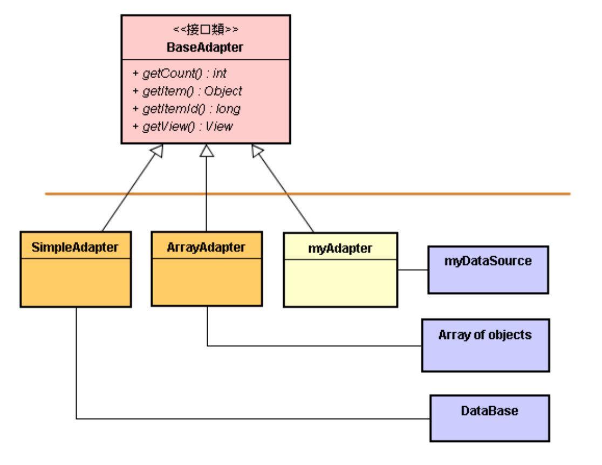

# 4. BaseAdapter 接口的使用范例

## 其实，ListView 是一个小框架

* ListView 是整个 View 体系的一员，也就是说，ListView 小框架容入于 Android 大框架里，成为其中的一部分。其位于 Android 大框架与 App 之间，如下图所示：

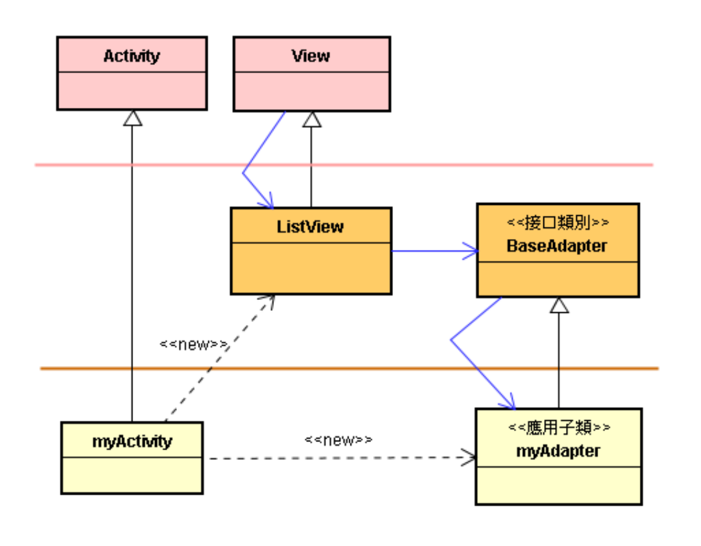

* 需求时间表


## 范例代码

### 撰写 \<T> 的代码，实现 BaseAdapter 接口

```java
// myAdapter.java
// ………
public class myAdapter extends BaseAdapter {
private final int WC 
= ViewGroup.LayoutParams.WRAP_CONTENT;
private Context ctx;
private ArrayList<Row> coll;
public myAdapter(Context context, ArrayList<Row> list) {
ctx = context; coll = list;
}
public int getCount() { return coll.size(); }
public Object getItem(int position) { return coll.get(position); }
public long getItemId(int position) { return position; }
public View getView(int position, View convertView, 
ViewGroup parent)
{
LinearLayout layout = new LinearLayout(ctx);
layout.setOrientation(LinearLayout.HORIZONTAL);
Row rw = (Row)coll.get(position);
ImageView iv = new ImageView(ctx);
iv.setImageResource(rw.getDwId());
iv.setPadding(0, 2, 5, 0);
LinearLayout.LayoutParams param
= new LinearLayout.LayoutParams(WC, WC);
layout.addView(iv, param);
TextView mv = new TextView(ctx);
mv.setText(rw.getText());
mv.setTextColor(Color.CYAN);
mv.setHeight(45); mv.setTextSize(26);
LinearLayout.LayoutParams param2
= new LinearLayout.LayoutParams(WC, WC);
param2.leftMargin = 5; param2.topMargin = 13;
layout.addView(mv, param2);
return layout;
}}
```

### 撰写 \<T> 的代码，实现 BaseAdapter 接口

```java
// myActivity.java
// ……….
public class myActivity extends Activity
implements OnItemClickListener {
private ArrayList<Row> coll;
@Override protected void onCreate(Bundle icicle) {
super.onCreate(icicle);
coll = new ArrayList<Row>();
coll.add(new Row("Play",R.drawable.mp4_icon) );
coll.add(new Row("Exit", R.drawable.icon2));
ListView lv = new ListView(this);
lv.setAdapter(new myAdapter(this, coll));
lv.setOnItemClickListener(this);
setContentView(lv);
}
@Override public void onItemClick(AdapterView<?> arg0, 
View arg1, int arg2, long arg3) 
{
if(arg2 == 1) finish();
} }
```

* 其中，myAdapter 必须实作 4 个抽象函数：
  * getCount()
  * getItem()
  * getItemId()
  * getView()
* 其功能
  * 调用 getCount() 函数而取得买主心中的 N 值  ( 多少个 Item )。 
  * 调用 N 次 getView(position : int) 函数，每次取得第 position 个 Item 的貌相，它就是该 Item 的代表视图 ( 一个 View 对象 )。
  * 调用 N 次 getItem() 函数，每次回传买主所设定第 position 个 Item 的内涵 ( 例如每次从 Coll[ ] 里取得第 position 个对象 )。
  * 调用 N 次 getItemId() 函数，每次回传买主所设定的第 position 个 Item 的 ID 值。
  * 这 ListView 里，每一个选项的视图都是一个 LinearLayout，其内可包含各种小视图。  
  * 例如上述范例里含有一个 ImageView 和一个 TextView。 
  * 换句话说，ListView 的每一个选项的外貌是一个 LinearLayout 视图，它是数个小视图所组成的。

## 更多特殊化设计

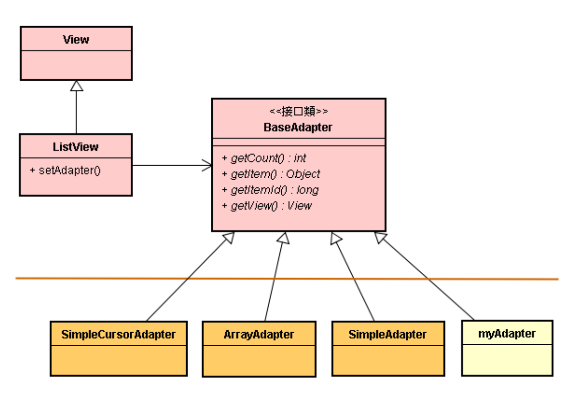

* 当框架开发者提供了这 SimpleAdapter、ArrayAdapter 和 SimpleCursorAdapter 等子类了，App 开发者就不必自己撰写 BaseAdapter 的子类了，而直接使用这 3 个具象子类别就行了。
* 例如直接使用 ArrayAdaper 对象就能在画面上显示出一个 ListView。
* 请留意，他在 ListView 视图里加上一项修饰：每个 Item 各自动加上一个 CheckView 对象。例如，撰写如下的指令：

```java
private String[] data = {" Taipei ", " NewYork ", " London "};
private ArrayAdapter<String> adapter
= new ArrayAdapter<String>(this, 
android.R.layout.simple_list_item_multiple_choice, data);
```

* 这直接拿 ArrayAdapter 接口子类来诞生对象，买主透过传递参数的途径，将买主的知识传入子类别里。子类别依据这参数：simple_list_item_multiple_choice 和 data 来供给 getCount()、getView()、getItem() 和 getItemId() 函数回传值内函。
* 请留意，每个 Item 各自动加上一个 CheckView 对象，这就是修饰型的预设行为。

