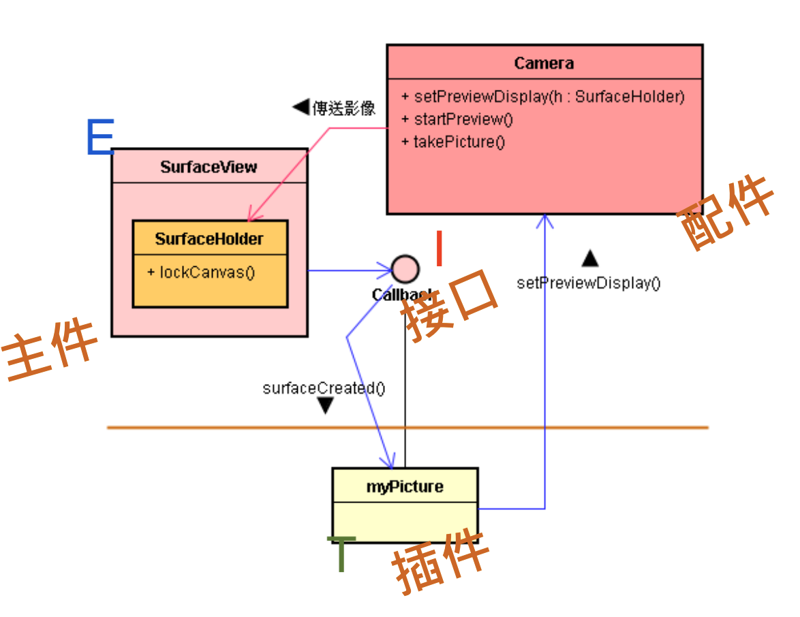
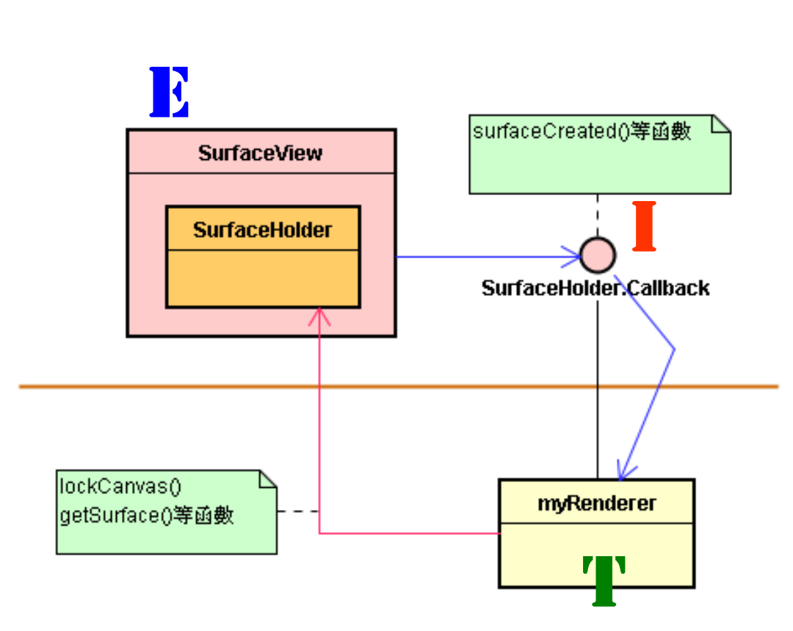
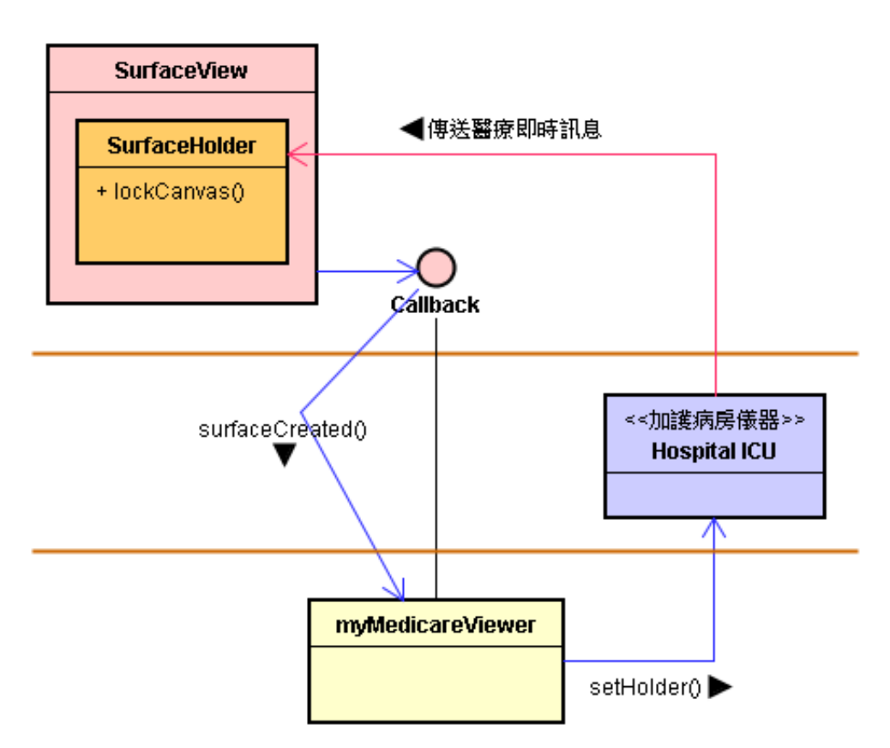
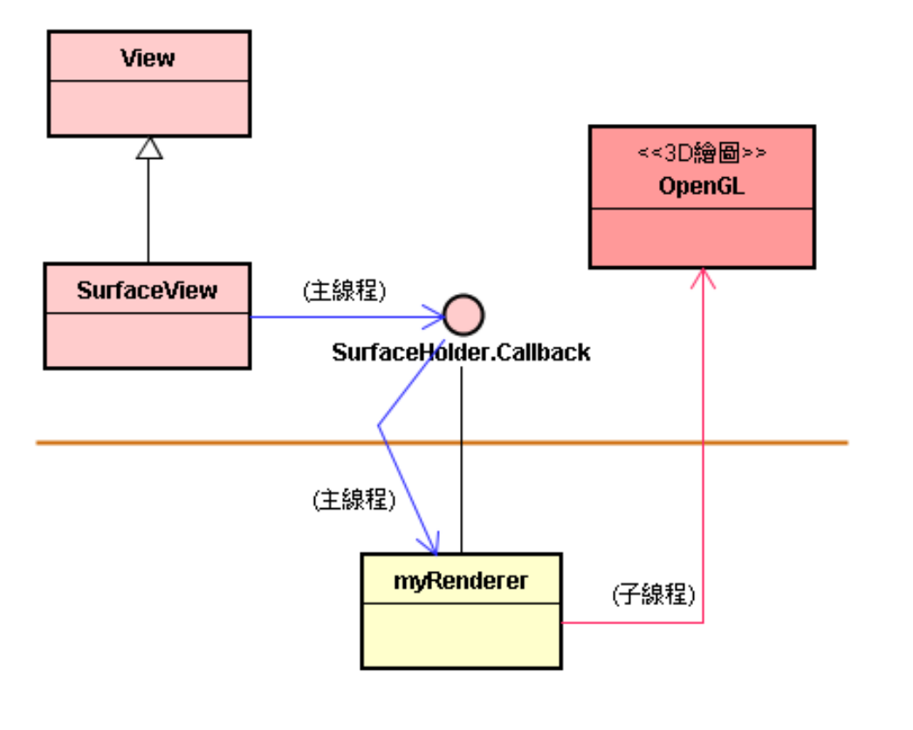
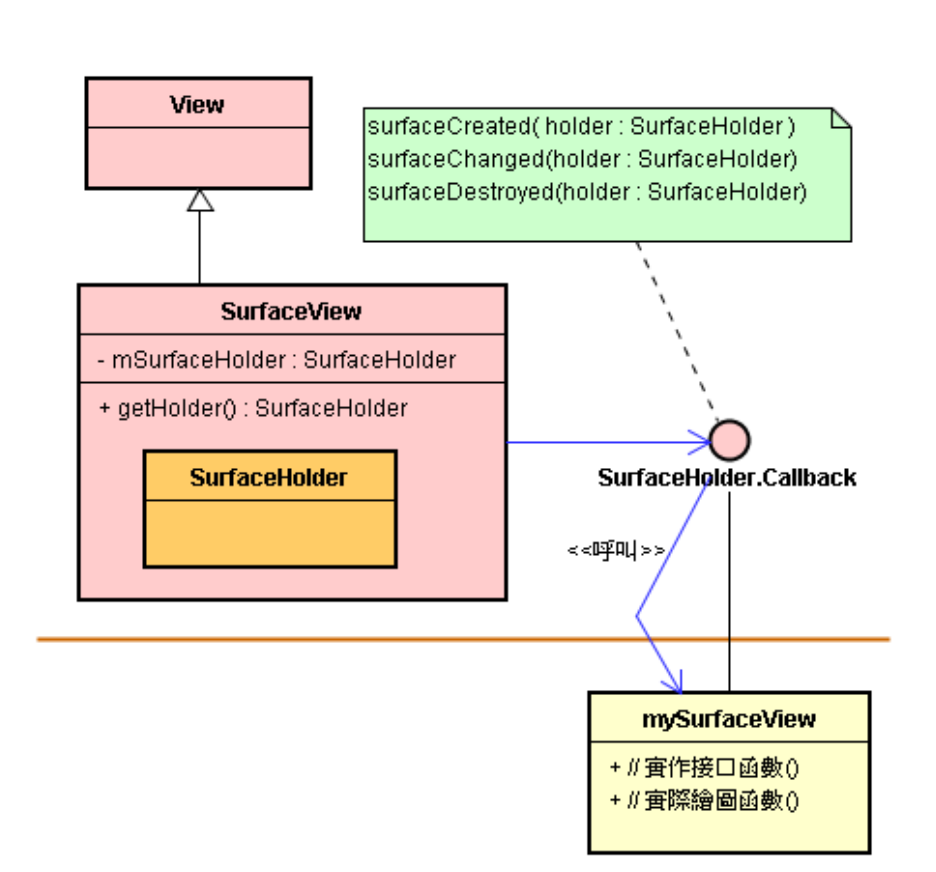
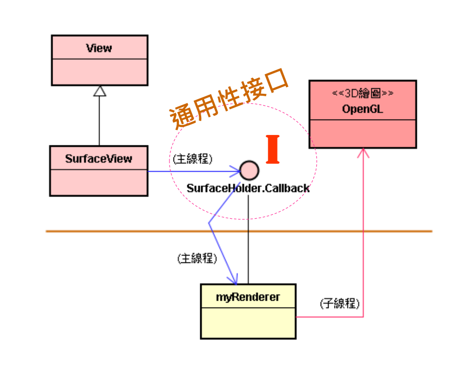
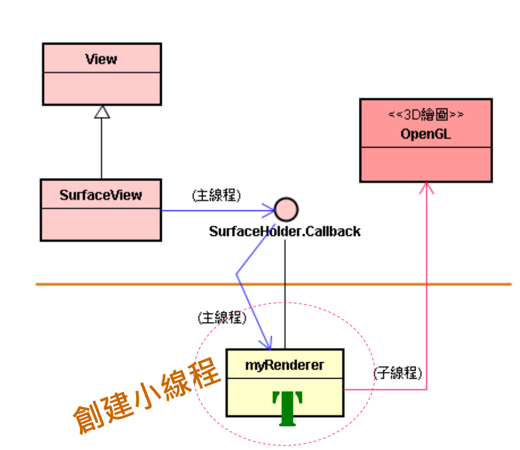
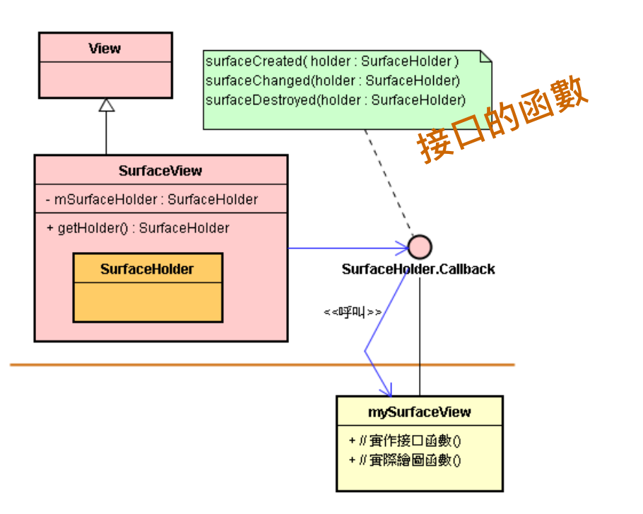

# 观摩：SurfaceView 小框架的未来性设计

# 1. 架构设计决策的未来性

* 架构师 (Architect) 是重要的决策者。其职责是致力于现在决策，透过现在的架构<设计> 来包容未来的变化，也就是让 < 目前决策 > 具有未来性。
* 架构师专注的不是未来决策，而是目前决策的未来性。
* 于是，表现在软件架构设计 ( 即决策 ) 的未来性上，其最为明显之处就是：包容未来的变化；包括用户 (User) 未来可能的选择等等。
* 架构师不是去预测未来，不是去关心 < 未来决策 >、去替未来做决策。
* 架构 < 设计 > 不是要去实现 < 需求 >。需求是善变、市场主导权之竞争也往往如流水般不可测；也就是因为它的未来的不可测性，所以我们需要优越的架构设计。

# 2. 举例：缺乏未来性的设计

## 以 SurfaceView + Camera(摄像机)为例

* Camera 能透过镜头去取得视像，然后将视像传递到 SurfaceView 里呈现出来。
* 那么，SurfaceView 与 Camera 两者之间，该以何种形式的架构来组合，才会具有未来性呢? 
* 如果架构师做了决策：“ SurfaceView 只能搭配 Camera ”，这项设计决策就失去了未来性。
* 当业主于稍后出现时，业主没有选择的余地，常常不能满足各业主的特殊需求，而不想要这个产品或系统。
* 这表示这个系统架构的设计是没有未来性的，没有办法适应未来各种不可预期的环境变化 ( 如业主的不同需求 )。

## 设计出未来性

* 基于 EIT 造形，就很容易联想的如何使用 SurfaceView 框架，来与 Camera 进行组合，做出具有未来性的设计。

# 3. 设计出未来性

## 如果架构师做了新的决策

* 将 SurfaceView 与 Camera 两者的相依性 (Dependency) 降低，成为疏结合 (Loosely Coupled) 。
* 于是，藉助于 EIT 造形，首先设计 <E&I>。
* 此架构预留了弹性，让业主在稍后出现时，能有决策的空间。业主委托 App 开发者把其决策写在应用子类 \<T>里。

* SurfaceView ( 含 SurfaceHolder ) 扮演 \<E> 的角色。 
* SurfaceHolder.Callback 扮演 \<I> 的角色。
*  myRenderer 扮演 \<T> 的角色。
* \<E> 透过 \<I> 接口，呼叫了 \<T> 的 surfaceCreated() 等函数。此外，也可以反过来，让 \<T> 呼叫 \<E> 了。

## SurfaceView 的工作流程

* Step-1：\<E> 向 Android 的 WindowManagerService ( 和 SurfaceFlinger ) 系统服务取的一个 Surface ( 即一个绘图的内存缓冲区 )，将它包装于 \<E> 里 SurfaceHolder 里。
* Step-2：\<E> 透过 Callback 接口来呼叫 \<T> 里的surfaceCreated() 函数，此时将该 SurfaceHolder ( 的指针或参考 ) 传递给 \<T>。
* Step-3：\<T> 才依循刚才传来的指针 ( 或参考 ) 而呼叫到 \<E> 里的 lockCanvas() 等函数。

## 弹性搭配 Camera

* 基于 EIT 造形，就很容易联想的如何使用 SurfaceView 框架，来与 Camera 进行组合，做出具有未来性的设计。

* 一旦 SurfaceView 与 Camera 两者变成为疏结合 (Loosely Coupled) 关系了，当业主在稍后出现时，就能做弹性的组合了。
* 例如，可委托开发者把护士站的 Android TV/STB 联接到医院加护病房的仪器设备上。如下图所示：

* 所以，在 Android 框架的支持下，将医院加护病房的仪器联结到护士站的 Android TV，让患者的病情及时传送到 TV 上。
* 同时，TV 也主动再将讯息及时传送到医生的手机或 Pad 上，让医生能进行实时性的决策，提供更高质量的服务。如下图所示：

* 框架 ( 如 SurfaceView 小框架 ) 是架构师用来包容未来变化的尚方宝剑。
* 架构师的洞悉力愈好，规划出来的框架就愈能给业主高度的决策空间。
* 基于这种优越的框架的软硬件相关产品，会具备良好的未来性，並掌握美好商机。

## 弹性搭配 OpenGL ES 绘图引擎

* 基于 EIT 造形，就很容易联想的如何使用 SurfaceView 框架，来与 OpenGL ES 进行组合，做出具有未来性的设计。

* 基于 SurfaceView 的 API 设计，你可使用 SurfaceView 来显示 3D 的动态绘图。
* 在绘图时，引擎需要在画布宣染，就由框架基类来提供画布。于是，必须设计接口函数 (API) 让基类反向调用应用子类，在调用时就将画布传递给子类，让 App 指定的绘图引擎 ( 如 OpenGL ES ) 能在画布宣染了。

* 画布就藏在 SurfaceHolder 对象里，在画布诞生、改变和删除时，基类会调用接口，把 SurfaceHolder 对象 ( 也就等于传画布 ) 传给子类。
* OpenGL ES 是一个 2D 和 3D 绘图模块 (graphics module)，ES 表示适用于嵌入式和 Mobile 设备。
* OpenGL ES 是 OpenGL 的子集合，并加上一些特殊功能。
* OpenGL ES 定义的 API 称为 EGL，但其实作(Implementation) 可因硬件而异。

# 4. 使用 OpenGL ES 引擎

范例：画出一个旋转的立方体

## 前言：通用性（General）接口

* SurfaceView 小框架就是一个 EIT 造形，其提供了一个通用性 (General) 的 \<I>，就是：SurfaceHolder.Callback 接口。

* 架构师设计了这通用性接口，来与形形色色的配件 ( 如 Camera、OpenGLES、MediaPlayer 等 ) 做非常弹性的组合。
* 基于通用性接口和弹性组合，创造了未来性 ( 能包容业主或用户的未来选择 )。
* 通用性接口不能顾及特殊性的需求。
* 例如，OpenGL 的绘图是费时的工作，不适合使用 UI 线程 ( 主线程 )，于是产生了特殊需求：需要产生一个新线程 (Thread) 来担任绘图任务。此线程会去执行一个 while 循环，将不断地调整旋转角度，并呼叫 MyCube 对象，重新画出立方体的表面。
* 特殊性：OpenGL 需要小线程。
* 这些特殊性就表达在 App 子类 ( 就是 \<T> ) 里；于是，\<T> 就来创建一个小线程去执行 OpenGL 引擎的绘图任务。

## 通用性接口范例：SurfaceHolder.Callback

* 在绘图时，引擎需要在画布宣染，就由框架基类来提供画布。
* 于是，Callback 接口让 \<E> 反向调用 \<T>，在调用时就将画布传递给 \<T>，让业主选择的绘图引擎 ( 如 OpenGL ES ) 能在画布宣染了。
* 在绘图时，引擎需要在画布宣染，就由框架基类来提供画布。
* 于是，Callback 接口让 \<E> 反向调用 \<T>，在调用时就将画布传递给 \<T>，让业主选择的绘图引擎 ( 如 OpenGL ES ) 能在画布宣染了。

* 画布就藏在 SurfaceHolder 对象里，在画布诞生、改变和删除时，基类会调用接口，把 SurfaceHolder 对象 ( 也就等于传画布 ) 传 给 \<T>。

## 结语

* 创造未来性需要仰赖通用性接口，然而通用性接口未能顾及各方 ( 如业主 ) 的特殊决策，只能将这些特殊需求都表达于 \<T> 里，增加了 App 开发 \<T> 插件时的工作量。
* 所以，架构师还需要设计特殊性接口，来减轻 App 开发者的负担。