# 观摩：SurfaceView 小框架的特殊性设计

# 1. 兼顾未来性与特殊性

## 回顾未来性

* 架构师专注的不是未来决策，而是目前决策的未来性。
* 于是，表现在软件架构设计 ( 即决策 ) 的未来性上，其最为明显之处就是：包容未来的变化；包括用户 (User) 未来可能的选择等等。 例如：

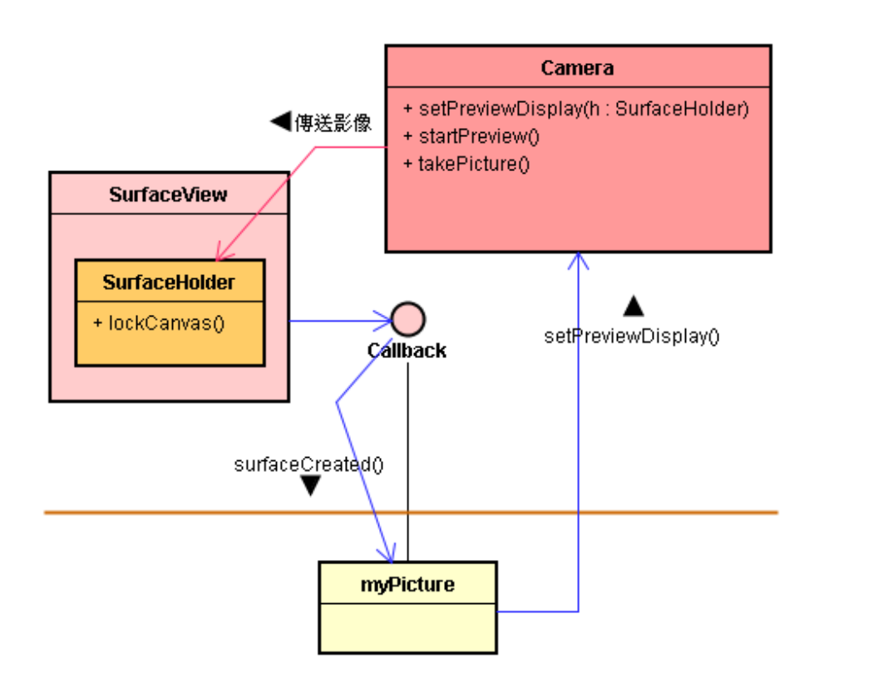

* 未来性大多是来自于通用性的接口。例如下图里的通用性 Callback 接口，创造了高度的未来性。
* 这通用性接口，让业主出现了，选择了 Camera 设备之后，App 开发者才写 myPicture 应用子类。
* 未来新业主出现了，选择了不一样的设备 ，App 开发者才写新的 myPicture 子类。
* 例如，选择把护士的 Pad 联接到医院加护病房的仪器设备上。

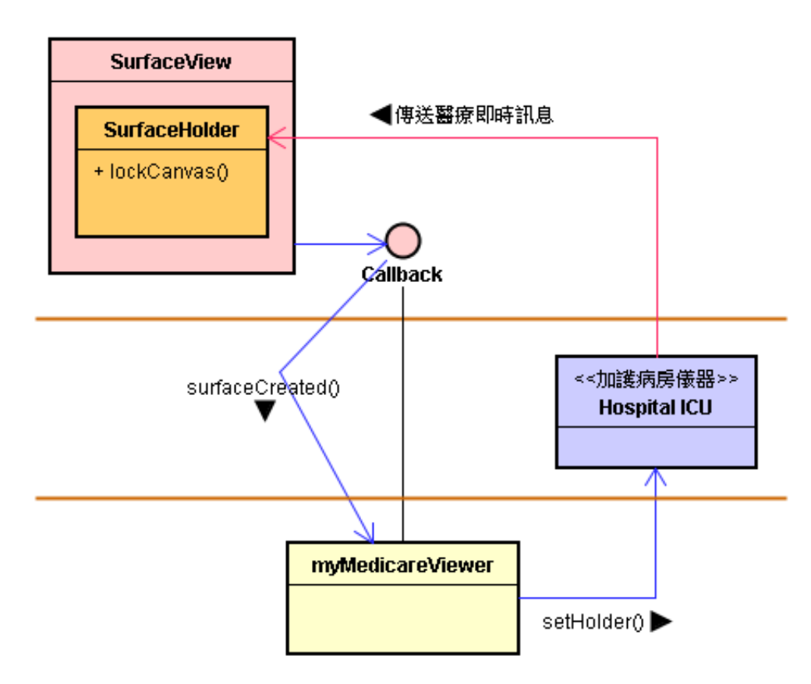

* 凡是业主选择了不一样的设备 ，App 开发者就写新的 myPicture 子类。
* 例如，选择把 Pad 联接到 OpenGL ES 绘图引擎上。

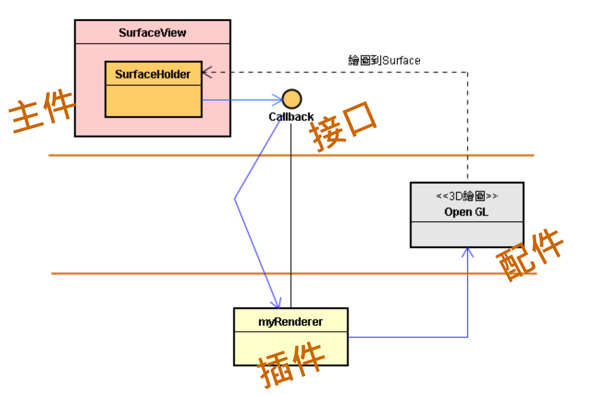

* SurfaceView 基类和 Callback 接口，就是 <E&I>，构成了一个小框架。这个框架就如同集装箱 (container)。
* 它包容了形形色色的插件 \<T> 和配件，亦即包容了业主需求的多变化，呈现了架构设计决策的未来性。 

## 从未来性衍生出特殊性

* 以 Stub 类改变接口。

* 曹操类 (Stub) 能封装天子的接口，定义自己的新接口。
* 它通常封装了通用性 (General) 的接口，然后定义出比较特殊性 (Special) 新接口。
* 例如，将 CameraService 的通用性 IBinder 接口封装起来，同时定义出如 ICamera、ICameraClient 和 ICameraService 等比较特殊性的接口。
* 这里的 Callback 接口，就属于通用性接口。可以增添一个 Stub 类，来封装这个通用性接口，并提供较为特殊性的接口。

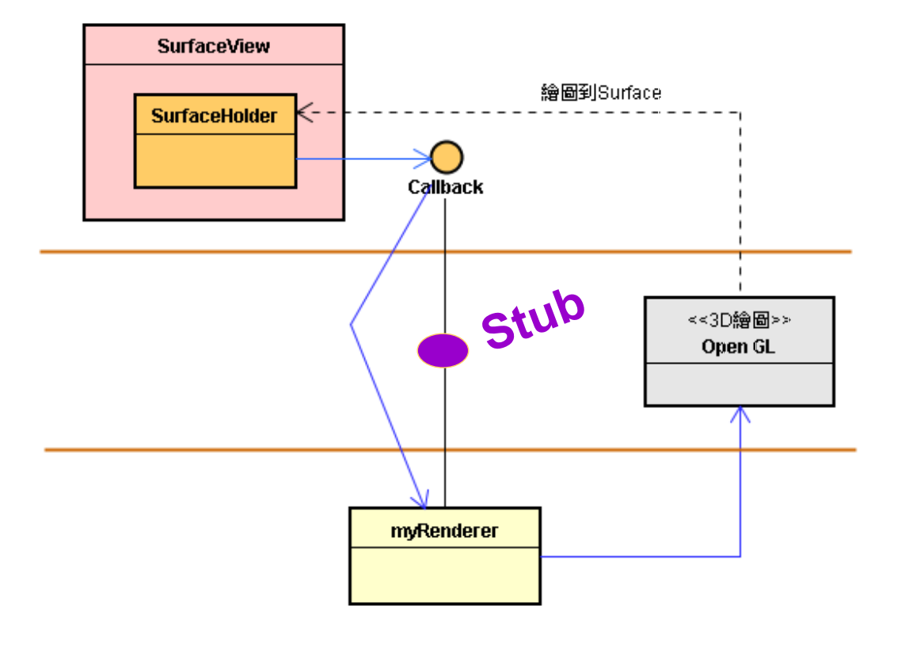

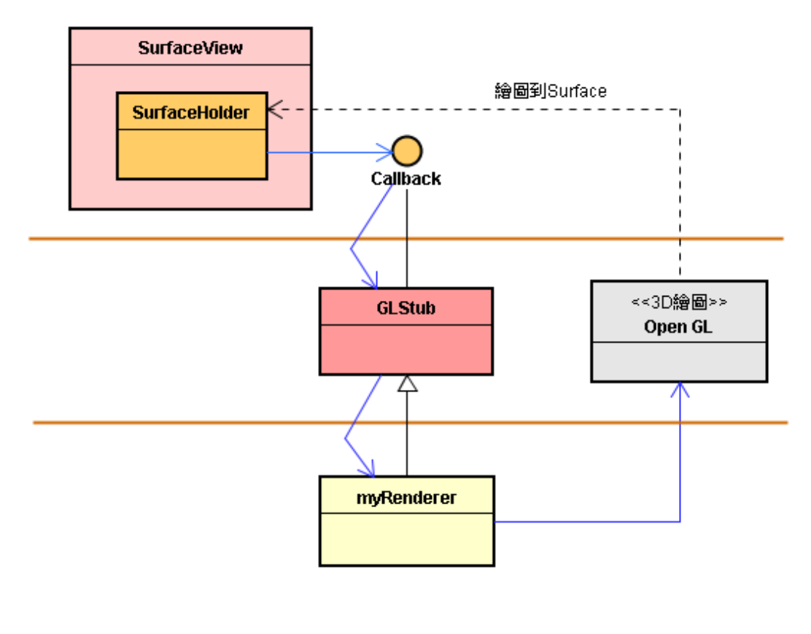

* 运用 EIT 的变形，建立出两层 EIT 造形。封装的上层EIT的 \<I>，定义出下层 EIT 的 \<T>。
* 目前 Android 平台，就提供了 GLSurfaceView 基类和 Renderer 接口的设计了。

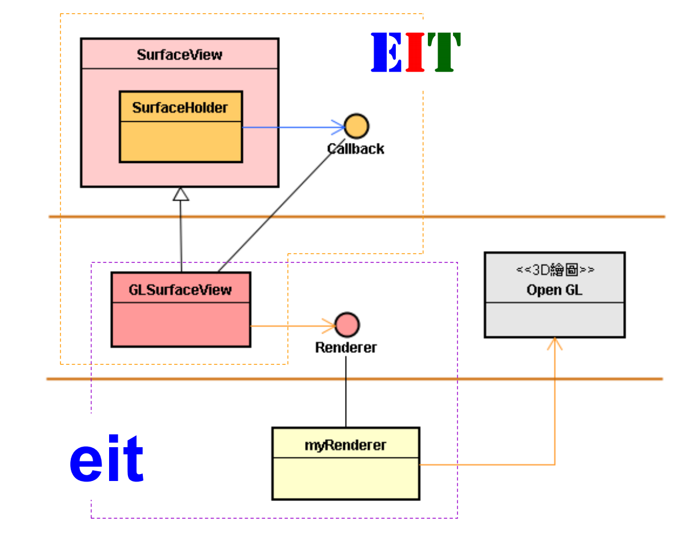

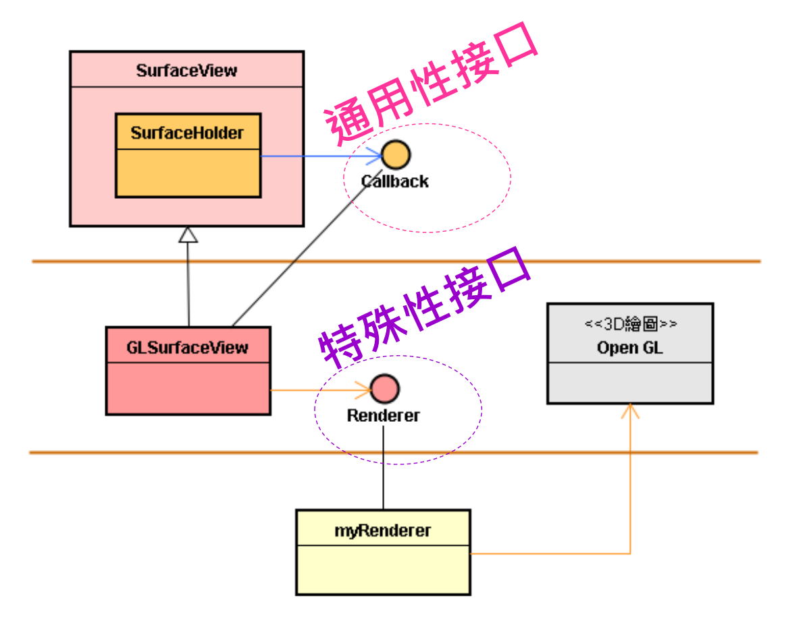

* 这是兼顾未来性与特殊性的美妙架构设计。

# 2. 使用特殊性接口：Renderer

## 前言

* 通用性接口不能顾及特殊性的需求。
* 例如，OpenGL 的绘图是费时的工作，不适合使用 UI 线程(主线程)，于是产生了特殊需求：需要产生一个新线程(Thread)来担任绘图任务。此线程会去执行一个 while 循环，将不断地调整旋转角度，并呼叫 MyCube 对象，重新画出立方体的表面。
* 特殊性：OpenGL 需要小线程。
* 这些特殊性就表达在 App 子类 ( 就是 \<T> ) 里；于是，\<T> 就来创建一个小线程去执行 OpenGL 引擎的绘图任务。
* 建立特殊性小框架，兼容未来性与特殊性。

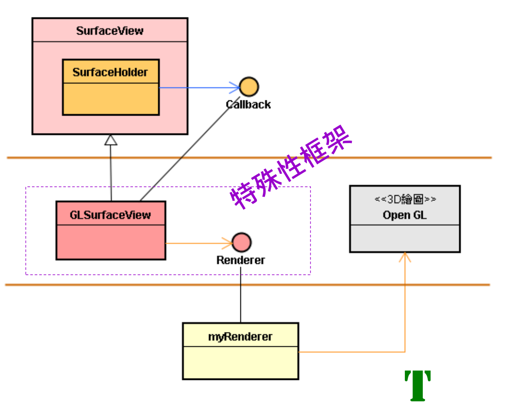

* 特殊性框架可以容纳特殊性的代码，因此可以在 GLSurfaceView 里创建小线程，担任执行 OpenGL 绘图的任务。
* 除了创建小线程之外，还可以将原来摆在 \<T> 的代码，移到 GLSurfaceView 类 ( 即 Stub 类 ) 里。

## GLSurfaceView 和 Renderer 接口

* Java 层的 OpenGL ES 版本速度比较慢。 
* 想提高其 3D 绘图速度，可以使用底层 ( C/C++ 层 ) 的 OpenGL ES C 版本。
* Android 提供了一个基类来协助有上述需求的 App 开发者。
* 这个基类就是 GLSurfaceView，它是基于 SurfaceView 框架，延伸而来的。

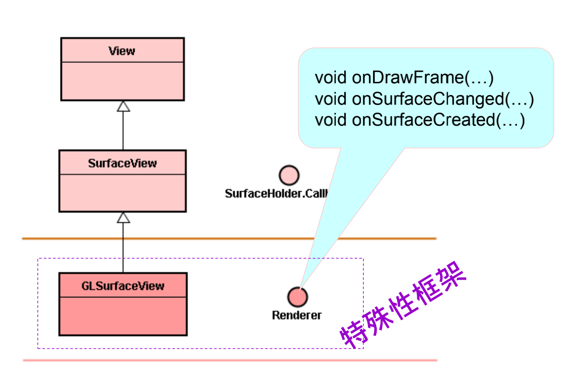

* 请留意，SurfaceView 透过 SurfaceHolder.Callback 接口调用 App 的函数时，是使用 UI 线程的。
* 如果 App 想绘制 3D 动态图时，\<T> 自行诞生小线程去绘图。
* 然而，有了特殊性小框架，则由 GLSurfaceView 針对 OpenGL 特殊需求而来创建小线程。
* 所以，GLSurfaceView 透过 Renderer 接口调用 App 的函数时，是使用小线程的。
* 基于上述的 Renderer 接口，就能撰写 \<T> 来实作此接口，并与 OpenGL 引擎对接。
* 也能与 C/C++ 层的 OpenGL 引擎对接。
* 此图里的 myRenderer 是 Java 层的类，它必须透过 JNI 接口来与 C/C++ 层的 OpenGL ES C 绘图引擎来沟通。如下图：

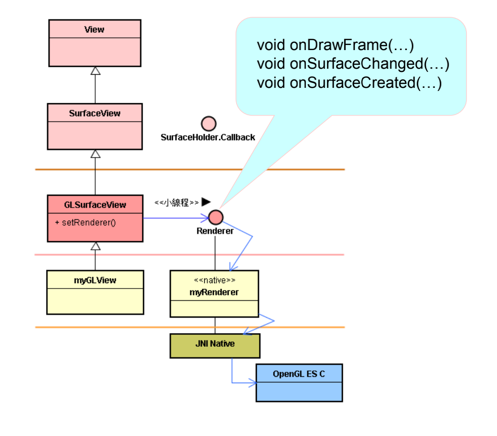

* 依循上图的规划，在装配阶段，可由 myActivity 来创建 myGLView 对象。
* 此 myGLView 对象再创建 myRenderer 对象。
* 然后，调用 GLSurfaceView 的 setRenderer() 函数来让 GLSurfaceView 指向 myRenderer 的 Renderer 接口。
* 建构好了，执行时，GLSurfaceView 就透过 Renderer 接口来调用 myRenderer 的函数，将画布 ( 即 Surface ) 传递到下层，再经由 JNI 接口来让层的 OpenGL ES C 引擎进行动态的 3D 绘图了。

# 3. 范例：JNI + OpenGL ES 引擎

## 范例一

* 撰写 \<T>，实现 Renderer 特殊性接口，并定义 Native 函数，来与 C/C++ 层的 OpenGL 引擎衔接。

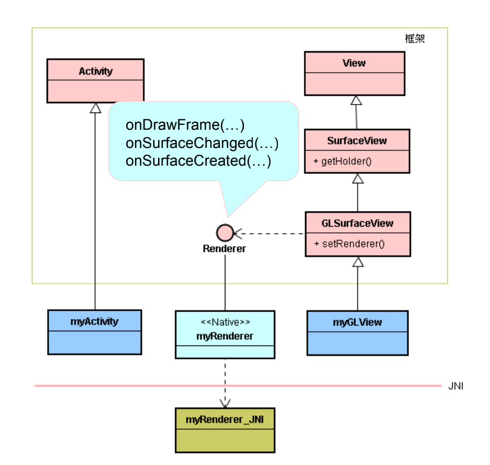

```java
class myRenderer implements GLSurfaceView.Renderer {
private static native void nativeInit();
private static native void nativeResize(int w, int h);
private static native void nativeRender();
private static native void nativeDone();
public void onSurfaceCreated(GL10 gl, EGLConfig config) 
{ nativeInit(); }
public void onSurfaceChanged(GL10 gl, int w, int h) 
{ nativeResize(w, h); }
public void onDrawFrame(GL10 gl) 
{ nativeRender(); }
}
```

* 创建 myRenderer 对象，然后调用 setRenderer() 来把自己装配到 GLSurfaceView 里。

```java
class myGLView extends GLSurfaceView {
myRenderer mRenderer;
public myGLView(Context context) {
super(context);
mRenderer = new myRenderer(); 
setRenderer(mRenderer);
}
```

* 以 C 撰写 Native 函数的实现代码；做为 myRenderer 与 OpenGL ESC 引擎的衔接信道。

```c
/* Java_com_example_MISOO_MyRenderer.h */
// .........
void
Java_com_example_MISOO_MyRenderer_nativeInit( JNIEnv* env )
{ appInit(); }
void
Java_com_example_MISOO_MyRenderer_nativeDone( JNIEnv* env )
{ // free objects. }
void
Java_com_example_MISOO_MyRenderer_nativeRender( JNIEnv* env )
{ curTime = ...
appRender(curTime, sWindowWidth, sWindowHeight);
}
void appInit(){
glEnable(GL_NORMALIZE);
glEnable(GL_DEPTH_TEST);
glDisable(GL_CULL_FACE);
glShadeModel(GL_FLAT);
glEnable(GL_LIGHTING);
glEnable(GL_LIGHT0);
glEnable(GL_LIGHT1);
glEnable(GL_LIGHT2);
glEnableClientState(GL_VERTEX_ARRAY);
glEnableClientState(GL_COLOR_ARRAY);
}
// 其它函數
```

* myActivity 创建 myGLView 的对象。

```java
// myActivity.java
public class myActivity extends Activity {
private GLSurfaceView mGLView;
@Override
protected void onCreate(Bundle savedInstanceState) {
super.onCreate(savedInstanceState);
mGLView = new myGLView(this);
setContentView(mGLView);
}
// ..........
static { System.loadLibrary("JniMyRenderer"); }
}
```

* setContentView() 向 WMS ( 和 SurfaceFlinger ) 系統服務索取一個 surface 給 GLSurfaceView。

## 范例二

* 此范例摘自： http://www.gorglucks.com/android/android-ndk-cube-sample/
* 此范例可绘出一个 3D 的 Cube 旋转图。

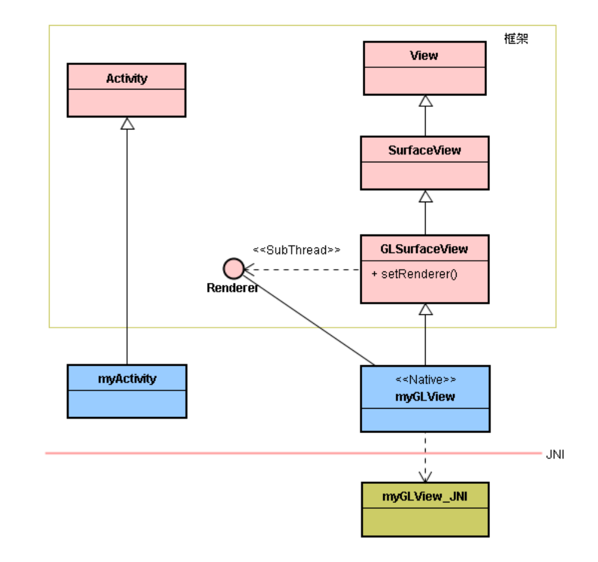

* 撰写 myGLView，实现 Renderer 特殊性接口，并定义 Native 函数，来与 C/C++ 层的 OpenGL 引擎衔接。

```java
// myGLView.java
// ……..
public class myGLView extends GLSurfaceView 
implements Renderer {
private Context context;
public myGLView(Context context) {
super(context);
this.setRenderer(this);
this.requestFocus();
this.setFocusableInTouchMode(true);
this.context = context;
}
public void onDrawFrame(GL10 gl) {
nativeRender();
}
public void onSurfaceChanged(GL10 gl, int w, int h) {
nativeResize(w, h);
}
public void onDrawFrame(GL10 gl) {
nativeRender(); }
public void onSurfaceChanged(GL10 gl, int w, int h) {
nativeResize(w, h); }
public void onSurfaceCreated(GL10 gl, EGLConfig config) {
nativeInit();
nativePushTexture(pixels, bitmap.getWidth(), 
bitmap.getHeight());
}
@Override public boolean onTouchEvent(MotionEvent event) {
if (event.getAction() == MotionEvent.ACTION_UP) {
nativePause();
}
return true;
}
// Natives methods
private static native void nativeInit();
private static native void nativePause();
private static native void nativeResize(int w, int h);
private static native void nativeRender();
private static native void nativePushTexture(int[] pixels, int w,
nt h);
}
```

* 以 C 撰写 Native 函数的实现代码；做为 myRenderer 与 OpenGL ESC 引擎的衔接信道。

```c
// Java_com_gorglucks_myGLView.c */
// Init
void Java_com_gorglucks_myGLView_nativeInit( JNIEnv* env ) 
{ // ………. }
// Window resize
void Java_com_gorglucks_myGLView_nativeResize(JNIEnv* env, 
jobject thiz, jint w, jint h) 
{ // ………. }
// Pause/Resume
void Java_com_gorglucks_myGLView_nativePause(JNIEnv* env) 
{ // ………. }
// Render
void Java_com_gorglucks_myGLView_nativeRender(JNIEnv* 
env) 
{ // ………. }
// Create the texture
void Java_com_gorglucks_myGLView_nativePushTexture(JNIEnv*
env, jobject thiz, jintArray arr, jint w, jint h) 
{ // ………. }
```

* myActivity 创建 myGLView 的对象。

```java
// myActivity.java
// ……..
public class myActivity extends Activity {
GLSurfaceView GLView;
@Override
public void onCreate(Bundle savedInstanceState) {
super.onCreate(savedInstanceState);
GLView = new myGLView(this);
setContentView(GLView);
}
static { System.loadLibrary("cube"); } }
```

* setContentView() 向 WMS ( 和 SurfaceFlinger ) 系統服務索取一個 surface 給 GLSurfaceView。